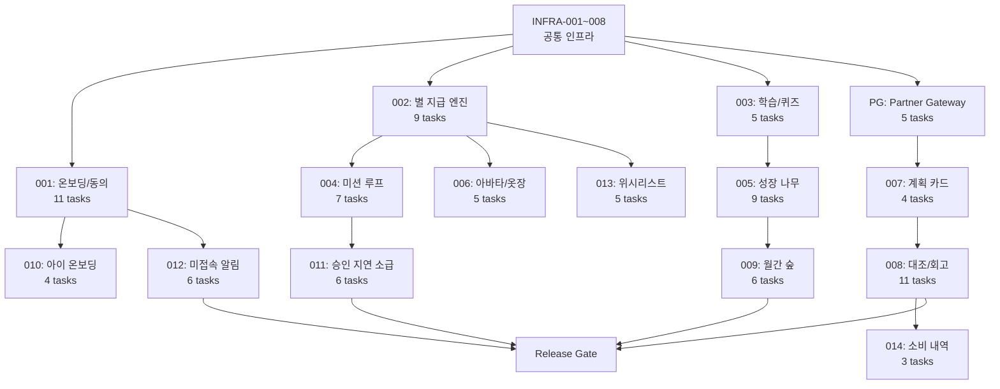

# FinFriends MVP 개발 상세 태스크 리스트

- **문서 ID:** TASK-FINFRIENDS-MVP-001
- **버전:** 1.0
- **작성일:** 2026-08-25
- **기준 문서:** `SRS_문서_핀프렌즈_v1.1_검토반영본.md`, `FinFriends_Technical_Design_Specification.md`
- **목적:** SRS v1.1의 기능 요구사항(REQ-FUNC-001~018), Sequence Diagram, 데이터 모델, API 명세, 비기능 요구사항을 바탕으로 개발팀이 바로 착수할 수 있는 상세 태스크를 도출한다.

> **읽는 법:**
> - 태스크 ID는 `TASK-{REQ번호}-{순번}` 형식으로 SRS 요구사항에 1:1 추적 가능하다.
> - 우선순위: `P0` 필수(Alpha Gate), `P1` 핵심(Beta Gate), `P2` 보조
> - 의존 관계가 명시된 태스크는 선행 태스크 완료 후 착수한다.

---

## 0. 공통 인프라 / 프로젝트 셋업

| Task ID | 태스크 | 상세 | 우선순위 | 산출물 | REQ |
|---|---|---|---|---|---|
| TASK-INFRA-001 | 프로젝트 초기 구조 생성 | 모노레포 또는 서비스별 레포 구조, 빌드 파이프라인(CI/CD), 린터/포맷터 설정 | P0 | 프로젝트 skeleton | - |
| TASK-INFRA-002 | DB 스키마 초기 마이그레이션 | SRS §10 Logical Data Model 기반 전체 테이블 DDL 작성 (`parent_accounts`, `child_accounts`, `consent`, `learning_completions`, `practice_credits`, `star_ledger`, `tree_states`, `monthly_forest_snapshots`, `spending_plan_cards`, `spending_records`, `wishlists`, `app_events`, `audit_logs`) | P0 | migration scripts | 전체 |
| TASK-INFRA-003 | API Gateway 셋업 | 인증/인가 미들웨어, `requestId` 자동 발급, 표준 오류 응답 포맷, Rate Limiting | P0 | Gateway config | NF-014 |
| TASK-INFRA-004 | 공통 Idempotency 모듈 | `Idempotency-Key` 헤더 기반 중복 요청 방지 미들웨어 (SRS §11.2) | P0 | idempotency middleware | NF-008 |
| TASK-INFRA-005 | Event Bus / Analytics 파이프라인 | 공통 Event Envelope (SRS §12.1: `eventId`, `eventName`, `idempotencyKey`, `childId`, `parentId`, `clientTs`, `serverTs`, `payload`) 스키마 및 발행 모듈 | P0 | event module | NF |
| TASK-INFRA-006 | Audit Log 미들웨어 | `audit_logs` 테이블에 actor/action/before/after 자동 기록 (SRS §10) | P0 | audit middleware | NF-018 |
| TASK-INFRA-007 | 암호화 at Rest 설정 | PII DB, 행동 데이터 DB, 결제 원장 각각 Encryption at Rest 적용 (SRS §14.2) | P0 | infra config | NF-012, NF-013 |
| TASK-INFRA-008 | 세션 관리 모듈 | 보호자 세션 ≤24h, 아동 세션 ≤7d (SRS §9.1 NF-015) | P0 | auth config | NF-015 |

---

## 1. REQ-FUNC-001: 보호자 온보딩 및 법정대리인 동의

> **Sequence Diagram 참조:** SRS §6.1 — 보호자 → 앱 → API Gateway → 본인인증 → Account & Consent → DB

| Task ID | 태스크 | 상세 | 우선순위 | 의존 | 산출물 | 검증 |
|---|---|---|---|---|---|---|
| TASK-001-01 | `parent_accounts` 테이블 구현 | PK: `parent_id(UUID)`, UQ: `auth_subject`, `consent_status(ENUM)`, `consented_at`, `notification_start/end(TIME)`, `push_permission(ENUM)`, `created_at` | P0 | INFRA-002 | DB migration | 스키마 테스트 |
| TASK-001-02 | `child_accounts` 테이블 구현 | PK: `child_id(UUID)`, FK: `parent_id`, `birth_year`, `device_type(ENUM)`, `status(ENUM: PENDING/ACTIVE/INACTIVE)` | P0 | INFRA-002 | DB migration | 스키마 테스트 |
| TASK-001-03 | `consent` 테이블 구현 | PK: `consent_id(UUID)`, FK→parent, `status(ENUM)`, `consented_at(Instant)` | P0 | INFRA-002 | DB migration | 스키마 테스트 |
| TASK-001-04 | 온보딩 진행 상태 관리 서비스 | `createProgress()` — 5단계 진행 상태 저장/조회, 중간 종료 후 직전 단계 재개 (AC1), 세션 만료 시 직전 완료 단계 재개 (E2) | P0 | 001-01 | Account & Consent 서비스 | AC1, E2 테스트 |
| TASK-001-05 | 본인인증(KYC) 연동 | 외부 본인인증 서비스 호출 `verify()`, 성공/실패 처리, 타임아웃 처리 | P0 | INFRA-003 | KYC adapter | 통합 테스트 |
| TASK-001-06 | 법정대리인 동의 등록 API | `POST /api/v1/parents/{parentId}/consent` — `registerConsent()` → DB `consent=COMPLETED` | P0 | 001-03, 001-04 | API endpoint | REG-001 테스트 |
| TASK-001-07 | 동의 게이트 Guard | 동의 미완 상태(`consent ≠ COMPLETED`)에서 아이 앱 진입 100% 차단 (AC3, REG-001). 서버 사이드 강제 (SRS §11.2) | P0 | 001-06 | Auth Guard | AC3 100% 차단 검증 |
| TASK-001-08 | 온보딩 상태 조회/갱신 API | `GET /api/v1/parents/{parentId}/onboarding`, `PUT /api/v1/parents/{parentId}/onboarding/{step}` | P0 | 001-04 | API endpoints | 단위/통합 테스트 |
| TASK-001-09 | 아동 계정 생성 API | `POST /api/v1/children` — `createChild()` → `child=ACTIVE` (동의 완료 전제 조건 검증 포함) | P0 | 001-07 | API endpoint | 동의 미완료 시 거부 검증 |
| TASK-001-10 | 카드 신청 API 실패 시 입력값 보존 | 외부 API 실패 시 입력값 24시간 보존 후 재시도 가능 (E1) | P0 | 001-09 | 장애 복구 로직 | E1 테스트 |
| TASK-001-11 | 온보딩 퍼널 이벤트 발행 | `onboarding_step` 이벤트 발행 (SRS §12.2) — 각 단계 진입/완료 기록 | P1 | INFRA-005 | Event 발행 | NF-011 측정 가능 |

---

## 2. REQ-FUNC-002: 별 지급 엔진

> **Sequence Diagram 참조:** SRS §6.2 — Client → Practice Service → Star Ledger → DB (멱등성 체크 + 잔액 lock + append + update) → Analytics

| Task ID | 태스크 | 상세 | 우선순위 | 의존 | 산출물 | 검증 |
|---|---|---|---|---|---|---|
| TASK-002-01 | `star_ledger` 테이블 구현 | `ledger_entry_id(PK)`, `child_id(FK)`, `delta`, `balance_after`, `trigger_code`, `source_type`, `source_id`, `idempotency_key(UQ)`, `created_at`. **불변식:** `balance_after(n) = balance_after(n-1) + delta(n)` | P0 | INFRA-002 | DB migration | 불변식 검증 쿼리 |
| TASK-002-02 | `star_balance` 테이블/뷰 구현 | 아동별 현재 잔액 관리. `star_ledger`의 최신 `balance_after`와 일치 보장 | P0 | 002-01 | DB migration | 정합성 테스트 |
| TASK-002-03 | Star Ledger 서비스 — `grantStar()` | Trigger(1~8), source, idemKey 인자. ① `find idemKey` → 이미 처리됨이면 기존 결과 반환 ② 최초: `lock balance` → `append ledger entry` → `update balance` → 응답 | P0 | 002-01, INFRA-004 | Ledger 서비스 | 멱등성 테스트, 동시성 테스트 |
| TASK-002-04 | Star Ledger 서비스 — `deductStar()` | 별 차감(아바타 구매 등). 잔액 부족 시 차단. append-only 원장 유지 | P0 | 002-03 | Ledger 서비스 | 잔액 부족 차단 테스트 |
| TASK-002-05 | 별 조회 API | `GET /api/v1/children/{childId}/stars` — 현재 잔액 + 최근 내역 | P0 | 002-03 | API endpoint | 단위 테스트 |
| TASK-002-06 | 별 지급 API (내부/관리용) | `POST /api/v1/children/{childId}/stars/grant` | P0 | 002-03 | API endpoint | 멱등성 테스트 |
| TASK-002-07 | 별 원장 정합성 검증 배치 | Daily batch: 전체 `star_ledger`의 `balance_after` 체인 검증, mismatch 시 Alert (SRS §20 Critical Alert) | P0 | 002-01 | Batch job | NF-008 (0% 오류) |
| TASK-002-08 | `star_ledger_entry` 이벤트 발행 | 별 지급/차감 시 Analytics 이벤트 발행 | P1 | INFRA-005, 002-03 | Event 발행 | 이벤트 수신 검증 |
| TASK-002-09 | 별/현금 분리 제약 구현 | 별↔저금통 전환 함수/필드 부재 검증. 코드 레벨에서 전환 경로 차단 (REG-005, ADR-004) | P0 | 002-01 | 제약 검증 | Static analysis |

---

## 3. REQ-FUNC-003: 학습/퀴즈

| Task ID | 태스크 | 상세 | 우선순위 | 의존 | 산출물 | 검증 |
|---|---|---|---|---|---|---|
| TASK-003-01 | `learning_completions` 테이블 구현 | `completion_id(PK)`, `child_id(FK)`, `topic_id(FK)`, `completed(bool)`, `completed_at`, `quiz_correct_count`, `cycle_id` | P0 | INFRA-002 | DB migration | 스키마 테스트 |
| TASK-003-02 | 커리큘럼 조회 API | `GET /api/v1/children/{childId}/curriculum` — 4주제 목록 + 각 주제별 학습/퀴즈 완료 상태 | P0 | 003-01 | API endpoint | 4주제 반환 검증 |
| TASK-003-03 | 퀴즈 채점 API | `POST /api/v1/children/{childId}/quiz/{topicId}/submit` — 정답 검증, 점수 기록, 학습 완료 처리 | P0 | 003-01 | API endpoint + Quiz Engine | 채점 정확성 |
| TASK-003-04 | 학습 완료 시 별 지급 연동 | 학습/퀴즈 완료 → Star Ledger `grantStar()` 호출. **단, 학습 별은 WPA에 산입하지 않음** (ADR-001, 비즈니스 규칙 §13 #4) | P0 | 002-03, 003-03 | 연동 로직 | WPA 미산입 검증 |
| TASK-003-05 | 불리기 영역 학습만 개통 | 불리기(예적금) 주제는 학습 콘텐츠만 개통, 실천은 잠금 (ADR-006). UI에서 잠금 표시 | P1 | 003-02 | 잠금 로직 | 실천 진입 차단 검증 |

---

## 4. REQ-FUNC-004: 미션 루프

| Task ID | 태스크 | 상세 | 우선순위 | 의존 | 산출물 | 검증 |
|---|---|---|---|---|---|---|
| TASK-004-01 | `mission` 테이블 구현 | `mission_id(PK)`, `child_id(FK)`, `star_amount`, `state(ENUM: PENDING/APPROVED/REJECTED/BACKFILLED)`, `completed_at`, `approved_at` | P0 | INFRA-002 | DB migration | State Diagram (§8.1) 검증 |
| TASK-004-02 | `practice_credits` 테이블 구현 | `practice_credit_id(PK)`, `child_id(FK)`, `practice_path`, `source_id`, `approval_mode`, `delay_hours`, `credited_at`, `cycle_id`, `tree_slot`, `idempotency_key(UQ)` | P0 | INFRA-002 | DB migration | 스키마 테스트 |
| TASK-004-03 | 미션 생성 API | `POST /api/v1/children/{childId}/missions` — 보호자가 조건/금액 설정 | P0 | 004-01 | API endpoint | 단위 테스트 |
| TASK-004-04 | 미션 승인/거절 API | `PUT /api/v1/missions/{missionId}/approval` — 승인 시: state=APPROVED → 실천 인정 → 별 지급 + 나무 조건 반영. 거절 시: state=REJECTED → 별 미지급, 실천 미인정 | P0 | 004-01, 002-03 | API endpoint + 상태 전이 | Mission State Diagram 테스트 |
| TASK-004-05 | 미션 승인 → Practice Credit 생성 | 승인 성공 시 `practice_credits` 레코드 생성 (`practice_path=MISSION`, `approval_mode=PARENT`). WPA 분자에 포함 | P0 | 004-02, 004-04 | Practice 서비스 | WPA 산입 검증 |
| TASK-004-06 | 미션 상태 전이 검증 | State Diagram (§8.1): `[*]→PENDING→APPROVED→BACKFILLED`, `PENDING→REJECTED→[*]`. 잘못된 전이 차단 | P0 | 004-01 | 상태 전이 로직 | Invalid transition 거부 테스트 |
| TASK-004-07 | `approval_state_changed` 이벤트 발행 | 승인/거절 시 Analytics 이벤트 | P1 | INFRA-005, 004-04 | Event 발행 | 이벤트 수신 검증 |

---

## 5. REQ-FUNC-005: 성장 나무

> **Sequence Diagram 참조:** SRS §6.5 — 학습/퀴즈/실천 이벤트 → Growth Tree → DB (load → increment → 조건 체크 → 승급 또는 유지 → 정체 판정)

| Task ID | 태스크 | 상세 | 우선순위 | 의존 | 산출물 | 검증 |
|---|---|---|---|---|---|---|
| TASK-005-01 | `tree_states` 테이블 구현 | `tree_state_id(PK)`, `child_id(FK)`, `slot`, `stage`, `learn_count`, `quiz_count`, `practice_count`, `cycle_start_at`, `last_progress_at`, `stall_days` | P0 | INFRA-002 | DB migration | 스키마 테스트 |
| TASK-005-02 | Growth Tree 서비스 — 조건 갱신 | 이벤트 수신 → `load TreeState` → `increment condition` (학습/퀴즈/실천 카운터 증가) | P0 | 005-01 | Growth 서비스 | 카운터 증가 검증 |
| TASK-005-03 | 승급 판정 로직 | 조건: `학습 >= 3 AND 퀴즈 >= 5 AND 실천 >= 1` → 승급. **실천 0건이면 절대 승급 불가** | P0 | 005-02 | 승급 판정 | AC: 실천 0 → 승급 차단 |
| TASK-005-04 | 정체 판정 로직 | `cycle_start` 후 14일 미만이면 정체 판정 금지. 14일 경과 후 미충족 조건 전체 표시, 가장 적게 남은 조건 최상단 | P0 | 005-02 | 정체 판정 | 14일 미만 정체 0건 |
| TASK-005-05 | 승인 대기 N건 구별 | 승인 대기 미션이 있을 때 이를 "성장 실패"가 아닌 "승인 대기"로 별도 표시 | P1 | 005-03, 004-04 | UI 분기 로직 | 대기 vs 실패 구별 |
| TASK-005-06 | 나무 조회 API | `GET /api/v1/children/{childId}/tree` — 현재 단계, 각 조건 충족 현황, 정체 여부, 미충족 조건 목록 | P0 | 005-02 | API endpoint | 응답 구조 검증 |
| TASK-005-07 | Tree Stall 배치 | Daily batch: 각 아동의 `stall_days` 갱신 (SRS §19) | P1 | 005-01 | Batch job | 일배치 정상 수행 |
| TASK-005-08 | `tree_state_changed` 이벤트 발행 | 승급/정체 발생 시 Analytics 이벤트 | P1 | INFRA-005, 005-03 | Event 발행 | NF-001 측정 가능 |
| TASK-005-09 | 나무 화면 응답 성능 | p95 ≤ 1,250ms (NF-001). 필요시 캐싱/쿼리 최적화 | P0 | 005-06 | 성능 최적화 | 부하 테스트 |

---

## 6. REQ-FUNC-006: 아바타/옷장

| Task ID | 태스크 | 상세 | 우선순위 | 의존 | 산출물 | 검증 |
|---|---|---|---|---|---|---|
| TASK-006-01 | `avatar`, `wardrobe_item`, `wardrobe_ownership` 테이블 구현 | ERD (§7.2): Avatar ↔ Wardrobe Ownership ↔ Wardrobe Item | P0 | INFRA-002 | DB migration | ERD 정합성 |
| TASK-006-02 | 옷장 조회 API | `GET /api/v1/children/{childId}/wardrobe` — 전체 아이템 목록 + 보유 여부 + 가격(별) | P1 | 006-01 | API endpoint | 단위 테스트 |
| TASK-006-03 | 아이템 구매 API | `POST /api/v1/children/{childId}/wardrobe/purchase` — 별 잔액 확인 → `deductStar()` → ownership 생성. 잔액 부족 시 차단 | P1 | 006-01, 002-04 | API endpoint | 잔액 부족 차단 검증 |
| TASK-006-04 | 1차 납품 데이터 시드 | 2종(동물) × 4벌 = 8 아이템 시드 데이터. **얼굴 이미지 미수집** (REG-006) | P1 | 006-01 | Seed data | 8 아이템 확인 |
| TASK-006-05 | 아바타 3D 에셋 연동 | 3D asset 파일 관리/로딩 (ADR-007: S1 동시 발주) | P2 | 006-04 | Asset pipeline | 에셋 로딩 테스트 |

---

## 7. REQ-FUNC-007: 소비 계획 카드

| Task ID | 태스크 | 상세 | 우선순위 | 의존 | 산출물 | 검증 |
|---|---|---|---|---|---|---|
| TASK-007-01 | `spending_plan_cards` 테이블 구현 | `plan_card_id(PK)`, `child_id(FK)`, `created_by_type`, `place_text`, `category_code`, `planned_amount`, `item_text(nullable)`, `status(ENUM: PENDING/MATCHED/EXPIRED)`, `expires_at` | P0 | INFRA-002 | DB migration | Plan Card State (§8.2) |
| TASK-007-02 | 계획 카드 생성 API | `POST /api/v1/children/{childId}/plan-cards` — 아이/보호자 모두 작성 가능. 필수: 장소, 업종, 금액 상한. 선택: 품목. **위치 권한/푸시 권한 요구 금지** (NF-017) | P0 | 007-01 | API endpoint | 위치 권한 0건 검증 |
| TASK-007-03 | Plan Card 상태 관리 | State Diagram (§8.2): `[*]→PENDING→MATCHED`, `PENDING→EXPIRED`. 매칭 시 MATCHED, 유효기간 초과 시 EXPIRED | P0 | 007-01 | 상태 관리 | 상태 전이 테스트 |
| TASK-007-04 | `plan_card_created` 이벤트 발행 | 계획 카드 작성 시 이벤트 → 작성률 KPI 산출용 | P1 | INFRA-005, 007-02 | Event 발행 | 작성률 ≥50% 측정 가능 |

---

## 8. REQ-FUNC-008: 계획↔실제 대조 / 회고

> **Sequence Diagram 참조:** SRS §6.8 — 제휴사 → Partner Gateway → Spending Plan (매칭 로직) → Retro Logic → Star Ledger → 아이 앱

| Task ID | 태스크 | 상세 | 우선순위 | 의존 | 산출물 | 검증 |
|---|---|---|---|---|---|---|
| TASK-008-01 | `spending_records` 테이블 구현 | `spending_record_id(PK)`, `child_id(FK)`, `plan_card_id(FK, nullable)`, `partner_transaction_id(UQ)`, `actual_amount`, `merchant_name`, `category_code`, `match_method(ENUM: CATEGORY/MERCHANT/AMOUNT_ONLY)`, `plan_met(bool)`, `category_met(bool)`, `retro_status` | P0 | INFRA-002 | DB migration | 스키마 테스트 |
| TASK-008-02 | Partner Gateway — 결제 수신 | 제휴사 결제 트랜잭션 수신 → normalized transaction으로 변환 | P0 | INFRA-003 | Partner Gateway adapter | 통합 테스트 |
| TASK-008-03 | 매칭 엔진 구현 | **3단계 매칭 순서:** ① CATEGORY match → ② (실패 시) MERCHANT match → ③ (실패 시) AMOUNT_ONLY fallback. Sequence Diagram의 alt 분기 구현 | P0 | 008-01, 007-01 | Matching Engine | 매칭 정확도 ≥90% (NF-005) |
| TASK-008-04 | 계획↔실제 판정 로직 | `actual <= planned` → 별 +1, `plan_met=true`. `actual > planned` → 별 미지급, `plan_met=false`. **업종 불일치 시에도 금액 지켰으면 별 지급** (비즈니스 규칙 §13 #8), `category_met=false`로 기록 | P0 | 008-03, 002-03 | 판정 로직 | 비즈니스 규칙 #5~#8 검증 |
| TASK-008-05 | 회고 문장 분기 | `plan_met` / `category_met` 조합에 따른 회고 문장 선택. **비복원 추출** (비즈니스 규칙 §13 #11) | P1 | 008-04 | Retro Logic | 문장 중복 0건 |
| TASK-008-06 | 회고 큐 병합 | 회고 큐 3건 초과 시 오래된 항목을 요약 회고로 병합 (비즈니스 규칙 §13 #12) | P1 | 008-05 | 병합 로직 | 4건 이상 → 병합 검증 |
| TASK-008-07 | 대조 결과 조회 API | `GET /api/v1/children/{childId}/plan-cards/{cardId}/reconciliation` | P0 | 008-04 | API endpoint | 응답 검증 |
| TASK-008-08 | 회고 확인 API | `POST /api/v1/children/{childId}/retro/{recordId}/confirm` — 아이가 회고 확인 | P0 | 008-05 | API endpoint | 단위 테스트 |
| TASK-008-09 | 회고 완료 → Practice Credit | 회고 확인 시 `practice_credits` 생성 (`practice_path=RETRO`). WPA 분자에 포함 | P0 | 008-08, 004-02 | 연동 로직 | WPA 산입 검증 |
| TASK-008-10 | Payment Reconciliation 배치 | 5~15분 주기 (제휴사 계약에 따라 조정). SRS §19 Batch/Scheduler | P0 | 008-02 | Batch job | 매칭 자동화 검증 |
| TASK-008-11 | `retro_viewed` 이벤트 발행 | 회고 체류 측정용 이벤트 | P1 | INFRA-005, 008-08 | Event 발행 | 이벤트 수신 확인 |

---

## 9. REQ-FUNC-009: 월간 숲

| Task ID | 태스크 | 상세 | 우선순위 | 의존 | 산출물 | 검증 |
|---|---|---|---|---|---|---|
| TASK-009-01 | `monthly_forest_snapshots` 테이블 구현 | `snapshot_id(PK)`, `child_id(FK)`, `year_month`, `earn_stage`, `spend_well_stage`, `save_stage`, `grow_stage`, `practice_count`, `reflection_count`, `spending_delta`, `total_earned_stars`, `delta_json`, `created_at` | P0 | INFRA-002 | DB migration | 스키마 테스트 |
| TASK-009-02 | Forest Snapshot 월배치 | Monthly batch: 전월 데이터 집계 → snapshot 생성. 4영역 단계 + 7개 지표 (SRS §6.9) | P0 | 009-01 | Batch job | SRS §19 검증 |
| TASK-009-03 | 전월 대비 비교 로직 | 이전 month snapshot과 현재 비교. **첫 달에는 비교 불가 메시지** 반환 | P0 | 009-02 | 비교 로직 | 첫 달 메시지 검증 |
| TASK-009-04 | 숲 조회 API | `GET /api/v1/children/{childId}/forest` — 최근 N개월 snapshot + 전월 대비 delta | P0 | 009-03 | API endpoint | 응답 검증 |
| TASK-009-05 | 숲 화면 응답 성능 | p95 ≤ 2,000ms (NF-002) | P0 | 009-04 | 성능 최적화 | 부하 테스트 |
| TASK-009-06 | `forest_view_opened` 이벤트 발행 | 보호자 숲 확인 시 이벤트 | P1 | INFRA-005, 009-04 | Event 발행 | 이벤트 수신 확인 |

---

## 10. REQ-FUNC-010: 아이 온보딩

> **Sequence Diagram 참조:** SRS §6.10 — 아동 → 아이앱 → Learning → Quiz → Star Ledger → Wardrobe (최초 진입 → 짧은 학습 → 퀴즈 → 온보딩 별 → 구매 가능 아이템 추천)

| Task ID | 태스크 | 상세 | 우선순위 | 의존 | 산출물 | 검증 |
|---|---|---|---|---|---|---|
| TASK-010-01 | 아이 최초 진입 감지 | 아이 앱 첫 세션 감지 → 온보딩 플로우 트리거 | P0 | 001-09 | 진입 감지 | 최초 1회만 트리거 |
| TASK-010-02 | 온보딩 학습 콘텐츠 제공 | `start onboarding` → 짧은 레슨 제공 → 퀴즈 출제 | P0 | 003-02, 003-03 | Learning 서비스 연동 | 콘텐츠 로딩 검증 |
| TASK-010-03 | 온보딩 별 지급 | 퀴즈 정답 시 `grant onboarding star` → `balance=1` | P0 | 002-03 | 별 지급 로직 | 잔액 = 1 검증 |
| TASK-010-04 | 구매 가능 아이템 추천 | `find affordable items` → `items <= 1 star` 목록 제공 → 아이에게 추천 | P1 | 006-02, 010-03 | 추천 로직 | 1별 이하 아이템 필터링 |

---

## 11. REQ-FUNC-011: 승인 지연 소급 지급

> **Sequence Diagram 참조:** SRS §6.11 — 보호자 → Practice Service (완료 시점 cycle 계산) → Star Ledger (backfill grant) → Growth Tree (원래 cycle 갱신) → Monthly Forest (원래 snapshot 갱신)

| Task ID | 태스크 | 상세 | 우선순위 | 의존 | 산출물 | 검증 |
|---|---|---|---|---|---|---|
| TASK-011-01 | 승인 지연 감지 로직 | 미션 `completed_at` 후 48시간 이상 미승인 상태 감지 | P0 | 004-01 | 감지 로직 | 48h 경과 검증 |
| TASK-011-02 | 소급 지급 — 같은 cycle | 같은 cycle 내 승인: `grantStar()` + Growth Tree에 practice 추가 | P0 | 002-03, 005-02 | 소급 로직 | 동일 cycle 검증 |
| TASK-011-03 | 소급 지급 — cycle 넘긴 경우 | cycle 종료 후 승인: `backfill grant` → Growth Tree **원래 cycle** 갱신 → Forest **원래 snapshot** 갱신. state=BACKFILLED | P0 | 002-03, 005-02, 009-02 | 소급 로직 | 크로스 cycle 검증 |
| TASK-011-04 | 일괄 승인 API | `POST /api/v1/parents/{parentId}/missions/bulk-approval` — 5건 이상이면 일괄 승인 지원 | P1 | 004-04, 011-02 | API endpoint | 5건 일괄 처리 검증 |
| TASK-011-05 | 소급 지급 사용자 알림 | 승인 완료 시 "지난 달 실천으로 인정됐어요" 메시지 (Sequence 마지막 단계) | P1 | 011-03 | 알림 로직 | 메시지 발송 검증 |
| TASK-011-06 | 소급 지급 성공률 모니터링 | NF-009: backfill events 100% 성공률 검증 | P0 | 011-03 | 모니터링 | NF-009 Alert |

---

## 12. REQ-FUNC-012: 3일 미접속 알림

> **Sequence Diagram 참조:** SRS §6.12 — Scheduler → Notification → Account (last_session 조회) → Push/Banner/SMS 분기

| Task ID | 태스크 | 상세 | 우선순위 | 의존 | 산출물 | 검증 |
|---|---|---|---|---|---|---|
| TASK-012-01 | Inactivity Detection 배치 | Hourly batch: `last_session`으로부터 72시간 경과 아동 추출. **71시간 재접속 시 오탐 0건** | P0 | INFRA-002 | Batch job | 72h 판정 정확도, 71h 오탐 0 |
| TASK-012-02 | 알림 채널 분기 로직 | Push enabled → Push 발송. Push disabled → 앱 내 Banner + SMS 동의 시 SMS 발송. 앱 삭제 → 재설치 안내 | P0 | 012-01 | Notification 서비스 | 채널 분기 테스트 |
| TASK-012-03 | Notification Dispatch 배치 | Hourly batch: 부모 활동 시간대 설정 내에서만 발송 | P0 | 012-02 | Batch job | 시간대 필터 검증 |
| TASK-012-04 | 알림 시간대 설정 API | `PUT /api/v1/parents/{parentId}/notification-window` — `notification_start`, `notification_end` | P1 | 001-01 | API endpoint | 시간대 저장 검증 |
| TASK-012-05 | 미접속 배치 트리거 API (내부) | `POST /api/v1/notifications/inactivity/batch` — 수동/스케줄 트리거 | P1 | 012-01 | API endpoint | 배치 실행 검증 |
| TASK-012-06 | `inactivity_notified` 이벤트 발행 | 미접속 알림 발송 시 이벤트 → NF-010 인지 ≤3일 측정 | P1 | INFRA-005, 012-02 | Event 발행 | NF-010 측정 가능 |

---

## 13. REQ-FUNC-013: 위시리스트

| Task ID | 태스크 | 상세 | 우선순위 | 의존 | 산출물 | 검증 |
|---|---|---|---|---|---|---|
| TASK-013-01 | `wishlists` 테이블 구현 | `wishlist_id(PK)`, `child_id(FK)`, `item_name`, `target_amount`, `saved_amount`, `paid_30(bool)`, `paid_70(bool)`, `paid_100(bool)`, `completed_at` | P0 | INFRA-002 | DB migration | 스키마 테스트 |
| TASK-013-02 | 위시리스트 생성/조회 API | `POST /api/v1/children/{childId}/wishlist`, `GET /api/v1/children/{childId}/wishlist` | P1 | 013-01 | API endpoints | 단위 테스트 |
| TASK-013-03 | 위시리스트 마일스톤 별 지급 | 30% / 70% / 100% 도달 시 각각 별 1개 지급. **동일 단계 중복 지급 금지** (paid 플래그 체크). **목표 하향으로 소급 지급 금지** | P1 | 013-01, 002-03 | 지급 로직 | 중복 지급 0건, 하향 소급 0건 |
| TASK-013-04 | 위시리스트 삭제 시 별 미회수 | 삭제해도 기존 지급 별 회수 없음 | P1 | 013-03 | 삭제 로직 | 삭제 후 잔액 변동 0 |
| TASK-013-05 | 위시리스트 → Practice Credit | 위시리스트 마일스톤 달성 시 `practice_credits` 생성 (`practice_path=WISHLIST`). WPA 분자에 포함 | P1 | 013-03, 004-02 | 연동 로직 | WPA 산입 검증 |

---

## 14. REQ-FUNC-014: 소비 내역

| Task ID | 태스크 | 상세 | 우선순위 | 의존 | 산출물 | 검증 |
|---|---|---|---|---|---|---|
| TASK-014-01 | 소비 내역 조회 API | `GET /api/v1/children/{childId}/spending` — 전월 대비 증감액 상단, 업종별 집계, UNKNOWN→미분류 | P1 | 008-01 | API endpoint | 응답 구조 검증 |
| TASK-014-02 | 전월 데이터 없는 경우 처리 | 전월 데이터 없으면 비교 문구 표시 (첫 달) | P1 | 014-01 | 분기 로직 | 첫 달 메시지 검증 |
| TASK-014-03 | Partner Transaction 조회 | `GET /api/v1/partner/cards/{cardId}/transactions` — 제휴사 결제 원장 조회 | P1 | 008-02 | API endpoint | 통합 테스트 |

---

## 15. REQ-FUNC-015: 예적금 비교·선택 (MVP 잠금)

| Task ID | 태스크 | 상세 | 우선순위 | 의존 | 산출물 | 검증 |
|---|---|---|---|---|---|---|
| TASK-015-01 | 예적금 기능 잠금 처리 | 법률 검토 통과 전 구현 착수 금지. UI에서 잠금 표시 + API 차단 | P2 | - | Feature flag | 접근 차단 검증 |
| TASK-015-02 | WPA v1→v2 전환 준비 | 기능 개통 시 WPA 계산식 v2 전환 + 4주 병기 설계. **중도해지 시 가입 별 미회수** | P2 | - | 설계 문서 | 전환 계획 검토 |

---

## 16~18. REQ-FUNC-016/017/018: 차기 릴리즈/Won't Have

| Task ID | 태스크 | 상세 | 우선순위 |
|---|---|---|---|
| TASK-016-01 | 카드 없는 체험 — Feature Flag 예약 | Could / 차기 릴리즈. Feature flag만 추가 | P2 |
| TASK-017-01 | 별의 옷장 외 목적지 — Feature Flag 예약 | Could / 정책 재검토 이후. Feature flag만 추가 | P2 |
| TASK-018-01 | 기존 기록 이전 미제공 확인 | Won't Have. "지금부터" 프레임 UI 문구 준비 | P2 |

---

## 19. Partner Gateway / 제휴사 연동

| Task ID | 태스크 | 상세 | 우선순위 | 의존 | 산출물 | 검증 |
|---|---|---|---|---|---|---|
| TASK-PG-01 | Partner Gateway 서비스 구현 | 제휴사 API와의 통신 레이어. 충전/결제 원장/카드 발행/해지 연동 | P0 | INFRA-003 | Gateway 서비스 | 통합 테스트 |
| TASK-PG-02 | 카드 발행 연동 | `POST /api/v1/partner/cards` — 제휴사 선불카드 발행 요청 | P0 | PG-01 | API endpoint | E2E 테스트 |
| TASK-PG-03 | 충전 연동 | `POST /api/v1/partner/topup` — 보호자 충전 요청 → 제휴사 충전 API | P0 | PG-01 | API endpoint | 충전 성공/실패 |
| TASK-PG-04 | 해지/환불 연동 | `POST /api/v1/partner/cards/{cardId}/terminate` — 해지 시 잔액 전액 환불 (REG-007) | P0 | PG-01 | API endpoint | REG-007 검증 |
| TASK-PG-05 | 결제 트랜잭션 수신 | 제휴사 결제 원장 → normalized transaction 변환. 5~15분 주기 폴링 또는 웹훅 | P0 | PG-01 | 수신 모듈 | 수신 정합성 |

---

## 20. 규제 / 보안 태스크

| Task ID | 태스크 | 상세 | 우선순위 | REQ |
|---|---|---|---|---|
| TASK-REG-01 | 위치정보 수집 0건 검증 | Manifest/스키마/네트워크 인터페이스에서 위치 관련 코드 완전 부재 검증 (REG-002, NF-017) | P0 | REG-002 |
| TASK-REG-02 | 얼굴 이미지 미수집 검증 | 이미지 업로드 기능 부재 확인. 동물 아바타만 사용 (REG-006) | P0 | REG-006 |
| TASK-REG-03 | 별↔저금통 전환 차단 검증 | 전환 함수/필드/API 경로 부재 Static analysis (REG-005) | P0 | REG-005 |
| TASK-REG-04 | 아동 친화적 고지 | 아동용 UI 문구 법적 고지 사항 (REG-003) | P1 | REG-003 |
| TASK-REG-05 | 만 14세 미만 마이데이터 경로 차단 | 마이데이터 API 호출 경로 부재 확인 (REG-009) | P0 | REG-009 |
| TASK-REG-06 | 입력 검증 | 모든 API 입력 파라미터 validation. SQL Injection, XSS 방지 (NF-016) | P0 | NF-016 |
| TASK-REG-07 | Dependency CVE 스캔 | Weekly scan 파이프라인 구축 (NF-019) | P1 | NF-019 |
| TASK-REG-08 | Data Purge 배치 | Daily batch: 삭제 요청 처리 + audit (NF-020, SRS §19) | P1 | NF-020 |

---

## 21. KPI / Analytics / 모니터링

| Task ID | 태스크 | 상세 | 우선순위 | REQ |
|---|---|---|---|---|
| TASK-KPI-01 | WPA 배치 구현 | Weekly D+1 배치: `WPA(w) = distinct child with practice_credited in ISO week w / active child count`. 활성 아동 조건: 동의완료 + 계정 7일 경과 + 28일 내 세션 1+. KST/ISO week 기준 | P0 | KPI §18.1 |
| TASK-KPI-02 | WPA API | `GET /api/v1/metrics/wpa` — 주별 WPA 조회 | P1 | KPI |
| TASK-KPI-03 | Secondary Metrics 수집 | 계획 카드 작성률, 매칭 정확도, 첫 실천 인정률, 카드 연결률 등 (SRS §18.2) | P1 | KPI §18.2 |
| TASK-KPI-04 | Critical Alert 구현 | Consent violation(>0, 30min), Ledger mismatch(>0, 30min), Location permission(>0, build block), API error(>0.5% 3d, release hold), WPA drop(-10%p WoW, 24h), Matching accuracy(<90% 2w, redesign) | P0 | SRS §20 |
| TASK-KPI-05 | Cloud cost 모니터링 | ≤500원/child/month (NF-021), 인증 cost ≤300원/signup (NF-022) | P1 | NF-021, NF-022 |

---

## 22. 테스트

| Task ID | 태스크 | 상세 | 우선순위 | 검증 대상 |
|---|---|---|---|---|
| TASK-TEST-01 | Unit 테스트 — 규칙/상태 전이/멱등성 | 별 지급 멱등성, Mission 상태 전이, Plan Card 상태 전이, 성장 나무 승급/정체 판정, 매칭 순서, 위시리스트 마일스톤 중복 방지 | P0 | 전 REQ |
| TASK-TEST-02 | Integration 테스트 — DB + Partner + Event | Star Ledger DB 정합성, Partner Gateway 연동, Event 발행/수신 | P0 | 전 REQ |
| TASK-TEST-03 | E2E 테스트 — 핵심 여정 | ① 온보딩→동의→아이 생성, ② 학습→퀴즈→별 지급, ③ 미션→승인→별→나무, ④ 계획 카드→결제→대조→회고→별, ⑤ 소급 지급 | P0 | 전 REQ |
| TASK-TEST-04 | Static Analysis | 위치 권한 0건, 전환 함수 부재, dependency CVE, manifest scan | P0 | NF-017, REG |
| TASK-TEST-05 | Data Integrity 테스트 | 원장 불변식 검증, 집계 정합성, snapshot 정합성 | P0 | NF-008 |
| TASK-TEST-06 | 성능/부하 테스트 | 나무 p95≤1,250ms, 숲 p95≤2,000ms, 별 지급 p95≤800ms (NF-001~003) | P0 | NF-001~003 |
| TASK-TEST-07 | UX 검증 인터뷰 | n=8 인터뷰: 나무 5초 회상 ≥6/8, 부모 확인 소요 ≤3min | P1 | KPI §18.2 |

---

## 23. Release Gate 준비

| Task ID | 태스크 | 상세 | 우선순위 | Gate |
|---|---|---|---|---|
| TASK-GATE-01 | Alpha Gate 체크리스트 | 모든 REG 자동 테스트 100%, ledger mismatch 0, location permission 0, NF-001~003 SLO 충족 | P0 | Alpha |
| TASK-GATE-02 | Beta Gate 체크리스트 | E4≥60%, E1≥6/8, WPA≥5/8, 매칭≥90% | P1 | Beta |
| TASK-GATE-03 | GA Gate 체크리스트 | WPA≥55% 2주 연속, 인지≤3일, 정합성 오류 0, 계획 카드 작성률≥50%, 카드 연결률≥60% | P1 | GA |

---

## 태스크 의존 관계 요약

---

## 총 태스크 집계

| 카테고리 | P0 | P1 | P2 | 합계 |
|---|---|---|---|---|
| 공통 인프라 | 8 | 0 | 0 | **8** |
| REQ-FUNC-001 온보딩/동의 | 10 | 1 | 0 | **11** |
| REQ-FUNC-002 별 지급 엔진 | 7 | 2 | 0 | **9** |
| REQ-FUNC-003 학습/퀴즈 | 4 | 1 | 0 | **5** |
| REQ-FUNC-004 미션 루프 | 5 | 2 | 0 | **7** |
| REQ-FUNC-005 성장 나무 | 5 | 3 | 0 | **8** |
| REQ-FUNC-006 아바타/옷장 | 1 | 3 | 1 | **5** |
| REQ-FUNC-007 계획 카드 | 3 | 1 | 0 | **4** |
| REQ-FUNC-008 대조/회고 | 6 | 4 | 0 | **10** |
| REQ-FUNC-009 월간 숲 | 4 | 2 | 0 | **6** |
| REQ-FUNC-010 아이 온보딩 | 3 | 1 | 0 | **4** |
| REQ-FUNC-011 소급 지급 | 3 | 2 | 0 | **5** |
| REQ-FUNC-012 미접속 알림 | 3 | 3 | 0 | **6** |
| REQ-FUNC-013 위시리스트 | 1 | 4 | 0 | **5** |
| REQ-FUNC-014 소비 내역 | 0 | 3 | 0 | **3** |
| REQ-FUNC-015~018 잠금/차기 | 0 | 0 | 4 | **4** |
| Partner Gateway | 5 | 0 | 0 | **5** |
| 규제/보안 | 5 | 3 | 0 | **8** |
| KPI/모니터링 | 2 | 3 | 0 | **5** |
| 테스트 | 6 | 1 | 0 | **7** |
| Release Gate | 1 | 2 | 0 | **3** |
| **합계** | **82** | **41** | **5** | **128** |

---

## 변경 이력

| Version | Date | Change |
|---|---|---|
| 1.0 | 2026-08-25 | SRS v1.1 검토반영본 기반 초기 태스크 리스트 작성 |
