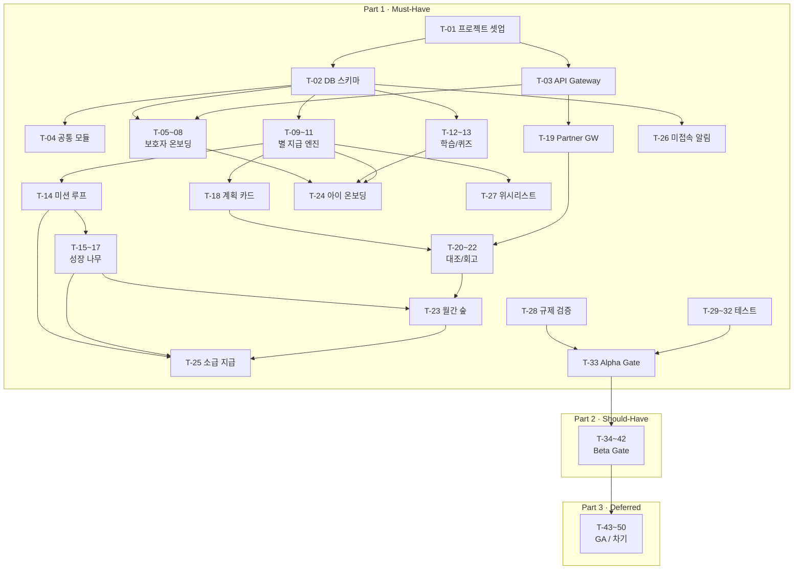

# FinFriends MVP 개발 태스크 리스트 (경량화)

- **문서 ID:** TASK-FINFRIENDS-MVP-001
- **버전:** 1.1
- **작성일:** 2026-08-25
- **기준 문서:** `SRS_문서_핀프렌즈_v1.1_검토반영본.md`, `FinFriends_Technical_Design_Specification.md`

> **읽는 법**
> - 태스크 ID: `T-{순번}` (SRS REQ 추적 컬럼 별도 명시)
> - **작업 규모:** 모든 태스크는 **0.5일~2일(4~16h)** 단위로 설계
> - **분류:** Must-Have → Should-Have → Deferred 순으로 배치
> - **의존:** 선행 태스크 ID로 표기. 미기재 시 독립 착수 가능

---

# Part 1. Must-Have (Alpha Gate 필수)

> MVP 출시의 최소 요건. 이 태스크가 모두 완료되어야 Alpha Gate를 통과한다.

---

## A. 공통 인프라

| # | Task ID | 태스크 | 상세 | 규모 | 의존 | REQ |
|---|---|---|---|---|---|---|
| 1 | T-01 | 프로젝트 구조 + CI/CD + 린터 | 레포 구조, 빌드 파이프라인, 포맷터/린터 설정, `.gitignore` 일괄 셋업 | 1d | — | — |
| 2 | T-02 | DB 스키마 전체 초기 마이그레이션 | SRS §10 기반 13개 테이블 DDL 일괄 작성 (`parent_accounts`, `child_accounts`, `consent`, `learning_completions`, `practice_credits`, `star_ledger`, `star_balance`, `tree_states`, `monthly_forest_snapshots`, `spending_plan_cards`, `spending_records`, `wishlists`, `app_events`, `audit_logs`) + PK/FK/UQ 제약 + Encryption at Rest 설정 | 2d | T-01 | 전체, NF-012/013 |
| 3 | T-03 | API Gateway + 인증/인가 + 세션 | Gateway 셋업, `requestId` 발급, 표준 오류 응답, Rate Limiting, 보호자 세션 ≤24h / 아동 ≤7d, 입력 검증 미들웨어 | 2d | T-01 | NF-014/015/016 |
| 4 | T-04 | 공통 모듈: Idempotency + Audit + Event | `Idempotency-Key` 미들웨어, `audit_logs` 자동 기록, Event Envelope(SRS §12.1) 스키마 및 발행 모듈 통합 구현 | 2d | T-02 | NF-008/018 |

---

## B. 보호자 온보딩 & 동의 (REQ-FUNC-001)

> **Seq 참조:** 보호자 → 앱 → Gateway → KYC → Account & Consent → DB

| # | Task ID | 태스크 | 상세 | 규모 | 의존 | REQ |
|---|---|---|---|---|---|---|
| 5 | T-05 | 온보딩 진행 상태 관리 서비스 | `createProgress()` — 5단계 저장/조회, 중간 종료 후 직전 단계 재개(AC1), 세션 만료 시 재개(E2), 실패 시 입력값 24h 보존(E1) | 1.5d | T-02 | 001 |
| 6 | T-06 | 본인인증(KYC) 연동 | 외부 KYC `verify()` 호출, 성공/실패/타임아웃 처리 | 1d | T-03 | 001 |
| 7 | T-07 | 법정대리인 동의 등록 + 동의 게이트 Guard | `POST /consent` → `consent=COMPLETED`. 동의 미완 시 아이 앱 진입 100% 차단(REG-001). 서버 사이드 강제 | 1d | T-05, T-06 | 001, REG-001 |
| 8 | T-08 | 온보딩 API 3종 + 아동 생성 | `GET/PUT /onboarding/{step}`, `POST /children` — 동의 전제 조건 검증 포함 | 1d | T-07 | 001 |

---

## C. 별 지급 엔진 (REQ-FUNC-002)

> **Seq 참조:** Client → Practice → Star Ledger → DB(멱등성 체크 + lock + append + update) → Analytics

| # | Task ID | 태스크 | 상세 | 규모 | 의존 | REQ |
|---|---|---|---|---|---|---|
| 9 | T-09 | Star Ledger 서비스 (`grantStar` / `deductStar`) | Trigger(1~8), idemKey 멱등성, `lock balance` → `append` → `update`. 차감 시 잔액 부족 차단. 불변식: `balance_after(n) = balance_after(n-1) + delta(n)`. 별↔현금 전환 경로 차단(REG-005) | 2d | T-02, T-04 | 002, REG-005 |
| 10 | T-10 | 별 조회/지급 API | `GET /stars`, `POST /stars/grant` | 0.5d | T-09 | 002 |
| 11 | T-11 | 별 원장 정합성 배치 | Daily batch: `balance_after` 체인 검증, mismatch > 0 시 30min Alert | 1d | T-09 | NF-008 |

---

## D. 학습/퀴즈 (REQ-FUNC-003)

| # | Task ID | 태스크 | 상세 | 규모 | 의존 | REQ |
|---|---|---|---|---|---|---|
| 12 | T-12 | 커리큘럼 + 퀴즈 서비스 | `GET /curriculum` (4주제 + 완료 상태), `POST /quiz/{topicId}/submit` (채점 + 학습 완료 기록). 불리기 영역은 학습만 개통, 실천 잠금(ADR-006) | 1.5d | T-02 | 003 |
| 13 | T-13 | 학습 완료 → 별 지급 연동 | 학습/퀴즈 완료 시 `grantStar()` 호출. **학습 별은 WPA 미산입**(ADR-001) | 0.5d | T-09, T-12 | 003, 002 |

---

## E. 미션 루프 (REQ-FUNC-004)

| # | Task ID | 태스크 | 상세 | 규모 | 의존 | REQ |
|---|---|---|---|---|---|---|
| 14 | T-14 | 미션 CRUD + 상태 전이 | `POST /missions` (보호자 설정), `PUT /missions/{id}/approval` (승인→APPROVED / 거절→REJECTED). State Diagram(§8.1) 기반 잘못된 전이 차단. 승인 시 `practice_credits` 생성 (`practice_path=MISSION`, WPA 산입) | 2d | T-02, T-09 | 004 |

---

## F. 성장 나무 (REQ-FUNC-005)

> **Seq 참조:** 이벤트 → Growth Tree → DB(load → increment → 조건 체크 → 승급/유지 → 정체 판정)

| # | Task ID | 태스크 | 상세 | 규모 | 의존 | REQ |
|---|---|---|---|---|---|---|
| 15 | T-15 | Growth Tree 서비스 — 승급/정체 판정 | 이벤트 수신 → 카운터 증가 → 승급 조건(`학습≥3 AND 퀴즈≥5 AND 실천≥1`, 실천 0이면 승급 불가). 정체: cycle 시작 14일 미만 판정 금지, 14일 이후 미충족 조건 표시(가장 적게 남은 것 최상단). 승인 대기 N건은 "실패"와 구별 | 2d | T-02, T-14 | 005 |
| 16 | T-16 | 나무 조회 API + 성능 최적화 | `GET /tree` — 단계/조건/정체/미충족 목록. p95 ≤ 1,250ms(NF-001) | 1d | T-15 | 005, NF-001 |
| 17 | T-17 | Tree Stall 일배치 | Daily batch: `stall_days` 갱신 | 0.5d | T-15 | 005 |

---

## G. 소비 계획 카드 (REQ-FUNC-007)

| # | Task ID | 태스크 | 상세 | 규모 | 의존 | REQ |
|---|---|---|---|---|---|---|
| 18 | T-18 | 계획 카드 CRUD + 상태 관리 | `POST /plan-cards` (아이/보호자 모두 가능). 필수: 장소, 업종, 금액 상한. 선택: 품목. State(§8.2): PENDING→MATCHED / PENDING→EXPIRED. **위치 권한/푸시 권한 요구 금지**(NF-017) | 1d | T-02 | 007, NF-017 |

---

## H. 계획↔실제 대조 / 회고 (REQ-FUNC-008)

> **Seq 참조:** 제휴사 → Partner GW → Spending Plan(매칭) → Retro → Star Ledger → 아이 앱

| # | Task ID | 태스크 | 상세 | 규모 | 의존 | REQ |
|---|---|---|---|---|---|---|
| 19 | T-19 | Partner Gateway 서비스 | 제휴사 API 통신 레이어: 카드 발행(`POST /partner/cards`), 충전(`POST /partner/topup`), 해지/환불(`POST /partner/cards/{id}/terminate`, REG-007 잔액 전액 환불), 결제 트랜잭션 수신(5~15분 폴링 또는 웹훅) | 2d | T-03 | 001, 002, REG-007 |
| 20 | T-20 | 매칭 엔진 | 3단계 매칭: ① CATEGORY → ② MERCHANT → ③ AMOUNT_ONLY. 판정: `actual ≤ planned` → 별+1/`plan_met=true`, `actual > planned` → 별 미지급/`plan_met=false`. 업종 불일치여도 금액 지켰으면 별 지급(§13 #8), `category_met=false` 기록 | 2d | T-18, T-19, T-09 | 008, NF-005 |
| 21 | T-21 | 회고 서비스 + API | 회고 문장 분기(`plan_met`/`category_met` 조합, 비복원 추출 §13 #11), 큐 3건 초과 시 요약 병합(§13 #12). `POST /retro/{recordId}/confirm`, `GET /plan-cards/{cardId}/reconciliation`. 회고 완료 → `practice_credits` 생성(`practice_path=RETRO`, WPA 산입) | 1.5d | T-20 | 008 |
| 22 | T-22 | Payment Reconciliation 배치 | 5~15분 주기 결제 대조 자동화 | 1d | T-19, T-20 | 008 |

---

## I. 월간 숲 (REQ-FUNC-009)

| # | Task ID | 태스크 | 상세 | 규모 | 의존 | REQ |
|---|---|---|---|---|---|---|
| 23 | T-23 | Forest Snapshot 월배치 + 조회 API | Monthly batch: 4영역 단계 + 7개 지표 집계 → snapshot 생성. 전월 대비 비교 로직(첫 달은 비교 불가 메시지). `GET /forest`. p95 ≤ 2,000ms(NF-002) | 2d | T-15, T-20 | 009, NF-002 |

---

## J. 아이 온보딩 (REQ-FUNC-010)

> **Seq 참조:** 아동 최초 진입 → 짧은 학습 → 퀴즈 → 온보딩 별(balance=1) → 구매 가능 아이템 추천

| # | Task ID | 태스크 | 상세 | 규모 | 의존 | REQ |
|---|---|---|---|---|---|---|
| 24 | T-24 | 아이 온보딩 플로우 | 최초 진입 감지(1회만) → 짧은 레슨 → 퀴즈 → `grantStar(onboarding)` → 1별 이하 아이템 추천 | 1d | T-08, T-12, T-09 | 010 |

---

## K. 승인 지연 소급 지급 (REQ-FUNC-011)

> **Seq 참조:** 보호자 → Practice(cycle 계산) → Ledger(backfill) → Growth(원래 cycle) → Forest(원래 snapshot)

| # | Task ID | 태스크 | 상세 | 규모 | 의존 | REQ |
|---|---|---|---|---|---|---|
| 25 | T-25 | 소급 지급 로직 + 일괄 승인 | 48h 이상 미승인 감지. 같은 cycle: `grantStar()` + Growth 반영. cycle 넘긴 경우: `backfill grant` → 원래 cycle Growth/Forest 갱신, state=BACKFILLED. `POST /missions/bulk-approval`(5건 이상 일괄). 사용자 메시지 "지난 달 실천으로 인정됐어요" | 2d | T-14, T-15, T-23 | 011, NF-009 |

---

## L. 3일 미접속 알림 (REQ-FUNC-012)

> **Seq 참조:** Scheduler → Notification → Account(last_session) → Push/Banner/SMS 분기

| # | Task ID | 태스크 | 상세 | 규모 | 의존 | REQ |
|---|---|---|---|---|---|---|
| 26 | T-26 | 미접속 감지 + 알림 발송 | Hourly batch: 72h 경과 추출(71h 재접속 시 오탐 0). Push enabled → Push, disabled → Banner + SMS 동의 시 SMS, 앱 삭제 → 재설치 안내. 부모 활동 시간대 내 발송. `PUT /notification-window` | 2d | T-02, T-03 | 012, NF-010 |

---

## M. 위시리스트 (REQ-FUNC-013)

| # | Task ID | 태스크 | 상세 | 규모 | 의존 | REQ |
|---|---|---|---|---|---|---|
| 27 | T-27 | 위시리스트 CRUD + 마일스톤 별 지급 | `POST/GET /wishlist`. 30/70/100% 도달 시 각 별 1개. 동일 단계 중복 지급 금지(paid 플래그). 목표 하향 소급 지급 금지. 삭제 시 별 미회수. 마일스톤 달성 → `practice_credits`(WISHLIST, WPA 산입) | 1.5d | T-02, T-09 | 013 |

---

## N. 규제 / 보안 검증

| # | Task ID | 태스크 | 상세 | 규모 | 의존 | REQ |
|---|---|---|---|---|---|---|
| 28 | T-28 | 규제 준수 일괄 검증 | ① 위치정보 수집 0건(Manifest/스키마/네트워크, REG-002/NF-017) ② 얼굴 이미지 미수집(REG-006) ③ 별↔저금통 전환 차단(REG-005) ④ 만14세 마이데이터 경로 차단(REG-009) ⑤ 동의 게이트 100%(REG-001). Static analysis + 자동 테스트 | 1.5d | T-07, T-09 | REG-001~009 |

---

## O. 핵심 테스트

| # | Task ID | 태스크 | 상세 | 규모 | 의존 | REQ |
|---|---|---|---|---|---|---|
| 29 | T-29 | Unit 테스트 — 핵심 규칙/상태 전이 | 별 멱등성, Mission 상태 전이, Plan Card 상태 전이, 승급/정체 판정, 매칭 순서, 위시리스트 중복 방지 | 2d | T-09~T-27 | 전체 |
| 30 | T-30 | Integration 테스트 — DB + Partner + Event | Star Ledger 정합성, Partner Gateway 연동, Event 발행/수신 | 2d | T-29 | 전체 |
| 31 | T-31 | E2E 테스트 — 5대 핵심 여정 | ① 온보딩→동의→아이 생성 ② 학습→퀴즈→별 ③ 미션→승인→별→나무 ④ 계획 카드→결제→대조→회고→별 ⑤ 소급 지급 | 2d | T-30 | 전체 |
| 32 | T-32 | 성능/부하 테스트 | 나무 p95≤1,250ms, 숲 p95≤2,000ms, 별 지급 p95≤800ms | 1d | T-16, T-23, T-10 | NF-001~003 |

---

## P. Alpha Gate 체크

| # | Task ID | 태스크 | 상세 | 규모 | 의존 | REQ |
|---|---|---|---|---|---|---|
| 33 | T-33 | Alpha Gate 체크리스트 실행 | REG 자동 테스트 100%, ledger mismatch 0, location permission 0, NF-001~003 SLO 충족 확인 + 보고 | 1d | T-28~T-32 | Gate |

---

# Part 2. Should-Have (Beta Gate 대상)

> Alpha 이후 Beta Gate까지 구현. 제품 완성도와 KPI 측정에 필요하다.

| # | Task ID | 태스크 | 상세 | 규모 | 의존 | REQ |
|---|---|---|---|---|---|---|
| 34 | T-34 | 아바타/옷장 서비스 | `GET /wardrobe`, `POST /wardrobe/purchase` — `deductStar()` → ownership 생성, 잔액 부족 차단. 1차 시드 데이터 2종×4벌=8 아이템. 얼굴 이미지 미수집(REG-006) | 1.5d | T-09 | 006 |
| 35 | T-35 | 소비 내역 조회 | `GET /spending` — 전월 대비 증감액 상단, 업종별 집계, UNKNOWN→미분류, 첫 달 비교 불가 메시지. `GET /partner/cards/{id}/transactions` | 1d | T-20 | 014 |
| 36 | T-36 | Analytics 이벤트 일괄 구현 | `star_ledger_entry`, `tree_state_changed`, `tree_view_opened`, `forest_view_opened`, `retro_viewed`, `approval_state_changed`, `inactivity_notified`, `onboarding_step`, `consent_gate_blocked`, `practice_credited`, `plan_card_created` — 총 11종 이벤트 발행 코드 | 2d | T-04, T-09~T-26 | NF |
| 37 | T-37 | WPA 배치 + API | Weekly D+1 배치: `WPA(w) = distinct practice_credited children / active children`. 활성 조건: 동의완료 + 7일 경과 + 28일 내 세션 1+. KST/ISO week. `GET /metrics/wpa` | 1.5d | T-04 | KPI §18.1 |
| 38 | T-38 | Secondary Metrics 수집 | 계획 카드 작성률(≥50%), 매칭 정확도(≥90%), 첫 실천 인정률(β≥60%), 카드 연결률(≥60%) — 집계 쿼리 + 대시보드 연동 | 1d | T-37 | KPI §18.2 |
| 39 | T-39 | Critical Alert 6종 구현 | Consent violation(>0, 30min), Ledger mismatch(>0, 30min), Location permission(>0, build block), API error(>0.5% 3d, release hold), WPA drop(-10%p WoW, 24h), Matching accuracy(<90% 2w, redesign) | 1.5d | T-37, T-11 | SRS §20 |
| 40 | T-40 | Dependency CVE 스캔 + Data Purge 배치 | Weekly CVE 스캔 파이프라인(NF-019). Daily Data Purge 배치 + audit(NF-020) | 1d | T-01 | NF-019/020 |
| 41 | T-41 | 아동 친화적 고지 문구 | 아동용 UI 법적 고지 사항 문구 작성 + 적용(REG-003) | 0.5d | — | REG-003 |
| 42 | T-42 | Beta Gate 체크리스트 실행 | E4≥60%, E1≥6/8, WPA≥5/8, 매칭≥90% 검증 + 보고 | 1d | T-34~T-41 | Gate |

---

# Part 3. Deferred (GA 이후 또는 차기 릴리즈)

> MVP 범위 밖이거나 정책/법률 검토 대기. Feature flag만 예약하거나 설계만 준비한다.

| # | Task ID | 태스크 | 상세 | 규모 | 의존 | REQ |
|---|---|---|---|---|---|---|
| 43 | T-43 | 예적금 비교·선택 — 잠금 처리 | Feature flag + UI 잠금 표시 + API 차단. 법률 검토 통과 전 구현 착수 금지. WPA v1→v2 전환 설계 문서 | 0.5d | — | 015 |
| 44 | T-44 | 카드 없는 체험 — Feature Flag | Could / 차기 릴리즈. Feature flag 예약만 | 0.5d | — | 016 |
| 45 | T-45 | 별의 옷장 외 목적지 — Feature Flag | Could / 정책 재검토 이후. Feature flag 예약만 | 0.5d | — | 017 |
| 46 | T-46 | 기존 기록 이전 미제공 확인 | Won't Have. "지금부터" 프레임 UI 문구 준비 | 0.5d | — | 018 |
| 47 | T-47 | 아바타 3D 에셋 파이프라인 | 3D asset 파일 관리/로딩 체계(ADR-007: S1 동시 발주) | 1d | T-34 | 006 |
| 48 | T-48 | Cloud Cost / 인증 Cost 모니터링 | ≤500원/child/month(NF-021), 인증 ≤300원/signup(NF-022). 빌링 대시보드 구축 | 1d | T-37 | NF-021/022 |
| 49 | T-49 | UX 검증 인터뷰 | n=8 인터뷰: 나무 5초 회상 ≥6/8, 부모 확인 소요 ≤3min | 1d | T-42 | KPI §18.2 |
| 50 | T-50 | GA Gate 체크리스트 | WPA≥55% 2주 연속, 인지≤3일, 정합성 오류 0, 계획 카드 작성률≥50%, 카드 연결률≥60% | 1d | T-49 | Gate |

---

# 태스크 의존 관계 요약

---

# 집계

| 분류 | 태스크 수 | 총 공수(일) |
|---|---|---|
| **Part 1. Must-Have** (Alpha) | 33 | ~44d |
| **Part 2. Should-Have** (Beta) | 9 | ~11d |
| **Part 3. Deferred** (GA/차기) | 8 | ~6d |
| **합계** | **50** | **~61d** |

---

# REQ → Task 추적표

| REQ | Task ID |
|---|---|
| FUNC-001 온보딩/동의 | T-05, T-06, T-07, T-08 |
| FUNC-002 별 지급 엔진 | T-09, T-10, T-11 |
| FUNC-003 학습/퀴즈 | T-12, T-13 |
| FUNC-004 미션 루프 | T-14 |
| FUNC-005 성장 나무 | T-15, T-16, T-17 |
| FUNC-006 아바타/옷장 | T-34, T-47 |
| FUNC-007 계획 카드 | T-18 |
| FUNC-008 대조/회고 | T-20, T-21, T-22 |
| FUNC-009 월간 숲 | T-23 |
| FUNC-010 아이 온보딩 | T-24 |
| FUNC-011 소급 지급 | T-25 |
| FUNC-012 미접속 알림 | T-26 |
| FUNC-013 위시리스트 | T-27 |
| FUNC-014 소비 내역 | T-35 |
| FUNC-015 예적금 | T-43 |
| FUNC-016 카드 없는 체험 | T-44 |
| FUNC-017 별 옷장 외 목적지 | T-45 |
| FUNC-018 기록 이전 | T-46 |
| Partner Gateway | T-19 |
| 규제/보안 | T-28, T-40, T-41 |
| KPI/모니터링 | T-37, T-38, T-39, T-48 |
| 테스트 | T-29, T-30, T-31, T-32, T-49 |
| Release Gate | T-33, T-42, T-50 |

---

## 변경 이력

| Version | Date | Change |
|---|---|---|
| 1.0 | 2026-08-25 | SRS v1.1 검토반영본 기반 초기 태스크 리스트 작성 (128건) |
| 1.1 | 2026-08-25 | 경량화: 128건 → 50건 통합. Must-Have/Should-Have/Deferred 3단계 분류. 0.5~2일 작업 단위 정제 |
