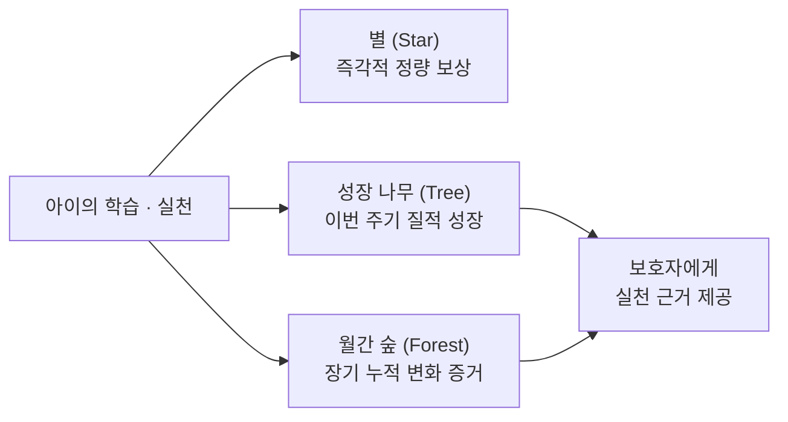
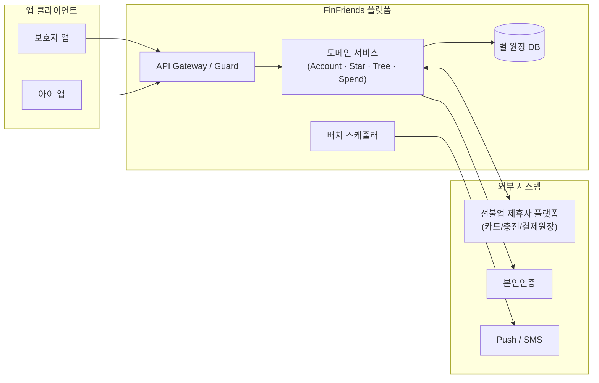

# 핀프렌즈 (FinFriends) — PRD to SRS & Implementation

**만 8~9세 아동을 위한 폐쇄형 선불카드 기반 금융교육 플랫폼**  
아이의 금융 행동 실천을 기록하고, 그 변화를 보호자에게 증거로 제시하는 서비스 요구사항·설계·구현 태스크 통합 저장소입니다.

---

## 📚 핵심 문서 체계 (Deliverables)

본 저장소의 산출물은 **PRD ➔ SRS ➔ 기술 설계 ➔ 개발 태스크**로 1:1 추적성을 갖추고 있습니다.

| 단계 | 산출물 문서 | 버전 | 주요 내용 |
|:---:|---|:---:|---|
| **01. 기획** | [`finfriends-prd-v1_0.md`](finfriends-prd-v1_0.md) | `v1.0` | **제품 요구사항 정의서 (PRD)** • 북극성 지표(WPA), 8대 사용자 스토리, 기능/비기능 요구사항 • 외부 제휴사 책임 경계 및 ADR 8건 |
| **02. 개정 계획** | [`plans/srs_revision_plan.md`](plans/srs_revision_plan.md) | `v1.2` | **SRS 개정 계획서** • Next.js 단일 풀스택, Prisma + Supabase PG, Gemini AI 연동 계획 • $0 무료 인프라 완화 전략 |
| **03. 요구사항 (최신)** | [`SRS_문서_핀프렌즈_v1.2.md`](SRS_문서_핀프렌즈_v1.2.md) | `v1.2` | **소프트웨어 요구사항 명세서 (SRS v1.2 AI-Native 최적화본)** • ISO/IEC/IEEE 29148:2018 준수 • Next.js Server Actions / Prisma Schema / Gemini AI 연동 명세 • REQ-FUNC 18건, NFR 24건, Mock Sandbox, ADR 13건 |
| **04. 기술 설계** | [`FinFriends_Technical_Design_Specification.md`](FinFriends_Technical_Design_Specification.md) | `v1.0` | **기술 설계 문서 (TDS)** • 도메인 아키텍처, 멱등성 및 원장 불변식 설계 • 제휴사 Gateway 연동, 이벤트 버스, 배치 스케줄러 명세 |
| **05. 개발 태스크** | [`FinFriends_Development_Task_List.md`](FinFriends_Development_Task_List.md) | `v1.1` | **개발 상세 태스크 리스트 (50건)** • Must-Have(33건) / Should-Have(9건) / Deferred(8건) • 0.5~2일 단위 공수 산정 및 선후행 의존 관계 다이어그램 |

> 💡 *참고: 실제 구현 및 검증 기준선은 AI-Native 단일 풀스택 기술 스택이 반영된 **v1.2 최신 명세서**([`SRS_문서_핀프렌즈_v1.2.md`](SRS_문서_핀프렌즈_v1.2.md))를 따릅니다.*

---

## 🎯 제품 핵심 가치 & 지표

- **핵심 가치 선언**:
  1. **자녀 (실천 계층)**: 금융을 짧게 배우고 행동(미션·소비 계획·위시리스트)을 직접 실천하며 성장한다.
  2. **보호자 (증거 계층)**: 학습량이 아닌 **금융 행동이 어떻게 달라졌는지**를 데이터와 변화로 확인한다.
- **북극성 KPI (North Star Metric)**:
  - **WPA (Weekly Practicing Active-children, 주간 실천 인정 아동 비율)**
  $$\text{WPA}(w) = \frac{\text{주간 실천(미션/회고/위시리스트) 인정 아동 수}}{\text{주초 활성 아동 수}}$$

---

## 🏗️ 시스템 아키텍처 & 외부 경계

- **책임 경계 (ADR-005)**: 선불전자지급수단 발행, 카드 발급, 충전금 별도 관리, 결제 원장은 **제휴사 인프라**를 사용합니다. FinFriends는 행동 데이터, 별 원장, 성장 알고리즘을 소유합니다.
- **철저한 규제 준수 (Compliance)**:
  - 위치정보(GPS) 수집 0건 (REG-002, NF-017)
  - 얼굴 이미지 미수집 및 동물 아바타 사용 (REG-006)
  - 별↔현금성 저금통 전환 완전 차단 (REG-005, ADR-004)
  - 법정대리인 동의 미완료 시 아동 진입 100% 서버 차단 (REG-001)

---

## 🚦 릴리즈 게이트 & 개발 로드맵

| 단계 | 목표 | 주요 진입 조건 (Quality Gate) | 태스크 규모 |
|---|---|---|:---:|
| **Alpha Gate** | 핵심 플로우 동작 & 보안/규제 100% | • REG 자동 테스트 100% 통과 • 별 원장 불변식 오차 0% • 위치 권한 0건 검증 • 핵심 성능 SLO 충족 (나무 ≤1.25s, 별지급 ≤0.8s) | **Part 1 (33개)** ~44 M/D |
| **Beta Gate** | 사용자 경험 및 데이터 파이프라인 검증 | • 첫 실천 인정률 $\ge 60\%$ • 결제-계획 매칭 정확도 $\ge 90\%$ • WPA 분석 파이프라인 및 알림 정상 동작 | **Part 2 (9개)** ~11 M/D |
| **General Release** | 상용 서비스 오픈 | • 2주 연속 WPA $\ge 55\%$ • 미접속 인지 $\le 3\text{일}$ • 계획 카드 작성률 $\ge 50\%$ / 카드 연결률 $\ge 60\%$ | **Part 3 (8개)** ~6 M/D |

---

## 🛠️ 변경 관리 및 규칙

1. **단일 진실 공급원 (Single Source of Truth)**:
   - 요구사항 변경은 **PRD §7-4 / SRS §23 ADR**을 통해 결정 후 전파합니다.
2. **역방향/정방향 추적성 보장**:
   - `PRD 스토리` ➔ `SRS 요구사항(REQ)` ➔ `API/DB 스키마` ➔ `태스크(T-xx)` ➔ `테스트 케이스(TC)` 연결을 항상 유지합니다.
