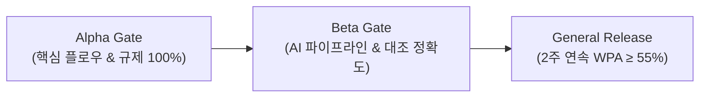

# 핀프렌즈 (FinFriends) — AI-Native 금융교육 플랫폼

> **"만 8~9세 아동의 금융 행동 실천을 기록하고, 그 변화를 보호자에게 시각적 증거로 증명합니다."**  
> 본 저장소는 **PRD(기획) ➔ SRS(요구사항) ➔ TDS(기술설계) ➔ Task List(개발태스크)** 로 이어지는 1:1 역방향/정방향 추적성을 갖춘 통합 개발 명세 및 다중 에이전트(Multi-Vendor Agent) Harness 저장소입니다.

---

## 📌 Repository About & Topics

### 📖 Description
```
아동의 금융 행동 실천(벌기·쓰기·모으기·불리기)을 돕고 보호자에게 시각적 성장을 증명하는 AI-Native 금융교육 플랫폼 (Next.js, Prisma, Supabase, Gemini AI)
```

### 🏷️ Recommended Topics / Tags
`nextjs`, `typescript`, `prisma`, `supabase`, `vercel-ai-sdk`, `gemini-ai`, `financial-education`, `fintech`, `agent-harness`, `compliance`

---

## 🛠️ 핵심 기술 스택 (AI-Native Single Fullstack)

핀프렌즈 MVP는 복잡한 마이크로서비스를 배제하고 **Next.js 단일 풀스택 + 완전 무료 인프라($0/월)** 환경에서 무결하게 구동되도록 설계되었습니다.

| 레이어 | 기술 스택 | 근거 및 제약 |
|---|---|---|
| **프레임워크** | **Next.js App Router (RSC + Server Actions)** | ADR-009 (단일 풀스택) |
| **언어** | **TypeScript (Strict Mode)** | 타입 안전성 및 런타임 오류 방지 |
| **ORM / DB** | **Prisma + Supabase PostgreSQL** | `DATABASE_URL`(6543 pgbouncer) / `DIRECT_URL`(5432 direct) 분리 |
| **검증** | **Zod** | 모든 Server Action 및 폼 입력 런타임 검증 |
| **AI 회고 엔진** | **Vercel AI SDK + Google Gemini 1.5 Flash** | ADR-010 (2.5s 하드 타임아웃 + 결정론적 룰 템플릿 Fallback) |
| **스케줄러** | **Supabase `pg_cron` + Lazy Evaluation** | ADR-011 ($0 인프라 배치 유지보수) |
| **외부 결제 연동** | **내장 Mock Partner Sandbox** | ADR-005, ADR-012 (실 결제망 미연동, 가상 승인/취소 Route Handler) |
| **UI / 테마** | **Tailwind CSS + shadcn/ui** | ADR-013 (아동 Fun / 보호자 Clean 듀얼 테마) |
| **테스트** | **Vitest** (Unit/Integration) + **Playwright** (E2E) | TDS §27 (GWT 시나리오 1:1 매핑) |
| **인프라** | **Vercel Hobby + Supabase Free** | REQ-NF-012 (**청구액 $0 불변 제약조건**) |

---

## 🤖 AI Agent Harness 구조 (Multi-Vendor 지원)

Antigravity, Cursor, Claude Code, OpenAI Codex 등 다양한 AI 코딩 에이전트가 동일한 규칙과 제약조건 하에서 충돌 없이 협업할 수 있도록 표준화된 Harness를 구성하고 있습니다.

```
.
├── .agents/                 # Antigravity & AI Agent 표준 커스터마이징 루트
│   ├── rules/               # 프로젝트 불변식 및 전역 개발 규칙
│   └── skills/              # 100~300번대 도메인/기술 스택별 전문 스킬
├── .cursor/                 # Cursor IDE 연동 디렉토리
│   ├── rules/               # Cursor Rules (.mdc)
│   └── skills/              # Cursor Skills (SKILL.md)
├── .claude/                 # Claude Code 연동 디렉토리
│   ├── agents/              # 4개 트랙 전용 서브에이전트 (track-a~d)
│   └── commands/            # 슬래시 커맨드 (/task-start, /gate-check, /fix-error)
├── AGENTS.md                # [SSOT] 모든 AI 에이전트 공통 행동 규칙
└── CLAUDE.md                # Claude Code 전용 라우팅 및 인터페이스 규약
```

### 🎯 4개 병렬 트랙 및 배타적 소유권 (`.cursor/rules/005`)
- **Track A (Core · Auth · Consent):** `prisma/schema.prisma`, `lib/auth/**`, `actions/onboarding.ts`, `middleware.ts`, `scripts/verify-compliance.ts`
- **Track B (Star Ledger · Practice):** `actions/ledger.ts`, `actions/learning.ts`, `actions/practice.ts`, `services/{ledger,quiz,mission,backfill}.service.ts`
- **Track C (Spending · Sandbox · AI):** `app/api/v1/sandbox/**`, `lib/sandbox/**`, `actions/{plan,retro}.ts`, `services/{plan,reconciliation}.service.ts`, `lib/ai/**`
- **Track D (Growth · Forest · Infra):** `prisma/seed.ts`, `actions/{growth,wardrobe,wishlist}.ts`, `services/{growth,forest,wardrobe,wishlist}.service.ts`

---

## 📚 핵심 문서 체계 (Deliverables Map — SSOT)

모든 기획과 설계 문서는 **ISO/IEC/IEEE 29148:2018** 요구사항 명세 표준을 준수합니다.

```
docs/
├── 00_PROJECT_DAG_ROADMAP.md        # [SSOT] 개발 총괄 실행 계획서 (30개 태스크 DAG, CPM 5.5MD)
├── 01_PRD/
│   └── finfriends-prd-v1_0.md       # 제품 요구사항 정의서 (WPA 지표, 8대 사용자 스토리, ADR 8건)
├── 02_SRS/
│   └── SRS_문서_핀프렌즈_v1.2.md    # 소프트웨어 요구사항 명세서 (ISO 29148, REQ 18건, NFR 24건, REG 9건)
├── 03_TDS/
│   └── FinFriends_Technical_Design_Specification.md # 기술 설계서 (도메인 모델, 별 원장 멱등성, 3단계 대조)
└── 04_Tasks/
    └── FinFriends_Development_Task_List.md          # 30개 상세 개발 태스크 목록
```

---

## 🛡️ 규제 및 정합성 6대 불변식 (Non-Negotiable Invariants)

| ID | 불변식 규칙 | 강제 수단 |
|:---:|---|---|
| **REG-001** | 법정대리인 동의 완료 전 아동 화면 진입 **차단율 100%** | `middleware.ts` Server Guard + E2E |
| **REG-005a** | 별 원장 $\text{balance\_after}(n) = \text{balance\_after}(n-1) + \text{delta}(n)$ **오차 0** | DB 제약 + Vitest 동시성 테스트 |
| **REG-005b** | 모든 별 지급/차감은 `idempotencyKey` **UNIQUE** 필수 | DB 제약 + `services/ledger.service.ts` 단일 진입 |
| **REG-005c** | 별 ↔ 현금성 잔액 전환 함수 및 필드 **원천 배제** | `npm run compliance` 정적 스캔 |
| **REG-002** | 위치정보(Geolocation) 권한/좌표/API 호출 **0건** | 정적 스캔 3계층 방어 |
| **REG-006** | 아동 얼굴 이미지 업로드 엔드포인트 **0건** (사전 렌더링 에셋 전용) | 정적 스캔 방어 |

---

## 🚦 릴리즈 게이트 (Release Gates)



1. **Alpha Gate:** REG 컴플라이언스 100% 통과, 별 원장 불변식 오차 0%, Warm 응답 SLO 충족(나무 $\le$ 800ms, 별지급 $\le$ 600ms).
2. **Beta Gate:** 첫 실천 인정률 $\ge 60\%$, 결제-계획 3단계 대조 정확도 $\ge 90\%$, Gemini AI Fallback 무결성.
3. **General Release:** 2주 연속 WPA $\ge 55\%$, 계획 카드 작성률 $\ge 50\%$, 3일 미접속 푸시 알림 인지율 $\ge 90\%$.

---

## 🚀 개발 실행 루프 (Definition of Done)

1. **이슈 및 명세 확인:** `tasks/step-*/TASK-XXX.md`의 Target Files, GWT 인수조건, 검증 명령어 정독.
2. **소유권 준수 구현:** 배타 소유 파일 범위 내에서 작업하며, 레이어 호출 규칙(`app → actions → services → lib/prisma`)을 준수.
3. **검증 및 무결성 확인:**
   ```bash
   npx tsc --noEmit && npm run lint && npm run compliance
   ```
4. **커밋 및 PR 생성:** Conventional Commits 규약(`feat(scope): 내용 (TASK-XXX)`)에 맞춰 커밋하고 PR 본문에 `Closes #<이슈번호>` 명시.
