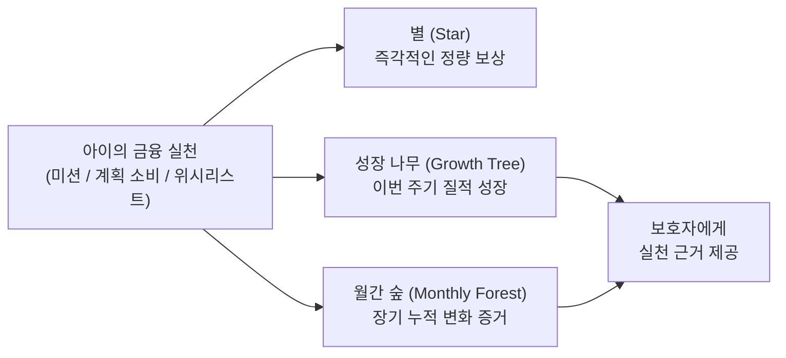
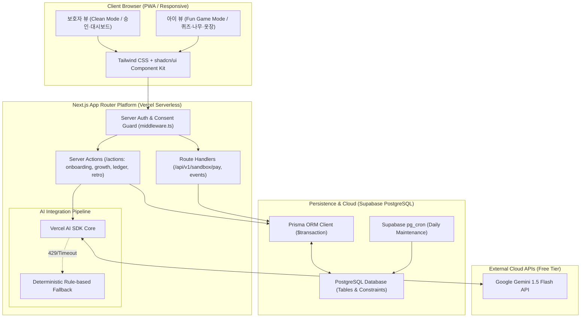

# 핀프렌즈 (FinFriends) — AI-Native 금융교육 플랫폼

> **"만 8~9세 아동의 금융 행동 실천을 기록하고, 그 변화를 보호자에게 시각적 증거로 증명합니다."**  
> 본 저장소는 **PRD(기획) ➔ SRS(요구사항) ➔ TDS(기술설계) ➔ Task List(개발태스크)** 로 이어지는 1:1 역방향/정방향 추적성을 갖춘 통합 개발 명세 및 다중 에이전트(Multi-Agent) Harness 저장소입니다.

---

## ⚡ 빠르게 훑어보기

```bash
npm install
npm run dev     # http://localhost:3000 — 화면 색인이 뜬다
```

| 명령 | 하는 일 |
|---|---|
| `npm run dev` | 개발 서버 |
| `npm run build` | 프로덕션 빌드 |
| `npm run typecheck` | `tsc --noEmit` |
| `npm run lint` | ESLint |
| `npm run compliance` | 금지 식별자 정적 검사 (`TASK-405` 산출 전 임시본) |

> **요구 런타임** — Node.js `v24.20.0` LTS · npm `11.19.0`

### 저장소를 처음 여는 사람이 볼 순서

| 무엇을 알고 싶은가 | 어디를 보는가 |
|---|---|
| 이 서비스가 무엇인가 | 아래 「제품 핵심 가치」 → [`docs/01-prd/prd.md`](docs/01-prd/prd.md) |
| 지금 무엇이 만들어져 있나 | [`docs/00-plan/prototype-review-log.md`](docs/00-plan/prototype-review-log.md) |
| 무엇을 어떤 순서로 만드나 | [`docs/00-plan/prototype-execution-plan.md`](docs/00-plan/prototype-execution-plan.md) |
| 왜 그렇게 정했나 | [`docs/00-plan/grill-ledger.md`](docs/00-plan/grill-ledger.md) |
| 에이전트가 지켜야 할 규칙 | [`AGENTS.md`](AGENTS.md) |

### 화면 13건 (확정 라우트 · `AGENTS.md` §3.2)

| 아동 뷰 — Fun Mode | 보호자 뷰 — Clean Mode |
|---|---|
| `/child/tree` 성장 나무 | `/parent/onboarding` 보호자 온보딩 |
| `/child/learn` 학습 주제 | `/consent` 법정대리인 동의 |
| `/child/quiz/[topic]` 퀴즈 | `/parent/forest` 월간 숲 대시보드 |
| `/child/missions` 미션 보고 | `/parent/missions` 승인·반려 |
| `/child/plan/new` 소비 계획 카드 | |
| `/child/retro/[recordId]` AI 회고 | |
| `/child/stars` 별 잔액·이력 | |
| `/child/wardrobe` 아바타 옷장 | |
| `/child/wishlist` 위시리스트 | |

**라우트를 신설하지 않는다.** 필요하면 `AGENTS.md` §3.2 를 먼저 고친다.

---

## 🛠️ 핵심 기술 스택 (AI-Native Single Fullstack)

핀프렌즈 MVP는 복잡한 다중 서버 아키텍처를 탈피하여 **단일 풀스택 및 완전 무료 인프라($0/월)** 환경에서 완벽히 자립 구동되도록 설계되었습니다.

- **프레임워크:** [Next.js](https://nextjs.org/) (App Router 기반 단일 풀스택)
- **서버 로직:** Next.js Server Actions & Route Handlers (별도 백엔드 서버 없음)
- **데이터베이스:** [Prisma ORM](https://www.prisma.io/) + [Supabase PostgreSQL](https://supabase.com/) (pgbouncer 6543 / direct 5432 분리)
- **UI / 스타일링:** [Tailwind CSS](https://tailwindcss.com/) + [shadcn/ui](https://ui.shadcn.com/) (아동 Fun / 보호자 Clean 듀얼 테마)
- **AI 회고 엔진:** [Vercel AI SDK](https://sdk.vercel.ai/) + [Google Gemini 1.5 Flash API](https://ai.google.dev/) (2.5s 타임아웃 + 룰 템플릿 Fallback)
- **외부 결제 연동:** 내장 Mock Partner Sandbox (실 결제망 미연동 가상 Route Handler)
- **테스트:** [Vitest](https://vitest.dev/) (Unit/Integration) + [Playwright](https://playwright.dev/) (E2E)
- **배포 & 인프라:** [Vercel](https://vercel.com/) (Git Push 무중단 배포, Hobby Free Tier $0 제약 준수)

---

## 📚 핵심 문서 체계 (Deliverables Map)

모든 기획과 설계는 **ISO/IEC/IEEE 29148:2018** 표준 및 규제(만 14세 미만 동의, 위치정보 수집 0건)를 엄격히 준수합니다.

번호는 **디렉토리 번호 하나만** 씁니다. `tasks/` 는 명세가 아니라 실행 트리라 번호를 갖지 않습니다.

| 디렉토리 | 산출물 문서 | 버전 | 주요 내용 |
|:---:|---|:---:|---|
| **`docs/00-plan/`**<br>총괄 계획 | [`dag-roadmap.md`](docs/00-plan/dag-roadmap.md) | `v2.0` | **개발 총괄 실행 계획서 (Execution Master Plan) — 실행 SSOT**<br>• 태스크 30건 DAG · 7개 위상 웨이브 · CPM 임계경로 5.5 MD (4트랙 총 20.5 MD)<br>• 파일 배타 소유권 맵, 교차 계약 8건, 릴리즈 게이트 프로토콜 |
| | [`prototype-suggestion.md`](docs/00-plan/prototype-suggestion.md) | `v1.1` | **시각 프로토타이핑 선별안 (부분 승인)**<br>• 30건 중 UI 표면 소유 태스크 선별(Tier 1 9건 / Tier 2 5건), 13 라우트 화면 맵, fixture 승격 규약<br>• 라우트·소유권은 확정되어 `AGENTS.md` §3.2·§6 반영. 실행 계획 P0~P3는 미착수 |
| | [`prototype-execution-plan.md`](docs/00-plan/prototype-execution-plan.md) | `v1.0` | **프로토타입 실행 지시서 (Node 확정판) — 착수 SSOT**<br>• 확정 런타임 Node v24.20.0 LTS · 스택 버전 후보와 함정 2건 · P0~P3 2.5 MD<br>• 라우트 13건 화면별 상세 명세 · 듀얼 테마 토큰 13종 × 2모드 · CSS 모션 · 완료 판정 9문항<br>• 이 문서 하나만 읽고 착수한다 |
| | [`grill-ledger.md`](docs/00-plan/grill-ledger.md) | — | **UI/UX 결정 원장 (6/6 RESOLVED)**<br>• 나무 소유 뷰 · 화면 범위 · 모드 접근 · 모션 수준 · 토큰 · 아바타 표현<br>• 각 결정의 근거와 반영 위치를 추적 |
| **`docs/01-prd/`**<br>기획 | [`prd.md`](docs/01-prd/prd.md) | `v1.0` | **제품 요구사항 정의서 (PRD)**<br>• 북극성 지표(WPA), 8대 사용자 스토리, 기능/비기능 요구사항, 선불업 경계 ADR 8건 |
| **`docs/02-srs/`**<br>요구사항 | [`srs.md`](docs/02-srs/srs.md) | `v1.2` | **소프트웨어 요구사항 명세서 (SRS)**<br>• REQ-FUNC 18건, NFR 24건, REG 9건, Server Actions 및 Prisma 스키마, ADR 13건 |
| **`docs/03-tds/`**<br>기술 설계 | [`tds.md`](docs/03-tds/tds.md) | `v1.0` | **기술 설계 문서 (TDS)**<br>• 도메인 모델, 별 원장 멱등성/불변식 설계, Mock Sandbox 3단계 대조 엔진 |
| **[`tasks/`](tasks/)**<br>실행 | [`task-list.md`](tasks/task-list.md)<br>[`parallel-gantt.md`](tasks/parallel-gantt.md)<br>[`step-N/TASK-XXX.md`](tasks/) | `v1.2` | **개발 태스크 30건 — 개별 명세가 구현 SSOT**<br>• 4단계 원칙(Contract ➔ Logic ➔ Test ➔ NFR)·공수·REQ 매핑<br>• 태스크별 Target Files · GWT 인수조건 · 검증 명령어 |

### 파일·디렉토리 명명 규칙

| 대상 | 규칙 | 예 |
|---|---|---|
| 디렉토리 | 소문자 kebab-case. 정렬이 필요하면 숫자를 접두 또는 접미하며 자릿수는 디렉토리별로 일관되게 | `00-plan/` · `step-1/` · `100-error-fixing-process/` |
| 문서 파일 | `kebab-case.md` — ASCII 소문자만. **한글·버전 표기 금지** | `dag-roadmap.md` · `srs.md` |
| ID 파일 | ID 자체가 이름 | `TASK-101.md` |
| 예외 | 도구·플랫폼이 이름을 고정하는 파일 | `README.md` · `SKILL.md` · `AGENTS.md` · `CLAUDE.md` |

> **버전을 파일명에 넣지 않는 이유** — 버전이 오를 때마다 인바운드 링크가 전부 깨진다.
> 버전은 각 문서 헤더의 `**버전:**` 줄이 소유한다.

---

## 🎯 제품 핵심 가치 및 북극성 지표



### 1. 2대 가치 선언
1. **자녀 (실천 계층):** 금융을 재미있게 배우고, 계획적인 소비와 미션 실천을 통해 스스로 성장한다.
2. **보호자 (증거 계층):** 얼마나 배웠는지가 아니라 **금융 행동이 어떻게 달라졌는지**를 시각적 데이터로 확인한다.

### 2. 북극성 KPI (North Star Metric)
- **WPA (Weekly Practicing Active-children, 주간 실천 인정 아동 비율)**
  $$\text{WPA}(w) = \frac{\text{주간 실천(미션 승인/계획 준수 지출) 인정 아동 수}}{\text{주초 활성 아동 수}}$$

---

## 🏗️ 시스템 아키텍처 (Single Fullstack)



---

## 🤖 AI Agent Harness 및 4트랙 병렬 개발

Antigravity, Cursor, Claude Code, OpenAI Codex가 공통 SSOT 하에서 충돌 없이 개발할 수 있도록 Harness가 구성되어 있습니다.

**원본은 한 곳뿐입니다.** 같은 내용이 두 경로에 있으면 한쪽은 반드시 기계 생성 파생본이며, 파생본을 직접 편집하면 다음 동기화에서 소실됩니다 ([`AGENTS.md`](AGENTS.md) §3.1).

```
├── AGENTS.md                # [원본] 모든 AI 에이전트 공통 행동 규칙 및 불변식
├── CLAUDE.md                # [원본] Claude Code 전용 라우팅
├── .claude/
│   ├── skills/              # [원본] 도메인 스킬 12건 — Claude Code 가 로드
│   ├── agents/              # [원본] 4트랙 서브에이전트
│   └── commands/            # [원본] 슬래시 커맨드 3건
├── .cursor/
│   ├── rules/               # [파생] AGENTS.md 를 Cursor .mdc 형식으로 반영 (수동)
│   └── skills/              # [파생] scripts/sync-skills.sh 가 생성 — 직접 편집 금지
└── scripts/sync-skills.sh   # 스킬 동기화 및 드리프트 검사 (--check)
```

| 자산 | 원본 | 파생본 | 동기화 |
|---|---|---|---|
| 프로젝트 규칙 | `AGENTS.md` | `.cursor/rules/*.mdc` | 수동 |
| 도메인 스킬 12건 | `.claude/skills/` | `.cursor/skills/` | `bash scripts/sync-skills.sh` |
| 서브에이전트 · 커맨드 | `.claude/{agents,commands}/` | — | Claude Code 전용 |

> Codex · Antigravity 용 `.agents/` 는 `.cursor/` 와 100% 중복이라 제거했습니다.
> 되살리려면 파생본으로 추가하고 `sync-skills.sh` 에 등록하십시오.

### 🎯 4개 병렬 트랙 소유권 분리
- **Track A (Core · Auth · Consent):** `prisma/schema.prisma`, `lib/auth/**`, `actions/onboarding.ts`, `middleware.ts`, `scripts/verify-compliance.ts`
- **Track B (Star Ledger · Practice):** `actions/ledger.ts`, `actions/learning.ts`, `actions/practice.ts`, `services/{ledger,quiz,mission,backfill}.service.ts`
- **Track C (Spending · Sandbox · AI):** `app/api/v1/sandbox/**`, `lib/sandbox/**`, `actions/{plan,retro}.ts`, `services/{plan,reconciliation}.service.ts`, `lib/ai/**`
- **Track D (Growth · Forest · Infra):** `prisma/seed.ts`, `actions/{growth,wardrobe,wishlist}.ts`, `services/{growth,forest,wardrobe,wishlist}.service.ts`

---

## 🛡️ 핵심 컴플라이언스 및 불변 원칙

1. **법정대리인 동의 게이트 (REG-001):** 만 14세 미만 아동의 서비스 이용 전 보호자 동의를 필수로 받으며, 미동의 상태 시 아동 진입을 서버 레벨에서 100% 차단합니다 (`middleware.ts`).
2. **위치정보 수집 0건 (REG-002, REQ-NF-009):** Geolocation API 호출 및 GPS 좌표 저장을 원천 배제하며 정적 스캔(`npm run compliance`)으로 강제합니다.
3. **얼굴 이미지 미수집 (REG-006, REQ-NF-010):** 아동 얼굴 사진 업로드를 금지하고 사전 렌더링된 2D 벡터 아바타만 제공합니다.
4. **별 원장 불변식 (REG-005, REQ-FUNC-002):** 별(Star)은 인앱 포인트로만 기능하며 현금성 잔액과 완전 분리됩니다.
   $$\text{balance\_after}_n = \text{balance\_after}_{n-1} + \text{delta}_n$$

---

## 🚦 릴리즈 게이트 (Release Gates)

| 단계 | 목표 | 주요 진입 조건 (Quality Gate) |
|---|---|---|
| **Alpha Gate** | 핵심 플로우 동작 & 보안/규제 100% | • REG 자동 테스트 100% 통과<br>• 별 원장 불변식 오차 0%<br>• 위치 권한 0건 검증<br>• Serverless Warm 응답 SLO 충족 (나무 ≤800ms, 별지급 ≤600ms) |
| **Beta Gate** | 사용자 경험 및 AI 파이프라인 검증 | • 첫 실천 인정률 $\ge 60\%$<br>• 결제-계획 매칭 정확도 $\ge 90\%$<br>• Gemini AI 회고 피드백 및 Fallback 파이프라인 무결성 |
| **General Release** | 상용 서비스 오픈 | • 2주 연속 WPA $\ge 55\%$<br>• 3일 미접속 알림 인지율 $\ge 90\%$<br>• 계획 카드 작성률 $\ge 50\%$ |

---

## 🛠️ 변경 관리 및 추적성 규칙

1. **단일 진실 공급원 (Single Source of Truth):**
   - 모든 요구사항 변경은 **PRD §7-4 및 SRS §17 ADR**을 통해 결정 후 코드로 전파됩니다.
2. **End-to-End 추적성 (Traceability):**
   - `PRD User Story` ➔ `SRS REQ-FUNC` ➔ `Next.js Server Action / Prisma Model` ➔ `Task List` ➔ `Test Case` 추적 체계를 상시 유지합니다.
