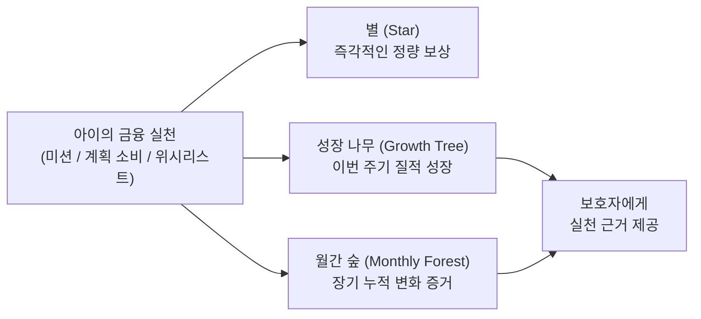
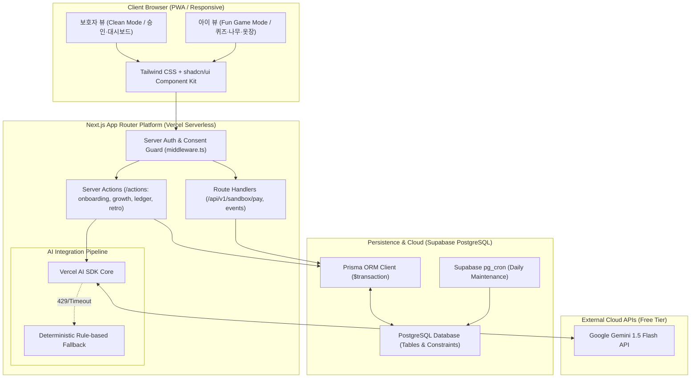

# 핀프렌즈 (FinFriends) — AI-Native 금융교육 플랫폼

> **"만 8~9세 아동의 금융 행동 실천을 기록하고, 그 변화를 보호자에게 시각적 증거로 증명합니다."**  
> 본 저장소는 **PRD(기획) ➔ SRS(요구사항) ➔ TDS(기술설계) ➔ Task List(개발태스크)**로 이어지는 1:1 역방향/정방향 추적성을 갖춘 통합 개발 명세 저장소입니다.

---

## 🛠️ 핵심 기술 스택 (AI-Native Single Fullstack)

핀프렌즈 MVP는 복잡한 다중 서버 아키텍처를 탈피하여 **단일 풀스택 및 완전 무료 인프라($0/월)** 환경에서 완벽히 자립 구동되도록 설계되었습니다.

- **프레임워크:** [Next.js](https://nextjs.org/) (App Router 기반 단일 풀스택)
- **서버 로직:** Next.js Server Actions & Route Handlers (별도 백엔드 서버 없음)
- **데이터베이스:** [Prisma ORM](https://www.prisma.io/) + 로컬 Supabase CLI / 배포 시 [Supabase PostgreSQL](https://supabase.com/)
- **UI / 스타일링:** [Tailwind CSS](https://tailwindcss.com/) + [shadcn/ui](https://ui.shadcn.com/) (아동 Fun / 보호자 Clean 듀얼 테마)
- **AI 엔진:** [Vercel AI SDK](https://sdk.vercel.ai/) + [Google Gemini 1.5 Flash API](https://ai.google.dev/) (단일 파이프라인 + Fallback 룰 엔진)
- **배포 & 인프라:** [Vercel](https://vercel.com/) (Git Push 기반 무중단 배포, Hobby/Free Tier 제약 준수)

---

## 📚 핵심 문서 체계 (Deliverables Map)

모든 기획과 설계는 **ISO/IEC/IEEE 29148:2018** 표준 및 규제(만 14세 미만 동의, 위치정보 수집 0건)를 엄격히 준수합니다.

| 단계 | 산출물 문서 | 버전 | 주요 내용 |
|:---:|---|:---:|---|
| **01. 기획** | [`finfriends-prd-v1_0.md`](finfriends-prd-v1_0.md) | `v1.0` | **제품 요구사항 정의서 (PRD)** • 북극성 지표(WPA), 8대 사용자 스토리, 기능/비기능 요구사항 • 선불업 책임 경계 및 ADR 8건 |
| **02. 개정 계획** | [`plans/srs_revision_plan.md`](plans/srs_revision_plan.md) | `v1.2` | **SRS 개정 계획서** • Next.js 단일 풀스택 + Prisma + Gemini AI 전환 전략 • $0 무료 인프라 완화(Mitigation) 전략 수립 |
| **03. 요구사항** | [`SRS_문서_핀프렌즈_v1.2.md`](SRS_문서_핀프렌즈_v1.2.md) | `v1.2` | **소프트웨어 요구사항 명세서 (SRS v1.2 최신본)** • **ISO/IEC/IEEE 29148:2018 준수** • REQ-FUNC 18건, NFR 24건, REG 9건 • Server Actions, Prisma 스키마, 7개 시퀀스 다이어그램, 신규 ADR 13건 |
| **04. 기술 설계** | [`FinFriends_Technical_Design_Specification.md`](FinFriends_Technical_Design_Specification.md) | `v1.0` | **기술 설계 문서 (TDS)** • 도메인 모델, 별 원장 멱등성 및 불변식 설계 • Mock Sandbox 결제 대조 및 스케줄러 명세 |
| **05. 개발 태스크** | [`FinFriends_Development_Task_List.md`](FinFriends_Development_Task_List.md) | `v1.1` | **개발 상세 태스크 리스트 (50건)** • Must-Have(33건) / Should-Have(9건) / Deferred(8건) • 0.5~2일 단위 공수 산정 및 선후행 의존 관계도 |

> 💡 *기준선 안내: 과거 v1.0/v1.1 문서는 이력 보존용이며, 실제 구현 및 검증 기준선은 **v1.2 최신 명세서**([`SRS_문서_핀프렌즈_v1.2.md`](SRS_문서_핀프렌즈_v1.2.md))를 따릅니다.*

---

## 🎯 제품 핵심 가치 및 북극성 지표

### 1. 2대 가치 선언
1. **자녀 (실천 계층):** 금융을 재미있게 배우고, 계획적인 소비와 미션 실천을 통해 스스로 성장한다.
2. **보호자 (증거 계층):** 얼마나 배웠는지가 아니라 **금융 행동이 어떻게 달라졌는지**를 시각적 데이터로 확인한다.

### 2. 북극성 KPI (North Star Metric)
- **WPA (Weekly Practicing Active-children, 주간 실천 인정 아동 비율)**
  $$\text{WPA}(w) = \frac{\text{주간 실천(미션 승인/계획 준수 지출) 인정 아동 수}}{\text{주초 활성 아동 수}}$$

---

## 🏗️ 시스템 아키텍처 (Single Fullstack)

---

## 🛡️ 핵심 컴플라이언스 및 불변 원칙

1. **법정대리인 동의 게이트 (REG-001):** 만 14세 미만 아동의 서비스 이용 전 보호자 동의를 필수로 받으며, 미동의 상태 시 아동 진입을 서버 레벨에서 100% 차단합니다.
2. **위치정보 수집 0건 (REG-002, REQ-NF-009):** Geolocation API 호출 및 GPS 좌표 저장을 원천 배제합니다.
3. **얼굴 이미지 미수집 (REG-006, REQ-NF-010):** 아동 얼굴 사진 업로드를 금지하고 사전 렌더링된 2D 벡터 아바타만 제공합니다.
4. **별 원장 불변식 (REG-005, REQ-FUNC-002):** 별(Star)은 인앱 포인트로만 기능하며 현금성 잔액과 완전 분리됩니다.
   $$\text{balance\_after}_n = \text{balance\_after}_{n-1} + \text{delta}_n$$

---

## 🚦 릴리즈 게이트 (Release Gates)

| 단계 | 목표 | 주요 진입 조건 (Quality Gate) |
|---|---|---|
| **Alpha Gate** | 핵심 플로우 동작 & 보안/규제 100% | • REG 자동 테스트 100% 통과 • 별 원장 불변식 오차 0% • 위치 권한 0건 검증 • Serverless Warm 응답 SLO 충족 (나무 ≤800ms, 별지급 ≤600ms) |
| **Beta Gate** | 사용자 경험 및 AI 파이프라인 검증 | • 첫 실천 인정률 $\ge 60\%$ • 결제-계획 매칭 정확도 $\ge 90\%$ • Gemini AI 회고 피드백 및 Fallback 파이프라인 무결성 |
| **General Release** | 상용 서비스 오픈 | • 2주 연속 WPA $\ge 55\%$ • 3일 미접속 알림 인지율 $\ge 90\%$ • 계획 카드 작성률 $\ge 50\%$ |

---

## 🛠️ 변경 관리 및 추적성 규칙

1. **단일 진실 공급원 (Single Source of Truth):**
   - 모든 요구사항 변경은 **PRD §7-4 및 SRS §17 ADR**을 통해 결정 후 코드로 전파됩니다.
2. **End-to-End 추적성 (Traceability):**
   - `PRD User Story` ➔ `SRS REQ-FUNC` ➔ `Next.js Server Action / Prisma Model` ➔ `Task List` ➔ `Test Case` 추적 체계를 상시 유지합니다.
