# [SRS 보강본] 핀프렌즈(FinFriends)

- **문서 ID:** SRS-FINFRIENDS-MVP-001
- **개정 버전:** 1.1
- **날짜:** 2026-08-25
- **표준:** ISO/IEC/IEEE 29148:2018
- **입력 문서:** `finfriends-prd-v1_0.md` v1.0
- **검토 기준:** PRD Story/AC, REQ-FUNC, REQ-NF, 인터페이스/API, 데이터 모델, Traceability, UML/행동 다이어그램, ISO 29148 구조

> **문서 상태:** v1.0 SRS의 요구사항을 기준선으로 유지하면서, 요구사항-설계 추적성·KPI/NF 연결·UML/행동 다이어그램·데이터 스키마·인터페이스 연결을 보강한 v1.1 검토 반영본이다.
>
> **중요:** 본 보강본은 원본 SRS의 요구사항을 변경하는 것이 아니라, 구현·검증 단계에서 빠질 수 있는 연결 정보를 명시적으로 추가한다. 요구사항 자체를 바꾸려면 PRD §7-4 / SRS ADR 체계를 통해 별도 변경한다.

---

# 0. 검토 결과 요약

| 기준 | v1.0 상태 | v1.1 판정 | 조치 |
|---|---|---|---|
| 1. PRD Story/AC → REQ-FUNC | 대부분 반영 | **조건부 충족 → 보강 후 충족** | Story→REQ 및 AC-level Traceability 추가 |
| 2. KPI/성능 → REQ-NF | 성능은 반영, KPI는 6.7 중심 | **부분 충족 → 보강 후 충족** | KPI/NF Coverage를 4.3에 추가 |
| 3. API 목록 | 핵심 API 존재 | **부분 충족 → 보강 후 충족** | PRD 인터페이스 ↔ SRS API ↔ REQ 매핑 추가 |
| 4. 데이터 모델 | 핵심 엔터티/스키마 존재 | **부분 충족 → 보강 후 충족** | 논리 ERD + 스키마 필드/키/제약 보강 |
| 5. Traceability Matrix | REQ→모듈→테스트 존재 | **부분 충족 → 보강 후 충족** | PRD F/US/AC → REQ → API → DB → Diagram → TC 추적 |
| 6. 기본 다이어그램 | 시스템 설명은 존재 | **미충족 → 충족** | Use Case, ERD, Class, Component, State, Flow 추가 |
| 7. Sequence Diagram 3~5개 | SRS 본문에 부족 | **미충족 → 충족** | 핵심 7개 작성 및 REQ 직후 배치 |
| 8. ISO 29148 구조 | 매핑은 있었으나 구조적 명시성이 약함 | **조건부 → 보강 후 충족** | ISO 29148 Content Map 및 logical DB / design constraint / verification 관계를 명시 |

**핵심 결론:** v1.0은 요구사항 자체는 상당히 잘 만들어져 있었지만, **“요구사항이 설계와 테스트에서 어떻게 구현되는가”를 SRS 안에서 한눈에 추적하는 정보가 부족**했다. v1.1은 이 연결을 보강한다.

---

# 1. ISO/IEC/IEEE 29148 적합성 맵

ISO/IEC/IEEE 29148:2018은 요구사항 공학의 프로세스와 요구사항 정보 산출물의 내용·형식에 대한 지침을 제공한다. 본 문서는 이를 엄격한 목차 복제 방식보다 **required information item의 누락 방지** 관점에서 적용한다.

| ISO 29148 계열 요구 정보 | SRS 위치 | v1.1 상태 |
|---|---|---|
| Purpose | §1.1 | 충족 |
| Scope | §1.2 | 충족 |
| Product Perspective / System Context | §3 | 충족 + Context Diagram |
| Product Functions | §4.2 | 충족 |
| User Characteristics | §2 | 충족 |
| Constraints / Limitations | §1.2, §4.4, §6.8 | 충족 |
| Assumptions & Dependencies | §4.1, §6.9 | 충족 |
| Apportioning of Requirements | §4.1.2 | 충족 |
| Specified Functional Requirements | §4.2 | 충족 |
| External Interfaces | §3, §6.1 | 충족 + API Contract |
| Logical Database Requirements | §6.2 | **v1.1 보강** |
| Design Constraints | §4.4, §6.8 | 충족 |
| Software System Attributes / NFR | §4.3, §6.6 | 충족 |
| Verification | §4.2/4.3/6.7 | 충족 |
| Supporting Information | §6.5~6.9, Appendix | 충족 |
| Traceability | §5 | **v1.1 보강** |

> ISO/IEC/IEEE 29148:2018은 2018년판이 현재 유효한 판본이며, 2024년에 확인되었고 2026년 현재 개정 작업이 진행 중이다. 본 SRS의 기준판은 29148:2018이다.

---

# 2. 서론

## 2.1 목적

본 문서는 만 8~9세 아동의 금융 행동 실천을 기록하고 그 변화를 보호자에게 증거로 제시하는 폐쇄형 선불카드 기반 금융교육 플랫폼 **FinFriends**의 소프트웨어 요구사항을 정의한다.

제품의 두 가치 선언은 다음과 같다.

1. 자녀가 금융을 학습하고 금융 행동을 실천하며 성장한다.
2. 얼마나 배웠는지가 아니라 금융 행동이 어떻게 달라졌는지를 한눈에 보여준다.

## 2.2 범위

### In Scope

- 금융 학습 4주제 + 퀴즈
- 실천 판정: 미션 승인 / 소비 회고 / 위시리스트
- 소비 계획 카드
- 계획↔실제 대조
- 별 원장
- 성장 나무
- 월간 숲
- 아바타/옷장
- 보호자 온보딩 5단계
- 법정대리인 동의 게이트
- 승인 지연 소급
- 3일 미접속 알림
- 소비 내역
- 선불업 제휴사 API 연동

### Out of Scope

- 외부 현금 용돈
- 친구 기능
- 모의투자
- 미션 사진 인증
- 위치정보
- 위치 기반 자동 알림
- 소비 순간 자동 개입
- 본 릴리즈에서의 예적금 가입 중개
- 타사 기록 이전

### Limitations

- 사전 소비 개입은 계획 카드에 의존한다.
- 온라인 결제 사전 개입은 v1에서 제공하지 않는다.
- 불리기 영역은 학습만 개통하고 실천은 잠근다.
- 학습이 행동 변화로 이어진다는 가설은 별도 실험으로 검증해야 한다.

---

# 3. 이해관계자와 사용자 특성

| 역할 | 책임 |
|---|---|
| PM | 요구사항/우선순위/ADR/릴리즈 게이트 |
| 정책·법령 담당 | 규제 검증 |
| 개발팀 리드 | 설계 승인/SLO |
| 개발 엔지니어 | 구현/정합성/테스트 |
| QA | AC 검증 |
| 콘텐츠 | 학습 콘텐츠/회고 문장 |
| 사업 | 제휴 조건/원가/수익 |
| 운영 | 배포/모니터링 |
| 제휴사 | 카드/충전/결제 원장 |
| 보호자 | 동의/충전/승인/성장 확인 |
| 아동 | 학습/실천/소비/회고 |

### 주요 사용자

- H1: 학습이 실제 행동으로 이어졌는지 빠르게 확인하고 싶은 보호자
- H2: 소비 전에 한 번 멈추게 하고 기록을 남기고 싶은 보호자
- 아동: 짧고 명확한 금융 학습과 즉각적인 별 보상 경험을 원하는 사용자

---

# 4. 시스템 맥락 및 인터페이스

## 4.1 Context Diagram

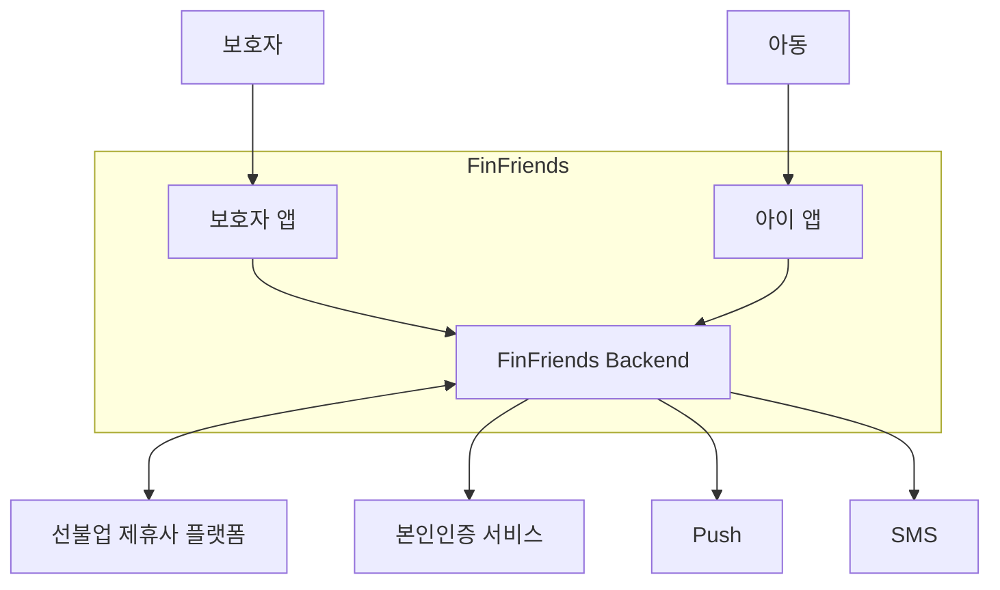

### 4.1.1 외부 시스템 책임 경계

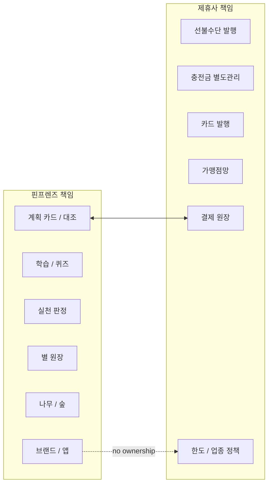

위 경계는 ADR-005에 따른다. FinFriends는 결제 인프라 자체를 소유하지 않으며 제휴사 정책의 최종 결정권도 갖지 않는다.

---

# 5. Use Case

## 5.1 Use Case Diagram

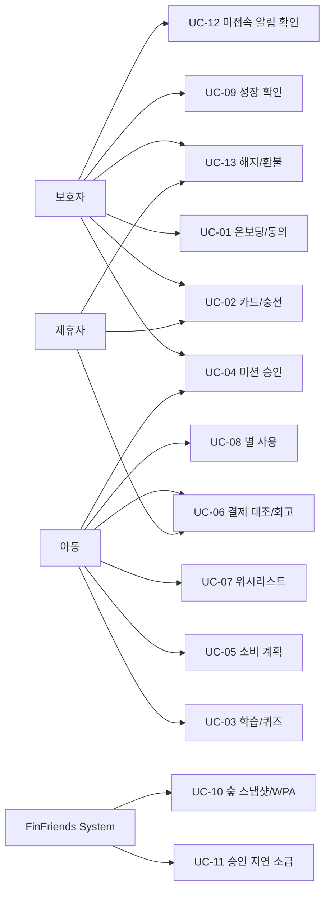

## 5.2 Use Case ↔ REQ 매핑

| Use Case | REQ |
|---|---|
| UC-01 | 001 |
| UC-02 | 001, 016 |
| UC-03 | 003, 006, 010 |
| UC-04 | 004, 011 |
| UC-05 | 007 |
| UC-06 | 008 |
| UC-07 | 013 |
| UC-08 | 002, 006, 017 |
| UC-09 | 005, 009, 014 |
| UC-10 | 009, 015 |
| UC-11 | 011 |
| UC-12 | 012 |
| UC-13 | REG-007 |

---

# 6. 기능 요구사항

> 기능 요구사항 ID는 v1.0의 기준선을 유지한다. 각 요구사항의 PRD Story/AC 연결은 §6.20 Traceability에서 명시한다.

## 6.1 REQ-FUNC-001 보호자 온보딩 및 법정대리인 동의

### Acceptance Criteria

- AC1: 5단계 중간 종료 후 다음 날 직전 단계에서 재개, 재입력 0건
- AC2: 총 소요 중위 ≤ 10분, 3단계 이탈률 ≤ 30%
- AC3: 동의 미완 상태 아이 진입 차단률 100%
- E1: 카드 신청 외부 API 실패 시 입력값 24시간 보존
- E2: 세션 만료 후 직전 완료 단계 재개, 동의 단계 재확인

### Sequence Diagram — REQ-FUNC-001

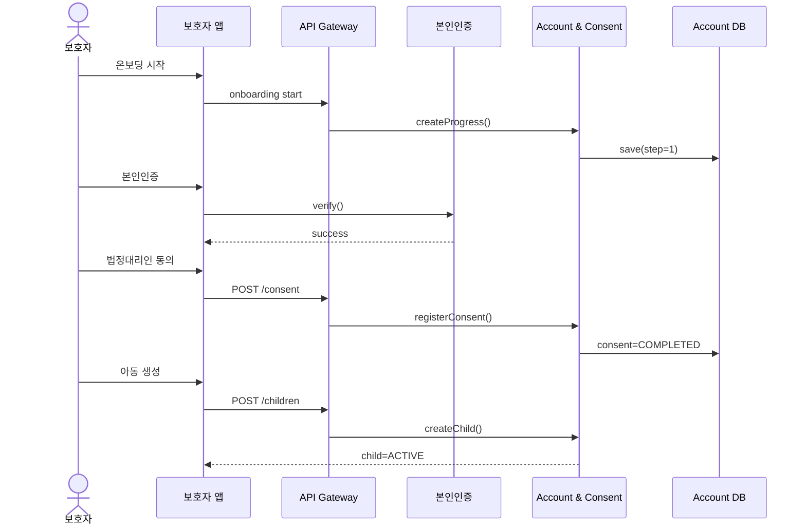

---

## 6.2 REQ-FUNC-002 별 지급 엔진

### 핵심 규칙

- Trigger 1~8
- 자동 7종 + 보호자 승인 1종
- cycle 초기화 없음
- idempotency 필수
- 현금성 잔액과 별 완전 분리

### Sequence Diagram — REQ-FUNC-002

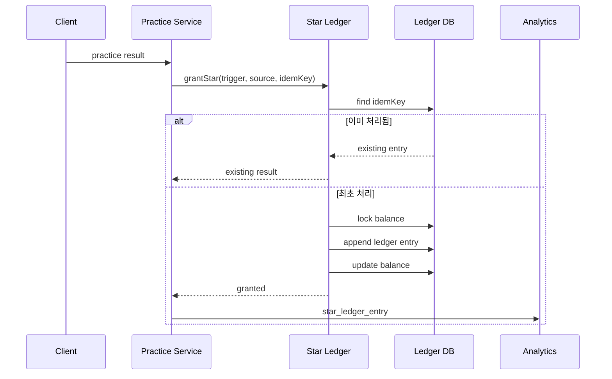

---

## 6.3 REQ-FUNC-003 학습/퀴즈

- 4주제 제공
- 퀴즈 채점
- 학습 완료 기록
- 불리기는 학습만 개통
- 학습 별은 WPA에 산입하지 않는다.

---

## 6.4 REQ-FUNC-004 미션 루프

- 미션 조건/금액 설정
- 아동 수행
- 보호자 승인
- 승인 성공 시 실천 인정
- 거절 시 별 미지급 및 실천 미인정

---

## 6.5 REQ-FUNC-005 성장 나무

### 핵심 규칙

```text
학습 >= 3
AND
퀴즈 >= 5
AND
실천 >= 1
→ 승급 가능
```

- 실천 0건이면 승급 불가
- 주기 초기화 직후 14일 미만은 정체 판정 금지
- 미충족 조건 전체 표시
- 가장 적게 남은 조건을 최상단 표시
- 승인 대기 N건은 성장 실패와 구별

### Sequence Diagram — REQ-FUNC-005

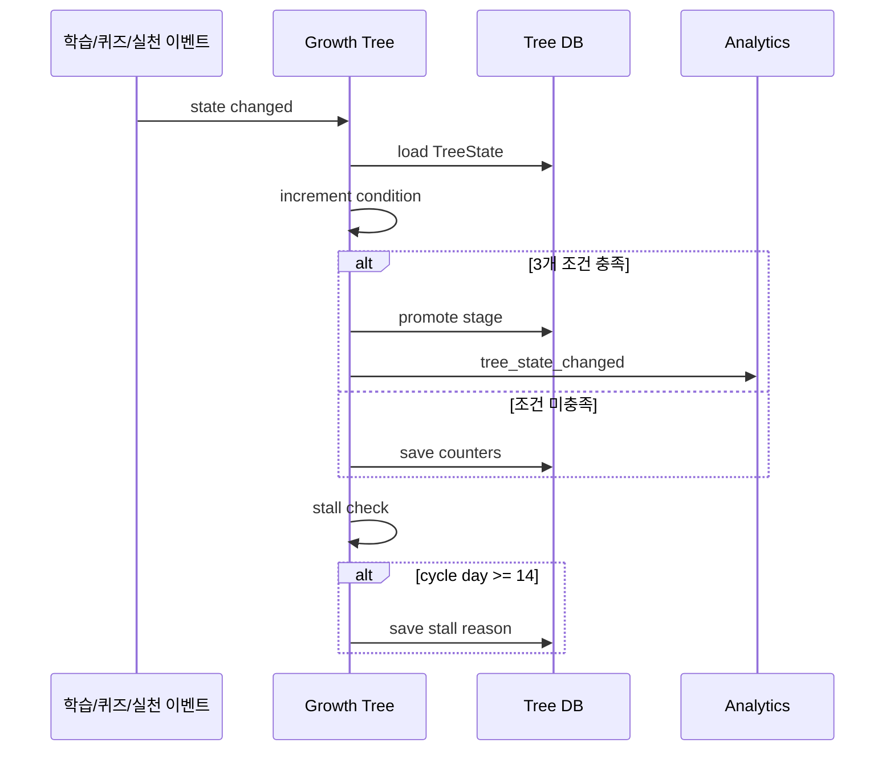

---

## 6.6 REQ-FUNC-006 아바타/옷장

- 5종 × 8벌 = 40조합
- 1차 납품 2종 × 4벌
- 별 잔액 부족 시 구매 차단
- 누적 별 구매 가능
- 이미지 업로드는 없다.

---

## 6.7 REQ-FUNC-007 소비 계획 카드

- 아이/보호자 모두 작성 가능
- 기기 종류 무관
- 위치 권한/푸시 권한 요구 금지
- 필수: 장소, 업종, 금액 상한
- 선택: 품목
- 작성률 목표 ≥ 50%

---

## 6.8 REQ-FUNC-008 계획↔실제 대조/회고

### 매칭 순서

```text
CATEGORY
  ↓ 실패
MERCHANT
  ↓ 실패
AMOUNT_ONLY
```

### 판정

```text
actual <= planned
    → 별 +1
    → plan_met=true

actual > planned
    → 별 미지급
    → plan_met=false
```

업종 불일치는 별 지급을 막지 않으며 `category_met=false`로 기록하고 회고 문장을 분기한다.

### Sequence Diagram — REQ-FUNC-008

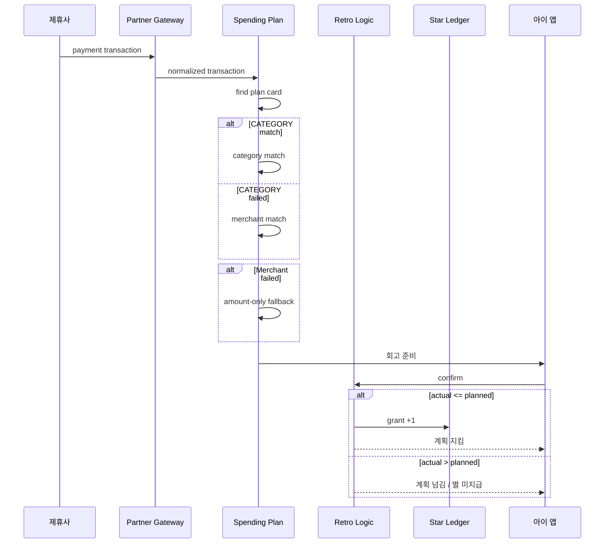

---

## 6.9 REQ-FUNC-009 월간 숲

- 전월 대비
- 4영역 단계
- 사려다 멈춤
- 가격 비교
- 저축률
- 총 7개 지표
- 첫 달에는 비교 불가 메시지

---

## 6.10 REQ-FUNC-010 아이 온보딩

### Sequence Diagram — REQ-FUNC-010

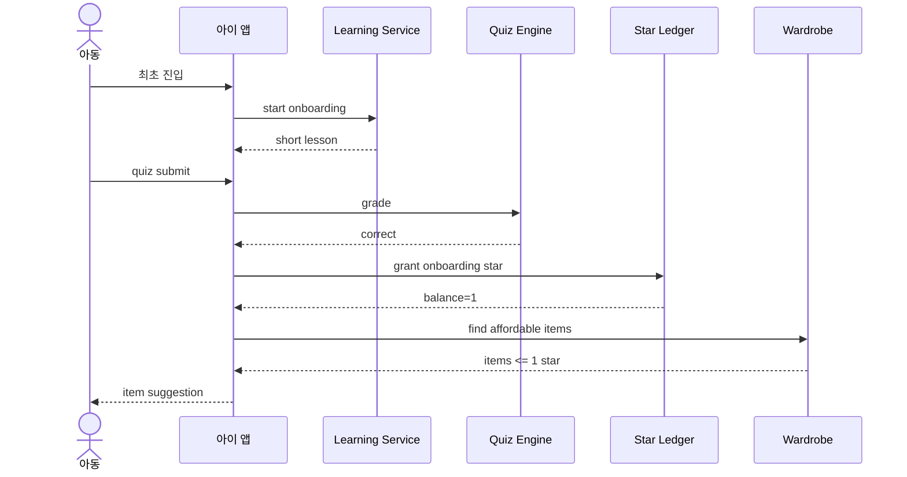

---

## 6.11 REQ-FUNC-011 승인 지연 소급 지급

### 규칙

- 완료 후 48시간 이상 미승인 가능
- 나중에 승인되면 완료 시점 기준 별 지급
- 나무 조건은 완료 시점 cycle에 귀속
- 월간 숲에도 해당 cycle로 반영
- 5건 이상이면 일괄 승인

### Sequence Diagram — REQ-FUNC-011

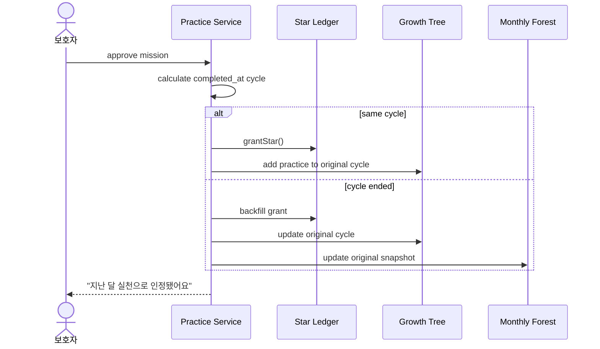

---

## 6.12 REQ-FUNC-012 3일 미접속 알림

- 72시간 판정
- 발송률 100%
- 인지 ≤ 3일
- 부모 활동 시간대 설정
- Push 차단 → Banner + 동의 시 SMS
- 앱 삭제 → 재설치 안내
- 71시간 재접속 → 오탐 알림 0

### Sequence Diagram — REQ-FUNC-012

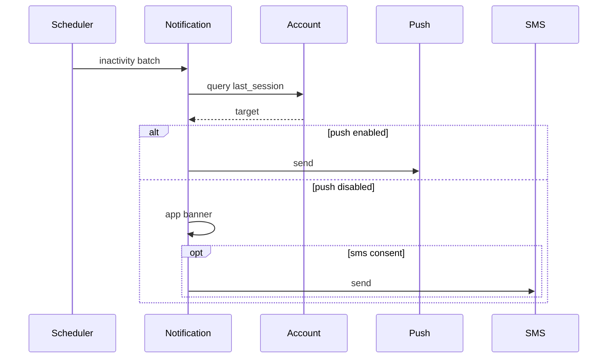

---

## 6.13 REQ-FUNC-013 위시리스트

- 30 / 70 / 100%에서 각각 별 1개
- 동일 단계 중복 지급 금지
- 목표 하향으로 소급 지급 금지
- 삭제해도 기존 지급 별 회수 없음

---

## 6.14 REQ-FUNC-014 소비 내역

- 전월 대비 증감액을 상단 배치
- 업종별 집계
- UNKNOWN은 미분류
- 전월 데이터가 없으면 비교 문구

---

## 6.15 REQ-FUNC-015 예적금 비교·선택

MVP 잠금.

- 법률 검토 통과 전 구현 착수 금지
- 가입 중개 금지
- 기능 개통 시 WPA v1→v2 전환
- 4주간 병기
- 중도해지 시 가입 별 회수 없음

---

## 6.16 REQ-FUNC-016 카드 없는 체험

Could / 차기 릴리즈.

---

## 6.17 REQ-FUNC-017 별의 옷장 외 목적지

Could / 정책 재검토 이후.

---

## 6.18 REQ-FUNC-018 기존 기록 이전

Won't Have.

- 타사 기록 이전 제공 안 함
- “지금부터” 프레임 사용

---

# 7. 기본 다이어그램

## 7.1 Class Diagram

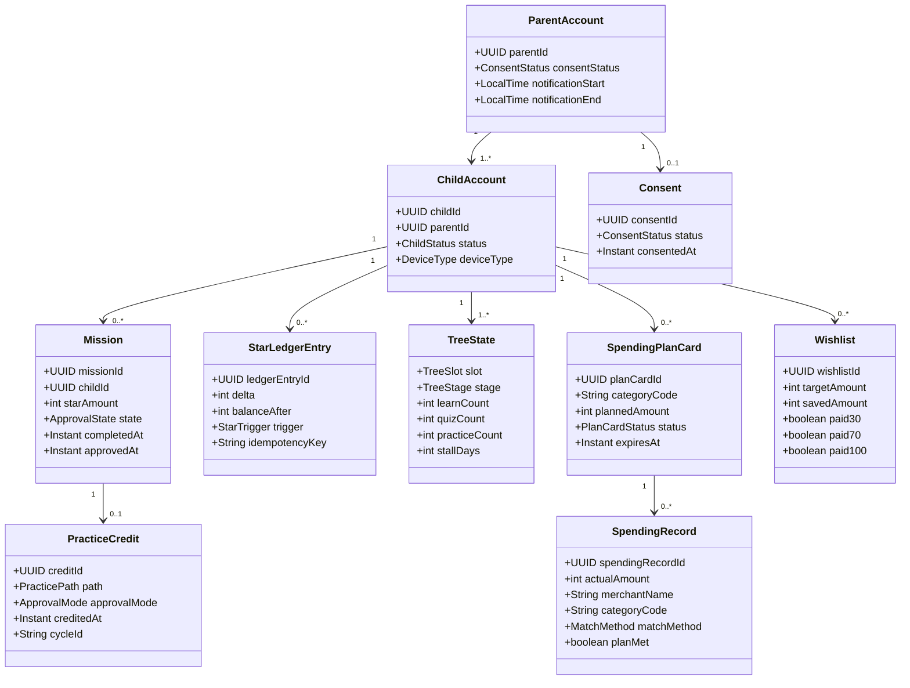

---

## 7.2 ERD

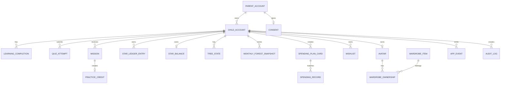

---

## 7.3 Component Diagram

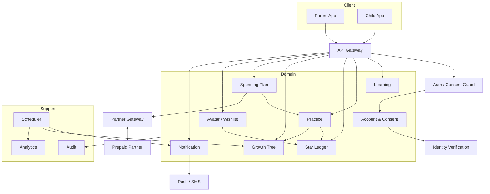

---

# 8. 상태 및 논리 Flow

## 8.1 Mission State

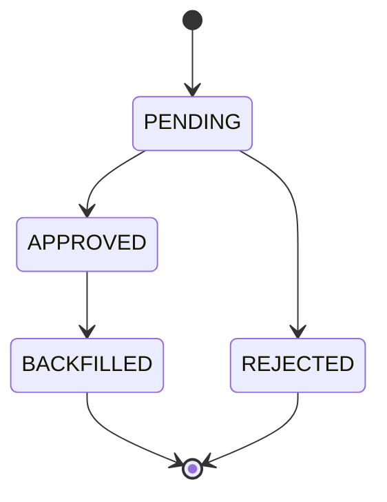

## 8.2 Plan Card State

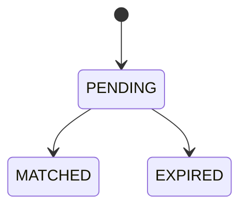

## 8.3 성장 나무 Flow

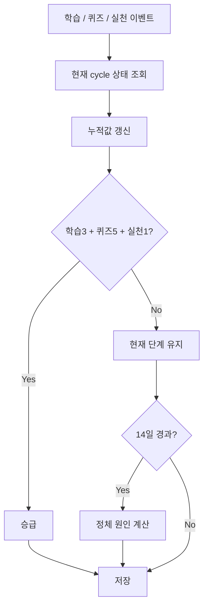

---

# 9. 비기능 요구사항 및 KPI Coverage

## 9.1 REQ-NF Performance / Integrity / Security

기존 v1.0의 REQ-NF-001~024를 기준선으로 유지하며, 아래 Coverage를 추가한다.

| KPI/성능 목표 | PRD 출처 | REQ-NF | 이벤트/측정 |
|---|---|---|---|
| 성장 나무 p95 ≤ 1,250ms | US-1 | NF-001 | tree_view_opened |
| 월간 숲 p95 ≤ 2,000ms | US-1 | NF-002 | forest_view_opened |
| 별 지급 p95 ≤ 800ms | US-2 | NF-003 | practice_credited |
| 오프라인 반영 ≤ 60s | US-2 E1 | NF-004 | reconnect / client_ts |
| 매칭 정확도 ≥ 90% | US-4 | NF-005 | match_method |
| 월 가용성 ≥ 99.0%* | PRD §5-2 | NF-006 | uptime probe |
| API 오류율 ≤ 0.5% | PRD §5-2 | NF-007 | 5xx + timeout |
| 별 정합성 오류 0% | PRD §5-2 | NF-008 | daily ledger diff |
| 소급 지급 성공률 100% | US-6 | NF-009 | backfill events |
| 미접속 인지 ≤ 3일 | US-7 | NF-010 | notification |
| 온보딩 총 소요 ≤ 10분 | US-8 | NF-011 | onboarding_step |
| 데이터 저장 암호화 | PRD §5-3 | NF-012 | schema/audit |
| PII/행동 데이터 분리 | PRD §5-3 | NF-013 | DB audit |
| API 인증/인가 100% | PRD §5-3 | NF-014 | endpoint test |
| 세션 만료 보호자 ≤24h / 아동 ≤7d | PRD §5-3 | NF-015 | auth tests |
| 입력 검증 | PRD §5-3 | NF-016 | negative tests |
| 위치 권한 0건 | P-19 | NF-017 | manifest scan |
| Audit log | PRD §5-3 | NF-018 | audit coverage |
| Dependency CVE | PRD §5-3 | NF-019 | weekly scan |
| Data purge | PRD §5-3 | NF-020 | deletion audit |
| Cloud cost ≤500원/child/month | PRD §5-2 | NF-021 | monthly billing |
| 인증 cost ≤300원/signup | PRD §5-2 | NF-022 | monthly billing |
| 규제/데이터 anomaly 대응 | PRD §5-3 | NF-023 | alert/escalation |
| enum/schema extensibility | PRD/ADR | NF-024 | schema tests |

> *제휴사 SLA가 더 낮으면 `min(자사 목표, 제휴사 SLA)`로 갱신한다.

## 9.2 제품 KPI를 REQ-NF에 연결해야 하는 이유

WPA, 첫 실천 인정률, 계획 카드 작성률 등은 사용자 경험상의 KPI이지만, **측정 불가능하면 요구사항 검증도 불가능하다.** 따라서 v1.1에서는 이들을 `Measurement / Observability` 성격의 NF trace와 연결한다.

---

# 10. 데이터 모델 및 스키마

## 10.1 Logical Data Model

### parent_accounts

| Field | Type | Key | Constraint |
|---|---|---|---|
| parent_id | UUID | PK | not null |
| auth_subject | VARCHAR | UQ | not null |
| consent_status | ENUM | | required |
| consented_at | TIMESTAMP | | nullable |
| notification_start | TIME | | |
| notification_end | TIME | | |
| push_permission | ENUM | | |
| created_at | TIMESTAMP | | |

### child_accounts

| Field | Type | Key | Constraint |
|---|---|---|---|
| child_id | UUID | PK | |
| parent_id | UUID | FK | not null |
| birth_year | SMALLINT | | |
| device_type | ENUM | | informational only |
| status | ENUM | | PENDING/ACTIVE/INACTIVE |

### learning_completions

- completion_id PK
- child_id FK
- topic_id FK
- completed
- completed_at
- quiz_correct_count
- cycle_id

### practice_credits

- practice_credit_id PK
- child_id FK
- practice_path
- source_id
- approval_mode
- delay_hours
- credited_at
- cycle_id
- tree_slot
- idempotency_key UQ

### star_ledger

- ledger_entry_id PK
- child_id FK
- delta
- balance_after
- trigger_code
- source_type
- source_id
- idempotency_key UQ
- created_at

**불변식:**

```text
balance_after(n) = balance_after(n-1) + delta(n)
```

### tree_states

- tree_state_id PK
- child_id FK
- slot
- stage
- learn_count
- quiz_count
- practice_count
- cycle_start_at
- last_progress_at
- stall_days

### monthly_forest_snapshots

- snapshot_id PK
- child_id FK
- year_month
- earn_stage
- spend_well_stage
- save_stage
- grow_stage
- practice_count
- reflection_count
- spending_delta
- total_earned_stars
- delta_json
- created_at

### spending_plan_cards

- plan_card_id PK
- child_id FK
- created_by_type
- place_text
- category_code
- planned_amount
- item_text nullable
- status
- expires_at

### spending_records

- spending_record_id PK
- child_id FK
- plan_card_id FK nullable
- partner_transaction_id UQ
- actual_amount
- merchant_name
- category_code
- match_method
- plan_met
- category_met
- retro_status

### wishlists

- wishlist_id PK
- child_id FK
- item_name
- target_amount
- saved_amount
- paid_30
- paid_70
- paid_100
- completed_at

### app_events

- event_id PK
- event_name
- child_id nullable
- parent_id nullable
- idempotency_key UQ
- client_ts
- server_ts
- payload_json
- event_date
- week_key

### audit_logs

- audit_id PK
- actor_id
- actor_type
- action
- target_type
- target_id
- before_json
- after_json
- request_id
- created_at

---

# 11. 인터페이스 명세

## 11.1 API 목록

| Method | Endpoint | REQ |
|---|---|---|
| POST | `/api/v1/parents/{parentId}/consent` | 001 |
| GET | `/api/v1/parents/{parentId}/onboarding` | 001 |
| PUT | `/api/v1/parents/{parentId}/onboarding/{step}` | 001 |
| POST | `/api/v1/children` | 001 |
| GET | `/api/v1/children/{childId}/curriculum` | 003 |
| POST | `/api/v1/children/{childId}/quiz/{topicId}/submit` | 003 |
| POST | `/api/v1/children/{childId}/missions` | 004 |
| PUT | `/api/v1/missions/{missionId}/approval` | 004, 011 |
| POST | `/api/v1/parents/{parentId}/missions/bulk-approval` | 011 |
| GET | `/api/v1/children/{childId}/stars` | 002 |
| POST | `/api/v1/children/{childId}/stars/grant` | 002 |
| GET | `/api/v1/children/{childId}/tree` | 005 |
| GET | `/api/v1/children/{childId}/forest` | 009 |
| POST | `/api/v1/children/{childId}/plan-cards` | 007 |
| GET | `/api/v1/children/{childId}/plan-cards/{cardId}/reconciliation` | 008 |
| POST | `/api/v1/children/{childId}/retro/{recordId}/confirm` | 008 |
| GET | `/api/v1/children/{childId}/spending` | 014 |
| GET | `/api/v1/children/{childId}/wishlist` | 013 |
| POST | `/api/v1/children/{childId}/wishlist` | 013 |
| POST | `/api/v1/children/{childId}/wardrobe/purchase` | 006 |
| GET | `/api/v1/children/{childId}/wardrobe` | 006 |
| POST | `/api/v1/partner/topup` | 002 / Partner |
| GET | `/api/v1/partner/cards/{cardId}/transactions` | 008 / 014 |
| POST | `/api/v1/partner/cards` | 001 / Partner |
| POST | `/api/v1/partner/cards/{cardId}/terminate` | REG-007 |
| POST | `/api/v1/notifications/inactivity/batch` | 012 |
| PUT | `/api/v1/parents/{parentId}/notification-window` | 012 |
| POST | `/api/v1/events` | NF / Analytics |
| GET | `/api/v1/metrics/wpa` | 6.7 / KPI |

## 11.2 공통 API 규칙

- 모든 API 인증 필수
- mutation API는 `Idempotency-Key` 권장 또는 필수
- requestId 반환
- 표준 오류 코드 사용
- 동의 게이트는 서버에서 강제
- 결제 원장은 Partner Gateway 외부를 통해서만 접근

---

# 12. Event & Analytics Interface

## 12.1 공통 Event Envelope

```json
{
  "eventId": "evt_...",
  "eventName": "practice_credited",
  "idempotencyKey": "idem_...",
  "childId": "child_...",
  "parentId": "parent_...",
  "clientTs": "2026-08-25T10:01:00+09:00",
  "serverTs": "2026-08-25T10:01:02+09:00",
  "payload": {}
}
```

## 12.2 주요 이벤트

| Event | 목적 |
|---|---|
| `practice_credited` | WPA |
| `star_ledger_entry` | 원장 정합성 |
| `tree_state_changed` | 성장 |
| `tree_view_opened` | 성장 증거 확인 |
| `forest_view_opened` | 보호자 확인 |
| `retro_viewed` | 회고 체류 |
| `approval_state_changed` | 소급/승인 지연 |
| `inactivity_notified` | 미접속 알림 |
| `onboarding_step` | 퍼널 |
| `consent_gate_blocked` | 규제 |

---

# 13. 주요 비즈니스 규칙

1. 별은 cycle 초기화되지 않는다.
2. 별은 현금으로 환급/충전/양도/저장금액과 교환되지 않는다.
3. 실천 인정 trigger만 WPA 분자에 들어간다.
4. 출석/학습/퀴즈 별은 WPA에 들어가지 않는다.
5. 결제 계획 대조는 CATEGORY → MERCHANT → AMOUNT_ONLY 순서다.
6. 실제 결제 합계가 계획 금액 이하이면 별 1개 지급.
7. 실제 결제가 계획을 초과하면 별 미지급이며 보유 별을 차감하지 않는다.
8. 업종 불일치여도 금액을 지켰으면 별은 지급한다.
9. 승인 지연 소급은 완료 시점 cycle에 귀속한다.
10. 정체는 cycle 시작 14일 이전에 판정하지 않는다.
11. 회고 문장은 비복원 추출한다.
12. 회고 큐가 3건 초과하면 오래된 항목을 요약 회고로 병합한다.
13. 위치정보는 어느 계층에서도 수집·저장·전송하지 않는다.
14. 동물 아바타를 사용하고 아동 얼굴 이미지는 수집하지 않는다.

---

# 14. 보안/개인정보/규제

## 14.1 규제 요구사항

| ID | 규칙 |
|---|---|
| REG-001 | 법정대리인 동의 전 아이 진입 차단 100% |
| REG-002 | 위치정보 수집/저장/전송 0 |
| REG-003 | 아동 친화적 고지 |
| REG-004 | 예적금 중개 금지 |
| REG-005 | 별/저금통 완전 분리 |
| REG-006 | 얼굴 이미지 미수집 |
| REG-007 | 해지 시 잔액 전액 환불 |
| REG-008 | 카드 한도/업종 정책은 제휴사 종속 |
| REG-009 | 만 14세 미만 마이데이터 경로 미사용 |

## 14.2 저장 보안

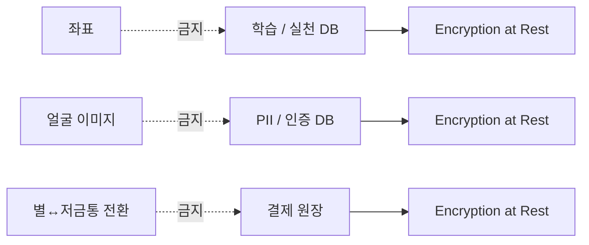

---

# 15. 검증 전략

## 15.1 Test Pyramid

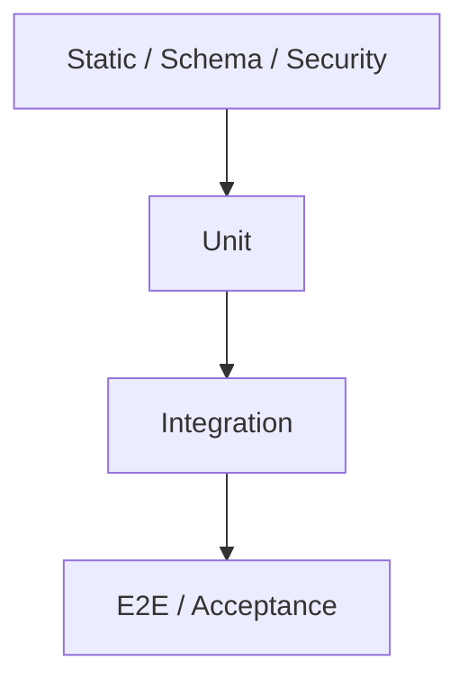

## 15.2 테스트 계층

- Unit: 규칙/상태 전이/멱등성
- Integration: DB + Partner Gateway + Event
- E2E: 핵심 여정
- Static: 위치/전환 함수/의존성
- Data validation: 원장/집계/스냅샷
- UX validation: n=8 인터뷰

---

# 16. Traceability Matrix

## 16.1 PRD Feature → SRS REQ

| PRD Feature | SRS REQ |
|---|---|
| F1 성장 나무 | 005 |
| F2 미션 루프 | 004 |
| F3 학습/퀴즈 | 003 |
| F4 별 지급 엔진 | 002 |
| F5 아바타/옷장 | 006 |
| F6 아이 온보딩 | 010 |
| F7 보호자 온보딩 | 001 |
| F8a 계획 카드 | 007 |
| F8b 계획↔실제 대조 | 008 |
| F9 월간 숲 | 009 |
| F10 소급 지급 | 011 |
| F11 미접속 알림 | 012 |
| F12 위시리스트 | 013 |
| F13 소비 내역 | 014 |
| F15 예적금 | 015 |
| F16 카드 없는 체험 | 016 |
| F17 별 옷장 외 목적지 | 017 |
| F18 기록 이전 | 018 |

## 16.2 User Story → REQ

| Story | REQ |
|---|---|
| US-1 변화를 한 문장으로 읽는다 | 005, 009, 014 |
| US-2 실천이 별/나무로 연결된다 | 002, 003, 004, 005, 010 |
| US-3 멈춘 이유를 화면에서 안다 | 005 |
| US-4 쓰기 전에 미리 적는다 | 007, 008 |
| US-5 참은 날이 확인만 한 날과 다르다 | 008 |
| US-6 부모가 늦어도 일이 사라지지 않는다 | 011 |
| US-7 아이가 멈춘 것을 3일 안에 안다 | 012 |
| US-8 시간을 쪼개서 시작할 수 있다 | 001, 010, 016 |

## 16.3 AC-Level Traceability

| Story/AC | REQ | 검증 |
|---|---|---|
| US-1 AC1 | 005 | TC-FUNC-005 / E1 |
| US-1 AC2 | 005 | TC-FUNC-005 / E2 |
| US-1 AC3 | 009 | TC-FUNC-009 / E1 |
| US-1 AC-E1 | 005 | TC-FUNC-005 |
| US-1 AC-E2 | 009 | TC-FUNC-009 |
| US-2 AC1~4 | 002/005 | TC-FUNC-002/005 |
| US-2 AC-E1~E3 | 002 | TC-FUNC-002 |
| US-3 AC1~3 | 005 | TC-FUNC-005 |
| US-3 AC-E1~E2 | 005 | TC-FUNC-005 |
| US-4 AC1~4 | 007 | TC-FUNC-007 |
| US-4 AC-E1~E3 | 008 | TC-FUNC-008 |
| US-5 AC1~3 | 008 | TC-FUNC-008 |
| US-5 AC2-1~2-3 | 008 | TC-FUNC-008 |
| US-5 AC-E1~E2 | 008 | TC-FUNC-008 |
| US-6 AC1~3 | 011 | TC-FUNC-011 |
| US-6 AC-E1~E3 | 011 | TC-FUNC-011 |
| US-7 AC1~3 | 012 | TC-FUNC-012 |
| US-7 AC-E1~E3 | 012 | TC-FUNC-012 |
| US-8 AC1~3 | 001/010 | TC-FUNC-001/010 |
| US-8 AC-E1~E2 | 001/010 | TC-FUNC-001/010 |

> **v1.1 보강 포인트:** 기존 Traceability는 REQ → 모듈 → 구현 클래스 → 테스트 중심이었다. 이제 PRD Story/AC까지 역방향으로 추적할 수 있다.

---

# 17. REQ → API → DB → Diagram → Test Traceability

| REQ | API | 주요 DB | Diagram | Test |
|---|---|---|---|---|
| 001 | consent/onboarding/children | parent, child, consent | UC / Seq-001 | TC-001 |
| 002 | stars | star_ledger | Class / Seq-002 | TC-002 |
| 003 | curriculum/quiz | learning, quiz | Component | TC-003 |
| 004 | missions/approval | mission, practice | UC / State | TC-004 |
| 005 | tree | tree_state | Class / Seq-005 | TC-005 |
| 006 | wardrobe | avatar, wardrobe | Class | TC-006 |
| 007 | plan cards | plan_card | ERD / Flow | TC-007 |
| 008 | reconciliation/retro | spending_record | Seq-008 / Flow | TC-008 |
| 009 | forest | forest_snapshot | ERD / Seq-005 | TC-009 |
| 010 | onboarding | learning/star/wardrobe | Seq-010 | TC-010 |
| 011 | bulk approval | mission/practice/ledger | Seq-011 | TC-011 |
| 012 | notification | notification/event | Seq-012 | TC-012 |
| 013 | wishlist | wishlist/ledger | Class | TC-013 |
| 014 | spending | spending_record | ERD | TC-014 |
| 015 | savings | future schema | State / ADR | TC-015 |
| 016 | future | account | UC | TC-016 |
| 017 | future | ledger | Class | TC-017 |
| 018 | none | none | Scope | N/A |

---

# 18. KPI 정의

## 18.1 WPA

```text
WPA(w) =
  distinct child_id with practice_credited in ISO week w
  /
  active child count at week start
```

활성 아동:

1. 법정대리인 동의 완료
2. 계정 생성 후 7일 경과
3. 직전 28일 앱 세션 1회 이상

KST / ISO week / D+1 배치.

## 18.2 Secondary Metrics

| Metric | Definition | Target |
|---|---|---|
| 계획 카드 작성률 | plan_card_created / payment_settled | ≥50% |
| 매칭 정확도 | correctly matched / sampled transactions | ≥90% |
| 첫 실천 인정률 | 7일 내 practice_credited | β ≥60% |
| 나무 5초 회상 | 변화 회상 성공 | ≥6/8 |
| 부모 확인 소요 | tree/forest task duration | ≤3min |
| 미접속 인지 | stop → parent awareness | ≤3 days |
| 카드 연결률 | linked / onboarding complete | ≥60% |
| 월 결제액 | total payment / active child | ≥30,000원 목표 |
| Cloud cost | cloud / active child | ≤500원 |

---

# 19. Batch / Scheduler

| Job | 주기 | 결과 |
|---|---|---|
| Inactivity Detection | hourly | 72h target |
| Notification Dispatch | hourly | Push/Banner/SMS |
| Payment Reconciliation | 5~15min* | spending record |
| Tree Stall | daily | stall days |
| Forest Snapshot | monthly | forest snapshot |
| WPA | weekly D+1 | KPI |
| Ledger Reconciliation | daily | mismatch |
| Data Purge | daily | deletion |

*제휴사 계약 및 API 특성에 따라 조정.

---

# 20. Observability / SLA

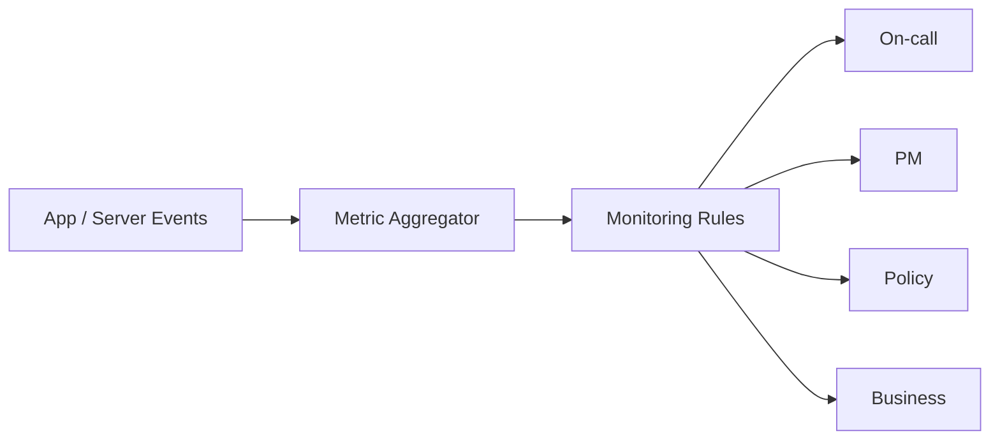

### Critical Alert

| Alert | Threshold | Response |
|---|---|---|
| Consent violation | >0 | 30min |
| Ledger mismatch | >0 | 30min |
| Location permission | >0 | build/merge block |
| API error | >0.5% 3 days | release hold |
| WPA drop | -10%p WoW | 24h analysis |
| Matching accuracy | <90% 2 weeks | ADR redesign |

---

# 21. Release Gate

## Alpha

- 모든 REG 자동 테스트 100%
- ledger mismatch 0
- location permission 0
- NF-001~003 SLO 충족

## Beta

- E4 ≥ 60%
- E1 ≥ 6/8
- WPA ≥ 5/8
- 매칭 ≥ 90%

## General Release

- WPA ≥55% 2주 연속
- 인지 ≤3일
- 정합성 오류 0
- 계획 카드 작성률 ≥50%
- 카드 연결률 ≥60%

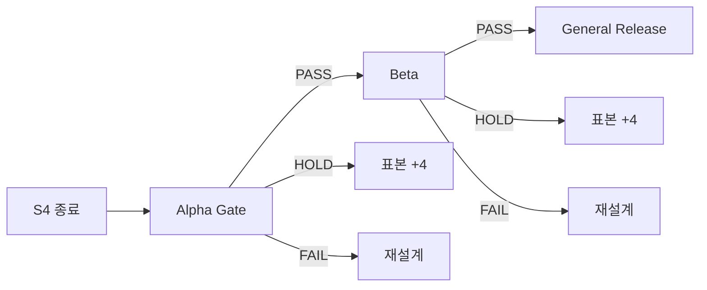

---

# 22. Risks / Dependencies

| ID | Risk | Impact | Mitigation |
|---|---|---|---|
| R4 | 제휴사 수수료율/최소 물량 미확정 | 손익 | S3 전 확정 |
| R5 | 업종 코드 상세도 부족 | 매칭 품질 | 샘플 데이터 검증 |
| R8 | 아이 이탈이 부모 화면에 늦게 나타남 | Retention | 3일 알림 유지 |
| R9 | 3D asset 지연 | S3 | S1 동시 발주 |

---

# 23. Architecture Decision Records

본 SRS의 주요 고정 결정은 아래 ADR과 연결된다.

- ADR-001: WPA는 실천 트리거만 산입
- ADR-002: 별/나무/숲 3층 구조
- ADR-003: 위치 기반 자동 개입을 사용하지 않고 계획 카드 사용
- ADR-004: 별 판정은 금액 기준
- ADR-005: 선불업 제휴사 위탁
- ADR-006: 불리기 학습만 개통
- ADR-007: 3D asset 사전 제작
- ADR-008: 출석 별은 지급하되 WPA 제외

변경 시 기존 ADR을 `Superseded`로 표시하고 신규 ADR을 추가한다.

---

# 24. 설계·다이어그램 배치 원칙

본 문서에서 다이어그램은 다음 위치에 배치한다.

| Diagram | 위치 | 목적 |
|---|---|---|
| Context Diagram | §4 | 전체 시스템 경계 |
| External Responsibility Diagram | §4.1.1 | 제휴사 경계 |
| Use Case Diagram | §5 | 사용자 행위 전체 |
| Sequence 001 | REQ-FUNC-001 직후 | 온보딩/동의 |
| Sequence 002 | REQ-FUNC-002 직후 | 별 정합성 |
| Sequence 005 | REQ-FUNC-005 직후 | 성장 갱신 |
| Sequence 008 | REQ-FUNC-008 직후 | 결제 대조/회고 |
| Sequence 010 | REQ-FUNC-010 직후 | 아이 온보딩 |
| Sequence 011 | REQ-FUNC-011 직후 | 승인 지연 소급 |
| Sequence 012 | REQ-FUNC-012 직후 | 미접속 알림 |
| Class Diagram | §7.1 | 객체 관계 및 책임 |
| ERD | §7.2 | 영속 데이터 관계 |
| Component Diagram | §7.3 | 물리/논리 서비스 경계 |
| State Diagram | §8 | 상태 전이 |
| Flow Chart | §8 | 복잡한 비즈니스 규칙 |

**원칙:** 요구사항을 읽은 직후 해당 시나리오의 Sequence를 볼 수 있게 배치한다. 데이터 구조는 ERD에서, 책임 구조는 Class/Component에서, 복잡한 판정은 Flow에서 보여준다.

---

# 25. v1.1 최종 Quality Gate

## 요구사항

- [x] PRD Feature 18건 → REQ-FUNC-001~018
- [x] PRD US-1~US-8 → REQ 역추적
- [x] Story AC → REQ 및 TC 추적
- [x] REQ-NF-001~024 유지
- [x] KPI → NF/Measurement 연결
- [x] REG 9건 유지

## 인터페이스

- [x] 내부 API 목록
- [x] Partner API 경계
- [x] Event interface
- [x] Idempotency
- [x] Error Contract

## 데이터

- [x] Logical ERD
- [x] 주요 엔터티
- [x] PK/FK
- [x] Unique constraints
- [x] 저장 보안
- [x] 금지 데이터

## 다이어그램

- [x] Use Case
- [x] ERD
- [x] Class Diagram
- [x] Component Diagram
- [x] State Diagram
- [x] Flow Chart
- [x] Sequence Diagram 7개

## 검증

- [x] Unit
- [x] Integration
- [x] E2E
- [x] Static
- [x] Data integrity
- [x] UX/Interview
- [x] Release Gate

## 추적성

```text
PRD
 ↓
Feature / User Story / AC
 ↓
REQ-FUNC / REQ-NF / REQ-REG
 ↓
API / Event / DB
 ↓
Diagram
 ↓
Test Case
 ↓
Release Gate
```

---

# Appendix A. Requirement ID Index

## Functional

`REQ-FUNC-001` ~ `REQ-FUNC-018`

## Non-functional

`REQ-NF-001` ~ `REQ-NF-024`

## Regulatory

`REQ-REG-001` ~ `REQ-REG-009`

---

# Appendix B. Mermaid Diagram Inventory

1. Context Diagram
2. External Responsibility Diagram
3. Use Case Diagram
4. Sequence — Onboarding
5. Sequence — Star Ledger
6. Sequence — Growth Tree
7. Sequence — Plan Reconciliation
8. Sequence — Child Onboarding
9. Sequence — Backfill
10. Sequence — Inactivity Notification
11. Class Diagram
12. ERD
13. Component Diagram
14. Mission State
15. Plan Card State
16. Growth Tree Flow
17. Test Pyramid
18. Monitoring Flow
19. Release Gate

---

# Appendix C. 변경 이력

| Version | Date | Change |
|---|---|---|
| 1.0 | 2026-08-25 | PRD v1.0 → SRS v1.0 |
| 1.1 | 2026-08-25 | Story/AC Traceability, KPI/NF Coverage, UML/Sequence, Logical DB, API Traceability 보강 |

---

# Appendix D. 원본 SRS와의 관계

이 문서는 GitHub의 `SRS_문서_핀프렌즈_(한글).md` v1.0을 기준선으로 작성한 **보강판**이다.

원본의 핵심 요구사항은 유지하고 다음을 추가했다.

1. PRD Story/AC → REQ-FUNC 역추적
2. KPI/성능 → REQ-NF 연결표
3. API → REQ → DB → Test 추적
4. Logical DB schema
5. Use Case Diagram
6. Class Diagram
7. ERD
8. Component Diagram
9. State Diagram
10. 7개 Sequence Diagram
11. 복잡한 비즈니스 규칙 Flow Chart
12. ISO 29148 Content Map
13. 요구사항 설계 배치 원칙
14. 최종 Quality Gate

> **외부 기준 참고:** ISO/IEC/IEEE 29148:2018은 요구사항 공학의 프로세스와 요구사항 관련 정보 산출물의 내용 및 형식에 대한 가이드라인을 제공한다.
