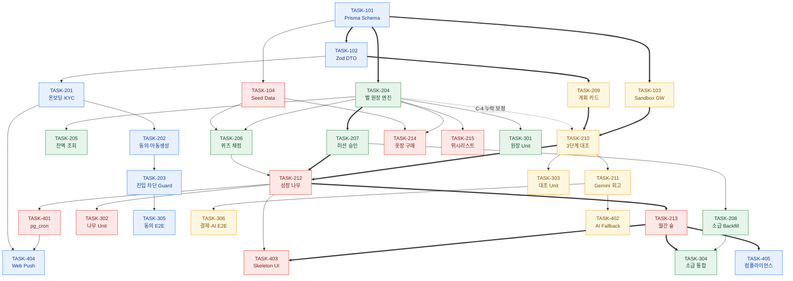
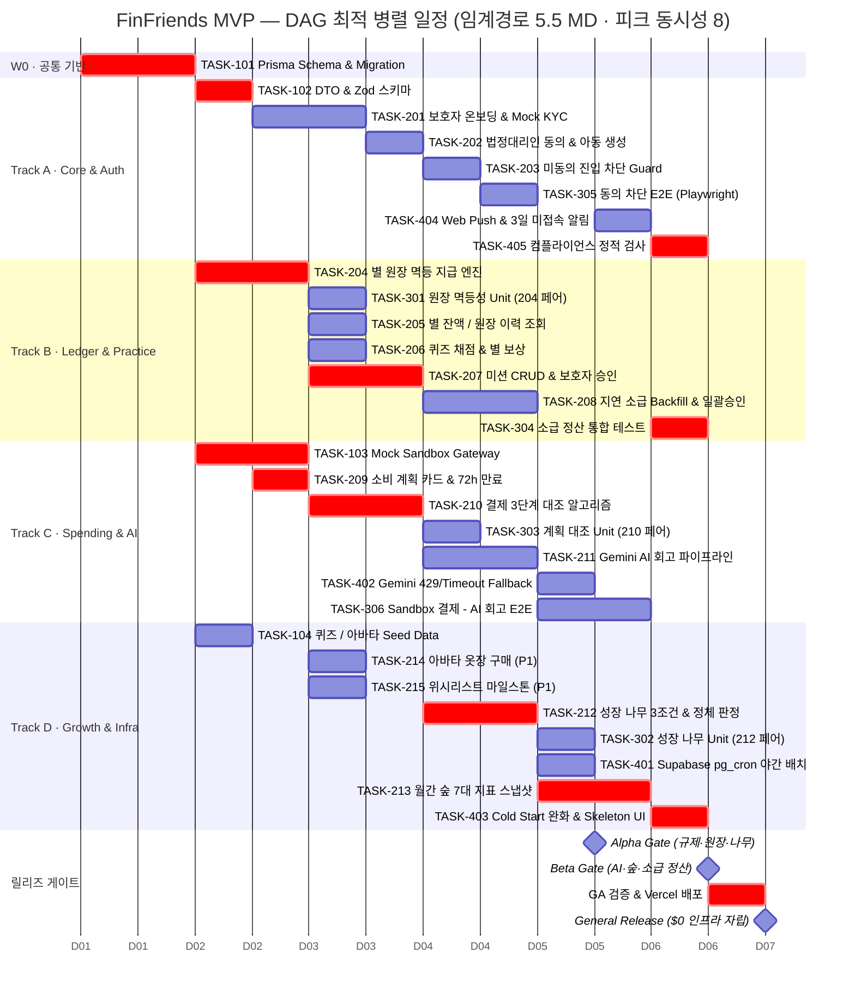
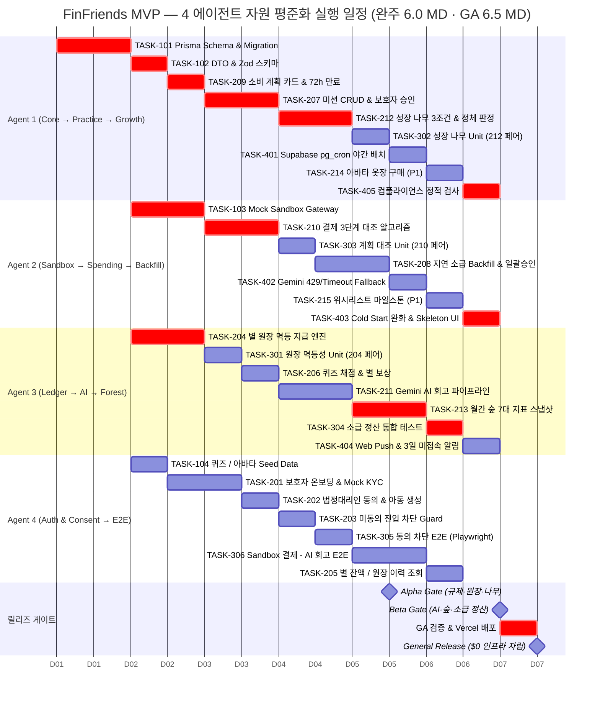

# [개발 총괄 실행 계획서] FinFriends MVP Execution Master Plan

- **문서 ID:** ROADMAP-FINFRIENDS-MVP-002
- **버전:** 2.0 (30개 태스크 본문 전수 대조 및 CPM 재산정본)
- **작성일:** 2026-08-26
- **문서 성격:** 개발 실행 총괄 (SSOT) — 실행 전략 · 의존성 구조(DAG) · 병렬 Gantt · 릴리즈 게이트
- **기준 문서:**
  - 요구사항: [`docs/02-srs/srs.md`](../02-srs/srs.md)
  - 기술설계: [`docs/03-tds/tds.md`](../03-tds/tds.md)
  - 태스크 목록: [`tasks/task-list.md`](../../tasks/task-list.md)
  - **태스크 본문 30건 (실측 원천):** [`tasks/`](../../tasks/) — `step-1` 4건, `step-2` 15건, `step-3` 6건, `step-4` 5건
- **적용 기술 스택:** Next.js (App Router), Prisma ORM + Supabase PostgreSQL, Tailwind CSS + shadcn/ui, Vercel AI SDK + Google Gemini 1.5 Flash, Vercel ($0 무료 인프라)

---

## 0. 문서의 위치와 사용법

| 문서 | 답하는 질문 | 소비 주체 |
|---|---|---|
| `docs/02-srs` | **무엇을** 만드는가 (요구사항) | 기획 / 검수 |
| `docs/03-tds` | **어떻게** 설계하는가 (구조) | 아키텍트 |
| `tasks/task-list.md` | **어떤 단위로** 쪼개는가 (30건 목록) | 리드 |
| **본 문서 (`00`)** | **누가 · 언제 · 어떤 순서로** 실행하는가 | **실행 오케스트레이터 / 각 개발 에이전트** |
| `tasks/step-N/TASK-XXX.md` | 개별 태스크를 **정확히 어떻게** 구현·검증하는가 | 담당 에이전트 |

> ⚠️ **우선순위 규칙:** 본 문서의 모든 수치·의존 관계는 **`tasks/` 하위 30개 태스크 본문을 실측 대조하여** 산출했습니다.
> 상위 문서(`tasks/task-list.md`)와 값이 충돌하는 경우 **태스크 본문 → 본 문서 → 상위 문서** 순으로 신뢰합니다. 충돌 내역은 §1.3에 전수 기록했습니다.

---

## 1. Executive Summary

### 1.1 핵심 수치 (태스크 본문 30건 실측 재집계)

| 지표 | 값 | 산출 근거 |
|---|---|---|
| 총 태스크 수 | **30건** | Step 1: 4 / Step 2: 15 / Step 3: 6 / Step 4: 5 |
| 총 공수 (직렬 환산) | **20.5 MD** | 30개 본문 `예상 소요 공수` 합계 |
| **임계 경로 (Critical Path)** | **5.5 MD** | CPM 정산 (자원 무제한) — §3.3 |
| 피크 동시성 / 평균 동시성 | **8** / 3.7 | MD 2.0~2.5 구간에 8개 태스크 동시 실행 — §4.2.1 |
| 병렬 트랙 수 | **4 트랙** | 파일 소유권 충돌 0건 + 부하 균등 기준 분할 — §2.2, §2.3 |
| **4 에이전트 실 완주** | **6.0 MD** (GA 검증 포함 **6.5 MD**) | Wave 0 단일 가동 제약 반영한 자원 하한 5.875 MD — §4.2.2 |
| 실 압축률 | **3.42배** (20.5 → 6.0) | 단일 에이전트 직렬 대비 |
| P0 (Must-Have) | 27건 | P1: `TASK-214`, `TASK-215`, `TASK-404` (3건) |
| 신규 생성 파일 | 56개 | 본문 `[NEW]` 선언 기준 |
| 수정 대상 파일 | 8개 | 본문 `[MODIFY]` 선언 기준 — §2.4 공유 파일 프로토콜 적용 |

### 1.2 실행 요약 흐름


> 게이트 시점은 **DAG 최적(자원 무제한)** 기준입니다. 괄호 안은 권장 편성인 **4 에이전트 동적 디스패치** 기준 실제 시점입니다(§4.2.2). Alpha Gate는 두 편성 모두 **MD 4.5**로 동일합니다.

### 1.3 선행 문서 대비 정정 내역 (5건)

태스크 본문 전수 대조 과정에서 발견된 **상위 문서와의 불일치 및 논리 결함**입니다. 본 문서는 아래 정정값을 적용합니다.

| # | 항목 | 선행 문서 값 | **정정값 (본문 실측)** | 근거 및 영향 |
|:--:|---|---|---|---|
| **C-1** | Step 3 공수 합계 | 4.0 MD | **3.5 MD** | `301`~`305` 각 0.5 + `306` 1.0 = 3.5 (본문 6건 실측 합계) |
| **C-2** | 프로젝트 총 공수 | 21.5 MD | **20.5 MD** | C-1 반영 (3.0 + 11.5 + 3.5 + 2.5) |
| **C-3** | `TASK-209` 선행 의존 | `TASK-103` (기존 Gantt 표기) | **`TASK-102`** | [`TASK-209.md`](../../tasks/step-2/TASK-209.md) 본문 `Blockers: TASK-102`. 계획 카드 생성은 Zod 스키마만 필요하고 Sandbox는 불필요 → ES가 2.0 → **1.5 MD로 당겨짐** |
| **C-4** | `TASK-210` 선행 의존 | `TASK-103`, `TASK-209` | **+ `TASK-204` 추가 필요** | 본문 구현요구 3항이 `grantStar(+1)`을 호출하는데 `TASK-204`가 Blocker에 누락. 방치 시 원장 미구현 상태로 착수하는 실패 경로 발생 (ES 변동은 없음) |
| **C-5** | `TASK-304`의 게이트 귀속 | Alpha Gate (`301`~`305` 일괄) | **Beta Gate** | `TASK-304`는 `TASK-213`(월간 숲, Beta 범위)에 의존 → Alpha에 두면 **게이트 순서가 역전**됨. [`TASK-304.md`](../../tasks/step-3/TASK-304.md) 본문도 `후행: Beta Gate 검증`으로 명시 |

> 📌 C-3 · C-4는 원천 문서(`tasks/task-list.md`, `tasks/step-2/TASK-210.md`)에도 역반영이 필요합니다. §7 리스크 `R-05` 참조.

---

## 2. 실행 전략 (Execution Strategy)

### 2.1 5대 실행 원칙

| # | 원칙 | 내용 | 위반 시 결과 |
|:--:|---|---|---|
| **P1** | **Contract-First** | `TASK-101`(Prisma Schema) · `TASK-102`(Zod DTO) 확정 전 **어떤 도메인 로직도 착수 금지** | 스키마 변경 시 전 트랙 재작업 |
| **P2** | **Ledger-Single-Source** | 별 지급·차감이 필요한 모든 도메인(`206`·`207`·`210`·`214`·`215`)은 **자체 구현 없이 `TASK-204`의 `grantStar`/`deductStar`만 호출** | 원장 불변식 붕괴 (REG-005 위반) |
| **P3** | **Idempotency-First** | 모든 별 지급 경로는 `idempotencyKey`를 **필수 인자로 전달**. 키는 `{도메인}_{엔티티ID}_{이벤트}` 규약 준수 | 중복 지급 → Alpha Gate 실패 |
| **P4** | **Stub-First** | 잠재 순환 참조 구간(§3.5)은 **no-op 스텁을 선배치**하고, 소유 태스크 완료 시 실구현으로 교체 | 트랙 간 상호 대기 데드락 |
| **P5** | **Gate-Driven** | 릴리즈 게이트 미통과 시 **다음 웨이브 착수 금지**. 게이트는 자동 명령어로만 판정(주관 판단 배제) | 결함의 하류 전파 |

### 2.2 4개 병렬 에이전트 트랙 정의

트랙은 **① 파일 소유권 충돌 0건**, **② 트랙 내부 도메인 응집도 최대화**, **③ 트랙 간 부하 균등(5.0~5.5 MD)** 세 조건을 동시에 만족하도록 분할했습니다.

| 트랙 | 담당 도메인 | 태스크 (권장 실행 순서) | 트랙 부하 | 임계경로 포함 태스크 |
|:---:|---|---|:---:|---|
| **A** | Core · Auth · Consent · Compliance | `101` → `102` → `201` → `202` → `203` → `305` → `404` → `405` | **5.0 MD** | `101`, `102`, `405` |
| **B** | Star Ledger · Learning · Practice | `204` → `301` → `206` → `207` → `205` → `208` → `304` | **5.0 MD** | `204`, `207`, `304` |
| **C** | Spending · Sandbox · AI Retro | `103` → `209` → `210` → `303` → `211` → `402` → `306` | **5.5 MD** | `103`, `209`, `210` |
| **D** | Growth · Forest · Rewards · Infra | `104` → `214` → `215` → `212` → `302` → `401` → `213` → `403` | **5.0 MD** | `212`, `213`, `403` |

> **Wave 0 유휴 처리:** `TASK-101`은 전 트랙의 단일 선행자이므로 Track A가 단독 수행합니다. 이 1.0 MD 동안 **Track B/C/D는 DAG 외 준비 작업**을 병행합니다 — Next.js 스캐폴딩, `vitest.config.ts` / `playwright.config.ts` 구성, shadcn/ui 초기화, `.env` 및 Supabase 로컬 인스턴스 기동 (§9.2).
>
> ⚠️ 위 트랙은 **파일 소유권의 기준 단위**입니다. 트랙을 그대로 1인 1트랙으로 고정 실행하면 Track C(부하 5.5 MD가 MD 1.0에야 착수)가 병목이 되어 완주가 6.5 MD로 늘어납니다. 실제 배정은 **§4.3의 자원 평준화 실행 일정**(완주 6.0 MD)을 따르고, 트랙은 소유권 판정에만 사용하십시오.

### 2.3 파일 소유권 맵 (병렬 충돌 방지)

30개 태스크 본문의 `변경 대상 파일` 전수를 트랙별로 귀속시킨 결과, **`package.json` 1건을 제외하고 트랙 간 동시 편집 충돌은 0건**입니다.

| 트랙 | 배타 소유 디렉토리 / 파일 |
|:---:|---|
| **A** | `prisma/schema.prisma`, `prisma/migrations/0_init/`, `lib/prisma.ts`, `types/domain.ts`, `lib/validations/**`, `actions/onboarding.ts`, `lib/auth/**`, `services/account.service.ts`, `middleware.ts`, `tests/e2e/onboarding.spec.ts`, `lib/notification/**`, `components/parent/InactivityBanner.tsx`, `public/sw.js`, `scripts/verify-compliance.ts` |
| **B** | `actions/ledger.ts`, `actions/learning.ts`, `actions/practice.ts`, `types/ledger.ts`, `services/ledger.service.ts`, `services/quiz.service.ts`, `services/mission.service.ts`, `services/backfill.service.ts`, `tests/unit/ledger.test.ts`, `tests/integration/backfill.test.ts` |
| **C** | `app/api/v1/sandbox/**`, `lib/sandbox/simulator.ts`, `actions/plan.ts`, `actions/retro.ts`, `services/plan.service.ts`, `services/reconciliation.service.ts`, `lib/ai/**`, `tests/unit/reconciliation.test.ts`, `tests/e2e/spending-loop.spec.ts` |
| **D** | `prisma/seed.ts`, `data/**`, `actions/growth.ts`, `actions/wardrobe.ts`, `actions/wishlist.ts`, `services/growth.service.ts`, `services/forest.service.ts`, `services/wardrobe.service.ts`, `services/wishlist.service.ts`, `tests/unit/growth.test.ts`, `prisma/migrations/procedures/`, `lib/db/cron-setup.sql`, `app/child/tree/loading.tsx`, `app/parent/forest/loading.tsx`, `components/ui/skeleton.tsx` |

**트랙 내부 `[MODIFY]` 인계 (동일 트랙이므로 안전):**

| 파일 | `[NEW]` 생성 태스크 | `[MODIFY]` 수정 태스크 | 트랙 |
|---|:---:|:---:|:---:|
| `actions/onboarding.ts` | `TASK-201` | `TASK-202` | A |
| `actions/ledger.ts` | `TASK-204` | `TASK-205` | B |
| `actions/practice.ts` | `TASK-207` | `TASK-208` | B |
| `actions/plan.ts` | `TASK-209` | `TASK-210` | C |
| `lib/ai/gemini-client.ts`, `lib/ai/fallback-templates.ts` | `TASK-211` | `TASK-402` | C |
| `actions/growth.ts` | `TASK-212` | `TASK-213` | D |

### 2.4 공유 파일 프로토콜 (`package.json`, `schema.prisma`)

`package.json`은 **모든 트랙이 의존성 추가로 접근**하며, `TASK-405`는 `scripts.compliance` 등록을 위해 명시적으로 `[MODIFY]`합니다.

1. **Wave 0 일괄 선설치:** Track A가 `TASK-101` 수행 시 전 트랙 의존성(`zod`, `ai`, `@ai-sdk/google`, `vitest`, `@playwright/test`, `web-push`, `tsx`)과 스크립트 슬롯(`test`, `compliance`, `seed`, `lint`)을 **미리 확정 등록**합니다.
2. 이후 트랙은 `package.json`을 **수정하지 않습니다.** 불가피한 추가 발생 시 오케스트레이터에 보고하고 Track A가 단독 반영합니다.
3. `prisma/schema.prisma`도 동일 원칙 — `TASK-101` 종료 후 **스키마 변경은 전 트랙 정지 후 Track A가 수행**하고 `npx prisma generate` 결과를 전 트랙에 전파합니다.

### 2.5 태스크 실행 루프 (에이전트 공통 DoD)

각 에이전트는 태스크 1건당 아래 8단계를 **예외 없이** 수행합니다.

```
1. [READ]    tasks/step-N/TASK-XXX.md 정독 — Target Files · GWT 인수조건 · Dependencies
2. [VERIFY]  Blocker 태스크의 산출 파일이 실재하고 export 시그니처가 일치하는지 확인
3. [SCOPE]   §2.3 소유권 맵 밖의 파일은 수정 금지. 필요 시 즉시 중단하고 오케스트레이터에 보고
4. [IMPL]    본문 "세부 구현 요구사항" 항목 번호 순서대로 구현
5. [TEST]    본문 "검증 명령어" 실행 → 실패 시 자가 수정 후 재실행 (통과까지 반복)
6. [STATIC]  npx tsc --noEmit && npm run lint 통과 확인
7. [COMMIT]  feat(TASK-XXX): <본문 title> 형식으로 커밋
8. [NOTIFY]  후행 태스크(Dependents)에 export 시그니처 변경분 통지
```

---

## 3. 의존성 구조 (Dependency Structure)

### 3.1 전체 태스크 DAG (30 노드 · 트랙 색인)

노드 색상은 §2.2의 트랙 귀속을, 굵은 선(`==>`)은 §3.3 임계 경로를 나타냅니다.



> `TASK-405`(컴플라이언스)의 본문 Blocker는 "Step 2 전체"입니다. Step 2 중 가장 늦게 끝나는 `TASK-213`이 실질 제약이므로 다이어그램에서는 `T213 ==> T405`로 축약 표기했습니다.

### 3.2 위상 정렬 웨이브 (Wave 0 ~ Wave 6)

동일 웨이브 내 태스크는 **상호 의존이 없어 전면 병렬 실행 가능**합니다. `ES`/`EF`는 MD(Man-Day) 시간축 기준 최조 착수/최조 완료 시점입니다.

| Wave | 태스크 (트랙) | ES → EF (MD) | 병렬도 | 웨이브 의의 |
|:---:|---|:---:|:---:|---|
| **W0** | `101`(A) | 0.0 → 1.0 | 1 | 단일 기반. 전 트랙 직렬 대기 구간 |
| **W1** | `102`(A) · `103`(C) · `104`(D) · `204`(B) | 1.0 → 2.0 | **4** | 4트랙 동시 착수 개시점 |
| **W2** | `201`(A) · `209`(C) · `205`·`206`·`207`·`301`(B) · `214`·`215`(D) | 1.5 → 3.0 | **8** | 최대 병렬 구간 |
| **W3** | `202`(A) · `210`(C) · `208`(B) | 2.0 → 4.0 | 3 | 대조 알고리즘 완성 |
| **W4** | `203`(A) · `211`(C) · `303`(C) · `212`(D) | 3.0 → 4.0 | 4 | **3중 임계경로 수렴** (`212`) |
| **W5** | `305`(A) · `306`·`402`(C) · `213`·`302`·`401`(D) | 3.5 → 5.0 | 6 | Alpha Gate 판정 및 AI/숲 완성 |
| **W6** | `404`·`405`(A) · `304`(B) · `403`(D) | 4.5 → 5.5 | 4 | 통합 검증 · NFR · 규제 마감 |

### 3.3 임계 경로 (CPM) 및 여유 시간 분석

**임계 경로 길이 = 5.5 MD.** 아래 **3개 체인이 동시에 임계**이며, 모두 `TASK-212`에서 수렴한 뒤 `213 → 304/403/405`로 갈라집니다.

```
체인 ①  101 ─ 204 ─ 207 ─ 212 ─ 213 ─ 304   1.0+1.0+1.0+1.0+1.0+0.5 = 5.5 MD
체인 ②  101 ─ 103 ─ 210 ─ 212 ─ 213 ─ 403   1.0+1.0+1.0+1.0+1.0+0.5 = 5.5 MD
체인 ③  101 ─ 102 ─ 209 ─ 210 ─ 212 ─ 213 ─ 405   1.0+0.5+0.5+1.0+1.0+1.0+0.5 = 5.5 MD
```

> 🎯 **최우선 관리 노드는 `TASK-212`(성장 나무 3조건 판정)입니다.** 세 체인이 모두 이 노드를 통과하므로, `206`·`207`·`210` 중 **단 하나라도 지연되면 프로젝트 전체가 1:1로 지연**됩니다. 착수 전 인터페이스 계약(§3.4) 사전 합의를 필수로 둡니다.

**전 태스크 여유 시간(Total Slack) 표** — Slack이 작을수록 지연 위험이 큽니다.

| Slack | 태스크 | 관리 등급 |
|:---:|---|---|
| **0.0** ★ | `101` `102` `103` `204` `207` `209` `210` `212` `213` `304` `403` `405` | **임계 (지연 즉시 전체 지연)** |
| 0.5 | `206` `211` `306` `401` `404` | 준임계 (일일 점검) |
| 1.0 | `104` `208` `302` `402` | 주의 |
| 1.5 | `201` `202` `203` `305` | 여유 |
| 2.0 | `303` | 여유 |
| 2.5 | `205` | 여유 |
| 3.0 | `214` `215` `301` | 최대 여유 (범위 축소 1순위 후보) |

> 💡 **일정 압박 시 절삭 우선순위:** Slack 3.0이면서 P1인 `TASK-214`(옷장 구매) · `TASK-215`(위시리스트)가 MVP 범위 축소의 1순위 후보입니다. 두 건 제거 시 총 공수는 1.0 MD 감소하나 **임계 경로는 5.5 MD로 불변**이므로 납기 단축 효과는 없고 트랙 D의 부하만 완화됩니다.

### 3.4 교차 트랙 인터페이스 계약 (Hand-off Contracts)

트랙 경계를 넘는 의존은 아래 8건입니다. **소비 측 착수 전 제공 측의 export 시그니처가 확정되어 있어야** 합니다.

| # | 제공 (Producer) | 소비 (Consumer) | 계약 대상 | 확정 시점 |
|:--:|---|---|---|:---:|
| H-1 | `TASK-101` (A) | 전 트랙 | `lib/prisma.ts` 싱글톤 · Prisma 모델 타입 | MD 1.0 |
| H-2 | `TASK-102` (A) | `209` (C) | `lib/validations/plan.ts` Zod 스키마 | MD 1.5 |
| H-3 | `TASK-104` (D) | `206` (B) | `data/curriculum.json` 퀴즈 키 스키마 | MD 1.5 |
| H-4 | `TASK-204` (B) | `210`(C) · `214`·`215`(D) | `grantStar(dto)` / `deductStar(dto)` · `idempotencyKey` 규약 | MD 2.0 |
| H-5 | `TASK-103` (C) | `210` (C, 동일 트랙) · `306` (C) | `POST /api/v1/sandbox/pay` 응답 스키마 | MD 2.0 |
| H-6 | `TASK-206`·`207` (B) | `212` (D) | `learning_completions` · `practice_credits` 카운터 read 계약 | MD 3.0 |
| H-7 | `TASK-210` (C) | `212` (D) | `practice_credits` (`practicePath = PLAN_MET`) 생성 계약 | MD 3.0 |
| H-8 | `TASK-213` (D) | `304` (B) | `getMonthlyForestReport` 스냅샷 보정 계약 | MD 5.0 |

### 3.5 잠재 순환 의존 3건과 해소 규약 (Stub-First)

태스크 본문 상호 참조 분석 결과, **명시된 Blocker 관계와 실제 함수 호출 방향이 역행하는 구간 3건**이 존재합니다. DAG가 깨지지 않도록 원칙 **P4(Stub-First)** 로 해소합니다.

| # | 순환 구간 | 발견 근거 | **해소 규약** |
|:--:|---|---|---|
| **S-1** | `TASK-103` ↔ `TASK-210` | `103` 본문: "결제 승인 후 `reconcilePayment` 자동 호출" / 그러나 `210`의 Blocker가 `103` | `103`은 `reconcilePayment`를 **선택적 주입 핸들러**로 호출하고 미주입 시 `{ matched:false }` 반환. `210` 완료 시 Track C가 실제 핸들러를 배선 |
| **S-2** | `TASK-206` ↔ `TASK-212` | `206` 본문: "`evaluateGrowthTree(childId)` 비동기 트리거" / 그러나 `212`의 Blocker가 `206` | `206`은 `evaluateGrowthTree`를 **no-op 스텁**으로 호출. `212` 완료 시 Track D가 `actions/learning.ts`의 import를 실구현으로 교체 (`[MODIFY]` 1건 추가 발생, 소유권은 Track B에 통지 후 위임) |
| **S-3** | `TASK-207` ↔ `TASK-212` | `207` 본문: "`grantStar` 호출하여 별 지급 및 `evaluateGrowthTree` 호출" | S-2와 동일 규약을 `actions/practice.ts`에 적용 |

> **스텁 표준형** — 세 구간 모두 아래 형태로 선배치합니다.
> ```ts
> // lib/growth/evaluate-stub.ts  (TASK-206/207 시점 임시, TASK-212에서 대체)
> export async function evaluateGrowthTree(_childId: string): Promise<void> {
>   if (process.env.NODE_ENV !== "production") console.debug("[stub] evaluateGrowthTree pending TASK-212");
> }
> ```

### 3.6 검증 명령어 순환과 "구현-검증 페어" 규약

Step 2 태스크 3건의 `검증 명령어`가 **Step 3 태스크가 생성할 테스트 파일을 가리키는** 구조적 순환이 있습니다.

| Step 2 태스크 | 지정 검증 명령어 | 해당 테스트 파일 소유자 |
|---|---|---|
| `TASK-204` | `npm run test tests/unit/ledger.test.ts` | **`TASK-301`** |
| `TASK-210` | `npm run test tests/unit/reconciliation.test.ts` | **`TASK-303`** |
| `TASK-212` | `npm run test tests/unit/growth.test.ts` | **`TASK-302`** |

**해소 규약 — 구현-검증 페어(Pair) 실행:** 세 쌍 모두 **동일 트랙 소속**이므로, 담당 에이전트가 두 태스크를 **연속 1개 작업 단위로 묶어** 실행합니다. 구현 → 테스트 작성 → 통과까지가 하나의 DoD입니다.

| 페어 | 트랙 | 실행 창 (MD) |
|---|:---:|:---:|
| `TASK-204` + `TASK-301` | B | 1.0 → 2.5 |
| `TASK-210` + `TASK-303` | C | 2.0 → 3.5 |
| `TASK-212` + `TASK-302` | D | 3.0 → 4.5 |

---

## 4. DAG 기반 병렬 실행 Gantt 차트

### 4.1 트랙별 병렬 Gantt — DAG 최적 일정 (자원 무제한 기준)

각 막대는 §3.2에서 산출한 **ES(최조 착수 시각)** 에 배치되어 있습니다. 시간축은 **1일 = 1 MD, 최소 눈금 0.5 MD**이며 `D01`~`D07`은 캘린더 일자가 아니라 **MD 경과일**입니다. `crit` 강조 막대는 §3.3의 임계 경로 태스크입니다.

> ⚠️ 본 차트는 **자원 무제한(에이전트 수 제약 없음)** 을 가정한 DAG 이론 최적 일정입니다. 피크 구간(MD 2.0~2.5)에는 **8개 태스크가 동시 실행**됩니다. 실제 4 에이전트 편성 시의 일정은 §4.3을 따르십시오.



### 4.2 자원 제약 분석 — 에이전트 수에 따른 실제 완주 시점

§4.1은 **자원 무제한** 가정이므로 그대로는 실행 불가합니다. 아래는 동시 실행 가능 에이전트 수를 제한했을 때의 실제 완주 시점입니다.

#### 4.2.1 동시성 프로파일 (DAG 최적 일정 기준)

| 구간 (MD) | 동시 실행 태스크 | 동시성 |
|:---:|---|:---:|
| 0.0 ~ 1.0 | `101` | **1** |
| 1.0 ~ 1.5 | `102` `103` `104` `204` | 4 |
| 1.5 ~ 2.0 | `103` `204` `201` `209` | 4 |
| **2.0 ~ 2.5** | `201` `205` `206` `207` `210` `214` `215` `301` | **8** ← 피크 |
| 2.5 ~ 3.0 | `207` `210` `202` | 3 |
| 3.0 ~ 3.5 | `203` `208` `211` `212` `303` | 5 |
| 3.5 ~ 4.0 | `208` `211` `212` `305` | 4 |
| 4.0 ~ 4.5 | `213` `302` `306` `401` `402` | 5 |
| 4.5 ~ 5.0 | `213` `306` `404` | 3 |
| 5.0 ~ 5.5 | `304` `403` `405` | 3 |

평균 동시성 = 20.5 MD ÷ 5.5 MD = **3.7**. 따라서 **4 에이전트가 비용 대비 최적 편성**입니다.

#### 4.2.2 에이전트 수별 완주 시점

| 편성 | 완주 (MD) | Alpha | Beta | GA | 비고 |
|---|:---:|:---:|:---:|:---:|---|
| 자원 무제한 (이론 하한) | **5.5** | 4.5 | 5.5 | 6.0 | 피크 8 에이전트 필요 — §4.1 |
| **4 에이전트 · 동적 디스패치** | **6.0** | **4.5** | 6.0 | **6.5** | **권장 실행안** — §4.3 |
| 4 에이전트 · 고정 도메인 트랙 | 6.5 | 4.5 | 6.5 | 7.0 | Track C(5.5 MD)가 MD 1.0에야 착수 → 병목 |
| 5 에이전트 | 5.5 | 4.5 | 5.5 | 6.0 | 이론 하한 도달. 5번째 에이전트 활용률 40%로 비효율 |
| 단일 에이전트 (직렬) | 20.5 | — | — | 20.5 | 참고값 |

> **자원 하한 계산:** Wave 0(MD 0~1.0)은 구조적으로 1 에이전트만 가동 가능하므로 4 에이전트 누적 용량은 `1.0 × 1 + (T − 1.0) × 4`입니다. 총 20.5 MD를 소화하려면 `T ≥ 5.875 MD` → 실무 반올림 **6.0 MD**.

#### 4.2.3 운영 규칙 — 고정 트랙 + Slack 우선 선점(Work-Stealing)

§2.2의 4개 도메인 트랙을 **기본 소유권 단위**로 유지하되, 에이전트가 유휴 상태가 되면 아래 우선순위로 **트랙 밖 태스크를 선점(steal)** 합니다. 이 규칙만으로 고정 트랙 6.5 MD → **6.0 MD**로 단축됩니다.

```
선점 우선순위 = ① Slack 0 (임계) → ② 구현-검증 페어 대기 중 → ③ 다음 게이트 포함 항목 → ④ Slack 오름차순
가드      = 선점 대상이 §2.3의 타 트랙 소유 파일을 동시 편집하게 되면 선점하지 않고 대기한다.
            (선행 태스크가 이미 완료되어 순차 인계가 성립하는 경우에만 선점 허용)
```

---

### 4.3 4 에이전트 자원 평준화 실행 일정 (권장 실행안 · 완주 6.0 MD)

§4.2.3 규칙을 적용해 실제로 배정한 **에이전트 4인 실행 일정**입니다. 각 에이전트는 §2.2의 도메인 트랙을 기본으로 하되, 유휴 구간에서 타 트랙 태스크를 선점합니다.

```
MD        0.0         1.0   1.5   2.0         3.0         4.0   4.5   5.0   5.5   6.0
          ├─────┼─────┼─────┼─────┼─────┼─────┼─────┼─────┼─────┼─────┼─────┼─────┤
Agent 1   │··· 101 ···│ 102 │ 209 │··· 207 ···│··· 212 ···│ 302 │ 401 │ 214 │ 405 │
Agent 2   │  (setup)  │··· 103 ···│··· 210 ···│ 303 │··· 208 ···│ 402 │ 215 │ 403 │
Agent 3   │  (setup)  │··· 204 ···│ 301 │ 206 │··· 211 ···│··· 213 ···│ 304 │ 404 │
Agent 4   │  (setup)  │ 104 │··· 201 ···│ 202 │ 203 │ 305 │··· 306 ···│ 205 │  -  │
          └─────┴─────┴─────┴─────┴─────┴─────┴─────┴─────┴─────┴─────┴─────┴─────┘
                                                                ▲                 ▲
                                                           Alpha Gate         Beta Gate
                                                             MD 4.5            MD 6.0
```



**에이전트별 부하 및 유휴:**

| 에이전트 | 기본 트랙 | 선점 수행 태스크 | 부하 | 유휴 | 유휴 활용 지침 |
|:---:|---|---|:---:|:---:|---|
| **1** | A → B → D | `209`(C), `207`(B), `212`·`302`·`401`·`214`(D) | **6.0 MD** | 0.0 | 풀가동. 임계 경로 대부분을 보유하므로 **지연 시 즉시 에스컬레이션** |
| **2** | C → B → D | `208`(B), `215`·`403`(D) | 5.0 MD | 1.0 (MD 0~1) | Wave 0에 Playwright · Sandbox 스켈레톤 셋업 |
| **3** | B → C → D | `211`(C), `213`(D), `404`(A) | 5.0 MD | 1.0 (MD 0~1) | Wave 0에 Vitest · 테스트 DB 격리 구성 |
| **4** | A → C | `104`(D), `306`(C), `205`(B) | 4.5 MD | 1.5 (MD 0~1, 5.5~6.0) | Wave 0에 shadcn/ui 초기화 · 듀얼 테마 토큰 정의. 마지막 0.5 MD는 **지연 흡수 버퍼** |

> ✅ 이 배정에서 **Alpha Gate 항목(`301` MD 2.5 · `303` MD 3.5 · `305` MD 4.0 · `302` MD 4.5)이 전부 MD 4.5 이전에 완료**되므로, Alpha Gate 시점은 DAG 최적 일정과 동일한 **MD 4.5**를 유지합니다.
> **Wave 0(MD 0.0~1.0) 유휴 3.0 MD**는 §2.2에 따라 DAG 외 환경 셋업으로 전량 흡수합니다.

---

## 5. 릴리즈 게이트 프로토콜

게이트는 **자동 명령어 결과로만 판정**하며, 하나라도 실패 시 다음 웨이브를 착수하지 않습니다(원칙 P5).

### 5.1 🚨 Alpha Gate — MD 4.5 (두 편성 공통)

> **목표:** 규제 준수 · 별 원장 정합성 · 성장 나무 판정 로직의 **100% 무결성 확보**
> **포함 범위:** `101`~`104`, `201`~`212`, `214`, `215`, `301`, `302`, `303`, `305`

| # | 점검 항목 | 통과 기준 | 검증 태스크 | 명령어 |
|:--:|---|---|:---:|---|
| A-1 | 법정대리인 동의 차단 (REG-001) | 미동의 아동 URL 직접 접근 **차단율 100%** | `TASK-305` | `npx playwright test tests/e2e/onboarding.spec.ts` |
| A-2 | 별 원장 멱등성 (REG-005) | 동일 `idempotencyKey` 5회 동시 호출 시 **지급 1회** | `TASK-301` | `npm run test tests/unit/ledger.test.ts` |
| A-3 | 잔액 불변식 | `balance_after(n) = balance_after(n-1) + delta(n)` **오차 0건** | `TASK-301` | `npm run test tests/unit/ledger.test.ts` |
| A-4 | 성장 나무 3조건 | 학습 10회 + 실천 0회 → **승급 불가** / 13일 정체 미판정 / 14일 넛지 출력 | `TASK-302` | `npm run test tests/unit/growth.test.ts` |
| A-5 | 결제 3단계 대조 | 업종 불일치 시 가맹점명 Fallback, 예산 초과 시 **별 미지급** | `TASK-303` | `npm run test tests/unit/reconciliation.test.ts` |
| A-6 | 타입 · 린트 무결성 | 컴파일 에러 0건 | 전 트랙 | `npx tsc --noEmit && npm run lint` |

### 5.2 🚨 Beta Gate — MD 5.5 (4 에이전트 편성 시 MD 6.0)

> **목표:** AI 회고 파이프라인 · 월간 숲 리포트 · 지연 소급 정산의 **엔드투엔드 검증**
> **포함 범위:** `213`, `304`, `306`, `401`, `402`, `403`
> **정정 반영:** `TASK-304`는 `TASK-213` 의존이므로 Alpha가 아닌 **Beta 귀속** (§1.3 C-5)

| # | 점검 항목 | 통과 기준 | 검증 태스크 | 명령어 |
|:--:|---|---|:---:|---|
| B-1 | 소급 정산 (REQ-FUNC-011) | 지난달 미션 승인 시 **해당 월 Cycle 귀속 + 스냅샷 보정** | `TASK-304` | `npm run test tests/integration/backfill.test.ts` |
| B-2 | AI 회고 생성 (REQ-FUNC-008) | 계획→결제→피드백→별 지급 전 여정 성공, **2.5s 이내 응답** | `TASK-306` | `npx playwright test tests/e2e/spending-loop.spec.ts` |
| B-3 | AI Fallback (ADR-010) | Gemini 429/Timeout 주입 시 **룰 템플릿 100% 전환** | `TASK-402` | `npm run test tests/unit/fallback-engine.test.ts` |
| B-4 | 월간 숲 스냅샷 | 7대 지표(4영역 단계·실천 횟수·저축률·WPA 등) **전항 집계** | `TASK-213` | `npm run test tests/unit/forest.test.ts` |
| B-5 | 야간 배치 (ADR-011) | `pg_cron` 정체 일수 가산 및 미접속 플래그 정상 갱신 | `TASK-401` | `npm run test tests/unit/cron-procedure.test.ts` |
| B-6 | Cold Start 완화 | 나무/숲 진입 시 Skeleton 즉시 노출, 프로덕션 빌드 성공 | `TASK-403` | `npm run build` |

### 5.3 🚀 General Release Gate — MD 6.0 (4 에이전트 편성 시 MD 6.5)

> **목표:** 컴플라이언스 정적 무결성 · 미접속 알림 · **$0 무료 인프라 자립 운영 확인**
> **포함 범위:** `404`, `405` + 전체 회귀

| # | 점검 항목 | 통과 기준 | 검증 태스크 | 명령어 |
|:--:|---|---|:---:|---|
| G-1 | 위치정보 미수집 (REG-002) | `navigator.geolocation` · `getCurrentPosition` · `watchPosition` **탐지 0건** | `TASK-405` | `npm run compliance` |
| G-2 | 얼굴 이미지 미수집 (REG-006) | 이미지 업로드 엔드포인트 **탐지 0건** | `TASK-405` | `npm run compliance` |
| G-3 | 3일 미접속 알림 (REQ-FUNC-012) | Web Push 발송 및 인앱 배너 노출 정상 | `TASK-404` | `npm run test tests/unit/notification.test.ts` |
| G-4 | 전체 회귀 | Unit + Integration + E2E **전건 통과** | 전 트랙 | `npm run test && npx playwright test` |
| G-5 | $0 인프라 자립 | Vercel Hobby + Supabase Free **청구액 0원**, Gemini 무료 쿼터 내 | — | 인프라 대시보드 육안 검증 |

### 5.4 게이트 일괄 실행 번들

```bash
# Alpha Gate
npx tsc --noEmit && npm run lint \
  && npm run test tests/unit/ledger.test.ts \
  && npm run test tests/unit/growth.test.ts \
  && npm run test tests/unit/reconciliation.test.ts \
  && npx playwright test tests/e2e/onboarding.spec.ts

# Beta Gate
npm run test tests/integration/backfill.test.ts \
  && npm run test tests/unit/forest.test.ts \
  && npm run test tests/unit/fallback-engine.test.ts \
  && npm run test tests/unit/cron-procedure.test.ts \
  && npx playwright test tests/e2e/spending-loop.spec.ts \
  && npm run build

# General Release Gate
npm run compliance \
  && npm run test tests/unit/notification.test.ts \
  && npm run test && npx playwright test
```

---

## 6. 태스크별 산출물 · 검증 명령어 카탈로그 (30건 전수)

각 태스크의 `변경 대상 파일`과 `검증 명령어`를 본문에서 그대로 추출한 실행 카드입니다.

### Step 1 — Contract & Data (3.0 MD)

| Task | 산출 파일 | 검증 명령어 |
|---|---|---|
| `101` | `prisma/schema.prisma`, `prisma/migrations/0_init/migration.sql`, `lib/prisma.ts` | `npx prisma format && npx prisma validate && npx prisma generate` |
| `102` | `types/domain.ts`, `lib/validations/{onboarding,plan,ledger,mission}.ts` | `npx tsc --noEmit` |
| `103` | `app/api/v1/sandbox/{topup,pay,cards/[cardId]/balance}/route.ts`, `lib/sandbox/simulator.ts` | `npm run test app/api/v1/sandbox` |
| `104` | `prisma/seed.ts`, `data/curriculum.json`, `data/wardrobe_items.json` | `npx prisma db seed` |

### Step 2 — Logic & Mutation (11.5 MD)

| Task | 산출 파일 | 검증 명령어 |
|---|---|---|
| `201` | `actions/onboarding.ts`, `lib/auth/mock-kyc.ts` | `npm run test tests/unit/onboarding.test.ts` |
| `202` | `actions/onboarding.ts` `[MOD]`, `services/account.service.ts` | `npm run test tests/unit/consent.test.ts` |
| `203` | `middleware.ts`, `lib/auth/consent-guard.ts` | `npm run test tests/unit/consent-guard.test.ts` |
| `204` | `actions/ledger.ts`, `services/ledger.service.ts` | `npm run test tests/unit/ledger.test.ts` ※`301` 페어 |
| `205` | `actions/ledger.ts` `[MOD]`, `types/ledger.ts` | `npm run test tests/unit/ledger-read.test.ts` |
| `206` | `actions/learning.ts`, `services/quiz.service.ts` | `npm run test tests/unit/learning.test.ts` |
| `207` | `actions/practice.ts`, `services/mission.service.ts` | `npm run test tests/unit/mission.test.ts` |
| `208` | `actions/practice.ts` `[MOD]`, `services/backfill.service.ts` | `npm run test tests/unit/backfill.test.ts` |
| `209` | `actions/plan.ts`, `services/plan.service.ts` | `npm run test tests/unit/plan.test.ts` |
| `210` | `services/reconciliation.service.ts`, `actions/plan.ts` `[MOD]` | `npm run test tests/unit/reconciliation.test.ts` ※`303` 페어 |
| `211` | `actions/retro.ts`, `lib/ai/gemini-client.ts`, `lib/ai/fallback-templates.ts` | `npm run test tests/unit/ai-retro.test.ts` |
| `212` | `actions/growth.ts`, `services/growth.service.ts` | `npm run test tests/unit/growth.test.ts` ※`302` 페어 |
| `213` | `actions/growth.ts` `[MOD]`, `services/forest.service.ts` | `npm run test tests/unit/forest.test.ts` |
| `214` | `actions/wardrobe.ts`, `services/wardrobe.service.ts` | `npm run test tests/unit/wardrobe.test.ts` |
| `215` | `actions/wishlist.ts`, `services/wishlist.service.ts` | `npm run test tests/unit/wishlist.test.ts` |

### Step 3 — Test & AC (3.5 MD)

| Task | 산출 파일 | 검증 명령어 |
|---|---|---|
| `301` | `tests/unit/ledger.test.ts` | `npm run test tests/unit/ledger.test.ts` |
| `302` | `tests/unit/growth.test.ts` | `npm run test tests/unit/growth.test.ts` |
| `303` | `tests/unit/reconciliation.test.ts` | `npm run test tests/unit/reconciliation.test.ts` |
| `304` | `tests/integration/backfill.test.ts` | `npm run test tests/integration/backfill.test.ts` |
| `305` | `tests/e2e/onboarding.spec.ts` | `npx playwright test tests/e2e/onboarding.spec.ts` |
| `306` | `tests/e2e/spending-loop.spec.ts` | `npx playwright test tests/e2e/spending-loop.spec.ts` |

### Step 4 — NFR, Infra & Security (2.5 MD)

| Task | 산출 파일 | 검증 명령어 |
|---|---|---|
| `401` | `prisma/migrations/procedures/nightly_batch.sql`, `lib/db/cron-setup.sql` | `npm run test tests/unit/cron-procedure.test.ts` |
| `402` | `lib/ai/gemini-client.ts` `[MOD]`, `lib/ai/fallback-templates.ts` `[MOD]` | `npm run test tests/unit/fallback-engine.test.ts` |
| `403` | `app/child/tree/loading.tsx`, `app/parent/forest/loading.tsx`, `components/ui/skeleton.tsx` | `npm run build` |
| `404` | `lib/notification/web-push.ts`, `components/parent/InactivityBanner.tsx`, `public/sw.js` | `npm run test tests/unit/notification.test.ts` |
| `405` | `scripts/verify-compliance.ts`, `package.json` `[MOD]` | `npm run compliance` |

---

## 7. 리스크 레지스터

| ID | 리스크 | 영향 | 발생 가능성 | 완화 조치 | 담당 |
|:--:|---|:---:|:---:|---|:---:|
| **R-01** | `TASK-101` 단일 장애점 — 전 트랙이 1.0 MD 직렬 대기하며, 스키마 오류 시 전면 재작업 | 치명 | 중 | 착수 전 SRS §10의 11개 테이블 DDL을 **리드가 사전 리뷰**. Wave 0 유휴는 환경 셋업으로 흡수 (§2.2) | 오케스트레이터 |
| **R-02** | `TASK-212` 3중 임계경로 수렴 — `206`·`207`·`210` 중 1건 지연 시 전체 1:1 지연 | 치명 | 중 | H-6·H-7 계약(§3.4)을 **MD 2.0 시점에 문서로 선확정**. 준임계 태스크 일일 점검 | Track D |
| **R-03** | 잠재 순환 의존 3건(S-1·S-2·S-3) 미인지 시 트랙 간 상호 대기 | 높음 | **높음** | 원칙 P4 Stub-First 강제. 표준 스텁형 사전 배포 (§3.5) | 전 트랙 |
| **R-04** | Step 2 검증 명령어가 Step 3 테스트 파일을 참조하는 순환 | 중 | **높음** | 구현-검증 페어 3쌍 규약 (§3.6) | Track B·C·D |
| **R-05** | 상위 문서(`tasks/task-list.md`, `TASK-210.md`)에 C-3·C-4 미반영 → 에이전트가 잘못된 Blocker로 착수 | 중 | 중 | 본 문서 승인 즉시 원천 문서 역반영 커밋 | 오케스트레이터 |
| **R-06** | Gemini 1.5 Flash 무료 쿼터 429 → `211`·`306` 검증 불가 | 높음 | 중 | `402` Fallback을 `211`과 **동시 설계**. `306` E2E는 정상 경로 + Fallback 경로 **양방향 검증** | Track C |
| **R-07** | `package.json` 다중 트랙 동시 편집 충돌 | 중 | 중 | Wave 0 일괄 선설치 프로토콜 (§2.4) | Track A |
| **R-08** | Track C 유휴 0 MD 풀가동 — 지연 흡수 여력 없음 | 높음 | 중 | Slack 3.0인 `214`·`215` 담당(Track D)을 예비 인력으로 지정 | 오케스트레이터 |
| **R-09** | REG-001/002/006 규제 검증 실패 시 GA 전면 차단 | 치명 | 낮음 | `203`·`305`·`405`를 P0 고정. `405` 룰셋은 Track A 유휴(MD 4.0~4.5)에 선작성 | Track A |
| **R-10** | Vercel Hobby / Supabase Free 티어 한계로 SLO 미달 | 중 | 중 | `403` RSC 캐싱 + Skeleton, `401` pg_cron 자립 배치로 완화 (ADR-011) | Track D |

---

## 8. 태스크 디스패치 매트릭스 (30건 전수)

에이전트에게 그대로 전달 가능한 실행 지시표입니다. `ES`/`EF`는 MD 시간축, `Slack`은 총 여유 시간입니다.

| Task | 트랙 | Wave | 명세서 경로 | 선행 (Blockers) | 공수 | ES → EF | Slack | P |
|---|:---:|:---:|---|---|:---:|:---:|:---:|:---:|
| `TASK-101` | A | W0 | [`tasks/step-1/TASK-101.md`](../../tasks/step-1/TASK-101.md) | — | 1.0 | 0.0 → 1.0 | **0.0** ★ | P0 |
| `TASK-102` | A | W1 | [`tasks/step-1/TASK-102.md`](../../tasks/step-1/TASK-102.md) | `101` | 0.5 | 1.0 → 1.5 | **0.0** ★ | P0 |
| `TASK-103` | C | W1 | [`tasks/step-1/TASK-103.md`](../../tasks/step-1/TASK-103.md) | `101` | 1.0 | 1.0 → 2.0 | **0.0** ★ | P0 |
| `TASK-104` | D | W1 | [`tasks/step-1/TASK-104.md`](../../tasks/step-1/TASK-104.md) | `101` | 0.5 | 1.0 → 1.5 | 1.0 | P0 |
| `TASK-204` | B | W1 | [`tasks/step-2/TASK-204.md`](../../tasks/step-2/TASK-204.md) | `101` | 1.0 | 1.0 → 2.0 | **0.0** ★ | P0 |
| `TASK-201` | A | W2 | [`tasks/step-2/TASK-201.md`](../../tasks/step-2/TASK-201.md) | `102` | 1.0 | 1.5 → 2.5 | 1.5 | P0 |
| `TASK-209` | C | W2 | [`tasks/step-2/TASK-209.md`](../../tasks/step-2/TASK-209.md) | `102` | 0.5 | 1.5 → 2.0 | **0.0** ★ | P0 |
| `TASK-205` | B | W2 | [`tasks/step-2/TASK-205.md`](../../tasks/step-2/TASK-205.md) | `204` | 0.5 | 2.0 → 2.5 | 2.5 | P0 |
| `TASK-206` | B | W2 | [`tasks/step-2/TASK-206.md`](../../tasks/step-2/TASK-206.md) | `204`, `104` | 0.5 | 2.0 → 2.5 | 0.5 | P0 |
| `TASK-207` | B | W2 | [`tasks/step-2/TASK-207.md`](../../tasks/step-2/TASK-207.md) | `204` | 1.0 | 2.0 → 3.0 | **0.0** ★ | P0 |
| `TASK-214` | D | W2 | [`tasks/step-2/TASK-214.md`](../../tasks/step-2/TASK-214.md) | `204`, `104` | 0.5 | 2.0 → 2.5 | 3.0 | P1 |
| `TASK-215` | D | W2 | [`tasks/step-2/TASK-215.md`](../../tasks/step-2/TASK-215.md) | `204` | 0.5 | 2.0 → 2.5 | 3.0 | P1 |
| `TASK-301` | B | W2 | [`tasks/step-3/TASK-301.md`](../../tasks/step-3/TASK-301.md) | `204` | 0.5 | 2.0 → 2.5 | 3.0 | P0 |
| `TASK-210` | C | W3 | [`tasks/step-2/TASK-210.md`](../../tasks/step-2/TASK-210.md) | `103`, `209`, **`204`**† | 1.0 | 2.0 → 3.0 | **0.0** ★ | P0 |
| `TASK-202` | A | W3 | [`tasks/step-2/TASK-202.md`](../../tasks/step-2/TASK-202.md) | `201` | 0.5 | 2.5 → 3.0 | 1.5 | P0 |
| `TASK-208` | B | W3 | [`tasks/step-2/TASK-208.md`](../../tasks/step-2/TASK-208.md) | `207` | 1.0 | 3.0 → 4.0 | 1.0 | P0 |
| `TASK-203` | A | W4 | [`tasks/step-2/TASK-203.md`](../../tasks/step-2/TASK-203.md) | `202` | 0.5 | 3.0 → 3.5 | 1.5 | P0 |
| `TASK-211` | C | W4 | [`tasks/step-2/TASK-211.md`](../../tasks/step-2/TASK-211.md) | `210` | 1.0 | 3.0 → 4.0 | 0.5 | P0 |
| `TASK-303` | C | W4 | [`tasks/step-3/TASK-303.md`](../../tasks/step-3/TASK-303.md) | `210` | 0.5 | 3.0 → 3.5 | 2.0 | P0 |
| `TASK-212` | D | W4 | [`tasks/step-2/TASK-212.md`](../../tasks/step-2/TASK-212.md) | `206`, `207`, `210` | 1.0 | 3.0 → 4.0 | **0.0** ★ | P0 |
| `TASK-305` | A | W5 | [`tasks/step-3/TASK-305.md`](../../tasks/step-3/TASK-305.md) | `203` | 0.5 | 3.5 → 4.0 | 1.5 | P0 |
| `TASK-213` | D | W5 | [`tasks/step-2/TASK-213.md`](../../tasks/step-2/TASK-213.md) | `212` | 1.0 | 4.0 → 5.0 | **0.0** ★ | P0 |
| `TASK-302` | D | W5 | [`tasks/step-3/TASK-302.md`](../../tasks/step-3/TASK-302.md) | `212` | 0.5 | 4.0 → 4.5 | 1.0 | P0 |
| `TASK-306` | C | W5 | [`tasks/step-3/TASK-306.md`](../../tasks/step-3/TASK-306.md) | `211` | 1.0 | 4.0 → 5.0 | 0.5 | P0 |
| `TASK-401` | D | W5 | [`tasks/step-4/TASK-401.md`](../../tasks/step-4/TASK-401.md) | `212` | 0.5 | 4.0 → 4.5 | 0.5 | P0 |
| `TASK-402` | C | W5 | [`tasks/step-4/TASK-402.md`](../../tasks/step-4/TASK-402.md) | `211` | 0.5 | 4.0 → 4.5 | 1.0 | P0 |
| `TASK-404` | A | W6 | [`tasks/step-4/TASK-404.md`](../../tasks/step-4/TASK-404.md) | `201`, `401` | 0.5 | 4.5 → 5.0 | 0.5 | P1 |
| `TASK-304` | B | W6 | [`tasks/step-3/TASK-304.md`](../../tasks/step-3/TASK-304.md) | `208`, `213` | 0.5 | 5.0 → 5.5 | **0.0** ★ | P0 |
| `TASK-403` | D | W6 | [`tasks/step-4/TASK-403.md`](../../tasks/step-4/TASK-403.md) | `212`, `213` | 0.5 | 5.0 → 5.5 | **0.0** ★ | P0 |
| `TASK-405` | A | W6 | [`tasks/step-4/TASK-405.md`](../../tasks/step-4/TASK-405.md) | Step 2 전체 (실질 `213`) | 0.5 | 5.0 → 5.5 | **0.0** ★ | P0 |

† `TASK-210`의 `TASK-204` 의존은 §1.3 C-4에 따라 본 문서가 추가 확정한 항목입니다 (본문 미기재).

---

## 9. 개발 착수 체크리스트

### 9.1 스프린트 개시 전 (D01 이전)

- [ ] 리드가 SRS §10의 11개 테이블 DDL 초안을 리뷰하고 `TASK-101` 스키마를 사전 승인 (R-01)
- [ ] 4개 에이전트 트랙 배정 확정 및 §2.3 파일 소유권 맵 배포
- [ ] §3.5 Stub-First 표준 스텁 3건 형태 합의
- [ ] §1.3 C-3 · C-4 정정을 `tasks/task-list.md` 및 `tasks/step-2/TASK-210.md`에 역반영 (R-05)
- [ ] `.env` 시크릿 준비 — `DATABASE_URL`, `GOOGLE_GENERATIVE_AI_API_KEY`, `VAPID_PUBLIC_KEY`, `VAPID_PRIVATE_KEY`

### 9.2 Wave 0 (MD 0.0~1.0) 동시 수행

| 에이전트 (기본 트랙) | 작업 |
|:---:|---|
| **1** (A) | `TASK-101` 수행 + §2.4 `package.json` 의존성·스크립트 일괄 선등록 |
| **2** (C) | Playwright 구성(`playwright.config.ts`), Sandbox 라우트 스켈레톤 준비 |
| **3** (B) | Vitest 구성(`vitest.config.ts`), 테스트 DB 격리 전략 수립 |
| **4** (D) | shadcn/ui 초기화, Tailwind 듀얼 테마(아동 Fun / 보호자 Clean) 토큰 정의 |

### 9.3 게이트 판정 시점 체크

- [ ] **MD 4.5** — §5.4 Alpha 번들 실행, 6개 항목 전건 통과 확인 후 W5 착수 승인
- [ ] **MD 5.5** (4 에이전트: MD 6.0) — §5.4 Beta 번들 실행, 6개 항목 전건 통과 확인 후 W6 착수 승인
- [ ] **MD 6.0** (4 에이전트: MD 6.5) — §5.4 GA 번들 실행 + 인프라 대시보드 $0 청구 육안 확인 후 릴리즈

---

## 10. 부록 — 요구사항 추적 요약

| 규제 / 핵심 요구사항 | 구현 태스크 | 검증 태스크 | 게이트 |
|---|---|---|:---:|
| **REG-001** 법정대리인 동의 게이트 | `202`, `203` | `305` | Alpha |
| **REG-002** 위치정보 수집 0건 | `209` (설계 배제) | `405` | GA |
| **REG-005** 별-현금 분리 원장 불변식 | `204` | `301` | Alpha |
| **REG-006** 얼굴 이미지 미수집 | `104`, `214` (벡터 아바타) | `405` | GA |
| **REQ-FUNC-002** 별 지급/차감 멱등성 | `204`, `205` | `301` | Alpha |
| **REQ-FUNC-005** 성장 나무 3조건·14일 정체 | `212` | `302` | Alpha |
| **REQ-FUNC-008** 결제 3단계 대조 + AI 회고 | `210`, `211` | `303`, `306` | Alpha / Beta |
| **REQ-FUNC-009** 월간 숲 7대 지표 | `213` | `304` | Beta |
| **REQ-FUNC-011** 지연 소급 정산 | `208` | `304` | Beta |
| **REQ-FUNC-012** 3일 미접속 알림 | `401`, `404` | — | GA |
| **REQ-NF-001/002** Cold Start 완화 | `403` | `npm run build` | Beta |
| **REQ-NF-005 / ADR-010** AI Fallback | `211`, `402` | `402` | Beta |
| **REQ-NF-012 / ADR-011** pg_cron 자립 배치 | `401` | `401` | Beta |
