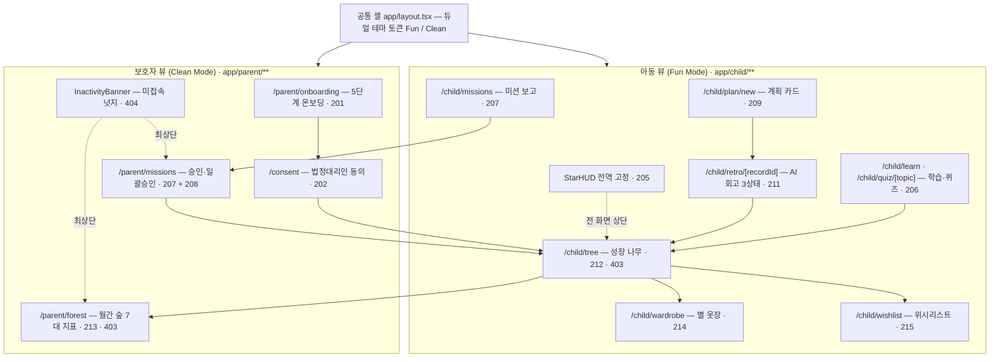

# [시각 프로토타이핑 선별안] FinFriends UI/UX 백뼈대 착수 계획

- **문서 ID:** PROTO-FINFRIENDS-MVP-001
- **버전:** 1.1
- **작성일:** 2026-08-27
- **기준 문서:** [`docs/00-plan/dag-roadmap.md`](dag-roadmap.md) · [`tasks/task-list.md`](../../tasks/task-list.md) · [`docs/02-srs/srs.md`](../02-srs/srs.md) · [`AGENTS.md`](../../AGENTS.md)
- **성격:** **부분 승인 + 실행 완료.** §4 라우트 13건과 §5.4 소유권 배정은 확정되어 `AGENTS.md` §3.2·§6 에 반영됐다.
  §5 실행 계획(P0~P3)은 2026-08-27 완료됐고, 최종 게이트 결과는 [`prototype-review-log.md`](prototype-review-log.md) 의 Round 4 에 기록돼 있다.
- **실행 지시서:** [`prototype-execution-plan.md`](prototype-execution-plan.md) — 본 문서 §5 P0~P3 를 Node 확정판으로
  옮긴 착수 문서. 런타임·스택 버전·토큰 승격 경로가 실행 가능한 형태로 확정돼 있다.
- ~~**선행 차수:** `visual-prototype-scope.md` — Node 없이 착수 가능한 4화면 경량 범위~~ **→ 폐기.** R-P7 해소로 전제가 소멸했다.

---

## 0. 문서의 위치와 사용법

이 문서는 **기존 30개 태스크를 대체하거나 재정의하지 않는다.** 30건 DAG는 그대로 두고, 그중 "사용자가 눈으로 확인하는 표면"을 소유한 태스크만 선별해 **선(先)프로토타이핑 대상**으로 지정한다.

| 읽는 사람 | 볼 절 |
|---|---|
| 오케스트레이터 | §1 요약 → §3 선별 결과 → §5 실행 계획 |
| 프로토타입 담당 에이전트 | §4 화면 맵 → §5 단계별 산출물 → §6 승격 규약 |
| 트랙 A/B/C/D 에이전트 | §5.4 소유권 확정안 → §6 fixture 치환 규약 |

---

## 1. Executive Summary

### 1.1 핵심 발견 — 30개 태스크에 화면 티켓이 없다

`dag-roadmap.md` §6 「태스크별 산출물 카탈로그」 30건 전수 대조 결과:

| 구분 | 건수 | 비고 |
|---|:--:|---|
| `.tsx` 화면/컴포넌트를 산출하는 태스크 | **2** | `403`(`loading.tsx` ×2 + `skeleton.tsx`), `404`(`InactivityBanner.tsx`) |
| 서버 로직·스키마·테스트만 산출하는 태스크 | 28 | `prisma/`·`actions/`·`services/`·`lib/`·`tests/`·`scripts/` |
| `app/child/**`·`app/parent/**` 페이지를 만드는 태스크 | **0** | — |

즉 현재 DAG를 그대로 완주하면 **Server Action은 전부 존재하나 그것을 호출할 화면이 없는 상태**로 Beta Gate에 도달한다. `TASK-305`·`TASK-306`(Playwright E2E)은 화면 존재를 전제하지만, 그 화면을 만드는 선행 태스크가 DAG에 없다 — **잠재 차단 요인**이다 (§7 R-P1).

### 1.2 선별 결과 요약

AC에 명시된 사용자 대면 표면을 역산해 30건을 3분류했다.

| 구분 | 건수 | 태스크 |
|---|:--:|---|
| **Tier 1 — 프로토타입 P0** | **9** | `201` `205` `206` `207` `209` `211` `212` `213` `403` |
| **Tier 2 — 프로토타입 P1** | **5** | `104` `202` `214` `215` `404` |
| **제외** | **16** | `101` `102` `103` `203` `204` `208` `210` `301`~`306` `401` `402` `405` |

- 프로토타입 예상 공수: **2.5 MD** (§5)
- 산출 화면: 아동 뷰(Fun Mode) 9 + 보호자 뷰(Clean Mode) 4 = **13 라우트**
- 이 13 라우트는 폐기용 목업이 아니라 **Step 1~4 실개발이 그대로 데이터를 채워 넣는 최종 파일**이다 (§6 승격 규약).

---

## 2. 선별 기준 및 제외 기준

### 2.1 선별 기준 (Inclusion Criteria)

5개 기준 중 **S1을 필수 전제로 하고, S2~S5 중 2개 이상**을 만족하면 선별한다.

| ID | 기준 | 판정 방법 |
|:--:|---|---|
| **S1** | **사용자 대면 표면 보유** *(필수)* | 태스크의 AC 또는 SRS REQ 본문이 아동/보호자가 **직접 보는 화면 요소**를 규정하는가. 개발자용 패널·로그는 제외 |
| **S2** | **듀얼 테마 판별력** | Fun Mode(아동)와 Clean Mode(보호자)의 시각 언어 차이를 드러내는가. 한쪽 뷰에만 존재하거나 양쪽에서 형태가 갈리는 화면이 해당 |
| **S3** | **핵심 루프 소속** | `계획 카드 → 결제 → 3단계 대조 → AI 회고 → 실천 인정 → 별 지급 → 나무 갱신 → 월간 숲` (AGENTS.md §1) 도메인 흐름 위에 있는가 |
| **S4** | **백엔드 무의존 렌더 가능성** | DB·Server Action 없이 **정적 fixture만으로 화면이 성립**하는가. 프로토타입이 `TASK-101`을 기다리지 않고 착수 가능한지의 판정 기준 |
| **S5** | **실개발 연속성** | 프로토타입 산출 파일이 폐기 없이 해당 태스크의 최종 산출물로 **그대로 승격**되는가 |

### 2.2 제외 기준 (Exclusion Criteria)

| ID | 기준 | 해당 태스크 |
|:--:|---|---|
| **X1** | **데이터·계약 계층** — 스키마·DTO. 화면이 아니라 화면의 재료 | `101` `102` |
| **X2** | **순수 도메인 로직** — 트랜잭션·판정 알고리즘·가드. 시각 산출물 0 | `203` `204` `208` `210` |
| **X3** | **검증 계층** — 단위/통합/E2E 테스트. 프로토타입의 *결과물*이 아니라 *소비자* | `301` `302` `303` `304` `305` `306` |
| **X4** | **배치·인프라·정적검사** — 사용자에게 보이지 않음 | `401` `402` `405` |
| **X5** | **API·게이트웨이** — Route Handler. 제어 패널이 있으나 **개발자용**이라 S1 미충족 | `103` |

### 2.3 제외했으나 화면에 그림자를 남기는 3건

아래 3건은 제외 대상이지만 **그 결과가 Tier 1 화면 위에 렌더링**된다. 프로토타입 화면 설계 시 **상태(state)로 반드시 포함**해야 한다.

| 태스크 | 제외 사유 | 그러나 화면에 남기는 것 | 반영할 Tier 1 화면 |
|---|---|---|---|
| `TASK-208` | X2 (소급 정산 로직) | AC3 — **"한 번에 모두 칭찬하기" 일괄 승인 버튼** (미승인 5건 이상 시) | `207` 보호자 미션 승인 |
| `TASK-210` | X2 (3단계 대조 알고리즘) | 판정 2분기 — `plan_met=true`(별 지급) / `false`(별 미지급) | `211` AI 회고 결과 |
| `TASK-402` | X4 (Fallback 룰 엔진) | Gemini 장애 시 **룰 템플릿 문구**가 노출되는 3번째 상태 | `211` AI 회고 결과 |

> **설계 지침:** `211` 회고 화면은 단일 상태가 아니라 **`AI칭찬 / AI격려 / 룰Fallback`** 3상태를 모두 렌더할 수 있어야 한다. 프로토타입 단계에서 이 3상태를 확정해두면 `TASK-306` E2E("정상 경로 + Fallback 경로 양방향 검증", 로드맵 R-06)가 화면 재작업 없이 착수된다.

---

## 3. 선별 결과 (30건 전수)

### 3.1 Tier 1 — 프로토타입 P0 (9건)

| Task | 명칭 | 담당 화면 | S1 | S2 | S3 | S4 | S5 | 선별 근거 |
|---|---|---|:--:|:--:|:--:|:--:|:--:|---|
| **`212`** | 성장 나무 판정 | `/child/tree` | O | O | O | O | O | **Fun Mode 대표 화면.** 4단계(새싹→묘목→어린나무→풍성한나무) 시각화 + AC3 "UI 최상단 넛지 메시지"가 AC에 명시 |
| **`213`** | 월간 숲 7대 지표 | `/parent/forest` | O | O | O | O | O | **Clean Mode 대표 화면.** 7대 지표 리포트 레이아웃 — 정보 밀도가 아동 뷰와 정반대라 듀얼 테마 대비를 가장 잘 드러냄 |
| **`206`** | 퀴즈 채점 & 보상 | `/child/learn`, `/child/quiz/[topic]` | O | O | O | O | O | 4주제 인터랙티브 콘텐츠 + 정답 즉시 별 지급 피드백. **아동 인터랙션의 원형** |
| **`207`** | 미션 루프 & 승인 | `/child/missions`, `/parent/missions` | O | O | O | O | O | **유일한 아동↔보호자 교차 화면.** 동일 도메인이 두 테마로 갈리는 형태를 검증 |
| **`209`** | 소비 계획 카드 생성 | `/child/plan/new` | O | O | O | O | O | 아동용 **폼 인터랙션 원형** (장소·업종·금액 3필드). REG-002 준수 UX(위치/카메라 권한 미요구)를 시각적으로 고정 |
| **`211`** | AI 회고 생성 | `/child/retro/[recordId]` | O | O | O | O | O | 서비스의 **감성 피드백 정점.** 칭찬/격려/Fallback 3상태 (§2.3) |
| **`205`** | 별 잔액/이력 조회 | `StarHUD` 전역 + `/child/stars` | O | O | O | O | O | 별은 이 서비스의 **핵심 시각 언어**이자 전 아동 화면 상단 고정 HUD. 컴포넌트 재사용 기준점 |
| **`201`** | 보호자 5단계 온보딩 | `/parent/onboarding` | O | — | — | O | O | **Clean Mode 진입 여정.** AC1 "5단계 중간 이탈 저장 및 재개"는 스텝 인디케이터 UI 없이는 확인 불가 |
| **`403`** | Cold Start Skeleton UI | `loading.tsx` ×2, `skeleton.tsx` | O | O | — | O | O | **30건 중 유일한 순수 UI 티켓.** shadcn/ui 듀얼 테마 토큰의 물리적 앵커 |

### 3.2 Tier 2 — 프로토타입 P1 (5건)

| Task | 명칭 | 담당 화면/자산 | 선별 근거 | P1인 이유 |
|---|---|---|---|---|
| **`202`** | 동의 & 아동 프로필 생성 | `/consent` | REG-001 리다이렉트 착지 화면 + 아동 프로필 생성 폼 | 정적 폼이라 시각 리스크 낮음 |
| **`214`** | 아바타 별 옷장 | `/child/wardrobe` | 아바타 2종·의상 4종 상점 그리드, 잔액 부족 차단 UX | 코어 루프 밖(보상 소비 측) |
| **`215`** | 위시리스트 마일스톤 | `/child/wishlist` | 30/70/100% 진척 게이지 | 단일 컴포넌트로 축약 가능 |
| **`404`** | 미접속 넛지 배너 | `components/parent/InactivityBanner.tsx` | **실 UI 파일을 보유한 2건 중 하나.** 보호자 대시보드 최상단 배너 | 단일 배너, 레이아웃 영향 국소 |
| **`104`** | 퀴즈·아바타 Seed Data | `data/curriculum.json`, `data/wardrobe_items.json` | **X1(데이터)이나 예외 편입** — 프로토타입 화면을 채울 실제 콘텐츠 원본. 로렘입숨 대신 진짜 문항·의상으로 렌더해야 시각 검증이 유효 | 화면이 먼저 서면 후행 가능 |

### 3.3 제외 (16건)

| Task | 제외 기준 | 사유 |
|---|:--:|---|
| `101` Prisma 스키마 | X1 | 11개 테이블 DDL. 화면 무관 (단 프로토타입 fixture의 타입 근거로 참조) |
| `102` DTO & Zod | X1 | 입출력 계약. 프로토타입 fixture가 이 타입을 **선취 정의**해 후행 정합 확보 |
| `103` Mock Sandbox Gateway | X5 | Route Handler. "개발용 시뮬레이션 제어 패널"은 아동/보호자 UX 아님 |
| `203` 동의 진입 차단 가드 | X2 | `middleware.ts` 로직. 화면은 `202`(`/consent`)가 소유 |
| `204` 별 원장 멱등 엔진 | X2 | 트랜잭션. 화면은 `205` StarHUD가 소유 |
| `208` 지연 소급 & 일괄승인 | X2 | AC3 일괄승인 버튼은 `207` 화면에 포함 (§2.3) |
| `210` 결제 3단계 대조 | X2 | 판정 2분기는 `211` 화면에 포함 (§2.3) |
| `301` 원장 멱등성 테스트 | X3 | Vitest |
| `302` 성장 나무 판정 테스트 | X3 | Vitest |
| `303` 계획 대조 Fallback 테스트 | X3 | Vitest |
| `304` 소급 정산 통합 테스트 | X3 | Vitest |
| `305` 동의 차단 E2E | X3 | Playwright — **프로토타입의 소비자.** `/consent` 라우트 확정 후 셀렉터 선작성 가능 |
| `306` 결제→AI 회고 E2E | X3 | Playwright — **프로토타입의 소비자.** `211` 3상태 확정 후 셀렉터 선작성 가능 |
| `401` pg_cron 야간 배치 | X4 | SQL 프로시저 |
| `402` Gemini Fallback 엔진 | X4 | Fallback 문구는 `211` 3번째 상태로 포함 (§2.3) |
| `405` 컴플라이언스 정적검사 | X4 | CI 스크립트. 단 **프로토타입 코드도 검사 대상** (§5.5) |

---

## 4. 프로토타입 화면 맵

### 4.1 라우트 구조

> ✅ 아래 13건은 [`AGENTS.md`](../../AGENTS.md) §3.2 에 **확정 라우트**로 성문화됐다. 신설하려면 §3.2 를 먼저 고쳐야 한다.
> `/child/tree`·`/parent/forest` 는 `TASK-403` 산출 파일 경로에서 이미 확정돼 있었고, 나머지 11건은 본 문서가 제안해 2026-08-27 승인됐다.



### 4.2 화면별 명세 근거 및 시각 검증 포인트

| # | 라우트 | 모드 | Task | SRS 근거 | 시각 검증 포인트 |
|:--:|---|:--:|:--:|---|---|
| 1 | `/child/tree` | Fun | `212` `403` | REQ-FUNC-005 | 4단계 나무 형상 전이, 3조건 카운터(학습≥3·퀴즈≥5·실천≥1), **최상단 넛지 배너**(AC3), 스켈레톤 → Fade-in |
| 2 | `/child/learn` | Fun | `206` | REQ-FUNC-003 | 4주제 카드(벌기/쓰기/모으기/불리기), **'불리기' 잠금 표시**(AC1 · ADR-006 · REG-004) |
| 3 | `/child/quiz/[topic]` | Fun | `206` | REQ-FUNC-003 AC2 | 정답 제출 → **별 1개 즉시 지급 피드백** |
| 4 | `/child/missions` | Fun | `207` | REQ-FUNC-004 | 미션 상태 전이 시각화 (`CREATED → PENDING_APPROVAL → APPROVED/REJECTED`) |
| 5 | `/child/plan/new` | Fun | `209` | REQ-FUNC-007 | 3필드 폼(장소·업종·금액), 72시간 만료 표시, **위치/카메라 권한 UI 부재**(AC2 · REG-002) |
| 6 | `/child/retro/[recordId]` | Fun | `211` | REQ-FUNC-008 | **3상태** — AI칭찬(별 지급) / AI격려(별 미지급) / 룰Fallback |
| 7 | `/child/stars` + `StarHUD` | Fun | `205` | REQ-FUNC-002 | 잔액 카운터, 획득 이력 페이징. **별↔현금 전환 UI 부재**(REG-005c) |
| 8 | `/child/wardrobe` | Fun | `214` | REQ-FUNC-006 | 아바타 2종·의상 4종 그리드, 잔액 부족 시 구매 차단 상태, **얼굴 업로드 UI 부재**(AC3 · REG-006) |
| 9 | `/child/wishlist` | Fun | `215` | REQ-FUNC-013 | 30/70/100% 마일스톤 게이지 (중복 지급 금지 표시) |
| 10 | `/parent/onboarding` | Clean | `201` | REQ-FUNC-001 AC1 | 5단계 스텝 인디케이터, **중간 이탈 후 재개** 상태 |
| 11 | `/consent` | Clean | `202` `203` | REG-001 | 동의 폼 + 아동 프로필 생성. 미동의 시 리다이렉트 착지점 |
| 12 | `/parent/forest` | Clean | `213` `403` `404` | REQ-FUNC-009 | **7대 지표** 리포트, 최상단 미접속 배너, 스켈레톤 |
| 13 | `/parent/missions` | Clean | `207` `208` | REQ-FUNC-011 AC3 | 승인 대기 목록 + **"한 번에 모두 칭찬하기"** 버튼(5건 이상 시) |

---

## 5. 실행 계획

### 5.1 단계 구성 (총 2.5 MD)

| 단계 | 명칭 | 공수 | 선행 | 산출물 | 완료 판정 |
|:--:|---|:--:|---|---|---|
| **P0** | 토대 — 스캐폴딩 & 듀얼 테마 | 0.5 MD | 없음 (`TASK-101` **불필요**) | Next.js App Router 스캐폴딩, shadcn/ui 초기화, Tailwind 듀얼 테마 토큰, `app/layout.tsx` 공통 셸, `components/ui/skeleton.tsx` | `npm run build` 통과 + 동일 컴포넌트가 두 테마에서 시각적으로 분기 |
| **P1** | Fun Mode 뼈대 | 1.0 MD | P0 | 화면 #1~#7 + `StarHUD` | 아동 7화면 라우팅 완주, fixture만으로 렌더 |
| **P2** | Clean Mode 뼈대 | 0.5 MD | P0 | 화면 #10~#13 + `InactivityBanner` | 보호자 4화면 라우팅 완주 |
| **P3** | 루프 연결 & 로딩 | 0.5 MD | P1, P2 | `plan → retro` mock 전이, `loading.tsx` ×2, 화면 #8·#9 | 계획→회고 3상태 전환이 클릭으로 시연 가능 |

> **P0가 `TASK-101`에 의존하지 않는 것이 이 계획의 핵심 이점이다.** 현 DAG의 Wave 0(MD 0.0~1.0)은 Track A가 `TASK-101`을 단독 수행하는 동안 B/C/D가 유휴 상태다 (로드맵 §2.2). P0~P1을 **이 유휴 구간에 흡수**하면 프로토타입 2.5 MD 중 최소 1.0 MD가 임계 경로 부담 없이 소화된다.

### 5.2 기존 Wave 0 준비 작업과의 관계

로드맵 §9.2는 이미 **에이전트 4(D)에게 "shadcn/ui 초기화, Tailwind 듀얼 테마(아동 Fun / 보호자 Clean) 토큰 정의"** 를 Wave 0 작업으로 배정하고 있다. **P0는 이 작업의 정식화이지 신규 작업이 아니다.** P1~P3만 순증분이다.

| 로드맵 §9.2 기존 배정 | 본 계획 대응 |
|---|---|
| 에이전트 4(D) — shadcn/ui 초기화, 듀얼 테마 토큰 | **P0에 그대로 흡수** (순증분 0) |
| 에이전트 2(C) — Playwright 구성, Sandbox 라우트 스켈레톤 | 유지. P3 완료 후 `306` E2E 셀렉터 확정 가능 |
| 에이전트 3(B) — Vitest 구성 | 유지 (영향 없음) |
| 에이전트 1(A) — `TASK-101` + `package.json` 일괄 선등록 | 유지. P0의 UI 의존성(`tailwindcss`, `class-variance-authority` 등)도 이때 함께 등록 |

### 5.3 Mock 데이터 규약 — 새 최상위 디렉토리를 만들지 않는다

`AGENTS.md` §3은 디렉토리 규약을 **변경 금지**로 명시한다. 따라서 `mocks/`·`fixtures/` 같은 최상위 디렉토리를 신설하지 않고, **화면 컴포넌트와 co-located 한 `*.fixture.ts`** 를 사용한다.

```
app/child/tree/page.tsx
app/child/tree/tree.fixture.ts     ← 같은 폴더. 승격 시 삭제
app/child/tree/loading.tsx         ← TASK-403 산출물과 동일 파일
```

모든 fixture 파일 첫 줄에 승격 마커를 넣는다.

```ts
// PROTO-DATA: TASK-212 — evaluateGrowthTree() 구현 시 이 파일을 삭제하고 actions/growth.ts 호출로 대체한다
```

후행 태스크 에이전트는 `grep -rn "PROTO-DATA: TASK-212"` 한 번으로 자기가 치환할 지점을 전수 특정한다.

### 5.4 파일 소유권 (확정 — AGENTS.md §6 반영 완료)

`AGENTS.md` §6과 로드맵 §2.3 소유권 맵은 **`app/child/**`·`app/parent/**`·`components/child/**` 를 어느 트랙에도 배정하지 않았다.** 현재 배정된 UI 파일은 `components/ui/skeleton.tsx`(D)·`components/parent/InactivityBanner.tsx`(A) 2건뿐이다. 4트랙 병렬 착수 전에 아래를 확정하지 않으면 **UI 디렉토리가 무주공산이 되어 "트랙 간 동시 편집 충돌 0건" 설계가 깨진다.**

**화면 소유권을 해당 Server Action 소유 트랙에 정렬**한다. 아래는 `AGENTS.md` §6 에 반영된 확정안이다:

| 트랙 | 추가 배타 소유 (제안) | 정렬 근거 |
|:--:|---|---|
| **A** | `app/parent/onboarding/**`, `app/consent/**`, `components/parent/**` | `actions/onboarding.ts`·`middleware.ts` 소유 트랙 |
| **B** | `app/child/{learn,quiz,missions,stars}/**`, `components/child/{Quiz,Mission,Star}*` | `actions/{ledger,learning,practice}.ts` 소유 트랙 |
| **C** | `app/child/{plan,retro}/**`, `components/child/{Plan,Retro}*` | `actions/{plan,retro}.ts` 소유 트랙 |
| **D** | `app/child/{tree,wardrobe,wishlist}/**`, `app/parent/forest/**`, `components/ui/**`, `components/child/{Tree,Wardrobe,Wish}*` | `actions/{growth,wardrobe,wishlist}.ts` 소유 + 기존 `loading.tsx` ×2 배정과 일치 |
| **공유** | `app/layout.tsx`, `app/globals.css`, `tailwind.config.ts` | `package.json`과 동일 프로토콜 — P0에서 확정 후 **동결**, 이후 변경은 오케스트레이터 경유 |

### 5.5 프로토타입에 그대로 적용되는 불변식

프로토타입이라도 `AGENTS.md` §4 불변식과 금지 식별자는 **면제되지 않는다.** 아래는 화면 설계 단계에서 물리적으로 차단한다.

| 불변식 | 프로토타입 단계 강제 방법 |
|---|---|
| **REG-002** 위치정보 0건 | `/child/plan/new`에 지도·"현재 위치" 버튼·주변 가맹점 UI를 **넣지 않는다.** 장소는 자유 텍스트 입력 |
| **REG-006** 얼굴 이미지 0건 | `/child/wardrobe`는 그래픽 아바타 2종만. 사진 업로드 컨트롤 미배치 |
| **REG-005c** 별↔현금 전환 부재 | `StarHUD`·`/child/stars`에 "원화 환산"·"출금" 표기를 넣지 않는다 |
| 금지 식별자 | `geolocation` `getCurrentPosition` `watchPosition` `latitude` `longitude` `convertStarToCash` `starToBalance` `withdrawStar` — **fixture 필드명 포함** 전면 금지 |
| **REG-001** | **프로토타입은 REG-001을 검증하지 않는다.** `middleware.ts`(A 소유, `TASK-203`) 미구현 상태이므로 `/consent` 전이는 mock 라우팅이다. 화면이 있다는 이유로 게이트 통과로 오인하지 않는다 |

### 5.6 프로토타입 검증 명령어

기존 태스크 검증 체계와 동일한 형태를 유지한다.

```bash
npx tsc --noEmit          # 타입 정합
npm run lint              # 스타일
npm run build             # 빌드 — TASK-403 검증 명령어와 동일
npm run compliance        # 금지 식별자 — TASK-405 산출 전에는 아래 grep으로 대체
```

`TASK-405`의 `scripts/verify-compliance.ts`가 아직 없는 동안의 임시 대체:

```bash
grep -rnE "geolocation|getCurrentPosition|watchPosition|latitude|longitude|convertStarToCash|starToBalance|withdrawStar" app/ components/ \
  && echo "COMPLIANCE FAIL" || echo "COMPLIANCE PASS"
```

---

## 6. 실개발 승격 규약 (프로토타입 → Step 1~4)

프로토타입 화면은 **폐기되지 않는다.** 후행 태스크는 화면을 새로 만들지 않고 fixture import를 Server Action 호출로 치환한다.

| 화면 | 프로토타입 fixture | 승격 시 대체할 호출 | 담당 Task | 트랙 |
|---|---|---|:--:|:--:|
| `/child/tree` | `tree.fixture.ts` | `actions/growth.ts` → `evaluateGrowthTree` | `212` | D |
| `/parent/forest` | `forest.fixture.ts` | `actions/growth.ts` `[MOD]` → `getMonthlyForest` | `213` | D |
| `/child/quiz/[topic]` | `quiz.fixture.ts` | `actions/learning.ts` → `submitQuizAnswer` | `206` | B |
| `/child/missions`, `/parent/missions` | `mission.fixture.ts` | `actions/practice.ts` → `createMission`·`reportMissionCompleted`·`approveMission` | `207` | B |
| `/parent/missions` 일괄승인 | `mission.fixture.ts` | `actions/practice.ts` `[MOD]` → `bulkApproveMissions` | `208` | B |
| `/child/plan/new` | `plan.fixture.ts` | `actions/plan.ts` → `createPlanCard` | `209` | C |
| `/child/retro/[recordId]` | `retro.fixture.ts` (3상태) | `actions/retro.ts` → `generateAIRetro` | `211` `402` | C |
| `StarHUD`, `/child/stars` | `ledger.fixture.ts` | `actions/ledger.ts` `[MOD]` → `getStarBalance` | `205` | B |
| `/parent/onboarding` | `onboarding.fixture.ts` | `actions/onboarding.ts` → `saveOnboardingStep` | `201` | A |
| `/consent` | `consent.fixture.ts` | `actions/onboarding.ts` `[MOD]` → `registerConsent`·`createChildProfile` | `202` | A |
| `/child/wardrobe` | `wardrobe.fixture.ts` | `actions/wardrobe.ts` → `purchaseWardrobeItem` | `214` | D |
| `/child/wishlist` | `wishlist.fixture.ts` | `actions/wishlist.ts` → `updateWishlistDeposit` | `215` | D |

**승격 절차** — 로드맵 §2.5 태스크 실행 루프 8단계 중 4번(`[IMPL]`)과 5번(`[TEST]`) 사이에 삽입한다:

```
4-a. [PROTO] grep -rn "PROTO-DATA: TASK-XXX" 로 치환 대상 fixture 전수 특정
4-b. [IMPL]  Server Action 구현
4-c. [SWAP]  화면의 fixture import → Server Action 호출로 치환. 화면 마크업은 변경 금지
4-d. [CLEAN] *.fixture.ts 삭제 후 grep 재실행하여 0건 확인
```

**부수 효과 — E2E 조기 착수:** `TASK-305`·`TASK-306`은 화면 셀렉터가 확정되면 Server Action 완성 전에도 **셀렉터·시나리오 골격을 선작성**할 수 있다. 로드맵 §3.6 "구현-검증 페어" 규약의 순환 대기(R-04)를 UI 층에서 완화한다.

---

## 7. 리스크 및 미결정 사항

| ID | 항목 | 영향 | 상태 | 대응 |
|:--:|---|:--:|:--:|---|
| **R-P2** | `app/**`·`components/child/**` **소유권 미배정** — 4트랙 병렬 시 충돌 | 높음 | ✅ **해소** | §5.4 배정안을 [`AGENTS.md`](../../AGENTS.md) §6 · 로드맵 [§2.3](dag-roadmap.md#23-파일-소유권-맵-병렬-충돌-방지) 에 반영 완료 |
| **R-P3** | 라우트 11건이 어느 문서에도 없음 | 중 | ✅ **해소** | 라우트 13건을 [`AGENTS.md`](../../AGENTS.md) §3.2 에 **확정·신설 금지**로 성문화. `/consent` 는 루트 배치 |
| **R-P1** | **DAG에 화면 생성 태스크가 없다** — `305`·`306` E2E가 존재하지 않는 화면을 대상으로 착수 | 치명 | ✅ **해소** | 2026-08-27 grill 세션 2 T7 — **안 A**. 12개 태스크 명세에 `[PROTO] 화면 선작성` 절을 삽입해 화면 생성 책임을 소유 트랙 태스크에 귀속. 새 티켓 0건, DAG 30건 불변 |
| **R-P7** | **로컬에 Node.js 툴체인이 없다** — `node`·`npm`·`npx`·`pnpm`·`yarn` 전부 부재 | 치명 | ✅ **해소** | 2026-08-27 **Node v24.20.0 LTS** 사용자 전역 설치 (`%LOCALAPPDATA%\Programs\nodejs`, npm 11.19.0). 상세는 [`prototype-execution-plan.md`](prototype-execution-plan.md) §1 |
| **R-P8** | `prisma` 의 npm `latest` 태그가 **RC**(8.0.0-rc.12)를 가리킨다 | 높음 | 🆕 신규 | `npm i prisma` 를 그대로 실행하면 RC 가 들어온다. `prisma@7.10.0` + `@prisma/client@7.10.0` **명시 고정** — 실행 지시서 §2 |
| **R-P9** | Tailwind v4 는 CSS-first — `tailwind.config.ts` 가 생성되지 않는다 | 중 | 🆕 신규 | §5.4 공유 파일 목록과 `AGENTS.md` §6 이 이 파일을 전제한다. `TASK-101` 이 버전 확정 시 함께 갱신 — 실행 지시서 §5 |
| **R-P4** | 프로토타입 fixture 타입이 `TASK-102` DTO와 불일치 | 중 | ⏳ 잔존 | fixture는 SRS §10·§11 기준으로 **선취 정의**하고, `102` 완료 시 `types/domain.ts`로 역흡수 |
| **R-P5** | 프로토타입 2.5 MD가 임계 경로(6.0 MD)에 순증 | 중 | ⏳ 잔존 | P0~P1(1.5 MD)을 Wave 0 유휴에 흡수(§5.1·§5.2). 실질 순증 **약 1.0 MD** |
| **R-P6** | 화면 존재가 REG-001 통과로 오인 | 높음 | ⏳ 잔존 | §5.5 명시. Alpha Gate 판정은 `TASK-203`+`TASK-305` 완료 시에만 유효 |

### 미결정 사항 (오케스트레이터 판단 필요)

1. ~~**본 계획을 별도 태스크(`TASK-100` 등)로 티켓화할 것인가**~~ → ✅ **해소 (2026-08-27).** 티켓화하지 **않는다.** 화면 생성 책임을 `AGENTS.md` §6 소유 트랙의 기존 태스크에 귀속시켰다 (grill T7 · 안 A).
   반영 결과는 `tasks/step-1/TASK-101.md` 와 `tasks/step-2/TASK-2XX.md` 11건의 `[PROTO]` 절에 있다.
2. ~~**Node.js 설치 시점** (R-P7)~~ → ✅ **해소 (2026-08-27).** v24.20.0 LTS 사용자 전역 설치 완료.
   라이브러리 버전은 여전히 `AGENTS.md` §2 대로 `TASK-101` 이 `package.json` 에 확정한다 —
   실행 지시서 §2 가 설치 시점 registry 조회 결과를 **근거로만** 남겨 뒀다.

> **확정 완료 (2026-08-27)** — §5.4 소유권 배정안과 §4.1 라우트 13건은 승인되어 SSOT에 반영됐다.
> 라우트는 이제 이 아니라 **확정**이며, 신설하려면 `AGENTS.md` §3.2 를 먼저 고쳐야 한다.

---

## 8. 부록 — 30건 분류 일람

| Task | 분류 | Task | 분류 | Task | 분류 |
|:--:|:--:|:--:|:--:|:--:|:--:|
| `101` | 제외 X1 | `207` | **Tier 1** | `301` | 제외 X3 |
| `102` | 제외 X1 | `208` | 제외 X2 * | `302` | 제외 X3 |
| `103` | 제외 X5 | `209` | **Tier 1** | `303` | 제외 X3 |
| `104` | Tier 2 | `210` | 제외 X2 * | `304` | 제외 X3 |
| `201` | **Tier 1** | `211` | **Tier 1** | `305` | 제외 X3 |
| `202` | Tier 2 | `212` | **Tier 1** | `306` | 제외 X3 |
| `203` | 제외 X2 | `213` | **Tier 1** | `401` | 제외 X4 |
| `204` | 제외 X2 | `214` | Tier 2 | `402` | 제외 X4 * |
| `205` | **Tier 1** | `215` | Tier 2 | `403` | **Tier 1** |
| `206` | **Tier 1** | — | — | `404` | Tier 2 |
| — | — | — | — | `405` | 제외 X4 |

`*` = 제외되었으나 Tier 1 화면에 상태로 반영 (§2.3)
