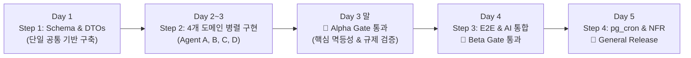
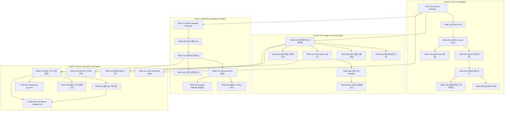
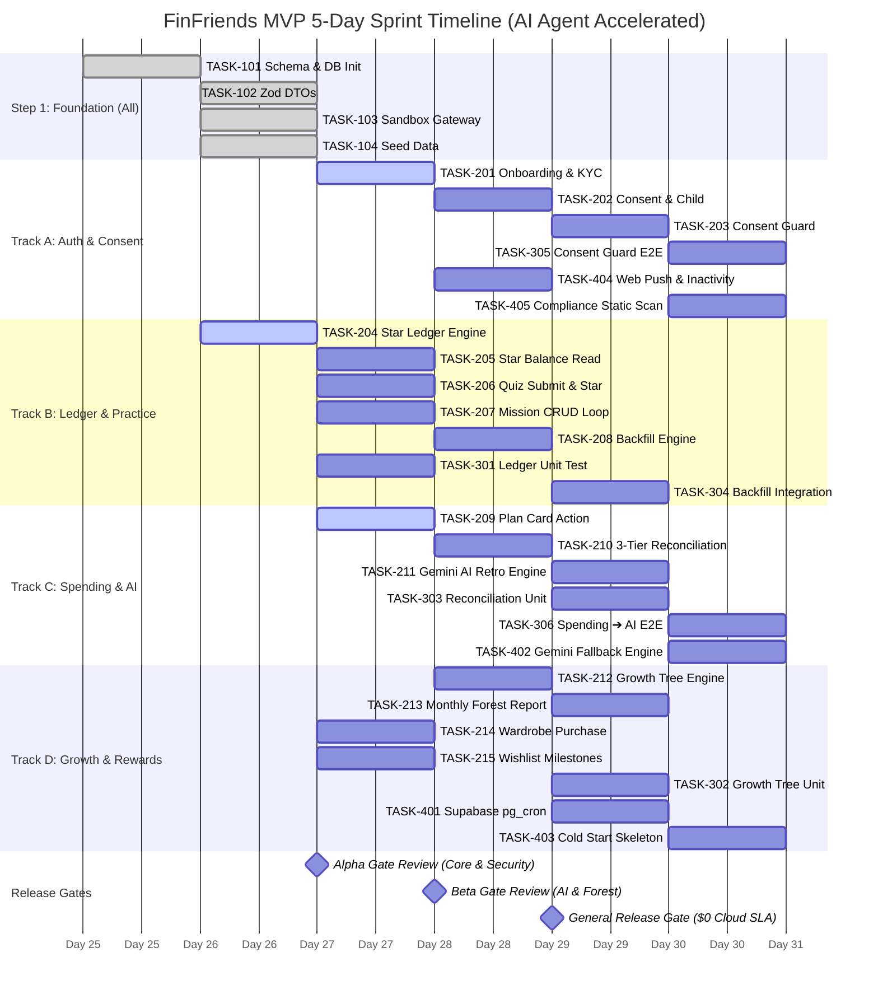

# [개발 총괄 로드맵] FinFriends AI-Native MVP DAG Roadmap & Execution Strategy

- **문서 ID:** ROADMAP-FINFRIENDS-MVP-001
- **버전:** 1.2
- **작성일:** 2026-08-25
- **책임자:** 시니어 스크럼 마스터 & 리드 솔루션 아키텍트
- **기준 문서:** [`docs/02_SRS/SRS_문서_핀프렌즈_v1.2.md`](02_SRS/SRS_문서_핀프렌즈_v1.2.md), [`docs/04_Tasks/FinFriends_Development_Task_List.md`](04_Tasks/FinFriends_Development_Task_List.md), [`tasks/README.md`](../tasks/README.md)
- **적용 기술 스택:** Next.js (App Router), Prisma ORM + Supabase PostgreSQL, Tailwind CSS + shadcn/ui, Vercel AI SDK + Google Gemini 1.5 Flash, Vercel ($0 무료 인프라)

---

## 1. 개요 및 AI 에이전트 가속 전략 (Executive Summary)

본 문서는 핀프렌즈 MVP 구축을 위한 **30개 세부 개발 태스크(`TASK-101` ~ `TASK-405`)의 의존성 그래프(DAG, Directed Acyclic Graph)와 릴리즈 게이트 통과 전략, 병렬 스프린트 일정(Gantt)**을 정의한 개발 총괄 문서입니다.

### ⚡ AI 멀티 에이전트 병렬 가속 원칙
- **전통적 단일 개발자 공수:** 총 30개 태스크 = **21.5 Man-Days (~4.5주)**
- **AI 에이전트 4개 병렬 트랙 가속:** **총 5일(1 Sprint) 내 Alpha ➔ Beta ➔ General Release 완주**
- **원칙:** 데이터 스키마(Step 1)를 선행 확정한 후, 상호 독립적인 도메인(Auth, Ledger, Spending, Learning)을 독립 에이전트가 병렬 구현하고, 테스트(Step 3)와 인프라(Step 4)를 단계별 릴리즈 게이트로 검증합니다.

---

## 2. 도메인별 4대 병렬 트랙 (Agent Workstreams)

---

## 3. DAG 기반 병렬 스프린트 일정 (Mermaid Gantt Chart)

AI 에이전트들이 의존성에 맞춰 4개 트랙으로 병렬 실행할 때의 **5일 완주 타임라인**입니다.

---

## 4. 릴리즈 게이트 (Release Gates) 통과 기준 및 평가 프로토콜

### 🚨 1. Alpha Gate (Day 3 완료 시점)
> **목표:** 핵심 데이터 정합성, 별 원장 멱등성, 14세 미만 동의 보안 규제 100% 검증

| 점검 항목 | 통과 기준 (Pass Criteria) | 검증 태스크 / 명령어 |
|---|---|---|
| **동의 차단 (REG-001)** | 미동의 아동 진입 차단율 100% | `TASK-305` (`npx playwright test onboarding.spec.ts`) |
| **별 원장 불변식 (REG-005)** | 멱등성 보장 및 잔액 오차 0건 | `TASK-301` (`npm run test ledger.test.ts`) |
| **성장 나무 3조건** | `학습3+퀴즈5+실천1` 승급 및 실천0 방어 | `TASK-302` (`npm run test growth.test.ts`) |
| **결제 대조 알고리즘** | Category ➔ Merchant ➔ Amount 3단계 매칭 | `TASK-303` (`npm run test reconciliation.test.ts`) |
| **타입 & 린트** | TypeScript 컴파일 에러 0건 | `npx tsc --noEmit && npm run lint` |

---

### 🚨 2. Beta Gate (Day 4 완료 시점)
> **목표:** Vercel AI SDK + Gemini AI 회고 파이프라인, 지연 소급 정산, 월간 숲 리포트 검증

| 점검 항목 | 통과 기준 (Pass Criteria) | 검증 태스크 / 명령어 |
|---|---|---|
| **소급 정산 (REQ-FUNC-011)** | 48h 지연 승인 시 과거 Cycle 정상 귀속 | `TASK-304` (`npm run test backfill.test.ts`) |
| **AI 회고 생성 (REQ-FUNC-008)** | 아동 맞춤 피드백 2.5s 이내 생성 | `TASK-306` (`npx playwright test spending-loop.spec.ts`) |
| **AI Fallback (ADR-010)** | 429/Timeout 시 룰 템플릿 100% 전환 | `TASK-402` (`npm run test fallback-engine.test.ts`) |
| **월간 숲 스냅샷** | 7대 핵심 지표 정상 집계 | `TASK-213` (`npm run test forest.test.ts`) |

---

### 🚀 3. General Release Gate (Day 5 완료 시점)
> **목표:** $0 무료 인프라 자립 운영, 컴플라이언스(위치/얼굴 0건), 미접속 알림 검증

| 점검 항목 | 통과 기준 (Pass Criteria) | 검증 태스크 / 명령어 |
|---|---|---|
| **규제 정적 스캔** | Geolocation 0건, 얼굴 업로드 0건 | `TASK-405` (`npm run compliance`) |
| **야간 크론 (ADR-011)** | Supabase `pg_cron` 정상 동작 | `TASK-401` (`npm run test cron-procedure.test.ts`) |
| **성능 체감 완화** | Cold Start 시 Skeleton UI 즉각 노출 | `TASK-403` (`npm run build`) |
| **인프라 비용 검증** | Vercel Free + Supabase Free ($0 청구) | 인프라 대시보드 검증 |

---

## 5. AI 에이전트 작업 지시 매트릭스 (Task Dispatch Matrix)

각 AI 에이전트에게 전달할 30개 태스크 파일 및 선후행 관계표입니다.

| Step | Task ID | 작업 명칭 | 상세 명세 파일 경로 | 의존 태스크 (Blocker) |
|:---:|---|---|---|---|
| **Step 1** | `TASK-101` | Prisma Schema & PG 마이그레이션 | [`tasks/step-1/TASK-101.md`](../tasks/step-1/TASK-101.md) | — |
| | `TASK-102` | TypeScript DTO & Zod 스키마 | [`tasks/step-1/TASK-102.md`](../tasks/step-1/TASK-102.md) | `TASK-101` |
| | `TASK-103` | Mock Partner Sandbox Gateway | [`tasks/step-1/TASK-103.md`](../tasks/step-1/TASK-103.md) | `TASK-101` |
| | `TASK-104` | 퀴즈 & 아바타 Seed Data | [`tasks/step-1/TASK-104.md`](../tasks/step-1/TASK-104.md) | `TASK-101` |
| **Step 2** | `TASK-201` | 보호자 온보딩 & Mock KYC | [`tasks/step-2/TASK-201.md`](../tasks/step-2/TASK-201.md) | `TASK-102` |
| | `TASK-202` | 법정대리인 동의 & 아동 생성 | [`tasks/step-2/TASK-202.md`](../tasks/step-2/TASK-202.md) | `TASK-201` |
| | `TASK-203` | 미동의 아동 진입 차단 Guard | [`tasks/step-2/TASK-203.md`](../tasks/step-2/TASK-203.md) | `TASK-202` |
| | `TASK-204` | 별 원장 멱등 지급 엔진 | [`tasks/step-2/TASK-204.md`](../tasks/step-2/TASK-204.md) | `TASK-101` |
| | `TASK-205` | 별 잔액/원장 이력 조회 | [`tasks/step-2/TASK-205.md`](../tasks/step-2/TASK-205.md) | `TASK-204` |
| | `TASK-206` | 퀴즈 채점 & 보상 연동 | [`tasks/step-2/TASK-206.md`](../tasks/step-2/TASK-206.md) | `TASK-204`, `TASK-104` |
| | `TASK-207` | 미션 CRUD & 승인 처리 | [`tasks/step-2/TASK-207.md`](../tasks/step-2/TASK-207.md) | `TASK-204` |
| | `TASK-208` | 지연 소급 Backfill & 일괄승인 | [`tasks/step-2/TASK-208.md`](../tasks/step-2/TASK-208.md) | `TASK-207` |
| | `TASK-209` | 소비 계획 카드 생성/만료 | [`tasks/step-2/TASK-209.md`](../tasks/step-2/TASK-209.md) | `TASK-102` |
| | `TASK-210` | 결제 3단계 대조 알고리즘 | [`tasks/step-2/TASK-210.md`](../tasks/step-2/TASK-210.md) | `TASK-103`, `TASK-209` |
| | `TASK-211` | Gemini AI 회고 생성 파이프라인 | [`tasks/step-2/TASK-211.md`](../tasks/step-2/TASK-211.md) | `TASK-210` |
| | `TASK-212` | 성장 나무 판정 & 정체 평가 | [`tasks/step-2/TASK-212.md`](../tasks/step-2/TASK-212.md) | `TASK-206`, `TASK-207`, `TASK-210` |
| | `TASK-213` | 월간 숲 7대 지표 스냅샷 | [`tasks/step-2/TASK-213.md`](../tasks/step-2/TASK-213.md) | `TASK-212` |
| | `TASK-214` | 아바타 옷장 구매 트랜잭션 | [`tasks/step-2/TASK-214.md`](../tasks/step-2/TASK-214.md) | `TASK-204`, `TASK-104` |
| | `TASK-215` | 위시리스트 마일스톤 별 지급 | [`tasks/step-2/TASK-215.md`](../tasks/step-2/TASK-215.md) | `TASK-204` |
| **Step 3** | `TASK-301` | 별 원장 불변식 단위테스트 | [`tasks/step-3/TASK-301.md`](../tasks/step-3/TASK-301.md) | `TASK-204` |
| | `TASK-302` | 성장 나무 단위테스트 | [`tasks/step-3/TASK-302.md`](../tasks/step-3/TASK-302.md) | `TASK-212` |
| | `TASK-303` | 계획 대조 단위테스트 | [`tasks/step-3/TASK-303.md`](../tasks/step-3/TASK-303.md) | `TASK-210` |
| | `TASK-304` | 소급 정산 통합테스트 | [`tasks/step-3/TASK-304.md`](../tasks/step-3/TASK-304.md) | `TASK-208`, `TASK-213` |
| | `TASK-305` | 동의 차단 E2E 테스트 | [`tasks/step-3/TASK-305.md`](../tasks/step-3/TASK-305.md) | `TASK-203` |
| | `TASK-306` | 결제 ➔ AI 회고 E2E 테스트 | [`tasks/step-3/TASK-306.md`](../tasks/step-3/TASK-306.md) | `TASK-211` |
| **Step 4** | `TASK-401` | Supabase pg_cron 야간 배치 | [`tasks/step-4/TASK-401.md`](../tasks/step-4/TASK-401.md) | `TASK-212` |
| | `TASK-402` | Gemini Fallback 룰 엔진 연동 | [`tasks/step-4/TASK-402.md`](../tasks/step-4/TASK-402.md) | `TASK-211` |
| | `TASK-403` | Cold Start 완화 Skeleton UI | [`tasks/step-4/TASK-403.md`](../tasks/step-4/TASK-403.md) | `TASK-212`, `TASK-213` |
| | `TASK-404` | Web Push & 3일 미접속 알림 | [`tasks/step-4/TASK-404.md`](../tasks/step-4/TASK-404.md) | `TASK-201`, `TASK-401` |
| | `TASK-405` | 컴플라이언스 정적 검사 | [`tasks/step-4/TASK-405.md`](../tasks/step-4/TASK-405.md) | Step 2 전체 |

---

## 6. 결론 및 개발 착수 가이드

본 로드맵에 따라 개발을 진행할 때 AI 에이전트는 다음 규칙을 준수합니다:
1. **각 태스크 착수 전:** 반드시 해당 태스크의 명세서(`tasks/step-X/TASK-XXX.md`)의 `Acceptance Criteria (GWT)`와 `Target Files`를 정독합니다.
2. **코드 변경 후:** 명세서 하단의 `Verification Commands`를 즉시 실행하여 검증 실패 시 자가 수정을 완료한 후 다음 태스크로 진행합니다.
3. **각 Gate 시점:** 정의된 게이트 통과 명령어를 일괄 실행하여 100% 무결성을 확보합니다.
