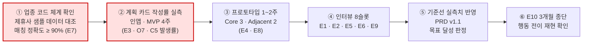
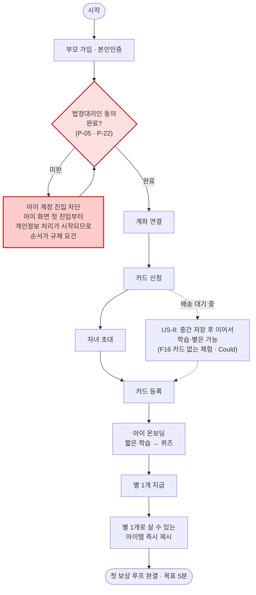
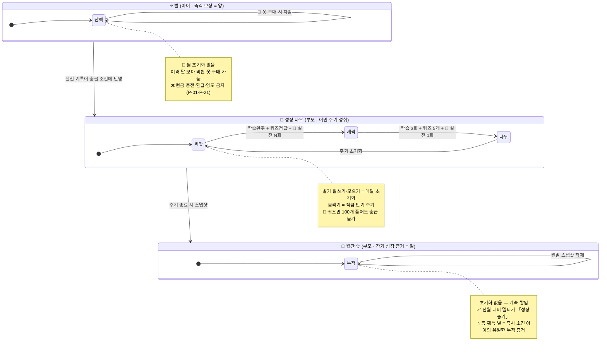
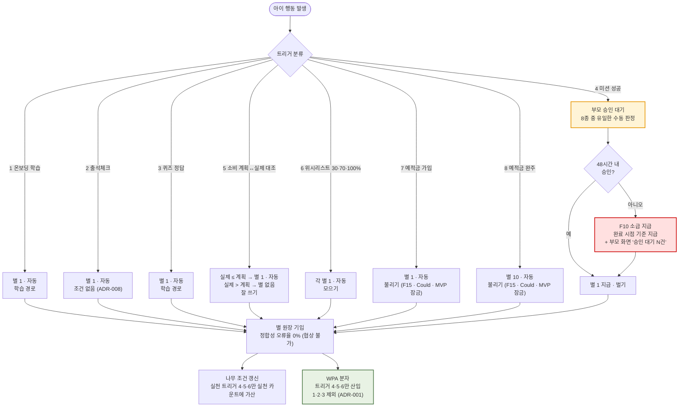
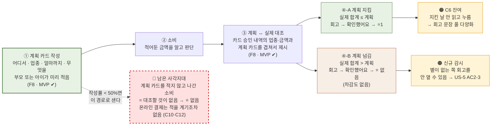

# 핀프렌즈(FinFriends) PRD v1.0

| | |
|---|---|
| **제품** | 핀프렌즈 — 만 8~9세 아동 대상 금융 학습·실천 플랫폼 |
| **Owner** | 제품기획 유림 |
| **검토** | 정책·법령 병윤 · 경쟁·리뷰 하영 · 서비스분석 혜원 |
| **최종 업데이트** | 2026-08-25 |
| **문서 상태** | **확정 — 구현 착수 기준선(baseline)** |
| **변경 절차** | 이 문서의 결정 사항을 바꾸려면 **§7-4에 ADR을 새로 쓰고** 이전 결정을 Superseded로 표시한다 |

**읽는 규칙 3가지**

1. **지표의 목표값은 확정 목표**다. `⬜` 는 **기준선을 아직 재지 않았다**는 뜻이며 목표가 미정이라는 뜻이 아니다 — 실측 시점은 §1-2 「기준선 확보」 열에 있다.
2. **모든 인터뷰 지표는 `k/8` 정수 판정**이고, 모든 KPI·수용 기준·실험은 **PASS / HOLD / FAIL 3구간**으로 판정한다 (§1-3-1 · §3-0).
3. **「왜 이렇게 만들었나」는 §7-4 ADR 8건이 답한다.** 본문은 결정 내용을, ADR은 결정 근거를 담는다.

---

## 0. 용어·코드 사전 — 이 문서의 모든 약어

> 코드마다 본문에 뜻을 병기했지만, 처음 읽는 사람을 위해 한자리에 모았다.

### 0-1. 두 가치 선언

| 코드 | 문장 | 누구의 것 |
|:-:|---|---|
| **선언 ①**<br>*(성장이 일어난다)* | **"핀프렌즈는 자녀가 금융에 대해 학습하고 금융 행동을 실천하며 성장할 수 있다."** | 🧒 **아이** — 학습·실천·성장이 아이에게서 일어남 |
| **선언 ②**<br>*(그 성장이 보인다)* | **"핀프렌즈는 자녀가 얼마나 금융 지식을 배웠는지가 아닌, 금융 행동이 어떻게 달라졌는지 한 눈에 보여줍니다."** | 👤 **부모** — 그 결과를 확인 |

**위계** — 선언 ①이 일어나야 선언 ②가 보여줄 것이 생긴다. 아이가 멈추면 부모 화면은 **빈 상태로 「정상 작동」** 한다.

### 0-2. 제품이 수행하는 일 (Job)

| 코드 | 읽는 이름 | 뜻 | 대응 선언 |
|:-:|---|---|:-:|
| **J1** | **실천할 자리 만들기** | 배운 것을 실천할 자리를 만들고, 실천이 성장으로 집계되게 한다 | 선언 ①(성장이 일어난다) · 아이 |
| **J2** | **행동 변화 보여주기** | 활동량이 아니라 「행동이 어떻게 달라졌는지」를 한 눈에 보여준다 | 선언 ②(그 성장이 보인다) · 부모 |
| **J3** | **끊김 방지** | 시작·인정·탐지가 끊기지 않게 한다 *(위계의 전제)* | ①→② 연결 |

### 0-3. 고객 문제(Pain) 코드 — 8건

| 층위 | 코드 | 읽는 이름 | 한 줄 뜻 | 인물 |
|:-:|:-:|---|---|:-:|
| ★ **선별** | **C1(성장 증거 부재)** | **성장 증거 부재** | 누적 숫자(116일·75문제·6,650원)가 성장의 증거가 되지 못한다 | 정미경 |
| ★ **선별** | **C2(실천 공백 → 나무 정체)** | **실천 공백 → 나무 정체** | 실천 칸이 비어 4개 나무가 전부 정체한다 | 정미경 |
| ★ **선별** | **C5(사전 개입 사각지대)** | **사전 개입 사각지대** | **재정의** — 소비 직전에 아이를 멈춰 세울 자동 수단이 없다. *(구: 「3분 체류」가 1분 미만 즉흥 구매를 못 잡는다 → 위치 알림 삭제로 전제 소멸)* | 배성우 |
| ◇ **보조** | **C3(정체 원인 미설명)** | **정체 원인 미설명** | 2주 정체를 부모가 아이의 능력 문제로 해석한다 | 정미경 |
| ◇ **보조** | **C10(FOMO 3초 판단)** | **FOMO 3초 판단** | 한정 스킨 결제는 판단 시간이 3초다 | 강동혁 |
| ◇ **보조** | **C12(온라인 개입 부재)** | **온라인 개입 부재** | 온라인 결제 사전 개입이 설계에 원리적으로 없다 | 강동혁 |
| △ **감시** | **C6(회고 형식화)** | **회고 형식화** | **범위 축소** — ⭐를 **계획 준수 시에만** 지급하도록 확정하여 「참은 날 = 안 참은 날」 문제는 해소. 남은 것은 **지킨 날에 읽지 않고 누르는 것** | 배성우 |
| △ **감시** | **A1(「불리기」 학습 장벽)** | **「불리기」 학습 장벽** | 이자·복리가 어려워 「불리기」가 학습 단계부터 막힌다 | 오하늘 |
| — | **C4(온보딩 5단계 비용)** | **온보딩 5단계 비용** | 현금 5초 ↔ 온보딩 5단계. 선별은 아니나 로드맵에 남음 | 배성우 |

**층위 표기** — ★ **선별**(3건 · 반드시 해결) · ◇ **보조**(3건 · 같은 해법으로 함께 풀림) · △ **감시**(2건 · 선언에 걸려 있으나 지표는 낮음)

### 0-4. 인물 (페르소나)

| 코드 | 읽는 이름 | 한 줄 |
|:-:|---|---|
| **H1** | **정미경**(39 · 중학교 교사) | 퍼핀 8개월차 — 숫자는 쌓이는데 확신은 안 쌓임 |
| **H2** | **배성우**(42 · 카페 자영업) | 현금 봉투 3년 — 소비 데이터가 아예 없음 |
| **H4** | **강동혁**(45 · 주 양육자) | 게임 결제로 용돈 60% 증발 *(보조 Pain 인물)* |
| **H5** | **오하늘**(38 · 약사) | 낭비는 안 하는데 모을 이유가 없음 *(감시 Pain 인물)* |
| **H6** | **임태경**(43 · 물류) | 지출 통제가 목적 — 🔴 **범위 밖으로 결정** |
| **H7 · H8** | 백현주 · 서명숙 | 승인 지연·부재 *(포용성 · 여정에서 P0)* |
| **H10** | 신가영(41 · 은행원) | 아이부자 2년차 — 불만이 없음 *(전환 검증용)* |

### 0-5. 지표 · 실험 · 기능 코드

| 접두 | 뜻 | 예 |
|:-:|---|---|
| **WPA** | **Weekly Practiced Active** — 주간 실천 인정 아동 비율 *(북극성 지표)* | §1-3 |
| **O1~O14** | **Outcome** — 고객이 원하는 결과의 정량 지표 | O4 = 7일 내 첫 실천 인정률 |
| **E1~E11** | **Experiment** — 검증 실험 | **E3 = 계획 카드 작성률**  |
| **F1(성장 나무)~F18** | **Feature** — 기능 번호  | F1~F18 |
| **US-1~US-8** | **User Story** — 사용자 스토리 | US-2 = 첫 실천이 나무에 반영된다 |
| **AC / AC-E** | **Acceptance Criteria** — 수용 기준 / **AC-E** = 예외·실패 케이스 기준 | US-6 AC-E2 |
| **P-01~P-23 · F-01** | **정책·법령 조항** — 규제 상수 | P-17·P-18 = 카드 한도·업종 제한<br>**P-19(위치정보)는 적용 없음** — 위치정보 미수집 |
| **①~④ 세그먼트** | 시장 세그먼트 | ① 금융성장 증명형(29.3만명 · 1차 타깃) |

### 0-6. 일반 약어

| 약어 | 풀어쓰면 |
|:-:|---|
| **MVP** | Minimum Viable Product — 최소 기능 제품 (여기서는 **F1(성장 나무)~F13(소비 내역·전월 비교) 13개**) |
| **KPI** | Key Performance Indicator — 핵심 성과 지표 |
| **NFR** | Non-Functional Requirement — 비기능 요구사항 |
| **SLO** | Service Level Objective — 서비스 수준 목표 *(성능·가용성 약속치)* |
| **Must·Should·Could·Won't** | 기능 우선순위 4단계 *(MoSCoW 기법)* |
| **AOS · DOS** | Attractive/Dissatisfied Opportunity Score — 고객 체감 / 시장 가중 기회점수 |
| **TAM · SAM · SOM** | 전체 / 유효 / 실질 공략 가능 시장 |
| **PASS · HOLD · FAIL** | 판정 3구간 — 통과 / 보류(표본 추가 후 재판정) / 실패(재설계) |
| **p95** | 95번째 백분위 — 100번 중 95번은 이 값 이내 |
| **Cohen's κ** | 코더 2인의 판정 일치도 계수 *(0.6 이상을 요구)* |

## 1. 개요·목표

### 1-1. 문제 정의 — Pain ID · 실패 KPI

> **범위 판정** — 고객 문제 8건 중 **7건을 이번 릴리즈 범위에 넣고, A1(「불리기」 학습 장벽)은 관측만** 한다. A1은 대응 기능(F15 예적금 실천)이 규제 선결(P-20: 예적금 가입 중개 회피) 대기라 요구사항으로 확정할 수 없다.

| 층위 | ID | 문제 (한 줄) | **실패 KPI — 이 값이면 실패** | 기준선 | 등급 | PRD 범위 |
|:-:|---|---|---|:-:|:-:|:-:|
| ★ **선별** | **C1(성장 증거 부재)** | 누적 숫자가 성장의 증거가 되지 못한다 | 나무 5초 노출 후 **행동 변화 1문장 회상 성공률 < 50%** · 부모 주 1회 확인 시간 **> 8분** | ⬜ 미측정<br>*(인터뷰 T3·Q0-2에서 실측)* | | ✅ |
| ★ **선별** | **C2(실천 공백 → 나무 정체)** | 실천 칸이 비어 4개 나무가 전부 정체한다 | **가입 후 7일 내 첫 실천 인정률 < 40%** · 월말 4칸 중 2칸 이상 성장 가정 **< 30%** | ⬜ 미측정<br>*(프로토타입 1주차 실측)* | | ✅ |
| ★ **선별** | **C5(사전 개입 사각지대)** | 소비 직전 자동 개입 수단이 없다 → **계획 카드를 적어둔 소비만 대조된다** | **계획 카드 작성률 < 50%**(카드 결제 건 대비) · 아이 소비 중 앱 기록 비율 **< 70%** | **0** *(현금 = 기록 0건)*<br>**체류시간 실측 불필요해짐** | | ⚠️ **부분** — §1-4 |
| ◇ **보조** | **C3(정체 원인 미설명)** | 2주 정체를 부모가 아이의 능력 문제로 해석한다 | 정체 발생 시 **원인 표시 열람률 < 40%** · 오귀인 발화 비율 **> 40%** | ⬜ 미측정<br>*(인터뷰 Q1-9)* | | ✅ |
| ◇ **보조** | **C10(FOMO 3초 판단)** | FOMO 결제는 판단 시간이 3초다 | 온라인 결제 건 중 **사전 개입 도달 0건 유지** | **0** | | ⚠️ **관측만** |
| ◇ **보조** | **C12(온라인 개입 부재)** | 온라인 결제 사전 개입이 설계에 원리적으로 없다 | 동일 | **0** | | ⚠️ **관측만** |
| △ **감시** | **C6(회고 형식화)** | **범위 축소** — ⭐는 **계획 준수 시에만** 지급. 남은 위험은 **계획을 지킨 날에 회고를 읽지 않고 누르는 것** | **동일 회고 문장 재노출률 > 50%**(7일 창) · **계획 준수 건의** 회고 화면 체류 **중위 < 2초** | ⬜ 미측정 |+ | ✅ |
| △ **감시** | **A1(「불리기」 학습 장벽)** | 「불리기」가 학습 단계부터 막힌 칸이 된다 | 4주제 중 **「불리기」 학습 완주율이 최저이며 차상위와 격차 > 20%p** | ⬜ 미측정 | | 📋 **관측만** |

**🔴 아이 행동 KPI의 관측 수단 문제**

**아이 Pain 12건 중 부모 화면에 신호로 나타나는 것이 0건**이고 아이 인터뷰도 0건이다. 따라서 아이 기준 KPI는 **관측 수단을 함께 확정**해야 한다.

| 아이 KPI | 관측 수단 | 상태 |
|---|---|---|
| 첫 실천 인정률 · 실천 트리거 도달 | **인앱 이벤트 로그** | 🟢 확보 가능 (F4(별 지급 엔진) 별 지급 로그) |
| 3일/7일 재접속률 | 인앱 세션 로그 | 🟢 확보 가능 |
| 회고 화면 체류 시간 | 인앱 화면 체류 로그 | 🟢 확보 가능 — **C6(회고 형식화) 판정의 유일한 수단** |
| 「참은 날」의 주관적 차이 | ❌ 없음 | 🔴 **아이 직접 조사 필요** (P-05 동의 · P-12 언어) |
| 소비 순간 실제 멈춤 | ❌ **트리거를 만들지 않기로 확정** (§4-2) | **계획 카드 작성률 + 계획 준수율로 대체** — 「멈췄는가」는 못 재고 **「적은 대로 썼는가」** 를 잼 |

### 1-2. 목표 — Desired Outcome 수치화

> **읽는 법** — 「기준선」은 **현재 값**이고, `⬜`는 **아직 재지 않았다**는 뜻이다. 목표값은 전부 **확정 목표**이며, 「기준선 확보」 열에 **언제·어떤 창구로 기준선을 채우는지**를 못박았다. 기준선이 채워지면 이 표의 목표값을 재검토하는 것이 아니라 **달성 여부를 판정**한다.

| # | Outcome | 지표 | 기준선 | **목표** | **기준선 확보** | 측정 주기 | 측정 창구 |
|:-:|---|---|:-:|:-:|---|:-:|---|
| O1 | 변화가 한 문장으로 읽힌다 | 나무 5초 노출 후 1문장 회상 성공률 | ⬜ | **≥ 6/8** | 인터뷰 8슬롯 1회차 (T3) | 인터뷰 회차 | 인터뷰 T3 (n=8) · rubric 코딩 |
| O2 | 확인이 짧아진다 | 부모 주 1회 확인 소요시간 | ⬜ *(대체재 15분 추정)* | **중위 ≤ 3분** | 인터뷰 Q0-2 재연 계측 | 주간 | `forest_view_opened.dwell_ms` p50 + 인터뷰 Q0-2 |
| O3 | 부모–자녀 대화가 생긴다 | 돈 이야기 월 횟수 | ⬜ | **월 2회** | 인터뷰 1회차 자기보고 | 월간 | 자기보고 단독 — **보조 지표.** 인앱 교차검증 수단이 없어 **게이트 기준으로 쓰지 않음** |
| O4 | 첫 실천이 반영된다 | 가입 후 7일 내 첫 실천 인정률 | ⬜ | **≥ 60%** | 프로토타입 1주차 코호트 | 주간 | `practice_credited` 가입 코호트 |
| O5 | 네 칸이 고르게 자란다 | 월말 4칸 중 2칸 이상 성장 가정 비율 | ⬜ | **≥ 50%** | 프로토타입 1개월차 월말 집계 | 월간 | `tree_state_changed` 월말 스냅샷 |
| O6 | 실천 경로가 실제로 쓰인다 | 실천 트리거 3종 중 1종 이상 도달 아동 비율 | ⬜ | **≥ 70%** | 프로토타입 1개월차 | 월간 | `practice_credited.trigger_code` distinct |
| O7 | 쓰기 전에 적은 기록이 남는다 | 계획 카드 작성 건수 / 카드 결제 건수 | **0%** *(현재 기능 부재)* | **≥ 50%** | ✅ **확보 완료 — 현행 0%** | 주간 | `plan_card_created` ÷ `payment_settled` — **F8의 생존 조건** |
| O8 | 소비가 기록으로 남는다 | 아이 소비 건수 중 앱 기록 비율 | **0%** *(현금 · 기록 0건)* | **전건(100%)** | ✅ **확보 완료 — 현행 0%** | 주간 | 카드 결제 원장 ÷ 소비 일지 대조 |
| O10 | 멈춘 이유를 알 수 있다 | 정체 원인 표시 열람률 · 실천 근거 열람률 | **0%** *(대체재에 화면 자체가 없음)* | **≥ 60%** | ✅ **확보 완료 — 현행 0%** | 월간 | `tree_view_opened.stall_reason_shown` · `.evidence_expanded` |
| O13 | 아이가 멈춘 것을 부모가 곧 안다 | 아이 루프 정지 → 부모 인지 일수 | **30일** *(다음 달 충전 시점에 인지 — 대체재 관측)* | **≤ 3일** | ✅ **확보 완료 — 대체재 관측 30일** | 주간 | `inactivity_notified` 발송~열람 |
| O14 | 부모 루프가 돈다 | 다음 달 충전율 · 월간 숲 익월 재방문율 | ⬜ | **≥ 70% / ≥ 50%** | 프로토타입 2개월차 | 월간 | 충전 원장 · `forest_view_opened` 월간 UU |

**기준선 확보 일정 요약** — `⬜` 7건 중 **O1·O2·O3은 인터뷰 8슬롯 1회차**, **O4·O5·O6은 프로토타입 1개월차**, **O14는 프로토타입 2개월차**에 전부 채워진다. 그 이전에는 목표값 대비 **진행 판정만** 하고 달성 판정을 하지 않는다(§1-3-1 표본 규칙).

### 1-2-1. 측정 경로 — 인앱 이벤트 명세

> 지표마다 **어떤 이벤트를 무슨 필드로 적재하는지**까지 내려간 명세다. 이 절이 있어야 §1-2·§1-3의 측정 창구가 구현 가능해진다.

| 이벤트명 | 발생 시점 | 필수 필드 | 이 이벤트로 산출되는 지표 |
|---|---|---|---|
| `practice_credited` | 실천 트리거로 ⭐ 지급 확정 | `child_id` `trigger_code(4·5·6·7·8)` `earned_at` `awarded_at` `approval_mode(auto·parent)` `tree_slot` | 🔴 **WPA(북극성)** · O4(7일 내 첫 실천 인정률) · O6(실천 경로 도달) |
| `star_ledger_entry` | 별 증감 확정 | `child_id` `delta` `trigger_code` `balance_after` `idempotency_key` | 별 정합성 오류율 · O8 |
| `tree_state_changed` | 나무 단계·조건 갱신 | `child_id` `slot` `stage_before` `stage_after` `cond_learn` `cond_quiz` `cond_practice` `stall_days` | O5(월말 4칸 성장) · C3(정체 원인 미설명) 정체 일수 |
| `tree_view_opened` | 부모가 성장 나무 진입 | `parent_id` `dwell_ms` `evidence_expanded(bool)` `stall_reason_shown(bool)` | O10(실천 근거·정체 원인 열람률) |
| `forest_view_opened` | 부모가 월간 숲 진입 | `parent_id` `year_month` `delta_items_rendered(int)` `dwell_ms` | O2(부모 확인 시간) · O14(익월 재방문) · **§8-3 ③ 변화 지표 개수** |
| `retro_viewed` | 회고 화면 진입~이탈 | `child_id` `sentence_id` `dwell_ms` `plan_amount` `actual_amount` **`plan_met(bool)`** **`star_granted(bool)`** | △ 감시 C6(회고 형식화) 체류 중위 · 동일 문장 재노출률 · **계획 준수율** · **갈래별 회고 열람률** |
| `approval_state_changed` | 미션 승인/거절/소급 | `mission_id` `state(pending·approved·rejected·backfilled)` `delay_hours` `cycle_id` | US-6 소급 성공률 · 대기 분포 |
| `inactivity_notified` | 3일 미접속 알림 발송 | `parent_id` `child_id` `last_session_at` `sent_at` `opened_at` | O13 탐지 일수 · F11(3일 미접속 알림) 발송·열람률 |
| `onboarding_step` | 온보딩 단계 진입/완료/이탈 | `parent_id` `step(1~5)` `state` `resumed(bool)` | US-8 퍼널 · 3단계 이탈률 |
| `consent_gate_blocked` | 동의 미완 상태 아이 진입 차단 | `parent_id` `attempted_at` | 🔴 규제 알림(>0건 즉시) |

> **적재 규칙** — 모든 이벤트에 `idempotency_key`(중복 방지) · `client_ts` / `server_ts`(오프라인 보정) 필수. **오프라인 발생 이벤트는 `client_ts` 기준으로 주차(week)에 귀속**한다.

### 1-3. 성공 지표 — 북극성 / 보조 KPI

> ## ⭐ 북극성 KPI — **WPA (Weekly Practiced Active · 주간 실천 인정 아동 비율)**

#### WPA 조작적 정의

```
WPA(주차 w) = 분자 / 분모

분자 — 주차 w 동안 「실천 트리거」로 ⭐를 1회 이상 받은 아동 수
       (practice_credited 이벤트가 1건 이상 있는 distinct child_id)

분모 — 주차 w 「활성 아동」 수
       = 주차 w 시작 시점에 아래 3조건을 모두 만족하는 아동
         ① 보호자 법정대리인 동의 완료 (P-05: 법정대리인 동의)
         ② 아이 계정 생성 후 7일 경과   ← 온보딩 ⭐가 실천을 과대계상하는 것을 차단
         ③ 직전 28일 내 앱 세션 1회 이상 ← 완전 이탈 계정 제외

주차 기준 — ISO 주(월~일) · KST
```

| 버전 | 「실천 트리거」 범위 | 언제 쓰는가 |
|:-:|---|---|
| 🔴 **WPA-v1** *(MVP 기준)* | **트리거 4** 미션 승인 · **5** 소비 회고 · **6** 위시리스트 달성 — **3종** | v1.0 MVP 전 기간 |
| **WPA-v2** *(개통 후)* | v1 + **트리거 7·8** 예적금(F15) — **5종** | F15 개통 시점부터 |

> **WPA-v1이 3종인 것은 성능 문제가 아니라 정의다.** 예적금(F15)이 Could이고 자동 개입 트리거를 채택하지 않았으므로 MVP의 실천 경로는 **구조적으로 3종**이다. 이것을 성능 저하로 오독하지 않도록 **v1·v2를 분리해 표기**한다.
> **WPA-v2 전환 시 시계열을 단절 표기**하고, 전환 후 4주간은 v1·v2를 **병기**한다.

**제외 규칙 (분자에 넣지 않음)** — 트리거 **1** 온보딩 학습 · **2** 출석체크 · **3** 퀴즈 정답. 셋 다 **학습 경로**이며, 특히 출석 ⭐1이 분자에 들어가면 *"접속만으로 실천 지표가 오르는"* 활동량 지표로 퇴화한다.

| 항목 | 값 |
|---|---|
| **기준선** | ⬜ — **프로토타입 2주차(D+14) 첫 산출.** 대체재에 대응 지표가 없어 외부 기준선은 존재하지 않는다 |
| **목표** | **β 클로즈드 ≥ 5/8 가정**(n=8) → **일반 공개 후 ≥ 55%** 2주 연속 |
| **FAIL 선** | β **≤ 2/8** · 일반 공개 **< 40%** → §8-2 E4 조치(성장 조건 난이도 재조정) 발동 |
| 측정 주기 | 주간 (ISO 주 마감 후 D+1 배치) |
| 측정 경로 | `practice_credited` + 활성 아동 스냅샷 |

> **채택 근거는 ADR-001**(§7-4)에 있다.

### 1-3-1. 3구간 판정 규칙 — 모든 KPI · AC · 실험에 공통 적용

> 통과선과 실패선만 두면 **그 사이 구간의 판정이 없다.** 아래 3구간이 모든 KPI·AC·실험의 공통 판정 규칙이다.

| 구간 | 판정 | 행동 |
|---|:-:|---|
| **통과선 이상** | ✅ **PASS** | 다음 게이트로 진행 |
| **통과선 미달 ~ 실패선 초과** | ⚠️ **HOLD** | **표본 +4 추가 후 재판정.** 2회 연속 HOLD면 **FAIL로 간주** · 그 사이 로드맵 변경 없음 |
| **실패선 이하** | ✕ **FAIL** | 지정된 재설계를 실행하고 다음 판본에 반영 |

| 지표 | PASS | HOLD | FAIL |
|---|:-:|:-:|:-:|
| 나무 5초 회상 (O1) | **≥ 6/8** | 4~5/8 | **≤ 3/8** |
| 첫 실천 인정률 (O4) | ≥ 60% | 40~59% | < 40% |
| 계획 카드 작성률 (E3) | ≥ 50% | 30~49% | < 30% |
| 정체 원인 열람률 (O10) | ≥ 60% | 40~59% | < 40% |
| WPA (β 기준) | ≥ 5/8 | 3~4/8 | ≤ 2/8 |
| WPA (일반 공개) | ≥ 55% (2주 연속) | 40~54% | < 40% |
| 부모 확인 소요시간 (O2) | 중위 ≤ 3분 | 3~8분 | > 8분 |
| 실천 경로 도달률 (O6) | ≥ 70% | 50~69% | < 50% |
| 회고 체류 중위 (E8) | ≥ 3초 | 2~3초 | < 2초 |
| 결제↔계획 카드 매칭 정확도 (E7) | ≥ 90% | 80~89% | < 80% |
| 아이 정지→부모 인지 (O13) | ≤ 3일 | 4~7일 | > 7일 |
| 카드 연결률 (수익) | ≥ 60% | 40~59% | < 40% |

**보조 KPI** — 전 항목 기준선·목표·측정 창구 확정

| 축 | 지표 | 기준선 | **목표** | **기준선 확보** | 주기 | 측정 창구 |
|---|---|:-:|:-:|---|:-:|---|
| 선언 ② *(전달)* | 나무 5초 회상 | ⬜ | **≥ 6/8** | 인터뷰 1회차 T3 | 인터뷰 회차 | 인터뷰 T3 rubric (κ≥0.6) |
| 선언 ② *(전달)* | 부모 확인 소요시간 | **15분** *(대체재 자기보고 추정)* | **중위 ≤ 3분** | ✅ 확보 — 대체재 15분 | 주간 | `forest_view_opened.dwell_ms` p50 |
| 선언 ② *(신뢰)* | 실천 근거 열람률 · 정체 원인 표시 열람률 | **0%** *(대체재에 화면 부재)* | **≥ 60%** | ✅ 확보 — 현행 0% | 월간 | `tree_view_opened.evidence_expanded` · `.stall_reason_shown` |
| J3 *(인정)* | 승인 지연 시 ⭐ 소급 지급 성공률 | **0%** *(소급 기능 부재)* | **100%** *(불변 조건)* | ✅ 확보 — 현행 0% | 주간 | `approval_state_changed(state=backfilled)` |
| J3 *(탐지)* | 아이 정지 → 부모 인지 일수 | **30일** | **≤ 3일** | ✅ 확보 — 대체재 30일 | 주간 | `inactivity_notified` 발송~열람 |
| 데이터 타당성 | 회고 화면 체류 중위값 | ⬜ | **≥ 3초** | 프로토타입 2주차 | 주간 | `retro_viewed.dwell_ms` p50 |
| 데이터 타당성 | 동일 회고 문장 재노출률 | ⬜ | **≤ 2/8** *(7일 창)* | 프로토타입 2주차 | 주간 | `retro_viewed.sentence_id` 중복률 |
| 지속 | 아이 3일 / 7일 재접속률 | ⬜ | **≥ 65% / ≥ 50%** | 프로토타입 1주차 | 주간 | 세션 로그 코호트 |
| 지속 | 익월 월간 숲 재방문율 | ⬜ | **≥ 50%** | 프로토타입 2개월차 | 월간 | `forest_view_opened` 월간 UU |
| 관계 *(보조)* | 부모–자녀 돈 대화 월 횟수 | ⬜ | **월 2회** | 인터뷰 1회차 | 월간 | 자기보고 단독 — **게이트 기준 아님** |
| **수익** | **카드 연결률** | **0%** | **≥ 60%** *(온보딩 완주자 대비)* | ✅ 확보 — 현행 0% | 월간 | 카드 등록 완료 ÷ 온보딩 5단계 완주 |
| **수익** | **아동 1인당 월 결제액** | **0원** | **≥ 30,000원** | ✅ 확보 — 현행 0원 | 월간 | 결제 원장 ÷ 활성 아동 |

> **수익 목표값의 산출 근거** — 페르소나 충전액 중위(H1 주 8,000원 · H2 주 5,000원 → 중위 주 6,500원 × 4.3주 ≈ **28,000원**)의 **소진율 100%** 를 상한으로 잡고 **30,000원**을 목표로 둔다. 이 값은 **손익분기 조건 `월 결제액 × 우리 몫 수수료율 ≥ 아동 1인당 월 원가`** 의 좌변을 채우는 값이며, 우변(원가)과 수수료율은 **검증과제 ⑥(제휴 조건 확인)** 에서 확정한다. 수수료율이 확정되면 **이 목표값을 상향/하향 조정하는 것이 아니라 손익분기 달성 여부를 판정**한다.
> **수익 KPI를 「유료 전환율」로 쓰지 않는다.** 정책상 **부모·아이 모두 무료**가 확정돼 SOM Level 3(구독 전제 · 440가구 × 월 4,900원) 산출식은 폐기됐다. 수익 구조는 **결제 수수료 + 금융사 제휴 2중 구조**다.

### 1-4. 이번 릴리즈가 다루지 않는 것 — 명시적 범위 밖

> 아래는 **결함이 아니라 결정**이다. 각 항목은 「왜 뺐는가」와 「언제 다시 보는가」를 함께 못박았고, 근거 결정은 §7-4 ADR에 있다.

| 범위 밖 | 내용 | 결정 근거 | **재검토 시점** |
|---|---|---|---|
| ★ **C5(사전 개입 사각지대)** — 자동 발동 부분 | 소비 **직전 자동 개입** | **ADR-003** — F8 계획 카드가 사전 수단을 담당한다. 자동 발동 대신 **「미리 적기」** 를 택했고, 못 잡는 대상은 「3분 미만 소비」에서 **「계획을 적지 않은 소비」** 로 이동했다 | **계획 카드 작성률(E3) 4주 실측 후.** ≥ 50% 확인 시 자동 발동 재논의 |
| ◇ **C10(FOMO 3초 판단) · C12(온라인 개입 부재)** | 온라인 결제 사전 개입 | **범위 밖 확정** — 온라인 결제는 계획 카드를 적을 계기가 구조적으로 없다. 대응 수단 0개임을 명시한다 | **v1.1 로드맵** — 온라인 가맹점 업종 코드 사전 등록 방식 검토 |
| △ **A1(「불리기」 학습 장벽)** | 「불리기」 실천 경로 | **ADR-006** — F15(예적금 실천)가 P-20(금융상품 중개업 회피) 법률 검토 대기. MVP에서 「불리기」는 **학습만 개통, 실천은 잠금** | **검증과제 ⑤ 법률 검토 완료 시** |
| — | 선언 ①의 **「학습」 마디 효과** | 학습 콘텐츠가 행동 변화로 이어진다는 연결은 **설계 근거로 서 있고 고객 Pain으로는 지탱되지 않는다** | **검증과제 ① · 실험 E6** |

> **이번 릴리즈의 도달 범위** — **선언 ②(그 성장이 보인다)를 완성**하고, **선언 ①(성장이 일어난다)을 4칸 중 3칸(벌기·잘쓰기·모으기)에서 개통**한다.
> *"소비 순간에 자동으로 멈춘다"* 는 **제품 범위가 아니다.** 제공하는 것은 **「쓰기 전에 적고, 쓴 뒤에 맞춰보는」 고리**다.


---

## 2. 사용자와 페르소나

### 2-1. 핵심 페르소나 2인

> 선별 Pain C1(성장 증거 부재)·C2(실천 공백 → 나무 정체)·C5(사전 개입 사각지대)를 겪는 인물 2인이다. **이번 릴리즈는 이 둘만을 대상으로 설계한다.**

| | **H1 정미경** *(선별 — C1 성장 증거 부재 · C2 실천 공백→나무 정체 / 보조 — C3 정체 원인 미설명)* | **H2 배성우** *(선별 — C5 사전 개입 사각지대 / 감시 — C6 회고 형식화)* |
|---|---|---|
| **프로필** | 39 · 중학교 교사 · 정하율(만 8세·초2)<br>주 8,000원 앱 충전 · **퍼핀 8개월차** · 아이 전용 태블릿 · 응답 **당일** | 42 · 카페 자영업(주 6일 · 07~20시) · 배주안(만 9세·초3)<br>**현금 봉투 주 5,000원 · 3년** · 아이 기기 **키즈워치** · 확인 주 1회 |
| **세그먼트** | ① 금융성장 증명형 · **29.3만명(35.8%)** · SOM 도달계수 **1.00** | 동일 세그먼트 ① 내부 · 도달계수 **1.00** |
| **Job** | **배운 것이 실제 돈 행동으로 이어졌는지를 짧은 시간에 확인하고 싶다** | **쓰기 전에 한 번 멈추게 하고, 그 선택이 기록으로 남게 하고 싶다** |
| **대체재 한계** | 퍼핀 학습현황 — **"보고도 모른다"** (Satisfaction 2) | 현금 봉투 — **"볼 것이 없다"** (Satisfaction 1 · 기록 0건) |
| **여정 최저 감정** | **3** (0단계 접하기 전) | **1** (3단계 전환 결정 — 온보딩 5단계 vs 현금 5초) |
| **진입 후크** | 🌳 성장 나무 · 🌲 월간 숲 | 📝 **소비 계획 카드 · 계획↔실제 대조** *(나무가 아님)* |
| **이탈 트리거** | 나무 **2주 이상 정체** → 아이 탓이 아니라 **앱 불신**으로 조용히 이탈 | **적어둔 계획과 실제가 맞춰지지 않으면 즉시 이탈** |
| **진입 장벽 성격** | **기록 이전 불가**(8개월치 자산) | **시간**(가게 일하면서 배송 받고 등록) |

> ⚠️ **두 인물은 같은 세그먼트 ① 안에 있다** — 모수를 각각 더해 58.6만으로 읽지 않는다.
> 🔴 **C10(FOMO 3초 판단)·C12(온라인 개입 부재)** 는 이번 릴리즈에 **대응 수단이 없다** — §1-4.

### 2-2. 여정 단계별 Pain·Needs 매핑

| 단계 | **H1 정미경** | **H2 배성우** | 대응 기능 |
|:-:|---|---|---|
| **0** 접하기 전 | ★**C1(성장 증거 부재)** 누적 숫자 3개(116일·75문제·6,650원)가 증거가 못 됨 *(감정 3)* | 소비 데이터가 **아예 없음** — 무엇을 가르칠지도 모름 *(감정 3)* | F1(성장 나무) · F9(월간 숲) · F13(소비 내역·전월 비교) |
| **1** 문제 신호 | 오답 재시도 보상 목격 → **학습 데이터 불신** | 하교길 문구점에서 3,000원 소진, **닷새 뒤 지갑 보고 안다** *(감정 2)* | F8(계획 카드·계획↔실제 대조) · F13(소비 내역·전월 비교) |
| **2** 인지·비교 | 나무 4칸에서 *"어디가 멈췄는지 보인다"* 즉시 이해 | **계획↔실제 대조 화면** 즉시 이해 — *"어디에 얼마 썼는지 그거 하나만"* *(감정 4)* | — |
| **3** 🔑 전환 결정 | **8개월치 기록 이전 불가** → '리셋'으로 체감 | **C4(온보딩 5단계 비용)** 현금 5초 ↔ 온보딩 5단계 *(감정 **1** 최저)* | F7(부모 온보딩·동의) · F16(카드 없는 체험)(✖) · F18(기록 이전)(✖) |
| **4** 아바타·온보딩 | — | 첫 보상까지 5분 · 규칙 이해 속도 > 별 모으는 속도 | F5(아바타·옷장) · F6(아이 온보딩) |
| **5** 학습·별 모으기 | 출석 ⭐1 우려 — *"공부를 안 할 수도"* | 학습 진도 느림 → **출석 ⭐1이 유일한 초기 별** | F3(학습 4주제) · F4(별 지급 엔진) |
| **6** 실천 선택 | ★**C2(실천 공백 → 나무 정체)** 실천 칸이 비어 **4칸 전부 정체** *(감정 4)* | ★**C5(사전 개입 사각지대)** 계획을 적어두지 않고 나간 소비는 **대조할 것이 없음** *(감정 4)* | F2(미션 루프) · F12(위시리스트) / **F8 계획 카드(부분)** |
| **7** 🔑 실천 판정 | — | **해소** — ⭐를 **계획 준수 시에만** 지급하도록 확정하여 참은 날과 안 참은 날이 구별됨. 남은 △**C6(회고 형식화)** 은 **지킨 날의 미열람**과 **못 받은 날의 회고 이탈** | F8(계획 카드·계획↔실제 대조) |
| **8** 아이템 구매 | 별을 즉시 소진 → 잔액만 표시돼 누적 성과 안 보임 | 참기 → 별 → 아이템 인과가 **가장 선명하게 성립** | F5(아바타·옷장) · F9(월간 숲)(총 획득 별) |
| **9** 나무·숲 | 4칸 확인 | 학습 이력 없어 **벌기·불리기 칸이 오래 비어** 고르지 않게 보임 | F1(성장 나무) · F9(월간 숲) |
| **10** 전환 후 | ◇**C3(정체 원인 미설명)** 2주 정체 → **오귀인 또는 앱 불신** *(감정 4)* | 소비가 안 줄면 *"보이기만 하고 달라지지 않는다"* 실망 | F1(성장 나무) 정체 원인 · F13(소비 내역·전월 비교) |

### 2-3. 범위 밖 세그먼트

| 세그먼트 | 규모 | 왜 범위 밖인가 | 그럼에도 남기는 것 |
|---|---|---|---|
| **③ 용돈 소비통제형** *(H6 임태경형)* | **13.3만명 (16.3%)** | Job이 **「지출 감축」** 이라 두 선언과 **성공 기준 자체가 다름.** AOS 1위(A6 4.0)이지만 DOS(SOM) 7위 | **F13(소비 내역·전월 비교)(전월 대비 증감액 상단)** 이 최소 유지 조건을 충족할 수 있음 — **포기가 아니라 1차 타깃 제외** |
| ② 습관관리형 / ④ 잠재관심형 | 27.0만 / 12.2만 | 3차·후순위 확장 | 별도 문서 |
| Extreme *(H7·H8)* | — | AOS·DOS 프레임 밖 | 🔴 **승인 지연은 여정지도에서 P0** → **F10(⭐ 소급 지급)이 대응** |
| Non-user *(H9~H11)* | — | 전환 이전에 이탈 | 진입 전략 사안 — F16(카드 없는 체험)·F18(기록 이전) |


---

## 3. 사용자 스토리와 수용 기준(AC)

> **Job 축** — **J1(실천할 자리 만들기)** 배운 것을 실천할 자리를 만든다 *(선언① · 아이)* / **J2(행동 변화 보여주기)** 행동이 어떻게 달라졌는지 보여준다 *(선언② · 부모)* / **J3(끊김 방지)** 시작·인정·탐지가 끊기지 않게 한다 *(전제)*
> AC의 Given에 **여정 단계 번호**를 넣어 §2-2와 대조할 수 있게 했다.
> **AC-E** = 예외·실패 케이스 수용 기준. **모든 스토리에 2개 이상**을 둔다 — 정상 경로만 규정된 AC는 구현 시 예외 처리를 개발자 재량에 맡기게 된다.

### 3-0. AC 판정 규칙 — 표본 · 임계치 · 코딩

**① 정수 임계치 환산 (n=8 인터뷰 지표)**

> 🔴 **비율 표기를 쓰지 않는다.** n=8에서 `≥70%`는 5.6명이라 정수 경계가 불명확하다. **모든 인터뷰 AC는 `k/8` 로 표기**한다.

| 비율 표기 | 정수 판정 | 실제 비율 |
|---|:-:|:-:|
| ≥ 70% | **≥ 6/8** | 75% |
| ≥ 60% | **≥ 5/8** | 62.5% |
| ≤ 30% | **≤ 2/8** | 25% |
| ≤ 25% | **≤ 2/8** | 25% |

**② 코딩 규칙 (rubric)**

| 판정 대상 | 성공 조건 | 코딩 방식 |
|---|---|---|
| **「변화 회상」 성공** | 응답에 **① 비교 시점**(지난달·지난주 등) **② 변화 방향**(늘었다·줄었다·자랐다) **③ 대상**(칸 또는 행동) 세 요소가 모두 포함 | 진행자 외 **코더 2인 독립 코딩** |
| **「실천」 도달** | *"실천"·"실제로 했다"·"참았다"·"미션"* 중 하나를 **진행자 개입 없이** 발화 | 동일 |
| **오귀인 발화** | 정체 원인을 **아이의 능력·의지**로 귀속(*"애가 안 해서"*) | 동일 |
| **앱 불신 발화** | 정체 원인을 **앱의 신뢰성**으로 귀속(*"앱을 안 믿게 된다"*) | 동일 |

- **일치도 기준** — 두 코더의 **Cohen's κ ≥ 0.6**. 미달 시 코딩 규칙을 조정하고 **전 표본 재코딩**
- **불일치 항목** — 제3자(리뷰어)가 판정하고 사유를 기록
- **5초 노출 통제** — 타이머 + 화면 덮기 도구 사용. **노출 오차 ±0.5초 초과 세션은 표본에서 제외**하고 제외 건수를 보고

**③ 표본 미확보 시 판정 규칙**

| 확보 표본 | 판정 |
|:-:|---|
| **n ≥ 8** | 정상 판정 |
| **5 ≤ n < 8** | ⚠️ **HOLD 고정** — PASS 판정을 내리지 않음. 비율 환산 금지 |
| **n < 5** | **판정 불가** — 실험 미실시로 기록 |

### US-1 — 변화를 한 문장으로 읽는다  `J2 행동 변화 보여주기`  `★선별 C1 성장 증거 부재`
 변화를 한 문장으로 읽는다

> **As a** H1 정미경(부모), **I want** 화면을 열었을 때 활동량이 아니라 **무엇이 달라졌는지**를 읽고, **so that** 아이가 배운 것이 행동으로 이어졌는지를 짧은 시간에 확인할 수 있다.

| # | Given / When / Then | 측정 도구 · 표본 |
|:-:|---|---|
| **AC1** | **Given** 여정 0단계, 이번 달 실천 기록이 1건 이상 있는 계정 / **When** 🌳 성장 나무 화면을 **5초만** 노출하고 덮은 뒤 *"기억나는 것"* 을 묻는다 / **Then** *"이번 달 행동이 어떻게 달라졌나"* 를 **1문장으로 회상: ≥ 6/8** *(rubric「변화 회상」)* | 인터뷰 T3 · **n=8** (모집 8슬롯) · 회상 내용 코딩 |
| **AC2** | **Given** 나무 상세를 펼치지 않은 기본 상태 / **When** *"나무가 자랐다는 건 아이가 뭘 했다는 뜻인가"* 를 묻는다 / **Then** **진행자 개입 0회로 「실천」에 도달한 응답자 ≥ 6/8**. *"퀴즈를 많이 풀어서"* 만 나오면 **AC 실패** | 인터뷰 Q1-8 · **n=8** · 개입 횟수 로그 |
| **AC3** | **Given** 여정 10단계, 전월 데이터가 존재 / **When** 🌲 월간 숲을 열어 *"지난달과 비교해 뭐가 달라졌는지 찾아보라"* 고 한다 / **Then** **전월 대비 변화 항목을 60초 이내 3개 이상 지목 ≥ 6/8** · 부모 확인 소요시간 **중위 ≤ 3분** | 인터뷰 Q1-10 + 인앱 세션 시간 |
| **AC4** | **Given** 아이가 별을 즉시 소진해 잔액이 0인 계정 / **When** 월간 숲을 연다 / **Then** **「이번 달 획득 별」이 스크롤 없이 노출**되고, 부모가 누적 성과를 지목할 수 있다 ≥ 6/8 | 인터뷰 Q1-11 · 화면 캡처 검수 |
| **AC-E1** | **Given** 이번 달 실천 기록이 **0건**인 계정 / **When** 성장 나무를 연다 / **Then** **"아직 기록이 없어요 + 첫 실천 안내"** 가 표시되고, **빈 화면을 앱 결함으로 인식한 응답자 ≤ 2/8** *(빈 화면이 「우리 애가 안 하는구나」로 오독되는 경로 차단)* | 인터뷰 · 화면 검수 |
| **AC-E2** | **Given** 가입 첫 달로 **전월 데이터가 없음** / **When** 월간 숲을 연다 / **Then** **「지난달과 비교」 영역이 "다음 달부터 비교할 수 있어요"로 대체**되고, **델타 0으로 렌더되지 않는다** *(0% → 0%가 「변화 없음」으로 오독되는 것 차단)* | 화면 검수 |

### US-2 — 첫 실천 한 건이 나무에 반영된다  `J1 실천할 자리 만들기`  `★선별 C2 실천 공백 → 나무 정체`
> **As a** 정하율(아이), **I want** 처음 실천한 한 건이 화면에서 **눈에 보이게** 반영되고, **so that** 계속할 이유가 생긴다. *(부모 관점: 화면이 움직이기 시작하는 것을 본다)*

| # | Given / When / Then | 측정 도구 · 표본 |
|:-:|---|---|
| **AC1** | **Given** 여정 6단계, 가입 7일 이내 아동 / **When** 실천 트리거 5종 중 1종을 최초로 완료한다 / **Then** **⭐ 지급 + 해당 나무 진행도 갱신이 동일 세션 내 반영** · **가입 7일 내 첫 실천 인정률 ≥ 60%** | 인앱 이벤트 로그 · 프로토타입 1~2주 (Core 3 · Adjacent 2) |
| **AC2** | **Given** 학습만 완료하고 실천 0건인 아동 / **When** 퀴즈를 추가로 풀어 학습·정답 조건을 초과 충족한다 / **Then** **나무 단계는 상승하지 않는다**(실천 0건이면 승급 불가) · 화면에 **"실천 N회 남음"** 이 명시된다 | 단위 테스트 + 화면 검수 |
| **AC3** | **Given** 여정 6단계 / **When** 월말에 집계한다 / **Then** **4칸 중 2칸 이상 성장한 가정 ≥ 50%** · **4칸 전부 씨앗 정체 가정 ≤ 15%** | 인앱 집계 · 월간 |
| **AC4** | **Given** MVP에서 「불리기」 실천 경로가 닫힘(F15(예적금 실천) 제외) / **When** 아이가 「불리기」 칸을 연다 / **Then** **"곧 열려요" 안내가 표시**되고, 4칸 미개통이 결함으로 오인되지 않는다 | 화면 검수 + 인터뷰 Q2-3 |
| **AC-E1** | **Given** 아동 기기가 **오프라인** / **When** 실천을 완료하고 이후 재연결된다 / **Then** **⭐ 중복 지급 0건**(`idempotency_key`) · 재연결 후 지급 반영 **≤ 60초** · 주차 귀속은 **`client_ts` 기준** | 단위 테스트 + `practice_credited` |
| **AC-E2** | **Given** 동일 미션에 대한 승인 요청이 **2회 이상** 발생 / **When** 부모가 각각 승인한다 / **Then** **⭐는 1회만 지급**되고 별 원장에 **불일치 0건** | 단위 테스트 + `star_ledger_entry` |
| **AC-E3** | **Given** 실천 조건은 충족했으나 **학습·퀴즈 조건 미충족** / **When** 나무 화면을 연다 / **Then** **승급하지 않고**, 남은 조건이 **조건별로 각각 표시**된다(*"학습 2회 · 퀴즈 3개 남음"*) | 단위 테스트 + 화면 검수 |

### US-3 — 멈춘 이유를 화면에서 안다  `J2 행동 변화 보여주기`  `◇보조 C3 정체 원인 미설명`
> **As a** H1 정미경(부모), **I want** 나무가 멈췄을 때 그 이유가 **아이 탓인지 조건 탓인지** 화면에서 구분되고, **so that** 실망을 아이에게 돌리지 않고 앱도 계속 신뢰할 수 있다.

| # | Given / When / Then | 측정 도구 · 표본 |
|:-:|---|---|
| **AC1** | **Given** 여정 10단계, 특정 칸이 **14일 이상 미상승** / **When** 부모가 그 칸을 연다 / **Then** **정체 원인이 조건 단위로 표시**된다(예: *"실천 1회가 남았어요 · 학습·퀴즈는 충족"*) · **열람률 ≥ 60%** | 인앱 화면 로그 · 월간 |
| **AC2** | **Given** 동일 상황 / **When** *"무슨 일이 있었다고 생각하느냐"* 를 묻는다 / **Then** **오귀인 발화 ≤ 2/8** · **앱 불신 발화 ≤ 2/8** *(분모 = 응답자 수)* | 인터뷰 Q1-9 · n=8 · rubric 코딩(κ≥0.6) |
| **AC3** | **Given** 정체 원인 표시를 본 부모 / **When** 다음 주 동일 화면에 재방문한다 / **Then** **정체 계정의 익주 재방문율 ≥ 50%**(정체가 이탈로 직결되지 않음) | 인앱 세션 로그 |
| **AC-E1** | **Given** 정체 원인이 **복수**(학습·실천 둘 다 미충족) / **When** 정체 원인을 표시한다 / **Then** **미충족 조건을 전부 표시**하고, **「가장 적게 남은 조건」을 최상단**에 둔다 *(다음 행동을 하나로 좁힘)* | 화면 검수 |
| **AC-E2** | **Given** 정체가 **주기 초기화 직후**에 발생(=아직 아무 조건도 채우지 않은 정상 상태) / **When** 부모가 화면을 연다 / **Then** **「정체」로 표시하지 않는다** — 정체 판정은 **주기 시작 후 14일 경과분에만** 적용 · **오탐 0건** | 단위 테스트 |

> 🔴 **AC2가 이 스토리의 핵심이다.** 사전 시나리오 응답에서 이 Pain은 *"아이 탓"* 이 아니라 **"앱을 안 믿게 된다"** 로 나타났다 — **오귀인은 대화라도 생기지만 불신은 신호 없이 이탈**한다. 두 경로를 모두 계측한다.

### US-4 — 📝 쓰기 전에 미리 적어둔다  `J1 실천할 자리 만들기`  `★선별 C5 사전 개입 사각지대`
> **As a** 배주안(아이), **I want** 가게에 가기 전에 **어디서 · 무슨 가게에서 · 얼마까지 · 무엇을** 살지 적어두고, **so that** 쓰고 나서 그 카드와 실제 결제를 겹쳐 볼 수 있다.

| # | Given / When / Then | 측정 도구 · 표본 |
|:-:|---|---|
| **AC1** | **Given** 아이 또는 부모가 계획 카드를 연다 / **When** **어디서 · 업종 · 얼마까지**를 입력한다 / **Then** 카드가 저장되고 **업종은 카드 승인 데이터의 업종 코드와 대조 가능한 값**으로 기록된다 *(「무엇을」은 선택 입력)* | 단위 테스트 + 화면 검수 |
| **AC2** | **Given** 계획 카드가 존재하는 아동 / **When** 카드 결제가 발생한다 / **Then** **해당 결제가 계획 카드에 자동 매칭**되고, 매칭 정확도 **≥ 90%** *(가맹점명 또는 업종 일치 기준)* | 결제 매칭 로그 · 수동 대조 표본 50건 |
| **AC3** | **Given** 계획 카드가 **없는** 상태에서 결제가 발생 / **When** 아이가 앱을 연다 / **Then** **대조 화면 대신 「다음엔 가기 전에 적어볼까요?」 유도**가 노출되고 **⭐가 지급되지 않는다** | 단위 테스트 + 화면 검수 |
| **AC4** *(생존 조건)* | **Given** MVP 운영 4주 / **When** 계획 카드 작성률을 집계한다 / **Then** **카드 결제 건 대비 계획 카드 작성률 ≥ 50%** *(O7)* | `plan_card_created` ÷ `payment_settled` |
| **AC-E1** | **Given** 한 계획 카드에 **여러 건의 결제**가 매칭 / **When** 대조 화면을 만든다 / **Then** **합계로 판정**하고 업종별 내역을 모두 나열한다 | 단위 테스트 |
| **AC-E2** *(결정 완료 · ADR-004)* | **Given** 계획한 업종과 **다른 업종에서만** 결제 (금액은 계획 이내) / **When** 대조 화면을 만든다 / **Then** **⭐1을 지급한다**(금액 기준 준수) · `plan_met=true` `category_met=false`로 기록 · 회고 문장은 **「업종이 달랐어요」 갈래**로 분기 제시 | 단위 테스트 + `retro_viewed.category_met` |
| **AC-E3** | **Given** 결제 업종 코드가 **제휴사에서 미분류(`UNKNOWN`)로 내려옴** / **When** 매칭을 시도한다 / **Then** **가맹점명 문자열 일치**로 2차 매칭하고, 그래도 실패하면 **금액만으로 판정**한다 · `match_method(category·merchant·amount_only)`를 적재해 **매칭 정확도 산출에서 분리 집계** | 결제 매칭 로그 |

### US-5 — 참은 날이 확인만 한 날과 다르다  `J1 실천할 자리 만들기`  `△감시 C6 회고 형식화`
> **As a** 배주안(아이), **I want** 참은 날이 그냥 확인만 한 날과 다르게 느껴지고, **so that** 참는 쪽이 더 좋은 선택으로 학습된다.

| # | Given / When / Then | 측정 도구 · 표본 |
|:-:|---|---|
| **AC1** | **Given** 여정 7단계, 7일 내 회고를 3회 이상 수행한 아동 / **When** 회고 문장을 제시한다 / **Then** **동일 문장 재노출률 ≤ 2/8**(문장 풀에서 비복원 추출) | 인앱 문장 배정 로그 |
| **AC2** | **Given** 회고 화면 진입 / **When** [확인했어요]를 누른다 / **Then** **화면 체류 중위 ≥ 3초** · 체류 1초 미만 비율 **≤ 20%** | 인앱 화면 체류 로그 — **C6(회고 형식화) 판정의 유일한 수단** |
| **AC2-1** *(갈래 A · 계획 지킴)* | **Given** 실제 결제액 **≤** 계획 금액 / **When** [확인했어요]를 누른다 / **Then** **⭐1이 지급**되고 `star_granted=true` · `plan_met=true`로 기록된다 | 단위 테스트 + 인앱 이벤트 |
| **AC2-2** *(갈래 B · 계획 넘김)* | **Given** 실제 결제액 **>** 계획 금액 / **When** [확인했어요]를 누른다 / **Then** **회고 문장은 동일하게 제시**되지만 **⭐가 지급되지 않고**, `star_granted=false` · `plan_met=false`로 기록된다. **보유 별을 차감하지 않는다** *(P-03 「별은 모으기만」)* | 단위 테스트 + 인앱 이벤트 |
| **AC2-3** *(갈래 B 이탈 감시)* | **Given** 계획 초과로 별을 받지 못하는 건 / **When** 회고가 대기한다 / **Then** **회고 열람률이 계획 준수 건 대비 ≥ 70%** *(보상 없는 쪽 회고가 방치되면 「행동」 데이터가 실패한 날만 비게 됨 — 미달 시 AC-E2 큐 정책으로 대응)* | `retro_viewed` 갈래별 열람률 |
| **AC3** | **Given** 계획 초과일과 계획 준수일 / **When** 각각 회고를 완료한다 / **Then** **회고 문장이 서로 구별되고**, 부모가 두 경우를 화면만 보고 구분 ≥ 6/8 | 화면 검수 + 인터뷰 Q1-15 |
| **AC-E1** | **Given** 회고 문장 풀이 **소진 임계(잔여 20% 이하)** / **When** 다음 회고를 배정한다 / **Then** **운영 알림이 발송**되고, 재사용을 시작하기 전에 **풀 확장이 요구**된다 *(비복원 추출은 유한하므로 「≤ 2/8 재노출」이 구조적으로 깨지는 시점을 사전 포착)* | 문장 풀 잔여율 모니터 |
| **AC-E2** | **Given** 회고 미완 상태에서 **다음 소비가 발생** / **When** 아이가 앱을 연다 / **Then** **미완 회고가 큐에 쌓여 순서대로 제시**되고, 큐 길이 **3건 초과 시 오래된 건은 「요약 회고」로 병합** | 단위 테스트 + 화면 검수 |

### US-6 — 부모가 늦어도 내가 한 일이 사라지지 않는다  `J3 끊김 방지`
> **As a** 아이(H7·H8형 포함), **I want** 부모 승인이 늦어도 내가 한 실천이 인정되고, **so that** 부모의 지연이 내 실패로 기록되지 않는다.

| # | Given / When / Then | 측정 도구 · 표본 |
|:-:|---|---|
| **AC1** | **Given** 여정 7단계, 미션 완료 후 부모 미승인 48시간 경과 / **When** 부모가 이후 승인한다 / **Then** **⭐가 완료 시점 기준으로 소급 지급** · **소급 지급 성공률 100%** | 인앱 이벤트 · 단위 테스트 |
| **AC2** | **Given** 승인 대기 건이 1건 이상 / **When** 부모가 🌳 성장 나무를 연다 / **Then** **「승인 대기 N건」이 나무 화면에 표시**되어 *"이번 주엔 안 했구나"* 라는 반대 결론을 막는다 | 화면 검수 · 인터뷰 |
| **AC3** | **Given** 아이 화면 / **When** 승인 대기 상태를 본다 / **Then** **「대기 중」이 「미실천」과 시각적으로 구별**된다(색·문구 상이) | 화면 검수 |
| **AC-E1** | **Given** 미션 완료 후 부모가 **거절** / **When** 거절이 확정된다 / **Then** **⭐ 미지급** · 아이 화면에 **「승인되지 않음 + 사유」** 가 표시되고 **「미실천」과 시각적으로 구별**된다 · 실천 카운트에 **가산되지 않음** | `approval_state_changed(state=rejected)` · 화면 검수 |
| **AC-E2** 🔴 | **Given** 미션 완료 시점의 주기(`cycle_id=N`)가 **이미 종료**되고 부모가 다음 주기(N+1)에 승인 / **When** 소급 지급이 실행된다 / **Then** **⭐는 지급**하되 **나무 조건은 주기 N에 귀속**되어 **N+1 나무에 가산하지 않는다.** 대신 **🌲 월간 숲(주기 N 스냅샷)에 반영**되고, 부모 화면에 *"지난 달 실천으로 인정됐어요"* 가 표시된다 | 단위 테스트 + `approval_state_changed.cycle_id` |
| **AC-E3** | **Given** 승인 대기 건이 **5건 이상 누적** / **When** 부모가 앱을 연다 / **Then** **일괄 승인 경로**가 제공되고, 일괄 승인 시에도 **각 건의 완료 시각 기준으로 개별 소급** 처리된다 | 단위 테스트 |

### US-7 — 아이가 멈춘 것을 3일 안에 안다  `J3 끊김 방지`
> **As a** 부모(H2형 포함), **I want** 아이가 앱을 안 열기 시작하면 곧 알게 되고, **so that** 다음 달 충전 시점에야 알고 *"우리 애가 안 맞나 봐"* 로 결론 내리지 않는다.

| # | Given / When / Then | 측정 도구 · 표본 |
|:-:|---|---|
| **AC1** | **Given** 아동 최종 접속 후 **72시간 경과** / **When** 배치가 실행된다 / **Then** **부모에게 미접속 알림 발송률 100%** · **정지 → 부모 인지 일수 ≤ 3일** | F11(3일 미접속 알림) 발송·열람 로그 |
| **AC2** | **Given** 미접속 알림 수신 / **When** 부모가 알림을 연다 / **Then** **아이가 멈춘 지점(어느 칸·어느 조건)이 함께 표시**된다 | 화면 검수 |
| **AC3** | **Given** 부모가 자영업 등으로 야간에만 확인 가능 / **When** 알림을 발송한다 / **Then** **발송 시간대가 부모 활동 시간에 맞춰 조정 가능** · 알림 열람률 ≥ 50% | 인앱 설정 + 열람 로그 |
| **AC-E1** | **Given** 부모가 **푸시 알림을 차단** / **When** 72시간 미접속이 판정된다 / **Then** **앱 내 배너 + (동의 시)문자**로 대체 발송되고, **차단 상태가 계측**된다 · **O13 산출에서 차단 계정은 별도 집계** | 권한 상태 + `inactivity_notified` |
| **AC-E2** | **Given** 아동이 **앱을 삭제** / **When** 72시간 판정 시점이 온다 / **Then** 알림 문구가 **「재설치 안내」로 분기**되고, 「미접속」과 **다른 이벤트 코드**로 적재된다 | 이벤트 코드 검수 |
| **AC-E3** | **Given** 미접속 **71시간** 시점에 아이가 재접속 / **When** 배치가 실행된다 / **Then** **알림을 발송하지 않는다** — **오탐 발송 0건** | 단위 테스트 |

### US-8 — 시간을 쪼개서 시작할 수 있다  `J3 끊김 방지`  `C4 온보딩 5단계 비용`
> **As a** H2 배성우(자영업 부모), **I want** 온보딩을 한 번에 끝내지 않아도 되고, **so that** 가게 일 사이에 나눠서 시작할 수 있다.

| # | Given / When / Then | 측정 도구 · 표본 |
|:-:|---|---|
| **AC1** | **Given** 여정 3단계, 온보딩 5단계 중 2단계까지 진행 / **When** 앱을 종료하고 다음 날 재진입한다 / **Then** **직전 단계에서 이어서 시작** · 재입력 항목 0건 | 인앱 이벤트 · 단위 테스트 |
| **AC2** | **Given** 카드 배송 대기 상태 / **When** 아이가 앱을 연다 / **Then** **학습·퀴즈·별 획득이 가능**하고 카드 필요 기능만 잠긴다 *(F16(카드 없는 체험) — MVP 밖이면 잠금 안내 문구로 대체)* | 화면 검수 |
| **AC3** | **Given** 온보딩 시작 / **When** 완주까지의 소요를 측정한다 / **Then** **세션 분할 시 총 소요 중위 ≤ 10분** · **3단계 이탈률 ≤ 30%** | `onboarding_step` 퍼널 |
| **AC-E1** | **Given** 카드 신청 단계에서 **외부 API 실패** / **When** 오류가 반환된다 / **Then** **입력값이 24시간 보존**되고 재진입 시 **재입력 항목 0건** · 오류 사유가 사용자 언어로 표시된다 | 단위 테스트 + 화면 검수 |
| **AC-E2** | **Given** 온보딩 중 **세션 만료** / **When** 재로그인한다 / **Then** **직전 완료 단계에서 재개**되고, **동의(P-05: 법정대리인 동의) 단계는 재확인**한다 *(동의는 캐시하지 않음)* | 단위 테스트 |


---

## 4. 기능 요구사항(Functional)

### 4-1. 기능 목록 · 우선순위(Must·Should·Could·Won't) · 의존성 · 스프린트 규모

> 스프린트는 **2주 · 개발 3인 기준**이며, **Could 이상은 전부 1스프린트 내 구현 가능**하도록 분할했다 — 1스프린트를 넘는 F8은 **두 개의 배포 가능한 조각(F8a·F8b)** 으로 쪼갰다.
> **v1.0에서 「의존성」과 「스프린트 규모」 열을 신설**했다. 스프린트는 **2주 · 개발 3인 기준**이며, **Could 이상은 전부 1스프린트 내 구현 가능**하도록 분할했다 — 1스프린트를 넘는 F8은 **두 개의 배포 가능한 조각(F8a·F8b)** 으로 쪼갰다.

| F | 기능 | 연결 Pain | Job | 중요도 | 난이도 | **우선순위** | **의존성** | **스프린트 규모** | 근거 (대안 대비 가치) |
|---|---|:-:|:-:|:-:|:-:|:-:|---|:-:|---|
| **F7** | 🔐 부모 온보딩 5단계 + **법정대리인 동의** | C4(온보딩 5단계 비용) | J3 | **5** | 4 | **Must** | 본인인증 SDK · **제휴사 카드 발급 API** | **1스프린트** | 규제 필수(P-05·P-22). 기존 사업자 미이행 관측 → 준수 자체가 신뢰 자산 |
| **F4** | ⭐ 별 지급 엔진 (트리거 8종 · 차감형 · 초기화 없음) | ★ C2 | J1 | **5** | 3 | **Must** | **없음** *(최선행 모듈)* | **1스프린트** | 실천 5경로 vs 학습 2경로 — 경로 수로 실천을 유도 |
| **F3** | 📚 학습 커리큘럼 4주제 + 퀴즈 (+「불리기」 한 줄 설명) | ★ C2 · △ A1 | J1 | **5** | 3 | **Must** | 콘텐츠 원고 4주제 | **1스프린트** | **4/4 전부 금융** vs 퍼핀 3/7 — 4칸 매핑이 구조적으로 가능한 쪽 |
| **F2** | 🧹 미션 루프 (조건·금액 사전 설정 → 승인 → ⭐1) | ★ C2 | J1 | **5** | 3 | **Must** | **F4** | **1스프린트** | 「벌기」의 유일한 실천 근거. 대체재는 조건이 부모 머릿속에만 있음 |
| **F1** | 🌳 성장 나무 (4영역 + 실천 근거 기본 노출 + **정체 원인 표시**) | ★ C1 · ◇ C3 | J2 | **5** | 4 | **Must** | **F4 · F3** | **1스프린트** | 퍼핀은 숫자 3개뿐 — 「어디까지 자랐나」를 보여주는 유일한 화면 |
| **F5** | 🐾 아바타 · 👕 옷장 (사전 제작 3D) | ★ C2 | J1 | **5** | 4 | **Must** | **F4** · 3D 에셋 납품 | **1스프린트** *(에셋 선납 전제)* | 아이의 **유일한** 동기 장치. 나무는 부모 화면 전용 |
| **F8a** | 📝 **소비 계획 카드** 작성·저장 (어디서·**업종**·얼마·무엇을) | ★ C5 | J1 | **5** | 3 | **Must** | **없음** *(결제 연동 불필요)* | **1스프린트** | 사전 절반. **위치·알림에 의존하지 않아 키즈워치 가정도 동작** |
| **F8b** | 💳 **계획↔실제 업종별 대조** + 두 갈래 판정(지킴 ⭐1 / 넘김 회고만) + **회고 문장 풀** | ★ C5 · △ C6 | J1 · J2 | **5** | **5** | **Must** | **F8a · F4 · 제휴사 결제내역 조회 API** | **1스프린트** | 사후 절반. 업종을 받으므로 **「얼마」만이 아니라 「어디에」가 데이터로 남음** |
| **F9** | 🌲 월간 숲 (**지난달과 비교**) | ★ C1 | J2 | **5** | 3 | **Must** | **F1** *(주기 스냅샷)* | **1스프린트** | **전월 대비 변화가 성장 증거** — 3사 전부 공백 |
| **F6** | 🐣 아이 온보딩 (학습→퀴즈→⭐1→아이템 제시) | C4 | J1 · J3 | 4 | 2 | **Should** | **F3 · F4 · F5** | **0.5스프린트** | 첫 보상 루프를 5분에 닫음 |
| **F10** | ⏱ 승인 지연 시 ⭐ **소급 지급** + 「대기 N건」 | US-6 | J1 · J2 | 4 | 2 | **Should** | **F2 · F4** | **0.5스프린트** | 🔴 **H7·H8의 P0** — 한 규칙으로 「인정」 군집 4건이 함께 풀림 |
| **F11** | 🔔 아이 **3일 미접속 알림** | US-7 | J3 | 4 | 2 | **Should** | 세션 로그 · 푸시 채널 | **0.5스프린트** | **O13(아이 정지 → 부모 인지 ≤3일)의 유일한 달성 수단** |
| **F12** | 🎯 위시리스트 (30·70·100% 각 ⭐1) | ★ C2 | J1 | 4 | 2 | **Should** | **F4** | **0.5스프린트** | 「모으기」 칸을 여는 실천 · 저축에 **이유**를 만듦 |
| **F13** | 📊 소비 내역 (**전월 대비 증감액 상단** · **업종별 집계**) | ★ C5 | J2 | 4 | 2 | **Should** | **F8b** *(업종 데이터 재사용)* | **0.5스프린트** | **H2의 최소 유지 조건** — *"어디서 얼마 썼는지, 그거 하나만"* |
| **F15** | 💰 예적금 비교·선택 (가입 ⭐1 · 완주 ⭐10) | △ A1 | J1 | 3 | 3 | **Could** | **F4** · 🔴 **검증과제 ⑤ 법률 검토(P-20)** | **1스프린트** | 「불리기」 실천 칸 — 법률 검토 통과가 착수 조건 |
| **F16** | 🪪 카드 없이 학습부터 시작하는 체험 경로 | C4 | J3 | 3 | 3 | **Could** | **F7 · F3** | **0.5스프린트** | H2의 진입 장벽(시간) 완화 |
| **F17** | 🛍 별의 **옷장 외 목적지** | (A2) | J1 | 3 | 3 | **Could** | **F4 · F5** · **P-21 현금 분리선 재검토** | **1스프린트** | 모으기형 아이의 루프 회수 |
| **F18** | 📤 기존 앱 기록 이전 / 병행 사용 | (H1 Anxiety) | J3 | 2 | **5** | **Won't** | 타사 데이터 반출 경로 *(존재하지 않음)* | **2스프린트 초과** | 난이도 5 · 병행 수요 낮음(*"둘 다요? 귀찮을 것 같은데요"*) |

**집계** — **Must 9** · **Should 5** · **Could 3** · **Won't 1** = **18개**

**구현 순서 (의존성 위상 정렬)** — 스프린트 경계를 이 순서로 자른다.

| 스프린트 | 내용 | 이유 |
|:-:|---|---|
| **S1** | **F4** ⭐ 별 지급 엔진 · **F7** 부모 온보딩+동의 | 둘 다 의존성 0. F4는 6개 기능의 선행이고, F7은 규제 게이트라 가장 먼저 테스트 가능해야 함 |
| **S2** | **F3** 학습·퀴즈 · **F2** 미션 루프 · **F8a** 계획 카드 작성 | F4 완료 후 착수 가능. F8a는 결제 연동 없이 단독 동작 |
| **S3** | **F1** 성장 나무 · **F5** 아바타·옷장 | F3·F4 완료가 선행. 여기서 **부모 화면이 처음 의미를 가짐** |
| **S4** | **F8b** 계획↔실제 대조 · **F9** 월간 숲 | 제휴사 결제내역 API 연동이 이 시점에 필요 — **계약이 S3 종료 전 확정돼야 함** |
| **S5** | **F6 · F10 · F11 · F12 · F13** *(각 0.5스프린트 · 병렬)* | 전부 Should. 0.5스프린트 단위라 2개씩 묶어 배치 |
| **S6+** | **F15 · F16 · F17** *(Could)* | F15는 법률 검토 통과가 착수 조건 |

> **「Could 이상 1스프린트 내 구현 가능」 확인** — Must 9건 · Should 5건 · Could 3건 = **17건 전부 1스프린트 이내**다. 유일한 초과 후보였던 F8(난이도 5)은 **F8a(작성) / F8b(대조)** 로 분할해 각각 독립 배포 가능하게 만들었다. F18(Won't)만 2스프린트를 넘으며, 그래서 Won't다.

### 4-2. 미개통 영역의 화면 대응

> 기능을 뺀 자리는 **빈 화면이 아니라 안내 문구로 채운다.** 빈칸이 결함으로 오인되면 §1-3의 「빈 화면 오독」 경로가 그대로 재현된다.

| 사실 | 화면 대응 | 검증 |
|---|---|---|
| 「불리기」 칸은 **학습만 열리고 실천은 닫힘**(F15 Could) | **"곧 열려요"** 표시 필수 — 4칸 미개통이 결함으로 오인되지 않게 | US-2 AC4 · 인터뷰 Q2-3 |
| **자동 사전 개입 0개** — **F8 계획 카드**가 유일한 사전 수단 | 대외 자료에서 *"매장에 3분 머무르면 알림"* **사용 금지**(사실이 아님). 생존 조건은 **계획 카드 작성률(E3)** | §8-3 · 대외 문구 검수 |
| 기록 이전 불가(F18 Won't) | 획득 메시지를 「이전」이 아니라 **「지금부터」** 프레임으로 | 온보딩 문구 검수 |
| 실천 기록 0건 계정의 성장 나무 | **"아직 기록이 없어요 + 첫 실천 안내"** | US-1 AC-E1 |
| 가입 첫 달의 월간 숲 「지난달과 비교」 | **"다음 달부터 비교할 수 있어요"** — 델타 0으로 렌더하지 않음 | US-1 AC-E2 |


---

## 5. 비기능 요구사항(NFR)

### 5-1. 규제 요구사항 — 최우선 · 협상 불가

> 아동 대상 금융 서비스의 1순위 NFR은 성능이 아니라 **규제**다. 아래는 설계 변수가 아니라 **상수**이며, 전 항목이 **자동 테스트 또는 스키마 검사로 상시 감시**된다.

| 조항 | 요구사항 | **임계치** | 검증 방법 | **모니터링 항목** |
|---|---|:-:|---|---|
| **P-05 · P-22** | **법정대리인 동의 완료 전 아이 화면 진입 불가.** 아이 온보딩은 첫 화면부터 개인정보 처리가 시작되므로 순서가 규제 요건 | **차단률 100%** · 우회 **0건** | 동의 미완 상태 아이 계정 진입 시도 → 자동 테스트 | `consent_gate_blocked` **> 0건 즉시 알림** |
| **P-19** | **위치정보를 수집·저장·전송하지 않는다.** 지오펜싱은 제품 범위에 포함하지 않는다. 앱은 위치 권한을 **선언하지 않는다** | 좌표 필드 **0개** · 위치 권한 선언 **0건** | ① 앱 매니페스트 권한 목록 검사 ② 서버 스키마 좌표 필드 부재 검증 ③ 패킷 검사 | 배포 파이프라인 **권한 선언 스캔**(빌드 실패 처리) |
| **P-12** | 아동용 **알기 쉬운 고지.** 4칸 명칭은 부모·아이 **동일**하게 두고, 「알기 쉬운 언어」는 **한 줄 설명**이 담당 | 아동 이해도 **≥ 6/8** | 문구 검수 + 아동 이해도 확인 세션 | 문구 변경 시 재검수 게이트 |
| **P-20** | 예적금 **가입 중개 안 함** — 비교·선택 경험까지만 | 중개 행위 **0건** | F15 구현 착수 전 법률 검토 통과(검증과제 ⑤) | F15 착수 게이트 |
| **P-01 · P-21** | 별은 **차감형 · 교차 금지**, 별↔저금통 **완전 분리.** ❌ 현금 충전 ❌ 현금 환급 ❌ 양도·거래 | 전환 경로 코드 **0개** | 별 원장 감사 · 정적 분석으로 전환 함수 부재 검증 | 일일 정산 배치 · 정적 분석 CI |
| **P-13** | 동물 아바타 **얼굴 이미지 미수집** | 이미지 업로드 경로 **0개** | 데이터 스키마 검수 | 스키마 변경 리뷰 게이트 |
| **P-11** | 해지 시 잔액 **전액 환불** | 환불 누락 **0건** · 처리 **≤ 3영업일** | 해지 플로우 테스트 | 해지 건별 환불 대사(일간) |
| **P-17 · P-18** | 카드 **한도·업종 제한은 제휴사 정책 종속** — 우리가 정할 수 없음 | — *(계약 확인 사항)* | 제휴 계약서 확인 | 제휴사 정책 변경 통지 수신 채널 |
| **F-01** | 만 14세 미만 **마이데이터 가입 불가** → 표준 API로 데이터를 받을 수 없음 | — *(아키텍처 제약)* | 아키텍처 리뷰 | — |

### 5-2. 성능 · 신뢰성 — SLO v1.0 (확정)

> **이 값은 확정 SLO다.** AC에서 역산해 산정했으며 — **AC가 성립하지 않는 값은 어떤 경우에도 허용될 수 없다** — 각 항목에 **재검토 트리거**를 붙였다. 트리거가 걸리면 값을 임의로 완화하는 것이 아니라 **ADR을 새로 써서** 갱신한다.

| 항목 | **SLO** | 산정 근거 (AC 역산) | 측정 방법 | **재검토 트리거** |
|---|:-:|---|---|---|
| 🌳 성장 나무 **p95 렌더** | **≤ 1,250 ms** | US-1 AC1이 **5초 노출**이므로, 렌더가 5초의 **25%를 넘으면 회상 테스트 자체가 오염** | `tree_view_opened` 진입~첫 페인트 · p95/주 | 실측 p95가 **3일 연속 초과** → 아키텍처 재검토 ADR |
| 🌲 월간 숲 **p95 렌더** | **≤ 2,000 ms** | US-1 AC3이 *"60초 이내 3개 지목"* — 렌더가 60초의 **3%를 넘으면** 과업 시간을 잠식 | `forest_view_opened` · p95/주 | 동일 |
| ⭐ 별 지급 반영 **p95** | **≤ 800 ms** | US-2 AC1이 *"동일 세션 내 반영"* — 아이 세션 이탈이 잦아 **1초 내 체감**이 전제 | `practice_credited` → 화면 반영 · p95/일 | 동일 |
| 오프라인 재연결 후 반영 | **≤ 60 s** | US-2 AC-E1에 명시 | 재연결~반영 · p95/일 | — *(AC 확정치 · 불변)* |
| 결제↔계획 카드 매칭 정확도 | **≥ 90%** | US-4 AC2에 명시 | 수동 대조 표본 50건/주 | **2주 연속 < 90%** → 매칭 규칙 재설계 ADR |
| 월 가용성 | **≥ 99.0%** | 🔴 **우리 SLA가 제휴사보다 높을 수 없다** — 제휴사 SLA 확인 전까지의 보수적 하한 | 월간 · 5분 단위 프로브 | 제휴사 SLA 확인 시 **min(우리 목표, 제휴사 SLA)** 로 갱신(검증과제 ⑥) |
| API 오류율 *(별 제외)* | **≤ 0.5%** | 일반 모바일 관행값 | (5xx + 타임아웃) / 전체 요청 · 일간 | **3일 연속 초과** → 원인 특정 전까지 릴리즈 중단 |
| 🔴 **별 지급·차감 정합성 오류율** | **0%** | **협상 불가** — 아이가 모은 것을 잃는 경험이라 허용 오차가 없다 | 별 원장 이중 기입 + 일일 정산 배치 | 없음 *(불변)* |
| ⭐ 소급 지급 성공률 | **100%** | US-6 AC1 · AC-E2 | 자동 테스트 + `approval_state_changed` | 없음 *(불변)* |
| F11 미접속 알림 발송 지연 | **≤ 6 h** | O13(인지 ≤ 3일)에서 72시간 판정 후 남는 여유가 24시간 — 그 1/4 | `sent_at − (last_session_at + 72h)` · p95/주 | **2주 연속 초과** → 배치 주기 단축 |

> **SLO 갱신 절차** — 프로토타입 실측 후 값을 조정할 때는 ① 실측 분포를 첨부하고 ② **AC 역산이 여전히 성립하는지** 확인한 뒤 ③ ADR을 추가한다. AC 역산 하한을 밑도는 완화는 **AC 자체를 바꾸지 않는 한 허용하지 않는다.**

### 5-3. 보안 · 아동 개인정보

> 설계 원칙만으로는 검증할 수 없으므로 전 항목에 **임계치와 모니터링 항목**을 붙였다.

| # | 요구사항 | **임계치** | 검증 방법 | **모니터링 항목** |
|:-:|---|:-:|---|---|
| **S1** | **전송 구간 암호화** — 모든 API는 TLS 1.2 이상 | 평문 전송 **0건** · TLS 1.1 이하 **0건** | 배포 전 SSL 스캔 | TLS 핸드셰이크 버전 분포 (주간) |
| **S2** | **저장 구간 암호화** — 아동 식별정보·인증정보·결제 원장은 저장 시 암호화 | 미암호화 컬럼 **0개** | 스키마 감사 (분기) | 스키마 변경 리뷰 게이트 |
| **S3** | **데이터 분리 저장** — 학습·실천 데이터는 **아동 식별정보와 물리적으로 분리** 저장하고 조인 키만 보유 | 동일 테이블 혼재 **0건** | 스키마 감사 | 동일 |
| **S4** | **인증·인가** — 모든 API에 인증 필수. 아이 계정은 **부모 계정에 종속**되며 독립 로그인·외부 공유·친구 기능이 **없다** | 비인가 접근 성공 **0건** | 권한 매트릭스 테스트 (전 엔드포인트) | 401/403 이상 급증 알림 (**전일 대비 +200%**) |
| **S5** | **세션 관리** — 부모 세션 만료 **≤ 24h**, 아이 세션 만료 **≤ 7일**. 동의 단계는 **캐시하지 않음** | 만료 미적용 **0건** | 자동 테스트 (US-8 AC-E2) | 세션 수명 분포 (주간) |
| **S6** | **전환 경로 부재** — 별↔저금통 전환 코드를 **아예 두지 않는다.** 기능 플래그로 막는 방식 **금지**(P-21) | 전환 함수 **0개** | 정적 분석 CI (금지 심볼 목록) | CI 실패 시 머지 차단 |
| **S7** | **위치 권한 미선언** — 앱 매니페스트에 위치 권한을 선언하지 않는다(P-19) | 권한 선언 **0건** | 빌드 파이프라인 매니페스트 스캔 | 빌드 실패 처리 |
| **S8** | **감사 로그** — 별 원장·동의 상태·결제 원장 변경은 **전건 감사 로그** 적재, 보존 **1년** | 감사 로그 누락 **0건** | 일일 정산 배치 diff | 누락 **> 0건 즉시 알림** |
| **S9** | **취약점 대응** — 외부 의존성 CVE 스캔 | **Critical 0건** · High **≤ 7일 내 조치** | 주간 의존성 스캔 (CI) | Critical 검출 시 릴리즈 차단 |
| **S10** | **개인정보 파기** — 해지 후 **30일 내** 아동 식별정보 파기 (법정 보존 항목 제외) | 파기 지연 **0건** | 파기 배치 로그 감사 (월간) | 30일 초과 잔존 건수 **> 0건 즉시** |

### 5-4. 비용

| 항목 | 내용 | **임계치** | **모니터링 항목** |
|---|---|:-:|---|
| **수익 전제** | **구독 매출 0원** — 부모·아이 모두 무료. 결제 수수료 + 금융사 제휴 **2중 구조** | — | — |
| **손익 조건** | `아동 1인당 월 결제액 × 우리 몫 수수료율 ≥ 아동 1인당 월 원가` | **월 결제액 ≥ 30,000원**(§1-3) | 월간 · 결제 원장 ÷ 활성 아동 |
| **클라우드 원가** | 서버·스토리지·로그 | **아동 1인당 월 ≤ 500원** | 월간 청구서 ÷ 활성 아동 · **3개월 연속 초과 시 아키텍처 재검토** |
| **본인인증 원가** | 부모 온보딩 1회당 인증 비용 | **가입 1건당 ≤ 300원** | 월간 청구서 ÷ 신규 가입 |
| **3D 에셋 원가** | 동물 종수 × 옷 벌수 (사전 제작) | **초기 제작비 상각 24개월** — 종수·벌수는 **ADR-007**에서 확정 | 분기 상각 잔액 |
| 🔴 **리스크** | **수수료 종속** — 결제 수수료가 사실상 유일한 수익원인데 그 몫을 제휴사와 나눈다. 실제 수수료율·최소 물량은 검증과제 ⑥에서 확정 | — | R5(§7-2)로 추적 |

### 5-5. 모니터링 — 계산식 · 수신자 · 대응 SLA · 에스컬레이션

> 알림 임계치만으로는 운영을 검증할 수 없다. **울린 뒤에 누가 무엇을 언제까지 하는가**를 항목마다 못박았다.

| 계층 | 항목 | **계산식 / 소스** | 알림 기준 | **수신자** | **대응 SLA** | **에스컬레이션** |
|---|---|---|---|---|---|---|
| 🔴 규제 | 동의 미완 아이 진입 · 서버 좌표 필드 유입 | `consent_gate_blocked` 건수 · 스키마 스캔 | **> 0건 즉시** | 개발 온콜 + 정책 담당 | **30분 내 확인 · 즉시 기능 차단** | 2시간 미해결 → 서비스 일시 중단 |
| 🔴 정합성 | 별 원장 불일치 | 일일 정산 배치 diff 건수 | **> 0건 즉시** | 개발 온콜 | **30분 내 확인 · 1시간 내 원인 특정** | 4시간 미해결 → 팀 전체 |
| **북극성** | WPA | `practice_credited` distinct / 활성 아동 | 전주 대비 **−10%p** | 제품 담당 | **24시간 내 원인 분석** | 2주 연속 → 로드맵 재검토 |
| 실천 | 7일 내 첫 실천 인정률 | 코호트 기반 | **< 40%** (FAIL선) | 제품 담당 | 주간 리뷰 | 2주 연속 → 성장 조건 난이도 재조정 |
| 인정 | 48h 초과 승인 대기 비율 | `approval_state_changed.delay_hours` | **> 20%** | 제품 담당 | 주간 리뷰 | — |
| 탐지 | F11(3일 미접속 알림) 발송 실패 | 발송 시도 − 성공 | **> 0건** | 개발 온콜 | 4시간 | 24시간 → 대체 채널 강제 |
| 데이터 타당성 | 회고 체류 중위 · 동일 문장 재노출률 | `retro_viewed.dwell_ms` p50 · `sentence_id` 중복률 | 중위 **< 3초** 또는 재노출 **> 2/8** | 콘텐츠 담당 | 1주 내 문장 풀 확장 | 2주 연속 → F8(계획 카드·계획↔실제 대조) 스펙 재검토 |
| 콘텐츠 | 회고 문장 풀 잔여 | 미사용 문장 / 전체 | **< 20%** | 콘텐츠 담당 | 1주 | — |
| 성능 | 화면별 p95 | §5-2 측정 방법 | **SLO 초과 3일 연속** | 개발 담당 | 3일 내 원인 특정 | 릴리즈 중단 |
| 🔴 보안 | 위치 권한 선언 · 미암호화 컬럼 · 전환 함수 | 빌드 스캔 · 스키마 감사 · 정적 분석 CI | **> 0건** | 개발 온콜 + 정책 담당 | **빌드/머지 즉시 차단** | 24시간 미해결 → 릴리즈 보류 |
| 보안 | 비인가 접근 시도 (401/403) | 전일 대비 증가율 | **+200%** | 개발 온콜 | 4시간 내 확인 | 24시간 → 보안 점검 착수 |
| 보안 | 의존성 CVE | 주간 스캔 결과 | **Critical > 0건** | 개발 담당 | **즉시 릴리즈 차단** | High 7일 초과 → 팀 전체 |
| 보안 | 개인정보 파기 지연 | 해지 후 30일 초과 잔존 건수 | **> 0건** | 개발 온콜 + 정책 담당 | 24시간 내 파기 | 72시간 → 정책 담당 에스컬레이션 |
| 매칭 | 결제↔계획 카드 매칭 정확도 | 수동 대조 표본 50건/주 | **< 90%** | 제품 담당 | 주간 리뷰 | 2주 연속 → 매칭 규칙 재설계 ADR |
| 비용 | 아동 1인당 월 클라우드 원가 | 월간 청구서 ÷ 활성 아동 | **> 500원** | 개발 담당 + 사업 담당 | 월간 리뷰 | 3개월 연속 → 아키텍처 재검토 |
| 수익 | 카드 연결률 · 1인당 월 결제액 | 카드 등록 ÷ 온보딩 완주 · 결제 원장 ÷ 활성 아동 | **< 40%** 또는 **< 20,000원** | 사업 담당 | 월간 리뷰 | 2개월 연속 → 수익 구조 재검토 |


---

## 6. 데이터·인터페이스 개요

### 6-1. 핵심 엔터티

| 엔터티 | 주요 필드 | 비고 |
|---|---|---|
| **보호자 계정** | id · 인증정보 · 법정대리인 동의 상태/일시 · 알림 시간대 설정 · 푸시 권한 상태 | 동의 상태가 **아이 계정 활성화의 게이트**(P-05) |
| **아동 계정** | id · 보호자_id · 생년(만 나이) · 기기 유형(전용폰/키즈워치/공유/없음) | **기기 유형은 참고 정보다.** 기능 대상 판정에 쓰지 않는다 — 계획 카드는 부모 폰에서도 작성 가능 |
| **학습 이수** | 아동_id · 주제(벌기/잘쓰기/모으기/불리기) · 완주 여부 · 퀴즈 정답 수 | 4주제 고정 |
| **실천 판정** | 아동_id · 경로(미션/회고/위시리스트/예적금) · 판정 시각 · **판정 방식(자동/부모승인)** · 승인 지연 시간 · `cycle_id` | **WPA 산출의 원천 테이블.** 「사전개입」 경로 삭제 |
| **별 원장** | 아동_id · 증감 · 트리거 코드(1~8) · 잔액 · 사유 · `idempotency_key` | 🔴 **이중 기입 · 초기화 없음 · 현금 전환 필드 부재**(P-01·P-21) |
| **나무 상태** | 아동_id · 칸 · 단계 · 조건 충족(학습/퀴즈/실천) · 주기 시작일 · **정체 일수** | 정체 일수가 **F1 정체 원인 표시**의 입력 |
| **월간 숲 스냅샷** | 아동_id · 연월 · 4칸 최종 단계 · 학습/실천/소비 집계 · **전월 대비 델타** · 총 획득 별 | 초기화되지 않고 **누적** |
| **소비 계획 카드** | id · 아동_id · 작성자(아이/부모) · 장소명 · **업종 코드** · 계획 금액 · 품목(선택) · 작성 시각 · 상태(대기/매칭/만료) | **F8a의 원천 테이블.** 업종 코드는 **카드 승인 데이터와 대조 가능한 체계**를 쓴다 |
| **소비 내역** | 아동_id · **계획 카드_id(nullable)** · 계획 금액 · 실제 결제 금액 · 가맹점명 · **가맹점 업종 코드** · `match_method` · `plan_met` · `category_met` · 회고 상태 · **회고 문장 id** | 회고 문장 id가 **C6 재노출률** 계산에 쓰인다. `match_method`는 **매칭 정확도 분리 집계**용 |

### 6-2. 데이터 제약

- **만 14세 미만 마이데이터 가입 불가**(F-01) → 표준 오픈뱅킹·마이데이터 연동 **불가**. **자체 카드 발급 + 폐쇄형 수집** 구조가 필수다
- **위치정보를 수집하지 않는다**(P-19) → 좌표 스키마도, 위치 권한 선언도, 온디바이스 판정 모듈도 **두지 않는다**(ADR-003)
- **앱 외부 현금은 범위 제외** → 수동 입력에 의존하면 성장 기록의 정확성이 훼손된다
- **업종 코드 체계 종속** — 계획 카드의 업종과 결제 승인의 업종을 대조하려면 **양쪽이 같은 코드 체계**여야 한다. 제휴사가 내려주는 분류 상세도가 **F8b의 품질을 직접 결정**한다(§6-3 · R9)

### 6-3. 제휴사 API 경계 — 선불업 B안

```
[핀프렌즈]                            [제휴사 — 선불업 등록 보유]
브랜드 · 앱 · 4칸 학습·실천 시스템   ↔   선불전자지급수단 발행·관리
성장 나무 · 월간 숲 · 별 원장             선불충전금 100% 별도관리
계획 카드 · 계획↔실제 대조                카드 발행 · 가맹점망
실천 판정 로직                            🔴 이용한도 · 업종 제한 (P-17·P-18)
```

| 인터페이스 | 입력 | 출력 | 제약 | **SLO / 실패 대응** |
|---|---|---|---|---|
| 충전 요청 | 보호자_id · 금액 | 충전 결과 · 잔액 | 한도는 **제휴사 정책 종속**(P-17) | 타임아웃 10s · 실패 시 **재시도 3회 후 사용자 안내** |
| 결제 내역 조회 | 아동 카드 id · 기간 | 거래 목록(시각·금액·가맹점명·**업종 코드**) | 🔴 **업종 분류 상세도가 대조 품질을 좌우** — 계약 시 코드 체계 명시 필요 | 조회 지연 **≤ 5분**(결제~앱 반영) · 미분류 시 **가맹점명 2차 매칭**(US-4 AC-E3) |
| 해지·환불 | 아동 카드 id | 환불 결과 | **전액 환불**(P-11) | **≤ 3영업일** · 누락 0건 |
| 카드 발급 신청 | 보호자_id · 아동 정보 | 신청 결과 · 배송 상태 | 발급 심사는 제휴사 소관 | 실패 시 **입력값 24시간 보존**(US-8 AC-E1) |


---

## 7. 범위(In/Out) · 리스크 · 가정 · 의존성 · ADR

### 7-1. In / Out

| | 내용 |
|---|---|
| **In** *(이번 릴리즈 · Must 9 + Should 5)* | 앱으로 충전된 용돈의 흐름 — **벌기 → 잘 쓰기 → 모으기** 3칸 개통 · **불리기**는 학습만 개통 · 학습 4주제 + 퀴즈 · 실천 판정 3종(미션·소비 회고·위시리스트) · **소비 계획 카드 작성(F8a)** · **계획↔실제 업종별 대조(F8b)** · 별·아바타·옷장 · 성장 나무 · 월간 숲 · 소비 내역(업종별 집계) · 부모 온보딩 5단계·법정대리인 동의 · ⭐ 소급 지급 · 3일 미접속 알림 |
| **Out** *(제품 범위 밖 · 영구)* | **앱 외부에서 오간 현금**(세뱃돈·친척 용돈) · **친구 기능** · 모의투자 *(퍼핀 앱 이름에 포함돼 넣으면 클론)* · 미션 사진 인증 *(퍼핀 동일 기능 + 아동 이미지 리스크)* · **위치정보 수집 일체**(ADR-003) |
| **Out** *(채택하지 않음)* | 📍 **위치 기반 자동 알림** · 🚦 **소비 순간 자동 개입 트리거** — 사전 개입은 계획 카드로 구현한다(ADR-003). 로드맵에도 두지 않는다 |
| **Out** *(차기 릴리즈 · Could)* | 💰 예적금 실천(F15 — 검증과제 ⑤ 통과 후) · 🪪 카드 없는 체험(F16) · 🛍 별의 옷장 외 목적지(F17 — P-21 재검토 후) |
| **Out** *(보류 · Won't)* | 📤 기존 앱 기록 이전(F18) — 난이도 5 · 타사 데이터 반출 경로 부재 |

> **범위 정합성** — **In에 있는 항목은 §4-1 스프린트 계획 S1~S5에 전부 배치돼 있고, Out에 있는 항목은 어느 스프린트에도 없다.**

### 7-2. 리스크 · 대응책

> **잔여 리스크 9건.** 각 항목에 **영향 · 완화책 · 조기 경보 지표**를 붙였다. 조기 경보 지표는 전부 §5-5 모니터링에 등재돼 있다.

| # | 리스크 | 영향 | **완화책** | **조기 경보 지표** |
|:-:|---|---|---|---|
| **R1** 🔴 | **계획 카드 작성률 미달** — F8a를 만들어도 아이·부모가 적지 않으면 사전·사후가 함께 무너진다 | C5 대응이 0으로 회귀 · F8b가 대조할 데이터를 잃음 · 선별 Pain 3건 중 1건 미대응 | **MVP 4주 실측**(O7 · E3 · US-4 AC4). 50% 미만이면 **작성 진입점을 결제 직후 회고 화면에 추가**하는 UX 재설계를 발동 | 주간 `plan_card_created ÷ payment_settled` — **< 50% 2주 연속** |
| **R2** 🔴 | **선언 ①의 「성장」이 실제 성장인지 증명되지 않았다** — 설계는 있으나 효과 증명이 없다 | 제3자 검증 없이 성과로 말하면 반박당함 | 대외 문구를 **「설계상 그렇게 되도록 만들었다」** 까지로 제한(§9-2) · **E10 3개월 종단 관찰**로 자체 재현 확인 · 6개월 시점 외부 검증 파트너 탐색 | E10 3지표 — **3개월 연속 불변 시 「성장」 정의 재검토** |
| **R3** 🔴 | **「금융 순도」가 확정 차별점이 아니다** — 검증과제 ①이 미검증이고 사전 시나리오는 (b) *"그것도 공부니까 좋다"* | (c)가 나오면 **4칸 매핑이 흔들려 「행동 변화」 측정 축까지 재설계** | 인터뷰 H1-3 최우선 배치 · **선언 ②는 과목 구성과 무관**하므로 포지션 전체는 유지 | E6 분기 — **(c) ≥ 3/8** |
| **R4** 🔴 | **수익 산출식의 우변(원가·수수료율)이 미확인** | 손익분기 판정 불가 | 검증과제 ⑥(제휴 조건 문의)을 **S3 종료 전** 완료 · 그때까지 좌변 목표(월 결제액 ≥ 30,000원)로 운영 | 카드 연결률 **< 40%** 또는 월 결제액 **< 20,000원** 2개월 연속 |
| **R5** 🔴 | **제휴사 업종 코드 상세도 부족** — 분류가 거칠면 계획↔실제 대조가 무의미해진다 | F8b 매칭 정확도 90% 미달 → 대조 화면 신뢰 상실 → F13 업종별 집계까지 연쇄 실패 | **계약 시 코드 체계를 명시**하고 샘플 데이터로 사전 검증(선결 과제 ①) · 미분류 시 **가맹점명 2차 매칭**(US-4 AC-E3) · 금액 단독 판정으로 폴백 | 주간 매칭 정확도 **< 90% 2주 연속** · `match_method=amount_only` 비율 **> 20%** |
| **R6** | **모집단이 매년 5~12% 감소** — 초1 2026년 29.8만명(첫 30만 붕괴) | DOS의 분모가 해마다 줄어듦 · **진입 속도 자체가 경쟁력** | 연도 변경 시 세그먼트·DOS 재산출 · 스프린트 계획을 **6스프린트(12주) 내로 압축** | 연 1회 학생 수 추계 갱신 |
| **R7** | **가격 경쟁 봉쇄** — 최대 경쟁자(아이부자·78만명)가 이미 0원, 대체재가 계좌·카드형 **83.9%** 점유 | 기능 모방 시 즉시 카피 대상 | **운영·생산 / 기술 개발** 두 활동에 자원 집중(차별화 「매우 높음」 유일 두 곳) · **E11 분기 재점검**으로 공백 유지 확인 | E11 — **경쟁사가 「변화 지표」 화면을 출시** |
| **R8** | **아이 Pain이 부모 화면에 신호로 나타나지 않는다**(12건 중 0건) | 아이가 멈춰도 부모는 **최대 한 달 뒤** 인지 | **F11(3일 미접속 알림)을 Should에서 내리지 않는다** · 푸시 차단 계정은 **앱 내 배너 + 문자**로 대체(US-7 AC-E1) | O13 인지 일수 **> 7일** · 푸시 차단 계정 비율 |
| **R9** | **3D 에셋 납품 지연이 S3를 막는다** — F5는 사전 제작 에셋에 의존 | S3 지연 시 아이 동기 장치가 없는 채로 프로토타입 진입 | **에셋 발주를 S1과 동시 착수**(ADR-007에서 종수·벌수 확정) · 1차 납품은 **동물 2종 × 옷 4벌**로 축소 착수 | 발주 후 6주차 납품 진척 **< 50%** |

### 7-3. 가정 · 의존성

| 유형 | 내용 | 확정 방법 | **기한** | 상태 |
|---|---|---|:-:|:-:|
| 🔴 **의존성** | **제휴사 수수료율 · 최소 물량 조건** | 제휴사 문의(검증과제 ⑥) | **S3 종료 전** | ⬜ 확인 중 — **R4로 추적** |
| 🔴 **의존성** | **제휴사 결제내역 API의 업종 코드 체계** | 계약 협의 + 샘플 데이터 검증(선결 과제 ①) | **S3 종료 전** | ⬜ 확인 중 — **F8b 착수 조건 · R5로 추적** |
| 🔴 **의존성** | **예적금 「가입 연결」의 중개업 해당 여부**(P-20) | 법률 검토(검증과제 ⑤) | **S6 착수 전** | ⬜ 확인 중 — **F15 착수 조건** |
| **의존성** | **3D 에셋 납품**(동물 종수 × 옷 벌수) | 외주 발주 — 사양은 **ADR-007**에서 확정 | **S3 착수 전** | 🟡 발주 준비 — **R9로 추적** |
| **의존성** | 본인인증 SDK · 푸시 채널 계약 | 벤더 선정 | **S1 착수 전** | 🟡 진행 |
| **가정** | 부모가 **금융 집중을 원한다** | 인터뷰 H1-3 (검증과제 ① · 실험 E6) | 인터뷰 1회차 | 🔴 **검증 대기** — 사전 시나리오는 (b) · **R3으로 추적** |
| **가정** | 실천 증가가 **실제 소비·저축 행동 변화로 이어진다** | E10 3개월 종단 관찰 | 프로토타입 3개월차 | 🔴 **검증 대기** — **R2로 추적** |
| **가정** | 부모가 **미션에 걸린 이자를 실제로 준다** | 검증과제 ③ *(10만원 × 연 20% = 월 1,700원)* | 인터뷰 1회차 | 🔴 **검증 대기** |
| **가정** | AOS·DOS 순위가 우선순위 판단으로 유효하다 | 인터뷰 후 Imp·Sat 재채점 | 8슬롯 완료 시 | — 정성 모델 위의 분석 판단값, **순위 비교용** |

> **미결 사양은 없다.** 아래 7건은 모두 **§7-4 ADR에서 확정**했다 — 나무 단계 수·조건(ADR-002) · 매달 조건 상승 여부(ADR-002) · 동물 종수·옷 벌수(ADR-007) · 출석체크 조건(ADR-008) · 승인 지연 지급 타이밍(US-6 AC1·AC-E2) · 업종 불일치 판정(ADR-004) · 이자 주기(F15 범위 밖 · ADR-006).

### 7-4. ADR — 제품 구조 설계 결정 기록

> **ADR(Architecture Decision Record)은 「무엇을 정했나」가 아니라 「왜 그렇게 정했나」를 남기는 기록이다.** 이 절의 결정을 바꾸려면 **새 ADR을 쓰고 이전 것을 Superseded로 표시**한다. 본문 어디서든 결정의 근거를 물으면 여기로 온다.
> 각 ADR은 **어떤 비즈니스 가설을 검증하기 위한 구조인지**를 「검증 연결」 항목에 명시했다 — 구조가 가설 검증을 막으면 그 구조가 틀린 것이다.

#### ADR-001 — 북극성 KPI를 **WPA(주간 실천 인정 아동 비율)** 하나로 둔다

| 항목 | 내용 |
|---|---|
| **상태** | ✅ Accepted |
| **맥락** | 후보가 셋이었다 — 나무 5초 회상 성공률(O1) · 다음 달 충전율(O14) · 아이 7일 재접속률. 두 가치 선언 중 어느 쪽을 북극성으로 삼을지가 쟁점이었다 |
| **결정** | **선언 ①(성장이 일어난다) 쪽의 WPA**를 단일 북극성으로 채택한다. 분자는 **실천 트리거 3종(미션 승인·소비 회고·위시리스트)** 으로 한정하고 학습 경로 3종(온보딩·출석·퀴즈)은 **분자에서 제외**한다 |
| **이유** | ① **선언 ①이 ②의 전제**다 — 아이가 실천하지 않으면 부모 화면은 거짓말 없이 비어 있고, ②의 어떤 지표를 북극성으로 삼아도 ①이 죽으면 함께 죽는다. ② **C2(실천 공백 → 나무 정체)는 AOS·DOS 두 지표에서 순서가 흔들리지 않는 유일한 항목**이다. ③ **나무 성장 조건에 실천 횟수가 들어 있어** 실천 없이는 나무·숲·별이 전부 멈춘다 |
| **버린 대안** | O1은 **인터뷰 회차 지표**라 상시 계측이 불가능하다. O14는 **지연 지표**(월 1회)라 문제를 한 달 뒤에 알려준다. 재접속률은 **출석 ⭐1만으로 올라가 활동량 지표로 퇴화**한다 |
| **대가** | MVP의 실천 경로가 구조적으로 3종이라 **WPA 상한이 낮다.** 이를 성능 저하로 오독하지 않도록 v1/v2를 분리 표기한다 |
| **검증 연결** | 비즈니스 가설 *"실천할 자리를 만들면 아이가 실천한다"* → **E4**(7일 내 첫 실천 인정률 ≥ 60%) · **β 게이트 WPA ≥ 5/8** |

#### ADR-002 — 보상을 **⭐ 별 / 🌳 성장 나무 / 🌲 월간 숲 3층**으로 분리한다

| 항목 | 내용 |
|---|---|
| **상태** | ✅ Accepted |
| **맥락** | 하나의 지표로 아이 동기와 부모 확인을 동시에 충족하려 하면, 아이를 움직이는 즉각 보상이 그대로 부모의 성장 증거가 돼버린다 — 그것이 대체재가 「누적 숫자 3개」에 머문 이유다 |
| **결정** | **⭐ 별**(아이 · 즉각 보상 · 초기화 없음 · 차감형) / **🌳 성장 나무**(부모 · 이번 주기 성취 · 주기마다 초기화) / **🌲 월간 숲**(부모 · 장기 누적 · 전월 대비 델타)로 **3층 분리**한다. 나무는 **3단계**(씨앗 → 새싹 → 나무)이며 승급 조건은 **학습 3회 + 퀴즈 5개 + 실천 1회 이상**으로 고정하고, **매달 조건을 상승시키지 않는다** |
| **이유** | 학술 근거 — 인센티브는 **양**을 예측하고 내재동기는 **질**을 예측한다. 별(양)과 나무(질)를 같은 축에 두면 별을 많이 준 달이 성장한 달로 보인다. **조건을 매달 올리지 않는 이유**는 난이도 상승이 「정체」와 구별되지 않아 C3(정체 원인 미설명)를 되살리기 때문이다 |
| **버린 대안** | 별 하나로 통합 → 부모 화면이 활동량 요약으로 퇴화. 나무만 운영 → 아이에게 즉각 보상이 없어 이탈 |
| **대가** | 화면이 3개로 늘어 구현 비용이 커지고, 세 층의 정합성(별↔나무↔숲)을 상시 감시해야 한다(§5-5 정합성 알림) |
| **검증 연결** | 가설 *"활동량이 아니라 변화를 보여주면 부모가 성장을 읽는다"* → **E1**(5초 회상 ≥ 6/8) · **E2**(실천 도달 ≥ 6/8) · **E8**(출석률과 WPA 상관 r ≤ 0.3) |

#### ADR-003 — 사전 개입을 **자동 트리거가 아니라 F8 계획 카드**로 구현한다

| 항목 | 내용 |
|---|---|
| **상태** | ✅ Accepted |
| **맥락** | C5(사전 개입 사각지대)는 AOS 전체 공동 1위인 선별 Pain인데, 자동 위치 기반 트리거 방식은 **선결 조건 4개 중 3개가 미해결**이었다 — ① 아이 기기 전제(선별 인물 둘 다 전용폰 없음) ② 3분 임계값의 실측 근거 부재 ③ P-19 온디바이스 판정 구현 범위 ④ 온라인 결제 개입 수단 부재 |
| **결정** | 자동 위치 기반 트리거를 **채택하지 않는다.** 사전 개입을 **자동 트리거가 아니라 「쓰기 전에 적는 행위」** 로 재정의하고, **F8a(계획 카드 작성) + F8b(계획↔실제 대조)** 로 구현한다. **위치정보를 일절 수집하지 않는다** |
| **이유** | ②를 해결해도 소용이 없다 — **3분 트리거가 못 잡는 소비가 곧 C5**였으므로 자동 트리거를 승격해도 선별 Pain이 남는다. 계획 카드는 선결 조건 **4개를 전부 우회**한다: 기기 조건 무관(부모 폰에서 작성) · 위치정보 미사용(P-19 적용 없음) · 체류시간 실측 불필요 · **남는 데이터가 「알림을 봤다/안 봤다」가 아니라 「업종 × 금액 대조」** 라는 검증 가능한 행동 데이터다 |
| **버린 대안** | 자동 트리거 보류 → C5 미대응 확정. 경량 트리거 분할 → 기기 전제가 그대로 남음. 자동 트리거 Must 승격 → 선결 3건에 MVP 일정을 거는 것 |
| **대가** | 🔴 **정직하게 남긴다** — ① **자동 발동이 사라졌다.** 사각지대가 없어진 게 아니라 「3분 미만 소비」에서 **「계획을 적지 않은 소비」로 옮겨갔다.** ② **C10·C12가 완전 미대응**이 됐다(대응 기능 0개). ③ 대외 문구에서 **지오펜싱 서술을 전부 내려야 한다** |
| **검증 연결** | 이 결정의 **생존 조건은 하나** — 가설 *"미리 적게 하면 실제로 적는다"* → **E3 · O7 · US-4 AC4**(카드 결제 건 대비 작성률 ≥ 50%). **50% 미만이면 사전 절반이 비고 대조할 것이 없어 사후 절반까지 무너진다** |

#### ADR-004 — 계획↔실제 대조에서 **금액 기준으로만 ⭐를 판정**한다

| 항목 | 내용 |
|---|---|
| **상태** | ✅ Accepted |
| **맥락** | 계획한 업종과 다른 업종에서만 결제했고 금액은 계획 이내인 경우, ⭐를 줘야 하는지 결정되지 않아 US-4 AC-E2가 열려 있었다 |
| **결정** | **금액 기준 준수면 ⭐1을 지급**한다. 업종 일치 여부는 `category_met` 필드로 **기록만** 하고 ⭐ 판정에 넣지 않는다. 대신 **회고 문장을 「업종이 달랐어요」 갈래로 분기**해 제시한다 |
| **이유** | ① 업종 매칭 정확도 목표가 **90%** 이므로, 업종을 ⭐ 판정에 넣으면 **10%의 매칭 오류가 그대로 오지급·미지급**이 된다 — 별 정합성 오류율 0%(P-01) 원칙과 충돌한다. ② 「잘 쓰기」의 학습 목표는 **한도를 지키는 것**이지 품목을 맞히는 것이 아니다. ③ 업종 데이터는 **버리지 않고** 회고 문장 분기와 F13 업종별 집계에 쓴다 |
| **버린 대안** | 업종까지 일치해야 ⭐ → 매칭 오류가 아이의 손실로 전가된다. 업종 불일치 시 ⭐ 절반 → 별은 정수 단위이고 분할 개념이 없다(P-01) |
| **대가** | 「적은 대로 썼는가」를 완전히 측정하지는 못한다. 업종 준수율은 **관측 지표로만** 남는다 |
| **검증 연결** | 가설 *"계획 대비 실제를 보여주면 소비 행동이 달라진다"* → **E10** 3지표(사려다 멈춤·가격 비교·저축률) · 업종 준수율은 보조 관측 |

#### ADR-005 — 선불전자지급수단을 **직접 발행하지 않고 제휴사에 위탁**한다 (B안)

| 항목 | 내용 |
|---|---|
| **상태** | ✅ Accepted |
| **맥락** | 아동 카드를 운영하려면 선불업 등록이 필요하다. 직접 등록(A안)과 등록 보유 제휴사 위탁(B안) 중 선택해야 했다 |
| **결정** | **B안** — 선불전자지급수단 발행·관리·충전금 별도관리·카드 발행·가맹점망은 **제휴사**가, 브랜드·앱·학습/실천 시스템·성장 나무·월간 숲·별 원장·실천 판정은 **핀프렌즈**가 담당한다 |
| **이유** | ① 등록 요건(자본금·내부통제·충전금 100% 별도관리)을 MVP 단계에서 갖추면 **출시가 규제 절차에 종속**된다. ② 만 14세 미만은 **마이데이터 가입이 불가**(F-01)해 어차피 **자체 카드 + 폐쇄형 수집** 구조가 필요하고, 그 인프라는 제휴사가 이미 갖고 있다. ③ 차별화 「매우 높음」 활동은 **운영·생산 / 기술 개발** 두 곳이며 결제 인프라는 거기 없다 |
| **버린 대안** | A안(직접 등록) → 출시 지연 + 자본 부담. 기존 카드 연동 → F-01로 데이터 수집 경로가 막힌다 |
| **대가** | 🔴 **수수료 종속**(R4) — 유일한 수익원의 몫을 제휴사와 나눈다. **이용한도·업종 제한을 우리가 정할 수 없다**(P-17·P-18). **업종 코드 상세도가 F8b 품질을 좌우**한다(R5). **우리 가용성 SLA가 제휴사보다 높을 수 없다**(§5-2) |
| **검증 연결** | 가설 *"결제 인프라는 이미 깔려 있다 — 충전식 카드 64.2%"* → **카드 연결률 ≥ 60%** 로 재현 확인 · 손익 조건은 **검증과제 ⑥** |

#### ADR-006 — MVP에서 **「불리기」는 학습만 개통하고 실천은 잠근다**

| 항목 | 내용 |
|---|---|
| **상태** | ✅ Accepted |
| **맥락** | 성장 나무는 4칸(벌기·잘쓰기·모으기·불리기) 구조인데, 「불리기」의 실천 경로인 F15(예적금 비교·선택)가 **P-20(가입 중개 회피) 법률 검토** 대기 상태다 |
| **결정** | 「불리기」는 **학습·퀴즈만 개통**하고 실천 트리거(7·8)를 **MVP에서 잠근다.** 화면에는 **"곧 열려요"** 를 표시한다. F15는 **Could**로 두고 **법률 검토 통과를 착수 조건**으로 건다. 예적금 이자 주기 사양은 **F15 범위이므로 이번 릴리즈에서 정하지 않는다** |
| **이유** | ① 법률 검토 없이 구현하면 **중개업 해당 시 기능 전체를 들어내야** 한다. ② 4칸 중 3칸이 열리면 WPA는 **3종 상한**으로 작동하고, 이는 성능 문제가 아니라 정의다(ADR-001). ③ 잠긴 칸을 **결함으로 오인시키지 않는 것**이 실제 리스크이므로 화면 문구를 AC로 못박았다(US-2 AC4) |
| **버린 대안** | 4칸 전부 개통 → 법률 리스크. 「불리기」 칸 자체를 숨김 → 4칸 구조가 무너져 나무·숲 설계를 다시 해야 한다 |
| **대가** | △ 감시 Pain **A1(「불리기」 학습 장벽)이 미대응**으로 남는다. 「불리기」 학습 완주율이 4주제 중 최저일 것으로 예상되며, **관측만** 한다 |
| **검증 연결** | 가설 *"4주제 전부 금융인 것이 차별점이다"* → **E6**(금융 집중 요구 (a) ≥ 5/8) · A1 관측 지표(완주율 격차 > 20%p 여부) |

#### ADR-007 — 아바타 에셋을 **사전 제작 5종 × 8벌로 고정**한다

| 항목 | 내용 |
|---|---|
| **상태** | ✅ Accepted |
| **맥락** | F5(아바타·옷장)는 아이의 **유일한** 동기 장치인데 종수·벌수가 정해지지 않아 발주가 막혀 있었고, 이것이 S3의 블로커였다(R9) |
| **결정** | **동물 5종 × 옷 8벌 = 40조합**으로 고정한다. **1차 납품은 2종 × 4벌**로 축소 착수하고 나머지는 S4~S5에 순차 납품한다. 제작비는 **24개월 상각**한다 |
| **이유** | ① **별 획득 속도 대비 소진 기간**으로 역산했다 — 실천 트리거 3종에서 주당 ⭐3~5개가 나오고 옷 1벌이 ⭐10~15개면 **40조합은 약 12~18개월치**다. 별은 초기화되지 않으므로(ADR-002) **여러 달 모아 사는 경로**가 살아 있어야 한다. ② 24개월 상각과 12~18개월 소진 기간이 맞물려 **상각 종료 전에 콘텐츠가 마르지 않는다.** ③ 1차 2종×4벌은 **온보딩 5분 루프에 필요한 최소 선택지**다 |
| **버린 대안** | 절차적 생성 → 3D 품질 관리 비용이 사전 제작보다 크다. 무한 확장 → 상각 계획을 세울 수 없다 |
| **대가** | 40조합 소진 후 **콘텐츠 확장이 필요**하다. 소진 시점 감시는 **v1.1에서 회고 문장 풀과 같은 방식의 잔여율 모니터**로 붙인다 |
| **검증 연결** | 가설 *"아바타·옷장이 아이의 동기를 유지한다"* → 아이 3일/7일 재접속률(≥ 65%/50%) · 옷 구매 전환율 |

#### ADR-008 — **출석체크 ⭐1은 조건 없이 지급**하되 **WPA 분자에서 제외**한다

| 항목 | 내용 |
|---|---|
| **상태** | ✅ Accepted |
| **맥락** | 두 페르소나가 정반대 신호를 냈다 — H1은 *"출석만 해도 주면 공부를 안 할 수도"* 를 우려하고, H2는 **학습 진도가 느려 출석 ⭐1이 유일한 초기 별**이다. 「학습 1개 이상」을 조건으로 걸면 H2의 진입이 지체된다 |
| **결정** | 출석체크 ⭐1을 **조건 없이 지급**한다. 대신 **WPA 분자에서 트리거 1·2·3(온보딩 학습·출석·퀴즈)을 전부 제외**한다(ADR-001) |
| **이유** | 두 요구는 **같은 층에서 충돌하지만 다른 층에서는 충돌하지 않는다.** H2가 원하는 것은 **별(아이 동기 층)** 이고 H1이 걱정하는 것은 **성장 증거(부모 확인 층)** 다. 3층 분리(ADR-002) 덕분에 **별은 후하게 주고 나무·WPA는 실천으로만 움직이게** 하면 둘 다 만족한다 |
| **버린 대안** | 「학습 1개 이상」 조건 → H2 진입 지체. 출석 ⭐ 폐지 → H2에게 초기 보상이 0이 된다 |
| **대가** | 별 발행량이 늘어 **옷 소진 속도가 빨라진다**(ADR-007의 12~18개월 추정이 단축될 수 있다) |
| **검증 연결** | 가설 *"인센티브(양)와 내재동기(질)를 분리하면 활동량 지표로 퇴화하지 않는다"* → **E8** 검증(출석률과 WPA 상관 **r ≤ 0.3**) |


---

## 8. 실험 · 롤아웃 · 측정

### 8-1. 모집 기반 검증 계획 — 8슬롯

| 슬롯 | 대상 | 이 가정으로 확인할 것 |
|---|---|---|
| **Core 1** | **H1형** — 용돈앱 6개월 이상 사용자 | 검증과제 ① 금융 집중 요구 · C1(성장 증거 부재)·C2(실천 공백 → 나무 정체)·C3(정체 원인 미설명) · 기록 이전 저항 |
| **Core 2** | **H2형** — 현금 용돈 + 고정 소비 동선 | 검증과제 ② · **가기 전에 계획 카드를 실제로 적는가(C5 사전 개입 사각지대)** |
| **Core 3** | **H3형** — 조건부·협상 지급 | 미션 루프가 「벌기」 실천 근거로 작동하는가 · 현금↔별 구분 |
| **Adjacent 1** | **H5형** — 저축 목표가 없는 가정 | 검증과제 ③ · 위시리스트 30·70·100% 단계 보상 · △ 감시 A1(「불리기」 학습 장벽) |
| **Adjacent 2** | **H6형** — 통제가 목적인 가정 | 검증과제 ④ · **타깃 경계 재확인**(범위 밖 판정 유지 여부) |
| **Extreme 1** | **H7형** — 부모 응답 48시간+ | **F10(⭐ 소급 지급) 소급 지급**의 신뢰 차이 |
| **Extreme 2** | **H4형** — 온라인·게임 결제가 주 소비 | ◇ 보조 C10(FOMO 3초 판단)·C12(온라인 개입 부재) 발생률 · **아이 이탈 축** |
| **Non-user 1** | **H10형** — 무료 대체재 사용 중 | 무료여도 카드·자녀 연결 의향이 생기는가 |

> ⚠️ **H2형은 「아이 전용 스마트폰 있음」과 「키즈워치만」을 각각 1가정씩** 확보해 대조한다 — 알림 수신이 아니라 **계획 카드를 누가(아이/부모) 어느 기기에서 적는가**를 보기 위해서다(ADR-003).

### 8-2. 실험별 가설 · 설계 · 3구간 판정

| # | 가설 | 설계 | 측정 도구 | **PASS** | **HOLD** | **FAIL → 조치** |
|:-:|---|---|---|:-:|:-:|---|
| **E1** | 나무가 「변화」를 전달한다 | 5초 노출 회상 테스트 *(노출 오차 ±0.5초)* | rubric「변화 회상」 · 코더 2인 κ≥0.6 | **≥ 6/8** | 4~5/8 | **≤ 3/8** → 나무 UI 재설계 |
| **E2** | 실천 조건이 전달된다 | 동일 세션 Q1-8 | 진행자 개입 횟수 | **≥ 6/8** | 4~5/8 | ≤ 3/8 → 실천 근거 기본 노출 강화 |
| **E3** 🔴 | **계획 카드가 실제로 작성된다** | 인앱 이벤트 · MVP 4주 | `plan_card_created` ÷ `payment_settled` | **≥ 50%** | 30~49% | **< 30%** → F8의 사전 절반이 무너짐 · 계획 작성 UX 재설계 · C5 발생률 재산출 |
| **E4** | 첫 실천이 7일 내 일어난다 | 프로토타입 1~2주 | `practice_credited` 코호트 | **≥ 60%** | 40~59% | < 40% → 성장 조건 난이도 재조정 |
| **E5** | 정체 원인 표시가 오귀인·불신을 줄인다 | 정체 시나리오 + Q1-9 | 발화 코딩(4범주) | 오귀인·불신 **각 ≤ 2/8** | 각 3/8 | 어느 쪽이든 **≥ 4/8** → 문구·정보량 재설계 |
| **E6** | 부모가 금융 집중을 원한다 | 반증 인터뷰 H1-3 | (a)/(b)/(c) 분기 | (a) **≥ 5/8** | (a) 3~4/8 | **(c) ≥ 3/8** → 포지션 변경 · 4칸 매핑 재설계 |
| **E7** 🔴 | **결제 승인 데이터가 계획 카드와 매칭된다** | 제휴사 샘플 데이터 + 수동 대조 표본 50건/주 | 매칭 성공 건 ÷ 전체 결제 건 · `match_method` 분포 | 정확도 **≥ 90%** | 80~89% | **< 80%** → 업종 코드 체계 재협의 · 가맹점명 2차 매칭 강화 · 금액 단독 판정 폴백 확대 |
| **E8** | 회고가 형식적 클릭으로 퇴화하지 않는다 | 프로토타입 로그 | `retro_viewed.dwell_ms` p50 · 재노출률 | p50 **≥ 3초** · 재노출 **≤ 2/8** | p50 2~3초 | p50 **< 2초** → 문장 풀 확대 · 상호작용 추가 |
| **E9** | 아이 정지를 부모가 3일 내 안다 | F11(3일 미접속 알림) 로그 | 발송률 · 열람률 · 인지 일수 | **≤ 3일** · 열람 **≥ 50%** | 4~7일 | **> 7일** → 알림 시간대·채널 재설계 |
| **E10** 🔴 | **실천 증가가 실제 소비·저축 행동 변화로 이어진다** *(§9-1 [K]의 우리 제품 재현 검증)* | **3개월 종단 관찰** — 월간 숲 「지난달과 비교」 3지표 추적 | 사려다 멈춤 횟수 · 가격 비교 횟수 · 저축률 | **3지표 중 2개 이상**이 3개월 연속 개선 | 1개만 개선 | **실천은 늘고 3지표 불변** → 🔴 **선언 ①(성장이 일어난다)의 「성장」 재정의** |
| **E11** | **국내 3사의 「학습→성장」 공백이 유지된다** *(§9-1 [L][M][F]의 재확인)* | **분기 1회 경쟁사 재점검** — 담당: 경쟁·리뷰 / 서비스분석 | 부모 화면 캡처 · 약관 대조 · 과목 목록 | 공백 유지 확인 | 부분 변화 | **경쟁사가 공백을 메움** → 차별 축 ①③ 재산정 · 포지션 재검토 |

> **E11에 반드시 포함할 항목** — 퍼핀 약관 별첨1의 **「분석 서비스 — 또래 집단과 비교·분석」** 실제 화면 확인. *"3사 전부 활동량 요약 수준"* 이라는 단정의 유일한 미검증 지점이다.

### 8-3. 대안 대비 벤치마크 계획 — 정량 비교

> 대체재 대비 우위를 **이진값(있다/없다)이 아니라 수치**로 비교한다. 축마다 측정 방법을 명시해 **분기마다 같은 방식으로 재산출**할 수 있게 했다(E11).

| 축 | **정량 지표** | 퍼핀 | 현금 봉투 | 아이부자·아이쿠카 | **핀프렌즈 v1.0** | 측정 방법 |
|:-:|---|:-:|:-:|:-:|:-:|---|
| **① 실천 판정** | **승급에 필요한 최소 실천 횟수** | **0회** | — | **0회** | **≥ 1회** | 앱 내 승급 규칙 대조 |
| ① *(보조)* | **실천 0건으로 도달 가능한 최대 단계** | **상한 없음** | — | **상한 없음** | **0단계** | US-2 AC2 단위 테스트 |
| **② 개입 시점** | **사전 개입 수단 개수** | 0개 | 0개 | 0개 | **1개** — 📝 계획 카드(F8a) | 기능 목록 대조 |
| ② *(보조)* | **소비 전 기록이 남는 비율** | 0% | 0% | 0% | **목표 ≥ 50%** (O7) | `plan_card_created ÷ payment_settled` |
| **③ 부모 확인** | **전월 대비 「변화」 지표 개수** | **0개**<br>*(누적 3개는 변화 지표가 아님)* | 0개 | 0개 | **7개**<br>4칸 단계 + 사려다 멈춤 · 가격 비교 · 저축률 | `forest_view_opened.delta_items_rendered` |
| ③ *(보조)* | **확인 1회 소요시간 (중위)** | **15분** *(자기보고 추정 · Q0-2 재연 계측으로 확정)* | — | ⬜ *(E11에서 산정)* | **≤ 3분** | `forest_view_opened.dwell_ms` p50 |
| **④ 커리큘럼** | **금융 과목 비율** | **3/7 (43%)** | — | ⬜ *(E11에서 산정)* | **4/4 (100%)** | 과목 목록 대조 |

**요구 충족 판정** — *"대안 대비 2가지 이상 수치 비교"* → **①(2지표) · ②(2지표) · ③(2지표) · ④(1지표) = 4축 7지표**로 충족한다.

> **②는 더 이상 0 vs 0이 아니다.** F8a 계획 카드가 **대체재에 없는 사전 수단**이다(대체재는 전부 결제 후 기록만). 다만 **자동 발동이 아니라 「미리 적기」** 이므로, 대외 문구는 *"소비 순간에 알림"* 이 아니라 **"가기 전에 적고, 쓴 뒤에 맞춰본다"** 로 쓴다.
> ⚠️ *"퍼핀은 확인 기능이 없다"* 로 쓰지 않는다 — **2024-10에 이미 출시**됐다. 정확한 문장은 **"확인은 됩니다. 그게 성장인지 알 수 없는 것이 문제입니다."**
### 8-4. 선결 과제 순서



> **①②를 먼저 두는 이유** — 둘 다 **문항이 아니라 계측**이고, 결과가 **F8의 성립 여부**와 C5 발생률을 직접 바꾼다. ①이 실패하면(업종 매칭 부정확) 대조 화면이 신뢰를 잃고, ②가 실패하면(작성률 미달) 대조할 것 자체가 없다. **①은 S3 종료 전에 끝나야 F8b를 착수할 수 있다**(§7-3).

### 8-5. 롤아웃

| 단계 | 범위 | 시점 | **진입 게이트 (전 항목 AND 조건)** |
|:-:|---|:-:|---|
| **α 내부** | 팀 + 지인 가정 3~5 | S4 종료 | ① 규제 자동 테스트 **100% 통과**(§5-1 전 항목) ② 별 원장 불일치 **0건** ③ 위치 권한 선언 **0건** ④ 성능 SLO 전 항목 충족(§5-2) |
| **β 클로즈드** | 모집 8슬롯 가정 | S5 종료 | ① **E4 PASS** — 7일 내 첫 실천 인정률 **≥ 60%** ② **E1 PASS** — 5초 회상 **≥ 6/8** ③ **WPA ≥ 5/8** ④ **E7 PASS** — 결제 매칭 정확도 **≥ 90%** ⑤ α 게이트 전 항목 유지 |
| **일반 공개** | ① 세그먼트 대상 | β +4주 | ① **WPA ≥ 55%** 2주 연속 ② **O13 ≤ 3일** ③ 정합성 오류 **0건** ④ **E3 PASS** — 계획 카드 작성률 **≥ 50%** ⑤ 카드 연결률 **≥ 60%** |

> **게이트 미달 시** — §1-3-1 3구간 규칙을 적용한다. **HOLD면 표본 +4 후 재판정**(그 사이 다음 단계로 넘어가지 않는다), **FAIL이면 해당 실험의 지정 조치**(§8-2)를 실행하고 재판정한다. **게이트를 우회하는 예외는 두지 않는다.**

---

## 9. 대외 커뮤니케이션 기준

> 제품을 소개하거나 자료를 만들 때 **사실관계를 틀리지 않기 위한 기준**이다. 왼쪽은 사실이 아니거나 출처가 확인되지 않은 문장, 오른쪽은 같은 내용을 정확하게 말하는 방법이다.

| # | 쓰지 않는 문장 | 정확한 문장 |
|:-:|---|---|
| 1 | 아직 재지 않은 지표를 **달성 성과**로 인용 | *"목표는 X이고, 기준선은 (§1-2 확보 시점)에 실측한다"* — 목표값 자체는 확정이므로 목표로 인용해도 된다 |
| 2 | **「소비 순간 자동 개입」을 제공 기능**으로 | *"가기 전에 적고, 쓴 뒤에 맞춰본다"* — 자동 개입은 제품 범위 밖(ADR-003). **지오펜싱·위치 알림 서술은 사실이 아니다** |
| 3 | *"대체재는 확인 기능이 없다"* | *"확인은 됩니다. 그게 성장인지 알 수 없는 것이 문제입니다."* — 대체재의 부모 화면은 2024-10에 이미 출시됐다 |
| 4 | 기회점수(AOS·DOS)를 *"검증됨"·"수학적으로 완벽"* | *"분석 판단값이며 순위 비교용"* |
| 5 | *"OECD가 한국 아이들에 대해…"* | **한국은 PISA 2022 금융이해력 평가 미참여** — 인용 불가 |
| 6 | **「금융 순도」를 확정 차별점**으로 | *"4주제 전부 금융이라는 구조적 차이가 있고, 그것이 부모 요구와 맞는지는 E6에서 확인한다"* |
| 7 | *"PISA에서 집안일+용돈 학생이 금융이해력 낮은 국가 10곳"* | **재조사에서 확인 실패** — 인용 불가 |
| 8 | *"3사 전부 활동량 요약 수준"* (특정 경쟁사 포함 단정) | 일부 경쟁사에 **또래 비교·분석 항목이 존재**한다 — **E11에서 실제 화면 확인 후** 서술 |
| 9 | **「유료 전환율」** 을 수익 KPI로 | **카드 연결률 · 아동 1인당 월 결제액** — 부모·아이 모두 무료가 확정 사항 |
| 10 | *"아이가 성장했습니다"* 로 효과를 단정 | *"설계상 그렇게 되도록 만들었고, E10 3개월 종단으로 재현을 확인한다"* |

## 부록. 핵심 로직 다이어그램

### A. 온보딩 게이트 — 동의가 아이 화면의 선행 조건



> **차단 지점이 규제 요건이다** — 동의 미완 상태의 아이 계정 진입 시도는 `consent_gate_blocked` 로 적재되고 **> 0건이면 즉시 알림**이 울린다(§5-1 · §5-5).

### B. 3층 구조 — 무엇이 초기화되고 무엇이 쌓이는가



### C. 별 지급 트리거 8종 — 자동 7 / 수동 1



> **병목이 8분의 1로 좁혀져 있다** — 부모 승인이 필요한 것은 미션 1종뿐이고 나머지 7종은 자동 판정이다.
> **별을 받는 것과 WPA에 산입되는 것은 다르다** — 학습 경로 3종(1·2·3)은 별을 주지만 북극성 분자에 넣지 않는다(ADR-001 · ADR-008). 이 분리가 *"접속만으로 실천 지표가 오르는"* 퇴화를 막는다.
### D. 소비 4단계 루프 — 📝 사전 수단은 「계획 카드」



> **사전 수단은 ① 계획 카드 작성이다**(ADR-003). 자동 트리거를 두지 않으므로 루프는 4단계다.
> 🔴 **★ 선별 C5(사전 개입 사각지대)는 남아 있다** — 다만 정체가 바뀌었다. 이제 못 잡는 것은 「3분 미만 소비」가 아니라 **「계획 카드를 적지 않고 나간 소비」** 다.
> **차이는 이겁니다** — 3분 사각지대는 기술로만 메울 수 있었지만, 이 사각지대는 **습관(작성률)으로 메울 수 있다.** 대신 **작성률이 곧 기능의 생존 조건**이 된다 (O7 · E3 · US-4 AC4).

---
---

*작성 — 제품기획 유림 / 검토 — 정책·법령 병윤 · 경쟁·리뷰 하영 · 서비스분석 혜원 / 승인 — 제품기획 유림*
