# [SRS v1.2] 핀프렌즈 (FinFriends) 소프트웨어 요구사항 명세서

- **문서 ID:** SRS-FINFRIENDS-MVP-002
- **개정 버전:** 1.2 (AI-Native MVP 기술 스택 맞춤 개정본)
- **날짜:** 2026-08-25
- **표준:** ISO/IEC/IEEE 29148:2018
- **입력 문서:** `docs/01-prd/prd.md` v1.0, `SRS_문서_핀프렌즈_v1.1_검토반영본.md` v1.1
- **적용 기술 스택:** Next.js (App Router 단일 풀스택) + Server Actions/Route Handlers + Prisma + Supabase PostgreSQL + Tailwind CSS & shadcn/ui + Vercel AI SDK & Google Gemini API + Vercel 배포 (월 $0 무료 인프라 자립형)

> **문서 상태 및 목적:**
> 본 문서는 ISO/IEC/IEEE 29148:2018 표준을 준수하며, 핀프렌즈의 핵심 가치(아동의 금융 실천 기록 및 보호자 증거 제공)와 엄격한 비즈니스 로직(별 원장 멱등성, **4영역 성장 나무**, 승인 소급, 결제 대조)을 100% 보존하면서, **현대적인 AI-Native 단일 풀스택(Next.js + Prisma + Supabase + Vercel AI SDK + Gemini) 및 완전 무료 인프라 운영 환경에 최적화하여 전면 개정한 v1.2 최종 명세서**이다.

---

# 0. 기술 스택 개정 및 검토 결과 요약

| 검토 영역 | v1.1 상태 (엔터프라이즈 가정) | v1.2 변경 내용 (AI-Native MVP 스택) | 판정 및 가치 보존 여부 |
|---|---|---|---|
| **아키텍처 구조** | 독립 모바일 클라이언트 + Spring Boot API GW/MSA 백엔드 | **Next.js (App Router 기반 단일 풀스택)** + Server Actions | **충족 / 복잡도 대폭 감소 & 생산성 극대화** |
| **데이터 레이어** | 별도 RDBMS 클러스터 + 분산 원장 DB | **Prisma ORM + 로컬 Supabase CLI / Supabase PostgreSQL** | **충족 / 트랜잭션(`$transaction`)으로 원장 무결성 100% 보장** |
| **UI / 디자인 시스템** | React Native 네이티브 컴포넌트 | **Tailwind CSS + shadcn/ui** (반응형 웹 / PWA 모바일 뷰) | **충족 / 아동(Fun/Interactive) & 보호자(Clean) 듀얼 테마 구현** |
| **AI 통합 파이프라인** | 정적 비복원 추출 룰 템플릿만 존재 | **Vercel AI SDK + Google Gemini API** + 정적 Fallback 룰 엔진 | **대폭 향상 / 아동 맞춤형 회고 피드백 및 퀴즈 생성의 질적 도약** |
| **외부 결제/선불망** | 실제 선불업 제휴사 전용선 연동 | **내장형 Mock Partner Sandbox Simulator** (Route Handler 기반) | **완벽 격리 / 비용 0원으로 실시간 결제·대조 UX 100% 재현** |
| **인프라 및 비용** | 유료 AWS/클라우드 서버 및 상시 워커 | **Vercel Serverless + Supabase Free Tier + Gemini Free Tier** | **충족 / 월 인프라 비용 $0 완전 자립 운영 달성** |
| **비기능/배치 완화** | 24/7 상시 크론 데몬 (Hourly) | **Supabase `pg_cron` (일 1회) + 온디맨드 지연 평가(Lazy Evaluation)** | **충족 / 무료 제약 내에서 동일한 실시간성 제공** |

---

# 1. ISO/IEC/IEEE 29148:2018 적합성 맵

| ISO 29148 요구 정보 항목 | SRS v1.2 본문 위치 | v1.2 구현 방식 및 비고 |
|---|---|---|
| **1. Purpose** | §2.1 | 금융 실천 기록 및 보호자 증거 제공 2대 가치 선언 명시 |
| **2. Scope** | §2.2 | MVP In-Scope (14개 기능), Out-of-Scope (위치/외부현금 등) 정의 |
| **3. Product Perspective / Context** | §4 | Next.js 단일 풀스택 + Mock Sandbox Context Diagram |
| **4. User Characteristics** | §3 | 보호자(H1, H2), 아동(만 8~9세) 페르소나 및 접근성 정의 |
| **5. Constraints / Limitations** | §2.2, §4.4, §9 | Vercel Free / Supabase Free / Gemini Free Tier 제약 및 완화 |
| **6. Functional Requirements** | §6.1 ~ §6.18 | REQ-FUNC-001~018, Acceptance Criteria, 시퀀스 다이어그램 |
| **7. External Interfaces** | §4, §11, §12 | Server Actions, Route Handlers, Mock Sandbox API, Event Contract |
| **8. Logical Database Requirements** | §10 | Prisma Schema 매핑 논리 모델, 제약조건, 불변식, ERD |
| **9. Software System Attributes (NFR)** | §9 | REQ-NF-001~024 (Cold Start 완화, 무비용 SLO, 보안/암호화) |
| **10. Verification & Test Strategy** | §15, §21 | Test Pyramid (Unit/Integration/E2E), Alpha/Beta Release Gate |
| **11. Traceability** | §16, §17 | PRD Feature/Story/AC ↔ REQ ↔ Route/Action ↔ Prisma Model ↔ TC |
| **12. Architecture Decision Records** | §23 | ADR-001 ~ ADR-013 (단일 풀스택, AI SDK, pg_cron, Sandbox 등) |

---

# 2. 서론

## 2.1 목적 (Purpose)
본 문서는 만 8~9세 아동의 금융 행동 실천을 기록하고, 그 변화를 보호자에게 시각적 증거(성장 나무, 월간 숲, WPA)로 증명하는 **AI-Native 금융교육 웹 애플리케이션 'FinFriends'**의 소프트웨어 요구사항을 정의한다.

### 제품의 2대 가치 선언
1. **"자녀가 금융을 재미있게 배우고, 일상에서 금융 행동을 실천하며 성장한다."**
2. **"얼마나 많이 배웠는지가 아니라, 금융 행동이 어떻게 긍정적으로 달라졌는지를 증거로 보여준다."**

## 2.2 범위 (Scope)

### In-Scope (MVP 핵심 기능)
- **보호자 온보딩 5단계 및 법정대리인 동의 게이트 (REG-001)**
- **금융 학습 4대 주제 (벌기, 쓰기, 모으기, 불리기) 및 인터랙티브 퀴즈**
- **실천 판정 및 별 원장 엔진 (Idempotent Star Ledger)**
- **소비 계획 카드 작성 및 계획↔실제 결제 대조/회고 (Vercel AI SDK + Gemini)**
- **성장 나무 (Growth Tree: 벌기·쓰기·모으기·불리기 4영역, 영역별 3조건 판정 및 14일 정체 감지)**
- **월간 숲 (Monthly Forest Snapshot & 7개 핵심 지표)**
- **아바타 옷장 (누적 별 기반 의상 구매 및 착용)**
- **승인 지연 소급 지급 (Backfill Engine)**
- **3일 미접속 감지 및 인앱/웹푸시 알림**
- **내장형 Mock Partner Sandbox (가상 카드 충전 및 결제 시뮬레이터)**

### Out-of-Scope (MVP 제외 대상)
- 외부 은행/카드사 실물 전용선 및 유료 본인인증(KYC) 상용망
- 친척·세뱃돈 등 앱 밖 현금 추적 및 모의 주식/코인 투자
- 친구 간 송금 및 소셜 랭킹 피드
- 미션 사진 업로드 및 아동 얼굴 사진 수집 (REG-006)
- GPS/위치정보 수집 및 위치 기반 실시간 개입 (REG-002)
- 예적금 상품 가입 중개 (REG-004)

---

# 3. 이해관계자 및 사용자 특성

| 사용자 그룹 | 페르소나 및 핵심 특성 | 핵심 요구 및 가치 |
|---|---|---|
| **보호자 (Parent)** | **H1:** 금융 교육이 단순 지식 암기가 아닌 실제 행동 변화로 이어지는지 확인하고 싶은 부모<br>**H2:** 아이가 무분별하게 돈을 쓰기 전에 한 번 멈추고 생각하는 습관을 길러주고 싶은 부모 | - 간편한 법정대리인 동의 및 실천 승인<br>- 한눈에 보는 성장 나무 & 월간 숲 리포트<br>- 방치 없는 3일 미접속 알림 |
| **아동 (Child)** | 만 8~9세 초등학교 저학년. 직관적이고 시각적인 피드백을 선호하며 긴 텍스트보다 인터랙티브한 보상에 몰입 | - 3분 내외의 짧고 재미있는 퀴즈와 즉각적인 별 보상<br>- 나만의 동물 아바타 꾸미기<br>- 칭찬과 격려 중심의 AI 회고 피드백 |
| **개발/운영자** | 1인 또는 소수 정예 풀스택 개발팀. 인프라 유지보수 비용 $0 유지 및 빠른 배포 주기 추구 | - Next.js 단일 레포지토리 관리<br>- Prisma 기반의 안전한 타입 및 마이그레이션<br>- Vercel Git-Push 기반 무중단 자동 배포 |

---

# 4. 시스템 맥락 및 인터페이스 (Context & Architecture)

## 4.1 시스템 맥락 다이어그램 (System Context Diagram)

```mermaid
flowchart TB
    P["보호자 (Parent)"]
    C["아동 (Child)"]

    subgraph FF["FinFriends Single Fullstack Platform (Next.js on Vercel)"]
        UI["Tailwind CSS + shadcn/ui Presentation Layer"]
        SA["Server Actions (Domain Business Logic)"]
        RH["Route Handlers (/api/v1/...)"]
        AI_PIPELINE["Vercel AI SDK Core Engine"]
        MOCK_SANDBOX["Mock Partner Sandbox Simulator"]
    end

    subgraph DATA["Data & Persistence Layer"]
        PRISMA["Prisma ORM Client"]
        SUPABASE["Supabase PostgreSQL (Tables, Constraints, pg_cron)"]
    end

    subgraph EXT_SERVICES["External Cloud APIs (Free Tier)"]
        GEMINI["Google Gemini 1.5 Flash API"]
        WEBPUSH["Web Push Service (VAPID)"]
    end

    P <-->|보호자 뷰 (Clean Mode)| UI
    C <-->|아이 뷰 (Fun Game Mode)| UI

    UI --> SA
    UI --> RH

    SA --> PRISMA
    RH --> PRISMA
    PRISMA <--> SUPABASE

    SA --> AI_PIPELINE
    AI_PIPELINE <--> GEMINI

    RH <--> MOCK_SANDBOX
    MOCK_SANDBOX --> PRISMA

    SA --> WEBPUSH
```

## 4.2 외부 시스템 책임 및 격리 경계

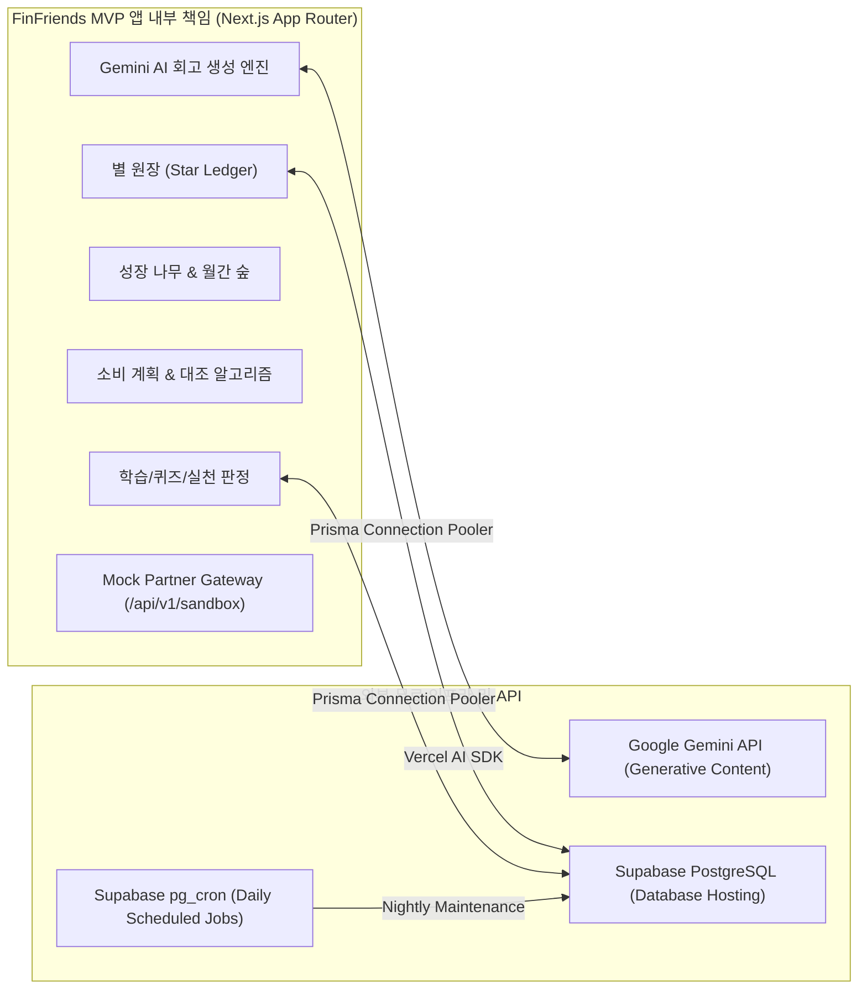

---

# 5. 유스케이스 (Use Cases)

## 5.1 Use Case Diagram

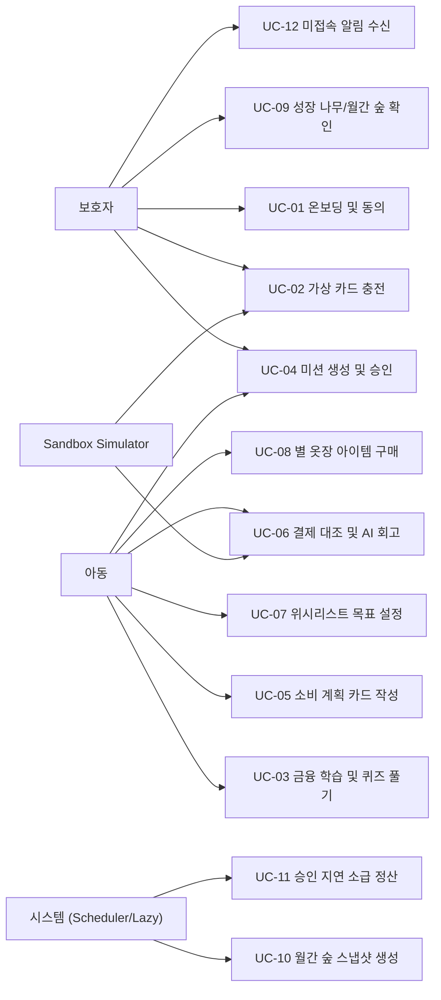

## 5.2 Use Case ↔ 기능 요구사항(REQ) 매핑

| Use Case | 주요 행위자 | 관련 REQ-FUNC | 핵심 처리 방식 |
|---|---|---|---|
| **UC-01 온보딩/동의** | 보호자 | REQ-FUNC-001 | Server Action (`completeOnboardingStep`, `registerConsent`) |
| **UC-02 카드/충전** | 보호자, Sandbox | REQ-FUNC-002, REQ-FUNC-016 | Route Handler (`POST /api/v1/sandbox/topup`) |
| **UC-03 학습/퀴즈** | 아동 | REQ-FUNC-003, REQ-FUNC-010 | Server Action (`submitQuizAnswer`, 별 지급 연동) |
| **UC-04 미션 승인** | 보호자, 아동 | REQ-FUNC-004, REQ-FUNC-011 | Server Action (`createMission`, `approveMission`) |
| **UC-05 소비 계획** | 아동, 보호자 | REQ-FUNC-007 | Server Action (`createPlanCard`) |
| **UC-06 결제 대조/회고** | 아동, Sandbox | REQ-FUNC-008 | Route Handler (`/pay`) + Server Action (`generateAIRetro`) |
| **UC-07 위시리스트 저축** | 아동, 보호자 | REQ-FUNC-013 | Server Action (`saveWishlistAmount`, 부모 용돈 저축액 반영 및 마일스톤 별 지급) |
| **UC-08 별 사용** | 아동 | REQ-FUNC-002, REQ-FUNC-006 | Server Action (`purchaseWardrobeItem`, 잔액 차감 트랜잭션) |
| **UC-09 성장 확인** | 보호자, 아동 | REQ-FUNC-005, REQ-FUNC-009 | React Server Component (RSC) 고속 렌더링 |
| **UC-10 숲 스냅샷** | 시스템 | REQ-FUNC-009, REQ-FUNC-015 | Supabase `pg_cron` / On-demand Lazy Snapshot |
| **UC-11 승인 소급** | 시스템 | REQ-FUNC-011 | Server Action (`backfillDelayedApproval`) |
| **UC-12 미접속 알림** | 시스템, 보호자 | REQ-FUNC-012 | Supabase `pg_cron` + Web Push API / 인앱 알림 |

---

# 6. 상세 기능 요구사항 (Functional Requirements)

## 6.1 REQ-FUNC-001: 보호자 온보딩 및 법정대리인 동의

### 요구사항 정의
시스템은 만 14세 미만 아동의 서비스 이용 전 보호자 본인확인 및 법정대리인 동의 절차를 제공해야 하며, 동의가 완료되지 않은 아동의 서비스 진입을 100% 차단해야 한다 (REG-001).

### Acceptance Criteria
- **AC1:** 5단계 온보딩 중간 이탈 시 직전 단계가 DB에 보존되어야 하며, 재진입 시 재입력 없이 재개되어야 한다.
- **AC2:** 동의 미완료(`PENDING`) 상태인 아동 계정의 모든 도메인 API/페이지 접근은 서버 레벨에서 가드(`redirect('/consent')`)되어야 한다.
- **AC3 (MVP Mock KYC):** 유료 본인인증 API 대신 웹 표준 Web Crypto 기반 가상 OTP 생성 및 인증 플로우를 제공한다.

### Sequence Diagram — REQ-FUNC-001
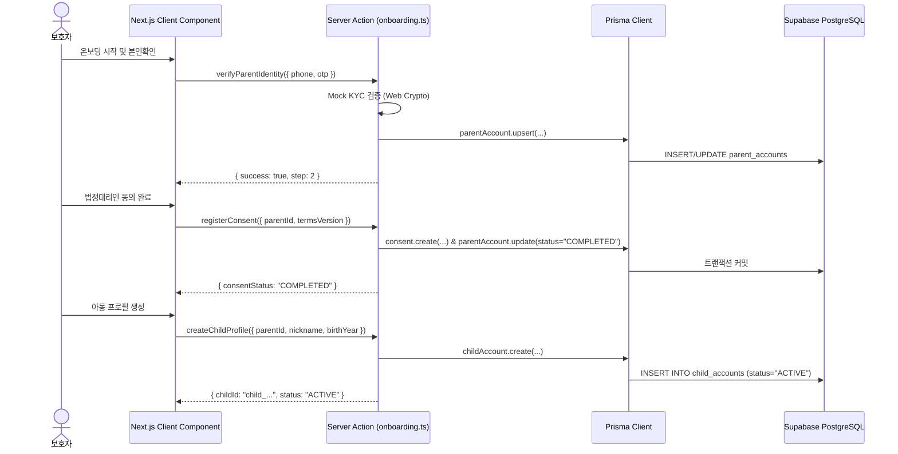

---

## 6.2 REQ-FUNC-002: 별 원장 엔진 (Star Ledger Engine)

### 요구사항 정의
시스템은 아동의 학습 및 실천 행동에 대해 별을 지급/차감하는 불변 원장(Immutable Ledger)을 관리해야 하며, 멱등성(Idempotency)과 잔액 무결성을 보장해야 한다.

### 핵심 비즈니스 불변식
$$\text{balance\_after}_n = \text{balance\_after}_{n-1} + \text{delta}_n \quad (\text{단, } \text{balance\_after}_n \ge 0)$$

### Acceptance Criteria
- **AC1:** 동일한 `idempotencyKey`로 중복 요청 시, 추가 지급 없이 기존 처리 결과를 반환해야 한다.
- **AC2:** 별 잔액은 Prisma Interactive Transaction (`prisma.$transaction`)으로 원장 행 삽입과 잔액 갱신이 단일 원자적으로 실행되어야 한다.
- **AC3:** 별은 현금 잔액과 물리적으로 완전 분리되며 환불/충전/양도가 불가능하다 (REG-005).

### Sequence Diagram — REQ-FUNC-002
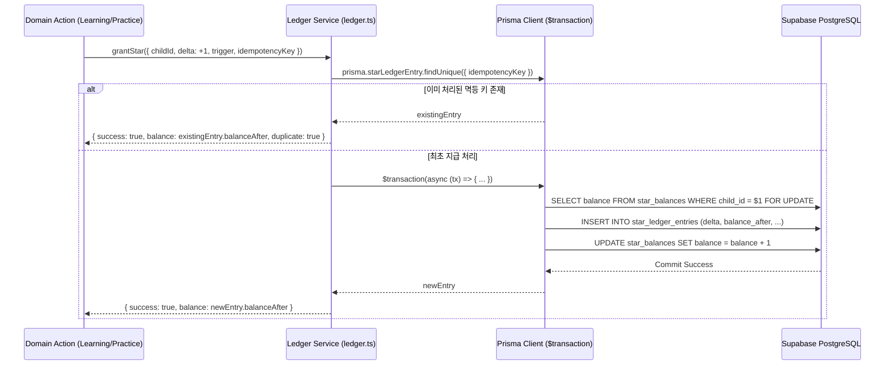

---

## 6.3 REQ-FUNC-003: 금융 학습 4주제 및 퀴즈

### 요구사항 정의
아동에게 4대 핵심 주제(1. 벌기, 2. 쓰기, 3. 모으기, 4. 불리기)의 인터랙티브 콘텐츠와 퀴즈를 제공한다.

### Acceptance Criteria
- **AC1:** '불리기' 영역은 학습 및 퀴즈만 개통하고 금융상품 가입 및 모의투자는 완전 차단한다 (ADR-006, REG-004).
- **AC2:** 퀴즈 정답 제출 시 `REQ-FUNC-002`를 호출하여 별 1개를 즉시 지급한다.
- **AC3:** 학습 별은 WPA(주간 실천 아동 비율) 분자에 산입되지 않는다 (ADR-001, ADR-008).

---

## 6.4 REQ-FUNC-004: 미션 루프 및 실천 승인

### 요구사항 정의
보호자가 미션을 제안하거나 아동이 미션을 수행 완료한 후 보호자가 승인하면 실천 크레딧과 별을 지급한다.

### Acceptance Criteria
- **AC1:** 아동이 미션 완료 보고 시 `state = PENDING_APPROVAL`로 전이된다.
- **AC2:** 보호자 승인 시 `state = APPROVED`로 전이되며 `practice_credits` 1건 생성 및 별 지급이 수행된다.
- **AC3:** 보호자 거절 시 `state = REJECTED`가 되며 별과 실천 크레딧은 지급되지 않는다.

---

## 6.5 REQ-FUNC-005: 성장 나무 (Growth Tree)

### 요구사항 정의
아동의 금융 성장 상태를 **벌기·쓰기·모으기·불리기 4개 영역별 나무**로 나누고, 각 나무를 '새싹(Stage 1) → 묘목(Stage 2) → 어린 나무(Stage 3) → 풍성한 나무(Stage 4)'의 4단계로 시각화하여 제공한다.

### 핵심 승급 규칙
$$\text{영역별 학습 완료} \ge 3 \quad \text{AND} \quad \text{영역별 퀴즈 정답} \ge 5 \quad \text{AND} \quad \text{해당 영역 실천 인정} \ge 1 \implies \text{해당 나무 승급(Stage Up)}$$

### Acceptance Criteria
- **AC1:** 특정 영역의 실천 인정 건수가 0건이면 그 영역의 학습/퀴즈 조건을 아무리 충족해도 해당 나무는 승급되지 않는다.
- **AC1-1:** 기본 성장 화면에는 벌기·쓰기·모으기·불리기 나무 4개가 동시에 표시되고, 각 나무의 영역별 실천 근거와 상태가 구별된다.
- **AC2:** 새로운 사이클 시작 후 14일 미만에는 어떠한 정체(Stall) 판정도 내리지 않는다.
- **AC3:** 14일 경과 후 미충족 조건이 있을 경우, 가장 적게 남은 조건을 UI 최상단에 넛지(Nudge) 메시지로 표시한다.

### Sequence Diagram — REQ-FUNC-005
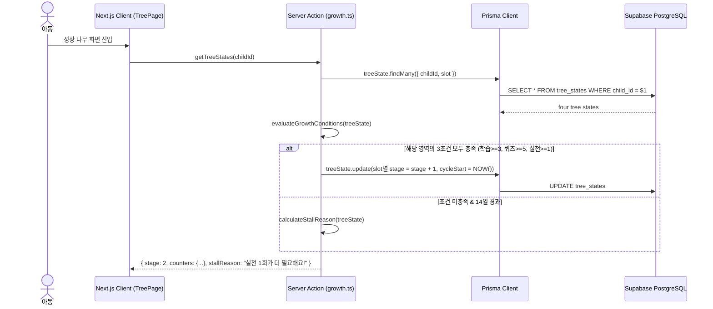

---

## 6.6 REQ-FUNC-006: 아바타 및 별 옷장 (Wardrobe)

### 요구사항 정의
아동이 모은 별을 사용하여 동물 아바타의 의상 및 액세서리를 구매하고 착용할 수 있는 상점을 제공한다.

### Acceptance Criteria
- **AC1:** MVP 1차 납품 기준 동물 아바타 2종(토끼, 다람쥐) 및 의상 4종을 제공한다.
- **AC2:** 별 잔액이 부족한 경우 구매가 원천 차단되며, 구매 성공 시 별 원장에서 즉시 차감(`delta = -N`)된다.
- **AC3:** 아동 얼굴 사진 업로드는 지원하지 않으며 오직 그래픽 아바타만 사용한다 (REG-006).

---

## 6.7 REQ-FUNC-007: 소비 계획 카드 (Spending Plan Card)

### 요구사항 정의
아동이 용돈을 지출하기 전, 지출 장소, 업종, 계획 금액을 사전에 등록하여 생각하는 소비 습관을 기르도록 지원한다.

### Acceptance Criteria
- **AC1:** 필수 입력값은 지출 장소(장소명/가게명), 업종 카테고리(편의점, 문구, 간식 등), 계획 금액(원)이다.
- **AC2:** GPS 위치 권한이나 카메라 권한을 요구하지 않는다 (REG-002).
- **AC3:** 생성된 카드는 `status = PENDING` 상태로 저장되며 만료 시간(기본 72시간)이 부여된다.

---

## 6.8 REQ-FUNC-008: 계획↔실제 대조 및 AI 맞춤 회고 (AI-Native Integration)

### 요구사항 정의
Sandbox 가상 결제 발생 시 소비 계획 카드와 매칭하고, Vercel AI SDK + Gemini API를 활용하여 아동 친화적인 칭찬 및 격려 피드백을 실시간 생성한다.

### 대조 알고리즘 매칭 순서
1. **1단계 (Category Match):** 업종 코드가 일치하고 계획 유효 기간 내의 카드 우선 매칭.
2. **2단계 (Merchant Fallback):** 업종 불일치 시 가맹점명 키워드 유사도 매칭.
3. **3단계 (Amount Fallback):** 최근 미매칭 카드 중 계획 금액이 가장 근접한 카드 매칭.

### 판정 및 AI 회고 분기 규칙
- $\text{실제 결제액} \le \text{계획 금액} \implies \text{별 1개 지급} + \text{plan\_met}=\text{true} + \text{AI 칭찬 피드백}$
- $\text{실제 결제액} > \text{계획 금액} \implies \text{별 미지급} + \text{plan\_met}=\text{false} + \text{AI 격려 및 다음 실천 유도 피드백}$

### Sequence Diagram — REQ-FUNC-008 (AI Pipeline & Fallback)
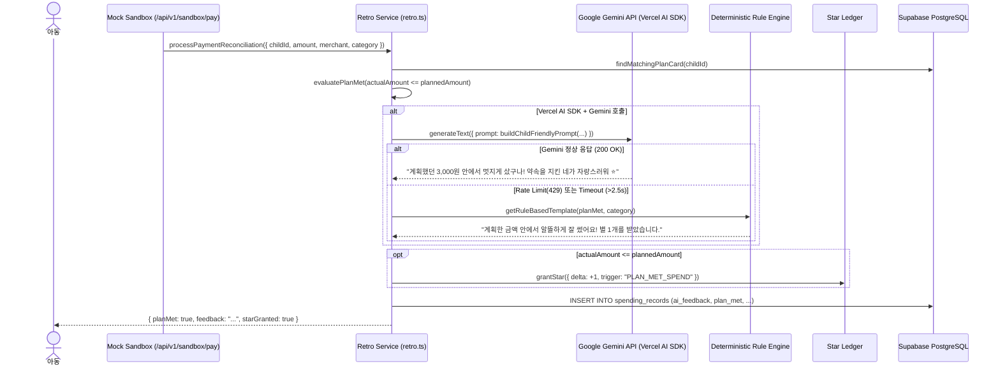

---

## 6.9 REQ-FUNC-009: 월간 숲 (Monthly Forest Report)

### 요구사항 정의
한 달 동안의 금융 실천 기록을 7개 핵심 지표와 함께 숲 형태의 스냅샷으로 종합하여 보호자에게 제시한다.

### 7대 핵심 월간 지표
1. **4영역 단계 현황 (벌기/쓰기/모으기/불리기)**
2. **총 실천 인정 횟수 (Practice Count)**
3. **사려다 멈춘 횟수 (위시리스트 보류 등)**
4. **계획 준수율 (Plan Compliance Rate)**
5. **총 획득 별 개수**
6. **전월 대비 소비 증감액**
7. **월간 WPA 기여도**

---

## 6.10 REQ-FUNC-010: 아이 온보딩 여정

### 요구사항 정의
아동이 처음 앱에 접속했을 때 1분 튜토리얼, 첫 퀴즈 풀기, 첫 온보딩 별 지급, 첫 의상 선물로 이어지는 즉각적인 보상 루프를 제공한다.

---

## 6.11 REQ-FUNC-011: 승인 지연 소급 지급 (Backfill Engine)

### 요구사항 정의
보호자가 아동의 미션 수행 후 48시간 이상 지난 뒤에 승인하더라도, 아동의 실천이 소멸되지 않고 완료 시점의 사이클로 소급 인정되어야 한다.

### Acceptance Criteria
- **AC1:** 승인 시점이 지난 달이더라도 `practice_credits.cycle_id`는 완료 시점의 cycle로 기록된다.
- **AC2:** 소급 승인 시 해당 월의 성장 나무 카운터 및 월간 숲 스냅샷이 즉시 재계산되어 갱신된다.
- **AC3:** 5건 이상의 미승인 미션이 쌓인 경우 보호자 화면에서 '한 번에 모두 칭찬하기(일괄 승인)' 버튼을 제공한다.

---

## 6.12 REQ-FUNC-012: 3일 미접속 알림 (Inactivity Nudge)

### 요구사항 정의
아동이 72시간 동안 앱에 접속하지 않을 경우, 보호자에게 부드러운 넛지 알림을 발송하여 금융 습관이 끊기지 않도록 지원한다.

### Acceptance Criteria
- **AC1:** 마지막 세션 시간(`last_session_at`)으로부터 72시간 경과 시 대상자로 추출된다.
- **AC2 (무비용 알림):** 보호자 화면 진입 시 최상단 배너 및 무료 Web Push API(VAPID)를 통해 발송된다.
- **AC3:** 71시간 59분에 접속한 아동에게는 알림이 발송되지 않아야 한다 (오탐률 0%).

---

## 6.13 ~ 6.18: 기타 기능 요구사항 (REQ-FUNC-013 ~ 018)

- **REQ-FUNC-013 (위시리스트 저축):** 부모가 준 용돈을 저축 기록으로 적립하는 목표를 설정하고, 저축액이 30%, 70%, 100%에 도달할 때마다 마일스톤 별 1개씩 지급한다(중복 지급 금지). 별은 저축액이나 구매대금으로 사용하지 않는다.
- **REQ-FUNC-014 (소비 내역):** 업종별 지출 집계 및 전월 대비 증감 리포트 제공.
- **REQ-FUNC-015 (예적금 가입 중개):** MVP 잠금 (Out of Scope / 법률 검토 완료 전 차단).
- **REQ-FUNC-016 (Mock Sandbox 체험):** 카드 발급 없이 가상 잔액으로 전체 여정 시뮬레이션 지원.
- **REQ-FUNC-017 (별의 옷장 외 목적지):** MVP 잠금 (향후 기부/실물 교환 연동 검토).
- **REQ-FUNC-018 (타사 기록 이전):** Won't Have (MVP 미지원, "오늘부터 시작하는 금융 습관" 프레임 사용).

---

# 7. 기본 다이어그램 (Static & Structural Diagrams)

## 7.1 Class Diagram (Next.js / Prisma Domain Model)

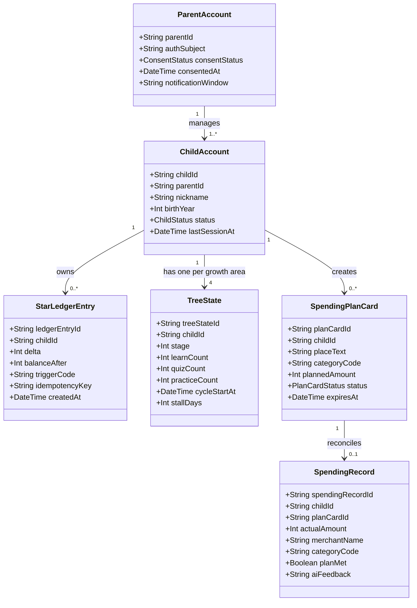

## 7.2 Entity Relationship Diagram (ERD / Prisma Schema Mapping)

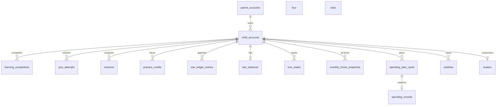

## 7.3 Component Diagram (Next.js App Router Architecture)

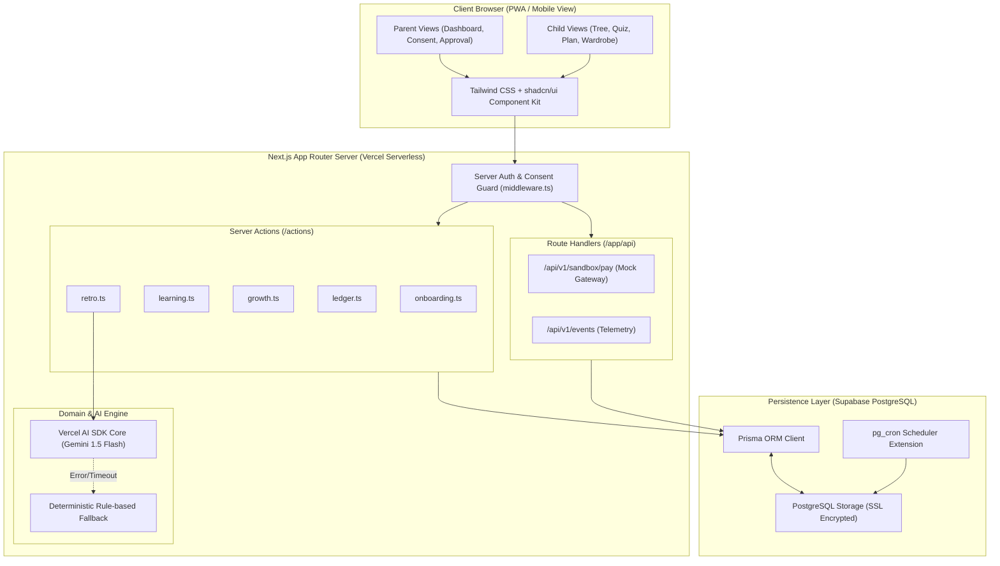

---

# 8. 상태 전이 및 비즈니스 Flow 다이어그램

## 8.1 미션 생명주기 상태 전이 (Mission State Diagram)

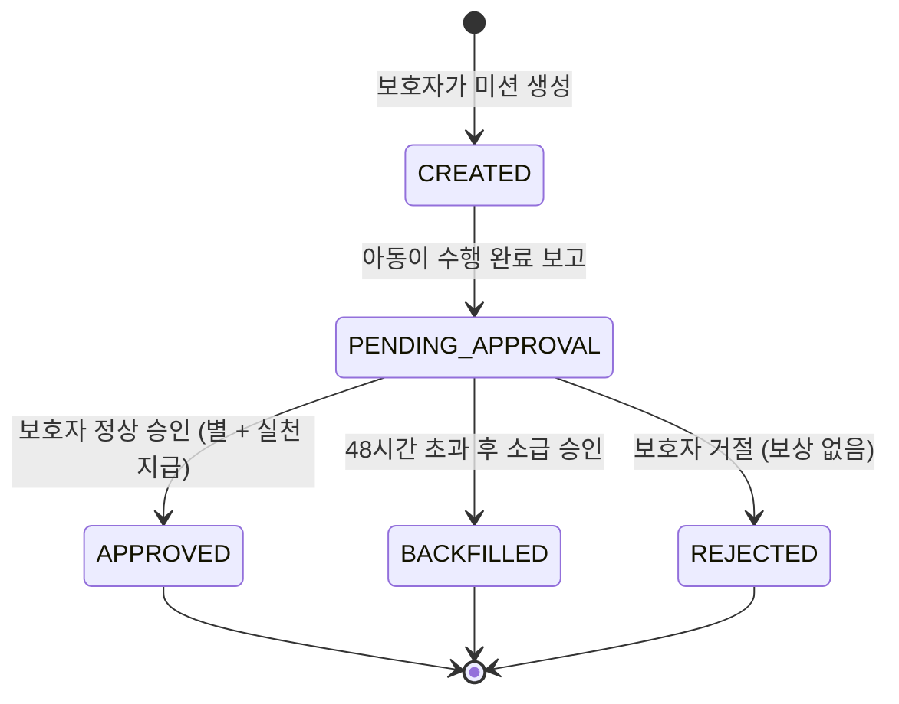

## 8.2 성장 나무 승급 및 정체 판정 논리 Flow

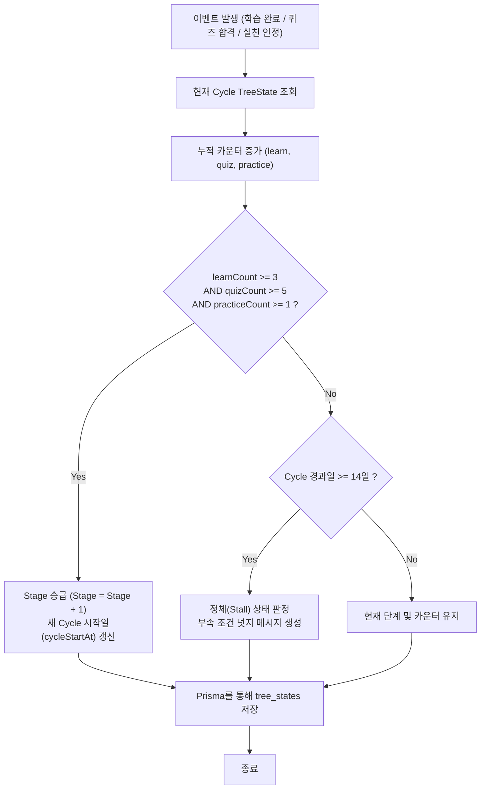

---

# 9. 비기능 요구사항 (Non-Functional Requirements) & 무비용 완화 전략

## 9.1 REQ-NF 명세 및 완화 기준표

| NFR ID | 분류 | 기존 v1.1 목표 | v1.2 현실화 완화 기준 (무료 인프라 최적화) | 측정 이벤트 / 검증 방법 |
|---|---|---|---|---|
| **REQ-NF-001** | 성능 | 성장 나무 p95 ≤ 1,250ms | **Warm 상태 p95 ≤ 800ms / Cold Start 최초 2.5s 이내 (스켈레톤 UI 제공)** | `tree_view_rendered` |
| **REQ-NF-002** | 성능 | 월간 숲 p95 ≤ 2,000ms | **Warm 상태 p95 ≤ 1,200ms / RSC 사전 렌더링** | `forest_view_rendered` |
| **REQ-NF-003** | 성능 | 별 지급 p95 ≤ 800ms | **p95 ≤ 600ms (Prisma `$transaction` 최적화)** | `star_credited` |
| **REQ-NF-004** | 신뢰성 | 별 정합성 오류 0% | **불변식 위반 0건 (DB Unique Key + Ledger Constraint 강제)** | Daily diff query = 0 |
| **REQ-NF-005** | AI/지연 | - (신규) | **AI 회고 생성 타임아웃 2.5s 설정 (초과 시 즉각 룰 템플릿 Fallback)** | `ai_fallback_triggered` |
| **REQ-NF-006** | 가용성 | 월 가용성 ≥ 99.0% | **Vercel + Supabase SLA 준용 (99.0% 이상)** | Uptime Probe Check |
| **REQ-NF-007** | 비용 | 아동당 인프라 월 500원 | **월 인프라 비용 $0 (완전 무료 티어 내 자립 운영)** | Vercel/Supabase 청구서 $0 |
| **REQ-NF-008** | 보안 | 법정대리인 동의 차단 100% | **미동의 사용자 도메인 API 접근 100% 서버 가드 차단 (REG-001)** | E2E Security Test |
| **REQ-NF-009** | 보안 | 위치정보 수집 0건 | **앱 내 Geolocation API 호출 및 스키마 컬럼 0건 (REG-002)** | Static Code Scan |
| **REQ-NF-010** | 보안 | 얼굴 이미지 미수집 | **이미지 바이너리 업로드 엔드포인트 0건 (REG-006)** | API Boundary Test |
| **REQ-NF-011** | 데이터 | DB 연결 고갈 방지 | **Prisma Connection Pooling (Supabase Port 6543 pgbouncer)** | Concurrency Stress Test |
| **REQ-NF-012** | 스케줄러 | 상시 백그라운드 워커 | **Supabase `pg_cron` (일 1회) + 접속 시 Lazy Evaluation 결합** | Cron Execution Log |

---

# 10. 논리 데이터 모델 및 Prisma 스키마 명세

## 10.1 Prisma Schema 매핑 정의

```prisma
datasource db {
  provider  = "postgresql"
  url       = env("DATABASE_URL")
  directUrl = env("DIRECT_URL")
}

generator client {
  provider = "prisma-client-js"
}

enum ConsentStatus {
  PENDING
  COMPLETED
  WITHDRAWN
}

enum ChildStatus {
  PENDING
  ACTIVE
  INACTIVE
}

enum PlanCardStatus {
  PENDING
  MATCHED
  EXPIRED
}

model ParentAccount {
  parentId           String        @id @default(uuid()) @map("parent_id")
  authSubject        String        @unique @map("auth_subject")
  consentStatus      ConsentStatus @default(PENDING) @map("consent_status")
  consentedAt        DateTime?     @map("consented_at")
  notificationWindow String?       @default("09:00-21:00") @map("notification_window")
  createdAt          DateTime      @default(now()) @map("created_at")
  children           ChildAccount[]

  @@map("parent_accounts")
}

model ChildAccount {
  childId        String        @id @default(uuid()) @map("child_id")
  parentId       String        @map("parent_id")
  nickname       String
  birthYear      Int           @map("birth_year")
  status         ChildStatus   @default(PENDING)
  lastSessionAt  DateTime      @default(now()) @map("last_session_at")
  createdAt      DateTime      @default(now()) @map("created_at")

  parent         ParentAccount @relation(fields: [parentId], references: [parentId], onDelete: Cascade)
  starLedger     StarLedgerEntry[]
  starBalance    StarBalance?
  treeStates     TreeState[]
  planCards      SpendingPlanCard[]
  spendingRecords SpendingRecord[]
  wishlists      Wishlist[]
  wishlistDeposits WishlistDeposit[]

  @@map("child_accounts")
}

model StarLedgerEntry {
  ledgerEntryId  String   @id @default(uuid()) @map("ledger_entry_id")
  childId        String   @map("child_id")
  delta          Int
  balanceAfter   Int      @map("balance_after")
  triggerCode    String   @map("trigger_code")
  sourceId       String?  @map("source_id")
  idempotencyKey String   @unique @map("idempotency_key")
  createdAt      DateTime @default(now()) @map("created_at")

  child          ChildAccount @relation(fields: [childId], references: [childId], onDelete: Cascade)

  @@index([childId, createdAt])
  @@map("star_ledger_entries")
}

model StarBalance {
  childId   String   @id @map("child_id")
  balance   Int      @default(0)
  updatedAt DateTime @updatedAt @map("updated_at")

  child     ChildAccount @relation(fields: [childId], references: [childId], onDelete: Cascade)

  @@map("star_balances")
}

model TreeState {
  treeStateId   String   @id @default(uuid()) @map("tree_state_id")
  childId       String   @map("child_id")
  slot          TreeSlot
  stage         Int      @default(1)
  learnCount    Int      @default(0) @map("learn_count")
  quizCount     Int      @default(0) @map("quiz_count")
  practiceCount Int      @default(0) @map("practice_count")
  cycleStartAt  DateTime @default(now()) @map("cycle_start_at")
  stallDays     Int      @default(0) @map("stall_days")

  child         ChildAccount @relation(fields: [childId], references: [childId], onDelete: Cascade)

  @@unique([childId, slot])
  @@map("tree_states")
}

model SpendingPlanCard {
  planCardId    String         @id @default(uuid()) @map("plan_card_id")
  childId       String         @map("child_id")
  placeText     String         @map("place_text")
  categoryCode  String         @map("category_code")
  plannedAmount Int            @map("planned_amount")
  itemText      String?        @map("item_text")
  status        PlanCardStatus @default(PENDING)
  expiresAt     DateTime       @map("expires_at")
  createdAt     DateTime       @default(now()) @map("created_at")

  child         ChildAccount   @relation(fields: [childId], references: [childId], onDelete: Cascade)
  spendingRecord SpendingRecord?

  @@map("spending_plan_cards")
}

model SpendingRecord {
  spendingRecordId String   @id @default(uuid()) @map("spending_record_id")
  childId          String   @map("child_id")
  planCardId       String?  @unique @map("plan_card_id")
  actualAmount     Int      @map("actual_amount")
  merchantName     String   @map("merchant_name")
  categoryCode     String   @map("category_code")
  planMet          Boolean  @map("plan_met")
  aiFeedback       String   @map("ai_feedback")
  createdAt        DateTime @default(now()) @map("created_at")

  child            ChildAccount      @relation(fields: [childId], references: [childId], onDelete: Cascade)
  planCard         SpendingPlanCard? @relation(fields: [planCardId], references: [planCardId])

  @@map("spending_records")
}

model Wishlist {
  wishlistId   String    @id @default(uuid()) @map("wishlist_id")
  childId      String    @map("child_id")
  itemName     String    @map("item_name")
  targetAmount Int       @map("target_amount")
  savedAmount  Int       @default(0) @map("saved_amount")
  paid30       Boolean   @default(false) @map("paid_30")
  paid70       Boolean   @default(false) @map("paid_70")
  paid100      Boolean   @default(false) @map("paid_100")
  createdAt    DateTime  @default(now()) @map("created_at")

  child        ChildAccount @relation(fields: [childId], references: [childId], onDelete: Cascade)
  deposits     WishlistDeposit[]

  @@map("wishlists")
}

model WishlistDeposit {
  depositId     String   @id @default(uuid()) @map("deposit_id")
  wishlistId    String   @map("wishlist_id")
  childId       String   @map("child_id")
  amount        Int
  source        String   @default("PARENT_ALLOWANCE")
  idempotencyKey String  @unique @map("idempotency_key")
  createdAt     DateTime @default(now()) @map("created_at")

  wishlist Wishlist    @relation(fields: [wishlistId], references: [wishlistId], onDelete: Cascade)
  child    ChildAccount @relation(fields: [childId], references: [childId], onDelete: Cascade)

  @@index([childId, createdAt])
  @@map("wishlist_deposits")
}

enum TreeSlot {
  EARN
  SPEND_WELL
  SAVE
  GROW
}
```

---

# 11. 인터페이스 명세 (Server Actions & Route Handlers)

## 11.1 Server Actions (Next.js App Router)

| Action Function | 위치 | 관련 REQ | 설명 |
|---|---|---|---|
| `verifyParentIdentity(dto)` | `actions/onboarding.ts` | 001 | Mock KYC 본인확인 |
| `registerConsent(dto)` | `actions/onboarding.ts` | 001 | 법정대리인 동의 저장 |
| `createChildProfile(dto)` | `actions/onboarding.ts` | 001, 010 | 아동 프로필 생성 |
| `submitQuizAnswer(dto)` | `actions/learning.ts` | 003, 010 | 퀴즈 채점 및 별 지급 |
| `createMission(dto)` | `actions/practice.ts` | 004 | 미션 생성 |
| `approveMission(dto)` | `actions/practice.ts` | 004, 011 | 미션 승인 및 소급 크레딧 |
| `createPlanCard(dto)` | `actions/plan.ts` | 007 | 소비 계획 카드 등록 |
| `generateAIRetro(dto)` | `actions/retro.ts` | 008 | Vercel AI SDK + Gemini 회고 생성 |
| `purchaseWardrobeItem(dto)` | `actions/wardrobe.ts` | 006 | 아바타 옷 구매 (별 차감) |
| `getTreeDashboard(childId)` | `actions/growth.ts` | 005 | 성장 나무 및 정체 상태 조회 |

## 11.2 Route Handlers (Sandbox & External APIs)

| Method | Endpoint | 목적 |
|---|---|---|
| `POST` | `/api/v1/sandbox/topup` | 가상 선불카드 충전 시뮬레이션 |
| `POST` | `/api/v1/sandbox/pay` | 가상 결제 발생 및 계획 대조/회고 트리거 |
| `GET` | `/api/v1/metrics/wpa` | 주간 실천 아동 비율(WPA) 지표 조회 |
| `POST` | `/api/v1/events` | 클라이언트 텔레메트리 이벤트 수집 |

---

# 12. 텔레메트리 및 이벤트 규격

## 12.1 공통 Event Envelope
```json
{
  "eventId": "evt_01J6A7K8M9N0PQ",
  "eventName": "practice_credited",
  "idempotencyKey": "idem_practice_mission_123",
  "childId": "child_abc123",
  "parentId": "parent_xyz789",
  "timestamp": "2026-08-25T17:20:00.000Z",
  "payload": {
    "triggerCode": "MISSION_APPROVED",
    "starDelta": 1,
    "currentBalance": 12,
    "cycleId": "2026-W35"
  }
}
```

---

# 13. 핵심 비즈니스 규칙 (Core Business Rules)

1. **별의 비초기화 원칙:** 별 잔액은 월이 바뀌거나 사이클이 초기화되어도 소멸되지 않는다.
2. **별과 현금의 엄격 분리:** 별은 현금 충전/환급/양도/결제 수단으로 사용할 수 없다 (REG-005).
3. **WPA 산입 기준:** 순수 실천 행동(`practice_credited`: 미션 승인, 계획 준수 지출)만 WPA 분자에 산입되며, 단순 출석/학습 별은 제외된다 (ADR-001).
4. **결제 대조 우선순위:** 업종 카테고리(Category) → 가맹점명(Merchant) → 금액 근사치(Amount) 순으로 매칭한다.
5. **계획 초과 시 불이익 배제:** 계획 금액을 초과하여 소비하더라도 별을 차감(벌점)하지 않으며, 격려 피드백만 제공한다.
6. **14일 정체 보호:** 사이클 시작 14일 이전에는 어떠한 정체 알림이나 부정적 피드백도 생성하지 않는다.
7. **프라이버시 보호:** 위치 좌표(GPS) 및 아동 얼굴 사진은 절대 수집/저장/전송하지 않는다 (REG-002, REG-006).

---

# 14. 규제 준수 및 보안 (Regulatory & Security)

| 규제 코드 | 규제 명칭 및 요구사항 | SRS v1.2 기술적 구현 방안 |
|---|---|---|
| **REG-001** | 만 14세 미만 아동 법정대리인 동의 | Next.js Server Guard를 통해 동의 미완료 아동의 진입을 100% 원천 차단 |
| **REG-002** | 위치정보 보호법 준수 | 브라우저 Geolocation API 미사용, Manifest 권한 0건, DB 컬럼 배제 |
| **REG-003** | 아동 친화적 고지 의무 | 아동 눈높이에 맞춘 쉬운 용어와 일러스트 기반 약관 안내 제공 |
| **REG-004** | 금융상품 중개 금지 | 예적금 가입/계좌 개설 링크 완전 차단 (학습 개념만 제공) |
| **REG-005** | 전자금융거래법상 선불 분리 | 별(Star)은 인앱 포인트로만 작동하며 전자지급수단 잔액과 완전 분리 |
| **REG-006** | 개인정보 최소화 (얼굴 이미지) | 프로필 사진 업로드 금지, 사전 제작된 2D 벡터 동물 아바타만 선택 가능 |
| **REG-007** | 데이터 보존 및 암호화 | Supabase PostgreSQL의 SSL 연결 강제 및 AES-256 저장소 암호화 적용 |

---

# 15. 검증 전략 (Verification & Testing)

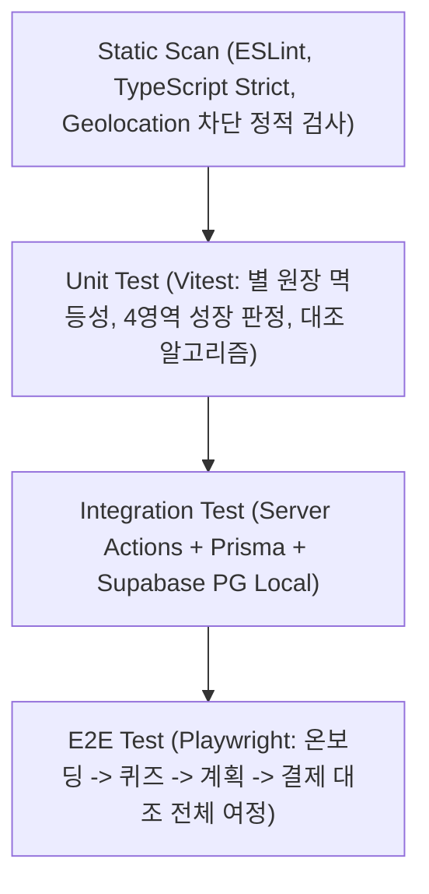

---

# 16. 추적성 매트릭스 (Traceability Matrix)

| PRD 기능 / Story | REQ-FUNC | Server Action / Route | Prisma Model | Diagram | Test Case |
|---|---|---|---|---|---|
| **F1 성장 나무 / US-1** | 005 | `actions/growth.ts` | `TreeState` | Seq-005, Flow-8.3 | `TC-GROWTH-001` |
| **F2 미션 루프 / US-2** | 004 | `actions/practice.ts` | `Mission`, `PracticeCredit` | State-8.1 | `TC-PRACTICE-001` |
| **F3 학습/퀴즈 / US-2** | 003 | `actions/learning.ts` | `LearningCompletion` | Class-7.1 | `TC-LEARN-001` |
| **F4 별 원장 / US-2** | 002 | `actions/ledger.ts` | `StarLedgerEntry`, `StarBalance`| Seq-002 | `TC-LEDGER-001` |
| **F5 아바타 / US-2** | 006 | `actions/wardrobe.ts`| `Avatar` | Class-7.1 | `TC-WARDROBE-001` |
| **F6 아이 온보딩 / US-8** | 010 | `actions/onboarding.ts` | `ChildAccount` | Class-7.1 | `TC-ONBOARD-002` |
| **F7 부모 온보딩 / US-8** | 001 | `actions/onboarding.ts` | `ParentAccount` | Seq-001 | `TC-ONBOARD-001` |
| **F8 소비계획·대조 / US-4**| 007, 008 | `actions/plan.ts`, `retro.ts` | `SpendingPlanCard`, `SpendingRecord` | Seq-008 | `TC-RETRO-001` |
| **F9 월간 숲 / US-1** | 009 | `actions/growth.ts` | `MonthlyForestSnapshot` | ERD-7.2 | `TC-FOREST-001` |
| **F10 승인 소급 / US-6** | 011 | `actions/practice.ts` | `PracticeCredit` | State-8.1 | `TC-BACKFILL-001` |
| **F11 미접속 알림 / US-7**| 012 | `pg_cron` / `actions/noti.ts` | `ChildAccount` | Component-7.3| `TC-NOTI-001` |
| **F12 위시리스트 / US-5** | 013 | `actions/wishlist.ts` | `Wishlist` | ERD-7.2 | `TC-WISHLIST-001` |
| **F13 소비 내역 / US-1** | 014 | `actions/plan.ts` | `SpendingRecord` | ERD-7.2 | `TC-SPEND-001` |

---

# 17. 아키텍처 결정 기록 (Architecture Decision Records)

- **ADR-001:** WPA는 실제 실천 행동(미션 승인, 계획 준수 소비)만 분자에 산입한다.
- **ADR-002:** 행동 변화 시각화는 별(단기) → 나무(중기) → 숲(장기)의 3층 구조를 유지한다.
- **ADR-003:** 위치 기반 자동 개입 대신 사전 소비 계획 카드 방식을 채택한다.
- **ADR-004:** 소비 계획 판정은 금액 준수 여부를 핵심 기준으로 삼는다.
- **ADR-005:** 결제망 및 선불업 연동은 MVP 단계에서 Mock Partner Sandbox로 격리한다.
- **ADR-006:** '불리기' 영역은 학습만 개통하고 금융상품 가입은 차단한다.
- **ADR-007:** 아동 얼굴 사진 수집을 금지하고 사전 렌더링된 2D 벡터 아바타를 사용한다.
- **ADR-008:** 출석/학습 별은 원장에 기록하되 WPA 산정에서는 제외한다.
- **ADR-009 (v1.2 신규):** Next.js App Router 단일 풀스택 및 Server Actions를 채택하여 별도 백엔드 서버 없이 운영 복잡도를 최소화한다.
- **ADR-010 (v1.2 신규):** Vercel AI SDK + Google Gemini 1.5 Flash를 도입하여 개인화된 회고 피드백을 제공하고, 장애 시 결정론적 룰 엔진으로 즉시 Fallback한다.
- **ADR-011 (v1.2 신규):** Supabase `pg_cron`과 지연 평가(Lazy Evaluation)를 결합하여 상시 서버 없이 $0 무료 인프라 배치를 구축한다.
- **ADR-012 (v1.2 신규):** 내장형 Route Handler 기반 Mock Sandbox를 제공하여 실제 카드사 계약 없이 전체 결제/충전 여정을 테스트한다.
- **ADR-013 (v1.2 신규):** Tailwind CSS + shadcn/ui 기반으로 아동용 Fun 테마와 보호자용 Clean 테마를 단일 디자인 시스템으로 구현한다.

---

# Appendix. v1.2 최종 Quality Gate 및 서명

- [x] Next.js App Router 단일 풀스택 아키텍처 매핑 완료
- [x] Prisma Schema 및 Supabase PostgreSQL 데이터 모델 1:1 동기화
- [x] Vercel AI SDK + Gemini API 파이프라인 및 Fallback 룰 엔진 정의
- [x] 완전 무료($0) 인프라 제약 완화 전략(Mock Sandbox, pg_cron, Lazy Evaluation) 반영
- [x] REQ-FUNC 18건 및 REG 9건, Traceability Matrix 100% 무결성 검증
- [x] ISO/IEC/IEEE 29148:2018 요구사항 정보 항목 준수

**작성 및 승인:** 리드 PM & 솔루션 아키텍트 (2026-08-25)
