# 핀프렌즈(FinFriends) 기술 설계 문서

- **문서명:** FinFriends Technical Design Specification
- **문서 ID:** TDS-FINFRIENDS-MVP-001
- **버전:** 1.0
- **작성일:** 2026-08-25
- **기준 문서:** [`docs/02-srs/srs.md`](../02-srs/srs.md)
- **설계 원칙:** SRS에 명시된 요구사항·제약·ADR을 구현 가능한 구조로 구체화하되, SRS에 없는 세부 구현은 본 문서에서 `설계 제안`으로 구분한다.

---

## 0. 문서 읽는 법

이 문서는 개발자가 SRS의 문장을 다시 해석하지 않고도 MVP의 구조와 핵심 흐름을 이해할 수 있도록 작성한다.

| 표기 | 의미 |
|---|---|
| **[SRS]** | SRS에 직접 명시된 요구사항/제약 |
| **[DERIVED]** | SRS의 요구사항으로부터 논리적으로 도출한 설계 |
| **[PROPOSED]** | 구현 편의를 위해 제안하는 기술적 선택. 팀 합의 필요 |
| **[OPEN]** | 구현 전 확정해야 하는 사항 |

### 0.1 핵심 설계 결정 요약

1. 보호자 계정은 아동 계정의 상위 계정이며, 법정대리인 동의가 완료되기 전에는 아동 화면에 진입할 수 없다.
2. 선불전자지급수단의 발행·충전금·카드·결제 원장은 제휴사가 소유하고 FinFriends는 Partner Gateway를 통해 필요한 정보만 소비한다.
3. 별(Star)은 별도 원장으로 관리하며 모든 지급/차감은 멱등성을 가져야 한다.
4. `별 ↔ 저금통` 간 전환 필드나 전환 함수는 두지 않는다.
5. 위치정보는 애초에 스키마·권한·네트워크 인터페이스에 존재하지 않도록 설계한다.
6. `계획 카드 → 결제 원장 → 매칭 → 회고 → 실천 인정 → 별 지급/나무 갱신`은 핵심 도메인 흐름이다.
7. 성장 나무와 월간 숲은 별 잔액과 분리한다.
8. 실천 트리거는 MVP 기준 미션·소비 회고·위시리스트 세 경로만 WPA에 포함한다.
9. 보호자 승인 지연은 실패가 아니라 정상적인 비동기 상태로 취급하고, 완료 시점과 지급 시점을 분리한다.
10. 분석 이벤트는 `idempotency_key`, `client_ts`, `server_ts`를 필수화하고 KST/ISO 주 기준으로 집계한다.

---

# 1. 설계 범위와 시스템 목표

## 1.1 제품 구조

FinFriends MVP는 다음 세 개의 사용자 가치 층을 분리한다.

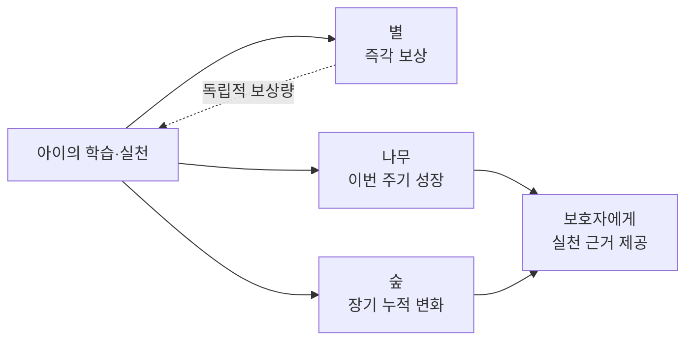

- **별:** 양적/즉각적 보상. 주기 초기화 없음.
- **나무:** 현재 주기의 질적 성장. 영역별 조건 충족 여부를 보여줌.
- **숲:** 장기 누적 증거. 전월 대비 변화를 보여줌.

**[SRS]** 이 세 층을 분리하는 목적은 별을 많이 받은 달이 곧 성장한 달로 오인되는 문제를 방지하는 것이다.

## 1.2 시스템 경계

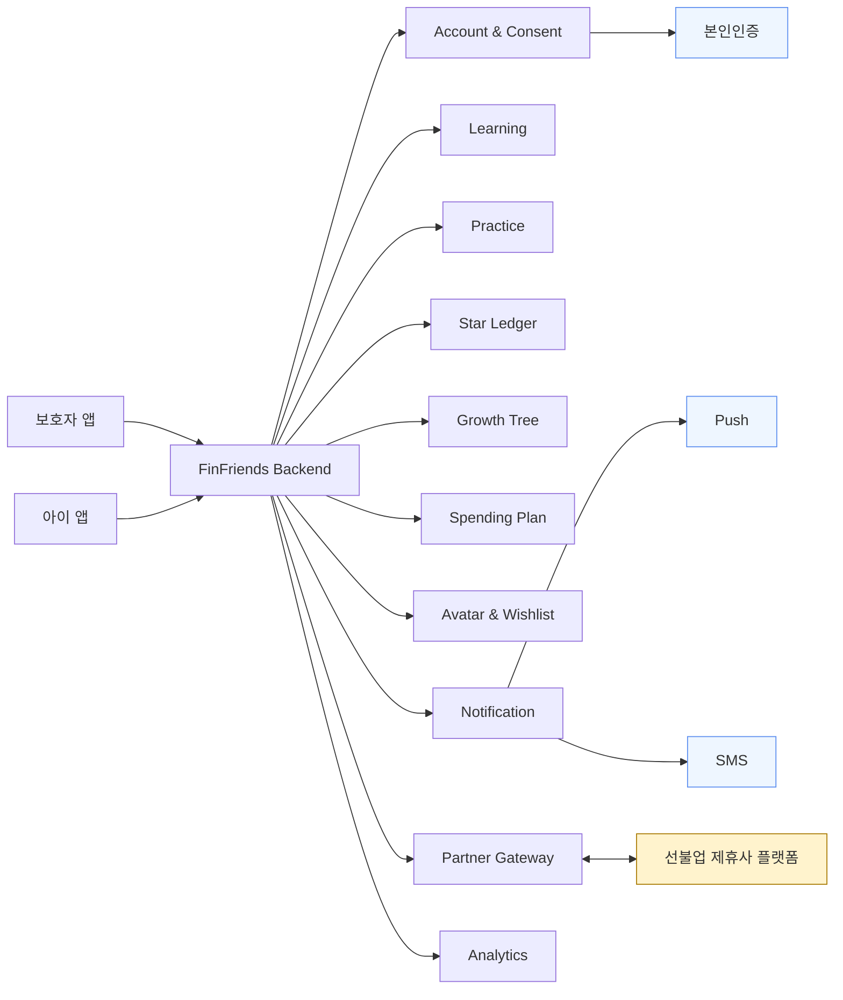

### 1.2.1 시스템이 소유하는 것

- 브랜드와 앱 UX
- 보호자/아동 계정 및 관계
- 법정대리인 동의 상태
- 학습 콘텐츠/퀴즈
- 미션/실천 판정
- 계획 카드
- 회고 문장
- 별 원장
- 성장 나무
- 월간 숲
- 아바타/옷장/위시리스트
- KPI 이벤트 및 집계

### 1.2.2 시스템이 소유하지 않는 것

- 선불전자지급수단 발행
- 충전금 별도관리
- 카드 발행
- 가맹점망
- 실제 결제 원장의 최종 권위
- 제휴사의 이용한도/업종 정책

---

# 2. 사용자와 권한 모델

## 2.1 Actor 정의

| Actor | 핵심 권한 |
|---|---|
| 보호자 | 온보딩, 법정대리인 동의, 카드 발급, 충전, 미션 승인, 성장 확인, 계획 카드 작성, 알림 설정 |
| 아동 | 학습, 퀴즈, 미션 확인, 계획 카드 작성, 소비 회고, 아바타/옷장, 위시리스트 |
| 시스템 | 자동 실천 판정, 별 지급, 나무 계산, 숲 집계, 미접속 판정, 이벤트 적재 |
| 제휴사 | 카드/결제/충전/환불 인프라 및 거래 원장 제공 |
| 운영자 | 모니터링, 배포, 장애 대응 |
| 정책 담당 | 규제 게이트와 금지 경계 검증 |

## 2.2 권한 관계

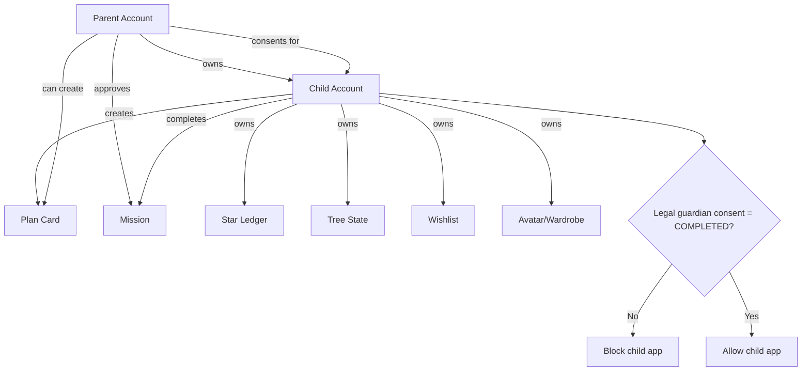

### 2.2.1 접근 제어 불변식

```text
child_app_access == true
IFF
parent.legal_consent_status == COMPLETED
AND
child.status == ACTIVE
```

이 조건은 UI에서만 검사하면 안 된다. API Gateway/Account & Consent Service에서도 검사해야 한다.

---

# 3. 주요 Use Case

## 3.1 Use Case 목록

| ID | Use Case | Actor | 핵심 결과 |
|---|---|---|---|
| UC-01 | 보호자 온보딩/동의 | 보호자 | 법정대리인 동의 완료 및 아동 계정 활성화 |
| UC-02 | 카드 발급/충전 | 보호자 | 제휴사에서 카드/충전 처리 |
| UC-03 | 금융 학습/퀴즈 | 아동 | 학습 이력과 퀴즈 결과 저장 |
| UC-04 | 미션 수행/승인 | 아동/보호자 | 실천 인정 및 별 지급 |
| UC-05 | 소비 계획 작성 | 아동/보호자 | 결제 전 계획 데이터 생성 |
| UC-06 | 결제↔계획 대조 | 시스템/아동 | 소비 매칭 및 회고 분기 |
| UC-07 | 위시리스트 달성 | 아동 | 목표 진척에 따른 실천 인정 |
| UC-08 | 별 사용 | 아동 | 옷장 아이템 구매 및 별 차감 |
| UC-09 | 성장 나무 확인 | 보호자 | 영역별 단계/근거/정체 원인 확인 |
| UC-10 | 월간 숲 확인 | 보호자 | 전월 대비 장기 성장 확인 |
| UC-11 | 승인 지연 소급 | 시스템 | 지연된 미션도 완료 시점 기준으로 반영 |
| UC-12 | 3일 미접속 알림 | 시스템/보호자 | 보호자에게 아이의 활동 중단 신호 전달 |
| UC-13 | 해지/환불 | 보호자/제휴사 | 카드 해지 및 전액 환불 |
| UC-14 | WPA 집계 | 배치 시스템 | 주간 WPA 산출 |

## 3.2 UC-01 보호자 온보딩/동의

**Precondition**
- 보호자는 미가입 상태다.

**Main Flow**
1. 보호자가 가입한다.
2. 본인인증을 완료한다.
3. 온보딩 5단계를 순차적으로 진행한다.
4. 앱은 각 단계 완료 상태를 저장한다.
5. 법정대리인 동의를 받는다.
6. 동의 상태를 서버에 확정 저장한다.
7. 아동 계정을 생성한다.
8. 아이 앱 진입을 허용한다.

**Alternative / Exception**
- 본인인증 API 실패 → 입력값 임시 보존, 재진입 가능
- 세션 만료 → 마지막 완료 단계부터 재개
- 동의 미완료 → 아이 앱 진입 차단

## 3.3 UC-04 미션 수행/승인

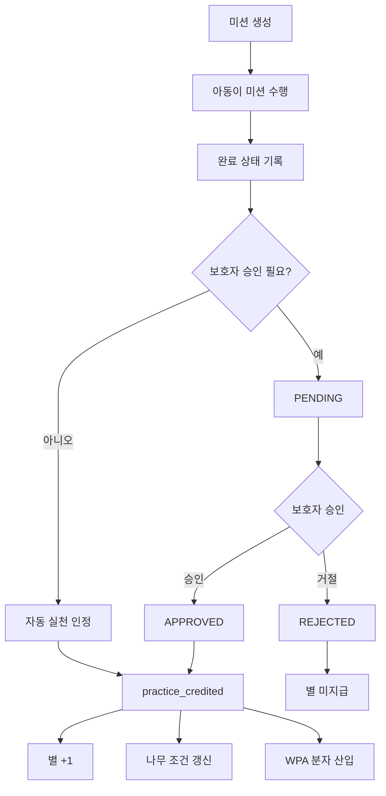

## 3.4 UC-06 결제↔계획 대조

핵심 규칙:

```text
계획 카드가 존재
    ↓
제휴사 결제 원장 수신
    ↓
1차: 업종 코드 매칭
    ↓ 실패
2차: 가맹점명 매칭
    ↓ 실패
3차: 금액 단독 폴백
    ↓
실제 금액 ≤ 계획 금액?
 ├─ YES → 별 +1, 회고 분기
 └─ NO  → 별 미지급/미차감, 회고만
```

업종이 달라도 금액을 지켰다면 별은 지급한다. 업종 차이는 관측 데이터와 회고 문장 분기에 사용한다.

## 3.5 UC-09 성장 나무

성장 나무 단계 조건:

```text
학습 3회
AND
퀴즈 정답 5개
AND
실천 1회 이상
      ↓
승급 가능
```

실천 0건이면 학습·퀴즈가 충분해도 승급하지 않는다.

---

# 4. Domain Model

## 4.1 핵심 Aggregate

### Account Aggregate
- Parent
- Child
- Consent
- OnboardingProgress

### Learning Aggregate
- Curriculum
- Topic
- Quiz
- LearningCompletion

### Practice Aggregate
- Mission
- PracticeCredit
- ApprovalState

### Reward Aggregate
- StarLedger
- StarLedgerEntry

### Growth Aggregate
- TreeState
- MonthlyForestSnapshot

### Spending Aggregate
- SpendingPlanCard
- SpendingRecord
- Reconciliation
- RetroSentence

### Avatar Aggregate
- Avatar
- WardrobeItem
- Wishlist

### Integration Aggregate
- PartnerCard
- PartnerTransaction
- RefundRequest
- PartnerPolicy

---

# 5. ERD

## 5.1 논리 ERD

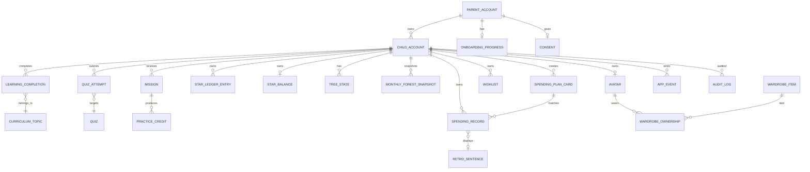

## 5.2 테이블 상세

### parent_accounts

| 필드 | 타입 예시 | 설명 | 제약 |
|---|---|---|---|
| parent_id | UUID | 보호자 PK | PK |
| auth_subject | VARCHAR | 인증 주체 ID | UNIQUE |
| legal_name | ENCRYPTED | 본인 정보 | 암호화 저장 |
| consent_status | ENUM | 동의 상태 | 필수 |
| consented_at | TIMESTAMP | 동의 시각 | null 허용 |
| notification_window_start | TIME | 알림 시작 | |
| notification_window_end | TIME | 알림 종료 | |
| push_permission | ENUM | 푸시 권한 | |
| created_at | TIMESTAMP | 생성 시각 | |

### child_accounts

| 필드 | 타입 예시 | 설명 |
|---|---|---|
| child_id | UUID | PK |
| parent_id | UUID | 보호자 FK |
| birth_year | SMALLINT | 생년 |
| device_type | ENUM | 참고용 장치 유형 |
| status | ENUM | PENDING/ACTIVE/INACTIVE |
| created_at | TIMESTAMP | 생성 시각 |

**[SRS]** 아동 식별정보와 학습/실천 데이터는 물리적으로 분리하고 조인 키만 보유한다.

### learning_completions

- completion_id
- child_id
- topic_id
- completed
- completed_at
- quiz_correct_count
- cycle_id

### practice_credits

- practice_credit_id
- child_id
- practice_path
- source_id
- credited_at
- awarded_at
- approval_mode
- delay_hours
- cycle_id
- tree_slot
- idempotency_key

`practice_credited` 이벤트의 원천 데이터다.

### star_ledger

별 원장은 append-only 성격을 권장한다.

- ledger_entry_id
- child_id
- delta
- balance_after
- trigger_code
- source_type
- source_id
- idempotency_key
- created_at

**[PROPOSED]** 현재 잔액은 빠른 조회를 위해 별도 projection(`star_balances`)으로 유지하고, 원장을 source of truth로 둔다.

### tree_states

- tree_state_id
- child_id
- slot
- stage
- learn_count
- quiz_count
- practice_count
- cycle_start_at
- last_progress_at
- stall_days
- updated_at

### monthly_forest_snapshots

- snapshot_id
- child_id
- year_month
- earn_stage
- spend_well_stage
- save_stage
- grow_stage
- aggregate_counts
- delta_json
- total_earned_stars
- created_at

### spending_plan_cards

- plan_card_id
- child_id
- created_by_type
- created_by_id
- place_text
- category_code
- planned_amount
- item_text
- status
- expires_at
- created_at

### spending_records

- spending_record_id
- child_id
- plan_card_id nullable
- partner_transaction_id
- actual_amount
- merchant_name
- category_code
- match_method
- plan_met
- category_met
- retro_status
- retro_sentence_id
- settled_at

### retro_sentence_pool

- sentence_id
- branch
- text
- active
- usage_count
- last_used_at

비복원 추출을 위해 사용 이력을 관리한다.

### wishlists

- wishlist_id
- child_id
- item_name
- target_amount
- saved_amount
- progress_rate
- paid_30
- paid_70
- paid_100
- completed_at

### app_events

- event_id
- event_name
- child_id nullable
- parent_id nullable
- idempotency_key
- client_ts
- server_ts
- payload_json
- event_date
- week_key

파티셔닝 키로 `event_date` 또는 `week_key`를 사용할 수 있다.

### audit_logs

- audit_id
- actor_id
- actor_type
- action
- target_type
- target_id
- before_json
- after_json
- request_id
- created_at

보존 대상에는 별 원장, 동의 상태, 결제 원장 변경 이력이 포함된다.

---

# 6. 데이터 무결성 규칙

## 6.1 별 원장 불변식

```text
balance_after(n)
=
balance_after(n-1) + delta(n)
```

그리고 모든 ledger entry에는 유일한 `idempotency_key`가 존재해야 한다.

동일 키로 재요청하면:
- 새로운 원장 행 생성 금지
- 기존 결과 반환

## 6.2 별과 현금성 잔액의 분리

```mermaid
flowchart LR
    STAR["Star Ledger"] X-->|전환 금지| CASH["Partner Prepaid Balance"]
```

별은 FinFriends의 게임/학습 보상 데이터이며 제휴사 현금 잔액과 별개의 도메인이다.

## 6.3 위치정보 금지

다음 세 계층에서 모두 방어한다.

1. 앱 Manifest: 위치 권한 없음
2. Backend Schema: 좌표 컬럼 없음
3. CI/Static Scan: `latitude`, `longitude`, geolocation 관련 금지 패턴 검사

---

# 7. CLD (Context Level Diagram)

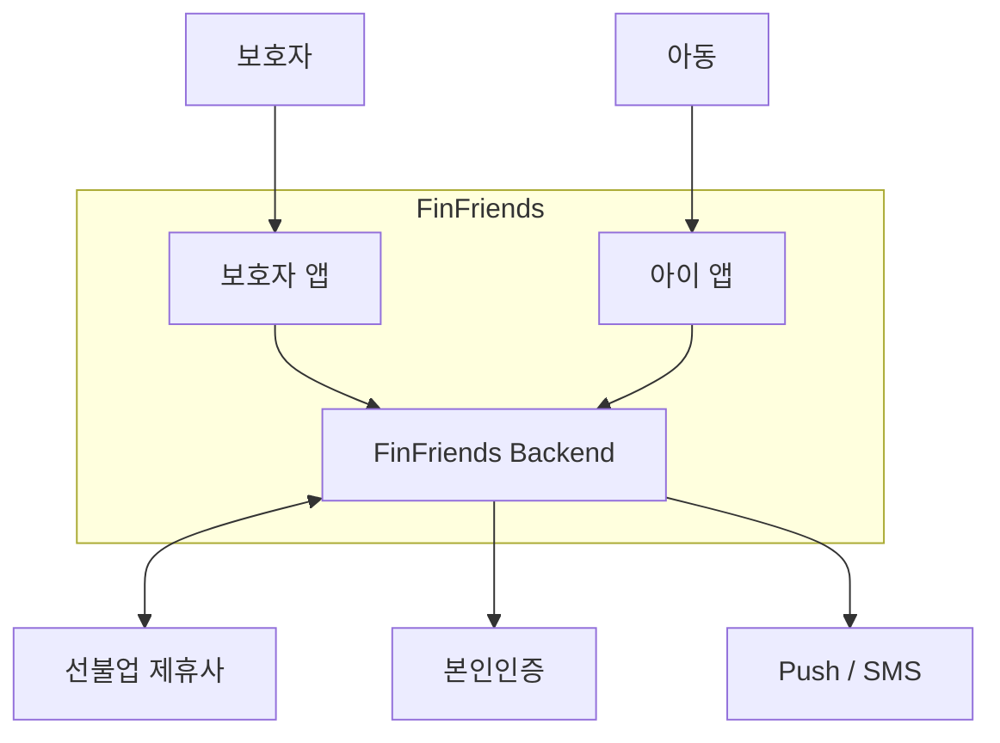

### 7.1 Context 주요 데이터 흐름

| From | To | 데이터 |
|---|---|---|
| 보호자 | FinFriends | 가입, 동의, 충전 요청, 승인, 조회 |
| 아동 | FinFriends | 학습, 퀴즈, 미션, 계획, 회고, 위시리스트 |
| FinFriends | 제휴사 | 카드 발급, 충전, 거래 조회, 해지/환불 |
| 제휴사 | FinFriends | 결제 시각, 금액, 가맹점명, 업종 코드 |
| FinFriends | 알림 채널 | 미접속 알림 |
| 본인인증 | FinFriends | 인증 결과 |

---

# 8. Component Diagram

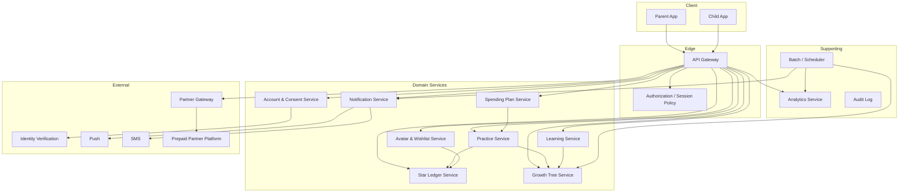

## 8.1 컴포넌트 책임

| Component | 책임 | 소유 데이터 |
|---|---|---|
| Account & Consent | 계정/관계/동의/온보딩 | Parent, Child, Consent |
| Learning | 학습/퀴즈 | Curriculum, Completion, QuizAttempt |
| Practice | 실천 판정/승인/소급 | Mission, PracticeCredit |
| Star Ledger | 별 지급/차감 | Ledger, Balance |
| Growth Tree | 나무/숲 | TreeState, ForestSnapshot |
| Spending Plan | 계획/결제매칭/회고 | PlanCard, SpendingRecord, Sentence |
| Avatar & Wishlist | 아바타/옷장/목표 | Avatar, Wardrobe, Wishlist |
| Notification | 미접속 알림 | NotificationDelivery |
| Partner Gateway | 외부 결제 API Adapter | Integration metadata |
| Analytics | 이벤트/KPI | AppEvent, KPI |

---

# 9. 서비스 간 의존성과 호출 원칙

## 9.1 원칙

- 도메인 서비스는 다른 서비스의 DB를 직접 조회하지 않는다.
- 서비스 간 상태 변경은 API 또는 이벤트를 사용한다.
- 별 지급은 Star Ledger Service 단일 책임으로 통합한다.
- Practice Service가 별 지급을 직접 쓰지 않는다.
- Growth Tree Service가 별 원장을 직접 수정하지 않는다.
- Partner Gateway만 제휴사 API의 외부 포맷을 안다.

## 9.2 동기/비동기 구분

| 흐름 | 방식 | 이유 |
|---|---|---|
| 동의 게이트 | 동기 | 즉시 차단 판단 필요 |
| 카드 발급 | 동기+외부 API | 사용자 완료 피드백 필요 |
| 퀴즈 채점 | 동기 | 즉시 결과 필요 |
| 미션 승인 | 동기 명령 + 비동기 후처리 가능 | 별/나무 갱신 연계 |
| 결제 매칭 | 비동기 권장 | 제휴사 원장 지연 수신 가능 |
| 월간 숲 | 배치 | 누적 집계 |
| 3일 미접속 알림 | 배치 | 72시간 주기 판정 |
| WPA | 배치 D+1 | ISO 주 종료 후 집계 |

---

# 10. 핵심 Sequence Diagram

## 10.1 온보딩 → 동의 → 아동 계정 생성

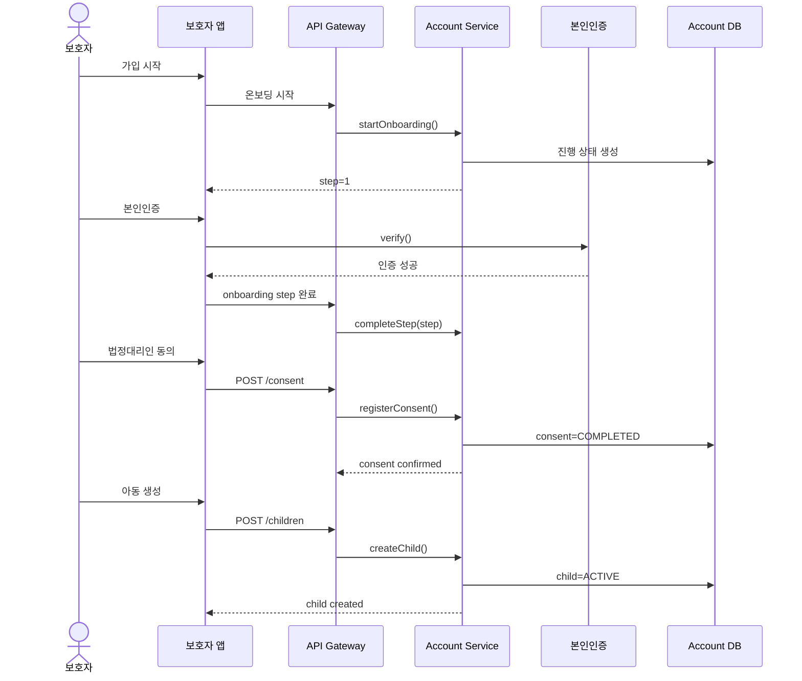

## 10.2 동의 미완료 아이 앱 진입

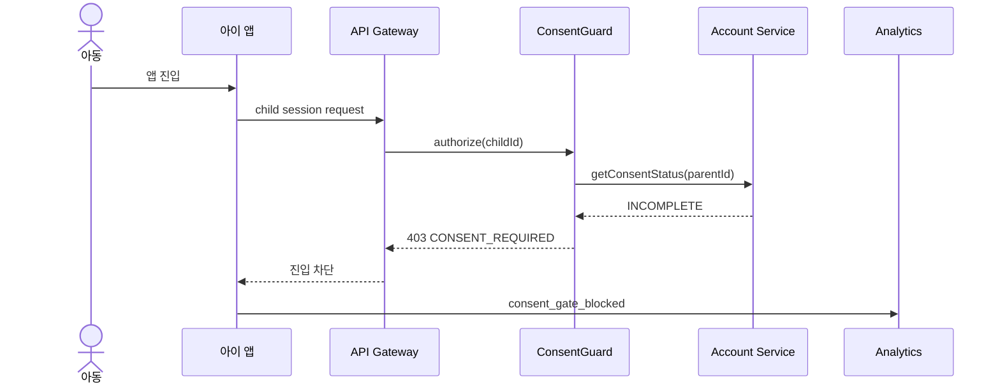

## 10.3 미션 승인 → 소급 지급

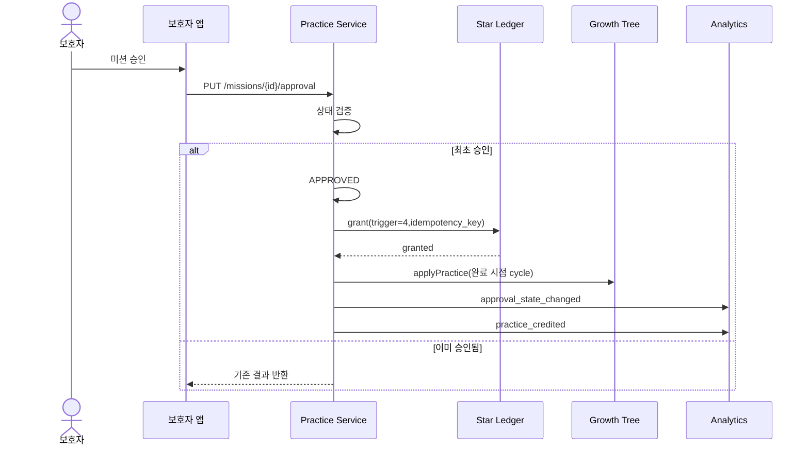

## 10.4 결제 원장 → 계획 대조 → 회고 → 별

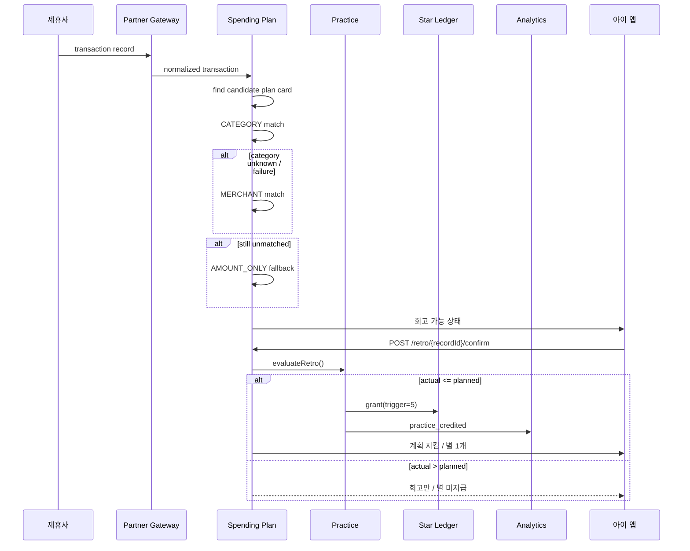

## 10.5 3일 미접속 알림

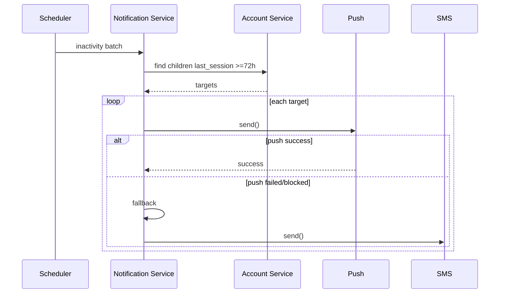

## 10.6 WPA 배치

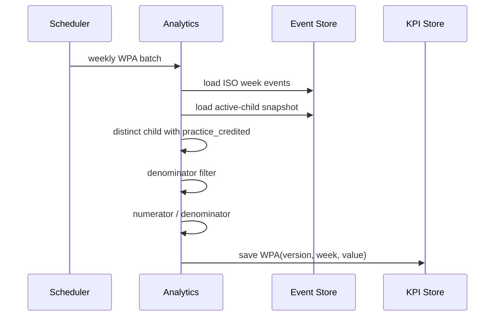

---

# 11. 상태 모델

## 11.1 Mission Approval State

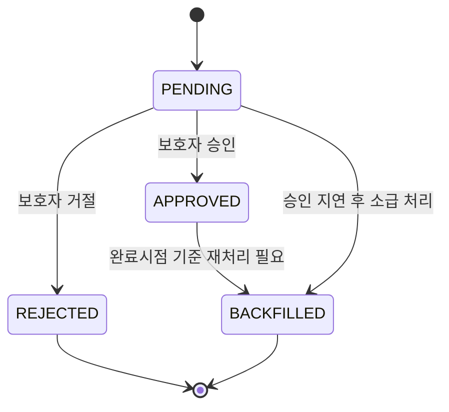

`REJECTED`는 실천 인정과 별 지급을 발생시키지 않는다.

## 11.2 Plan Card State

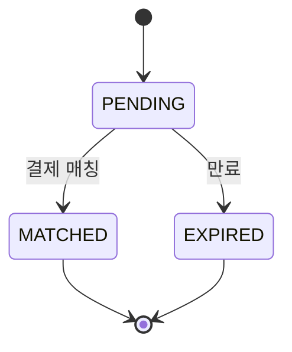

## 11.3 Tree State

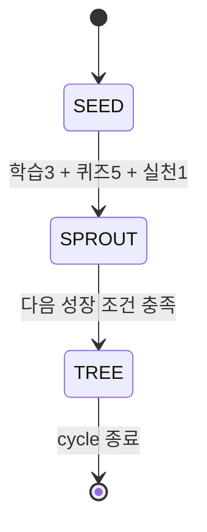

**[OPEN]** SRS에는 2단계 이후의 추가 수치 조건이 명시되지 않았다. MVP에서는 3단계 고정이라고 정의되었으므로 `SEED → SPROUT → TREE` 외 세부 승급 수식은 개발 착수 전에 확정해야 한다.

---

# 12. Flow Chart: 소비 계획과 회고

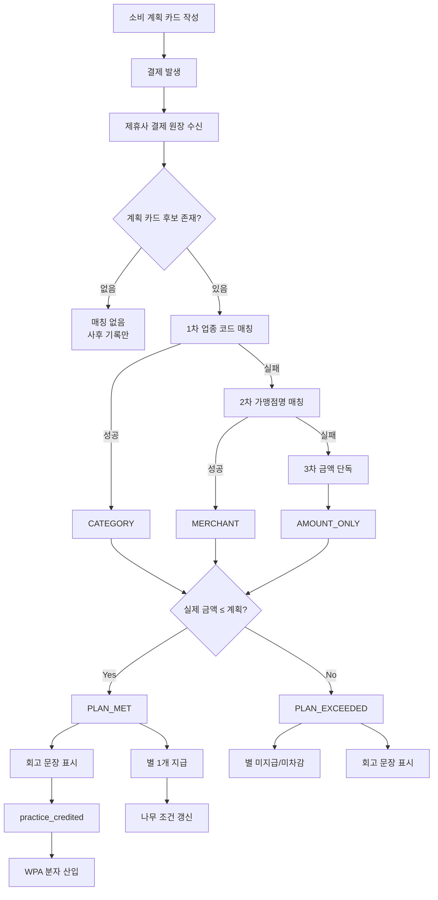

---

# 13. Flow Chart: 성장 나무 갱신

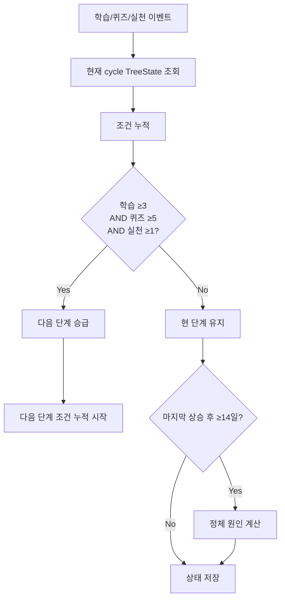

정체는 cycle 시작 후 14일 미만에는 발생하지 않는다.

---

# 14. Plan–Payment Reconciliation 설계

## 14.1 매칭 우선순위

```text
CATEGORY
  ↓
MERCHANT
  ↓
AMOUNT_ONLY
```

각 매칭 방식을 별도로 집계한다.

## 14.2 후보 계획 카드 선택

**[PROPOSED]**

1. `child_id` 일치
2. 결제 시각이 카드의 유효 기간 내
3. 카드 상태가 `PENDING`
4. 금액 차이가 가장 작은 후보 우선
5. 동률이면 생성 시각이 가장 가까운 카드

```pseudo
candidateCards =
  cards.where(child_id = childId)
       .where(status = PENDING)
       .where(expires_at >= payment.settled_at)

candidate = rank(candidateCards,
    by = [categoryExact,
          merchantSimilarity,
          abs(plannedAmount - actualAmount),
          createdAtNearest]
).first()
```

## 14.3 금액 기준 판정

```pseudo
planMet = actualAmount <= plannedAmount
categoryMet = categoryCode == plannedCategoryCode
```

- `planMet=true` → 별 1개
- `planMet=false` → 별 지급 없음
- `categoryMet=false AND planMet=true` → 별 지급 + 업종 불일치 회고

---

# 15. Star Ledger 설계

## 15.1 Trigger Matrix

| Trigger | 코드 | 별 | 자동 | WPA |
|---|---:|---:|---|---|
| 온보딩 학습 | 1 | +1 | Yes | No |
| 출석 | 2 | +1 | Yes | No |
| 퀴즈 정답 | 3 | +1 | Yes | No |
| 미션 승인 | 4 | +1 | Parent | Yes |
| 소비 회고 | 5 | +1 | Auto | Yes |
| 위시리스트 | 6 | +1 | Auto | Yes |
| 예적금 | 7 | MVP Lock | Auto | v2 |
| 예적금 | 8 | MVP Lock | Auto | v2 |

## 15.2 Ledger Write Algorithm

```pseudo
function grantStar(childId, triggerCode, sourceId, idempotencyKey):
    existing = ledger.findByIdempotencyKey(idempotencyKey)

    if existing != null:
        return existing.result

    begin transaction:
        balance = balanceRepo.lock(childId)

        entry = ledger.insert(
            childId=childId,
            delta=1,
            triggerCode=triggerCode,
            sourceId=sourceId,
            idempotencyKey=idempotencyKey,
            balanceAfter=balance + 1
        )

        balanceRepo.update(childId, balance + 1)

    commit

    emit star_ledger_entry
    return entry
```

### 15.2.1 반드시 보장할 것

- 동일 `idempotency_key`에 원장 1건 이하
- 잔액과 ledger 합계 일치
- 차감 시 잔액 음수 여부 정책 확인
- 부분 성공 시 rollback
- 재시도 가능한 API

---

# 16. API 설계

## 16.1 API 목록

| Method | Endpoint | 주요 책임 |
|---|---|---|
| POST | `/api/v1/parents/{parentId}/consent` | 법정대리인 동의 |
| GET | `/api/v1/parents/{parentId}/onboarding` | 온보딩 조회 |
| PUT | `/api/v1/parents/{parentId}/onboarding/{step}` | 단계 완료 |
| POST | `/api/v1/children` | 아동 생성 |
| GET | `/api/v1/children/{childId}/curriculum` | 학습 진도 |
| POST | `/api/v1/children/{childId}/quiz/{topicId}/submit` | 퀴즈 제출 |
| POST | `/api/v1/children/{childId}/missions` | 미션 생성 |
| PUT | `/api/v1/missions/{missionId}/approval` | 승인/거절 |
| POST | `/api/v1/parents/{parentId}/missions/bulk-approval` | 일괄 승인 |
| GET | `/api/v1/children/{childId}/stars` | 별 잔액/원장 |
| POST | `/api/v1/children/{childId}/stars/grant` | 별 지급 |
| GET | `/api/v1/children/{childId}/tree` | 나무 조회 |
| GET | `/api/v1/children/{childId}/forest` | 숲 조회 |
| POST | `/api/v1/children/{childId}/plan-cards` | 계획 카드 |
| GET | `/api/v1/children/{childId}/plan-cards/{cardId}/reconciliation` | 대조 결과 |
| POST | `/api/v1/children/{childId}/retro/{recordId}/confirm` | 회고 확인 |
| GET | `/api/v1/children/{childId}/spending` | 소비 내역 |
| POST | `/api/v1/children/{childId}/wardrobe/purchase` | 옷 구매 |
| GET | `/api/v1/children/{childId}/wishlist` | 위시리스트 |
| POST | `/api/v1/notifications/inactivity/batch` | 72시간 알림 배치 |
| PUT | `/api/v1/parents/{parentId}/notification-window` | 알림 시간대 |
| POST | `/api/v1/partner/topup` | 충전 |
| GET | `/api/v1/partner/cards/{cardId}/transactions` | 결제 내역 |
| POST | `/api/v1/partner/cards/{cardId}/terminate` | 해지/환불 |
| POST | `/api/v1/partner/cards` | 카드 발급 |
| POST | `/api/v1/events` | 이벤트 수집 |
| GET | `/api/v1/metrics/wpa` | WPA 조회 |

## 16.2 API 공통 응답

**[PROPOSED]**

```json
{
  "requestId": "req_01J...",
  "data": {},
  "error": null
}
```

실패:

```json
{
  "requestId": "req_01J...",
  "data": null,
  "error": {
    "code": "CONSENT_REQUIRED",
    "message": "법정대리인 동의가 완료된 후 이용할 수 있습니다."
  }
}
```

## 16.3 Idempotency

다음 API는 `Idempotency-Key`를 반드시 요구한다.

- 별 지급
- 미션 승인
- 충전 요청
- 카드 발급
- 이벤트 수집
- 옷 구매
- 회고 확인

---

# 17. API Schema 예시

## 17.1 소비 계획 카드 생성

```json
{
  "createdByType": "CHILD",
  "placeText": "강남역 분식집",
  "categoryCode": "FOOD_SERVICE",
  "plannedAmount": 8000,
  "itemText": "떡볶이"
}
```

Response:

```json
{
  "planCardId": "plan_123",
  "status": "PENDING",
  "expiresAt": "2026-08-25T21:00:00+09:00"
}
```

## 17.2 회고 확인

```json
{
  "retroAction": "CONFIRM",
  "sentenceId": "retro_42"
}
```

Response:

```json
{
  "branch": "PLAN_MET",
  "planMet": true,
  "categoryMet": false,
  "starGranted": true,
  "practiceCredited": true
}
```

---

# 18. Event-Driven Analytics Design

## 18.1 이벤트 공통 Envelope

```json
{
  "eventId": "evt_...",
  "eventName": "practice_credited",
  "idempotencyKey": "idem_...",
  "childId": "child_...",
  "parentId": "parent_...",
  "clientTs": "2026-08-25T10:01:00+09:00",
  "serverTs": "2026-08-25T10:01:02+09:00",
  "payload": {}
}
```

## 18.2 주요 이벤트

| Event | 사용처 |
|---|---|
| `practice_credited` | WPA, 첫 실천 인정률 |
| `star_ledger_entry` | 별 정합성 |
| `tree_state_changed` | 성장 지표 |
| `tree_view_opened` | 근거/정체 원인 열람 |
| `forest_view_opened` | 보호자 확인시간 |
| `retro_viewed` | 회고 체류/재노출 |
| `approval_state_changed` | 승인 지연/소급 |
| `inactivity_notified` | 알림 성과 |
| `onboarding_step` | 온보딩 퍼널 |
| `consent_gate_blocked` | 규제 모니터링 |

---

# 19. WPA 산출 설계

## 19.1 분자

```sql
COUNT(DISTINCT child_id)
WHERE event_name = 'practice_credited'
AND trigger_code IN (4,5,6)
AND earned_at in ISO_WEEK
```

## 19.2 분모

주차 시작 시점 기준으로 모두 만족해야 한다.

```text
legal_consent_status = COMPLETED
AND child_account_age >= 7 days
AND last_session_at >= NOW - 28 days
```

## 19.3 KPI Pipeline

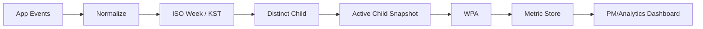

v1→v2 전환 시 4주 동안 병기하고 시계열 단절을 명시한다.

---

# 20. Security & Privacy Architecture

## 20.1 데이터 분리

```mermaid
flowchart LR
    PII["PII / 인증 DB"] -->|join key only| BEHAVIOR["Learning / Practice DB"]
    PII --> ENCRYPT["At-Rest Encryption"]
    BEHAVIOR --> ENCRYPT2["At-Rest Encryption"]

    LOCATION["Location Coordinates"] -. forbidden .-> BEHAVIOR
    STAR2CASH["Star ↔ Cash Conversion"] -. forbidden .-> BEHAVIOR
```

## 20.2 최소 접근 원칙

| Actor | PII | 학습 | 결제 |
|---|---|---|---|
| 보호자 | 자기 가정 범위 | 자기 아동 | 자기 카드 |
| 아동 | 최소 표시 | 자기 데이터 | 필요한 소비 결과만 |
| Backend Service | 역할별 제한 | 서비스별 제한 | Partner Gateway 제한 |
| Analytics | 가명화 권장 | 집계/이벤트 | 직접 PII 접근 금지 |
| 운영자 | 기본 비접근 | 운영 필요 정보 | 원문 제한 |

## 20.3 CI 보안 Guardrail

- 위치 권한 scan
- 좌표 schema scan
- 별↔저금통 전환 키워드 scan
- TLS 정책 검사
- dependency CVE scan
- 암호화 필드 감사
- 금지된 API 직접 호출 탐지

---

# 21. External Integration / Partner Gateway

## 21.1 Adapter 역할

Partner Gateway만 제휴사 API의 실제 스펙을 알고, 내부 도메인에는 표준화된 형태로 전달한다.

```mermaid
flowchart LR
    PARTNER["Partner API"] --> ADAPTER["Partner Gateway Adapter"]
    ADAPTER --> NORM["Canonical Transaction"]
    NORM --> SPENDING["Spending Plan Service"]
```

Canonical Transaction:

```json
{
  "partnerTransactionId": "ptx_...",
  "cardId": "card_...",
  "settledAt": "2026-08-25T12:30:00+09:00",
  "amount": 7000,
  "merchantName": "OO분식",
  "categoryCode": "FOOD_SERVICE"
}
```

## 21.2 제휴사 장애 원칙

**[PROPOSED]**

- timeout
- retry with exponential backoff
- circuit breaker
- 중복 거래 방지를 위한 `partnerTransactionId` UNIQUE
- 거래 조회 지연 시 매칭을 `PENDING`으로 유지
- 최종 데이터 재수신 시 idempotent merge

---

# 22. Batch / Scheduler 설계

| Job | 주기 | 목적 |
|---|---|---|
| Inactivity Detection | 매시간 | 72시간 미접속 대상 탐지 |
| Notification Dispatch | 매시간 | 알림 윈도우 내 발송 |
| Payment Reconciliation | 5~15분 또는 제휴사 계약 기준 | 신규 결제 매칭 |
| Tree Stall Detection | 매일 | 14일 정체 판정 |
| Forest Snapshot | 월 1회 | 전월 성장 스냅샷 |
| WPA Aggregation | 주 1회 | D+1 WPA |
| Ledger Reconciliation | 매일 | 원장/잔액 diff |
| Data Purge | 매일 | 보존기간 초과 데이터 삭제 |

---

# 23. Error Handling

## 23.1 오류 분류

| Category | 예시 | 사용자 처리 |
|---|---|---|
| AUTH | 세션 만료 | 재로그인 |
| CONSENT | 동의 필요 | 보호자 동의 유도 |
| VALIDATION | 금액 음수 등 | 입력 수정 |
| PARTNER | 외부 API 장애 | 재시도/상태 보존 |
| CONFLICT | 멱등키 재사용 | 기존 결과 반환 |
| MATCHING | 결제 매칭 실패 | 매칭 없음 상태 |
| POLICY | 제휴사 한도/업종 제한 | 제휴사 정책 메시지 |
| INTERNAL | 서버 오류 | 일반 오류 + requestId |

## 23.2 사용자 언어 원칙

규제/기술 오류를 그대로 노출하지 않는다.

나쁜 예:
> `403 CONSENT_REQUIRED`

좋은 예:
> 법정대리인 동의가 완료된 후 자녀 서비스를 이용할 수 있어요.

---

# 24. Non-Functional Architecture

## 24.1 성능 목표

SRS의 화면/서비스 SLO를 기준으로 구성하되, 구체적인 endpoint별 예산은 [OPEN]으로 남긴다.

**[PROPOSED]**

```text
API Gateway        50~100ms
Domain service     100~200ms
DB                 50~150ms
External Partner   500ms~1.5s
Total user API     p95 <= SRS target
```

외부 제휴사 지연이 내부 SLO를 잠식하지 않도록 사용자 경로와 배치 경로를 구분한다.

## 24.2 가용성

제휴사 가용성이 전체 시스템의 상한이므로:

- 사용자 핵심 화면은 캐시/마지막 성공 데이터를 활용
- 결제 원장 실시간 조회가 필요한 화면만 외부 의존
- 제휴사 장애 시 `DEGRADED` 모드 고려

---

# 25. Observability

## 25.1 로그

모든 request에:

- `request_id`
- `trace_id`
- `actor_id`(가명/내부 ID)
- `child_id`
- service
- endpoint
- status
- latency

## 25.2 Metrics

### Business

- WPA
- 첫 실천 인정률
- 계획 카드 작성률
- 실천 경로 도달률
- 보호자 확인 소요시간
- 결제 매칭 정확도

### Technical

- API p50/p95/p99
- partner API error rate
- reconciliation backlog
- event ingestion lag
- ledger mismatch count
- notification failure count

### Security

- consent gate violation
- forbidden location field detection
- unauthorized access spike
- critical CVE
- data purge delay

---

# 26. 장애 대응 Runbook 요약

## 26.1 별 원장 불일치

```mermaid
flowchart TD
    A["Ledger mismatch alert"] --> B["30분 내 확인"]
    B --> C["Affected child range 추출"]
    C --> D["ledger sum vs balance 비교"]
    D --> E{"중복 지급?"}
    E -->|Yes| F["idempotency / retry 분석"]
    E -->|No| G["partial transaction 분석"]
    F --> H["write 차단 및 재조정"]
    G --> H
    H --> I["원인/영향 범위 기록"]
    I --> J["4시간 초과 시 팀 escalation"]
```

## 26.2 위치정보/규제 위반

> 즉시 기능 차단 → 원인 특정 → 영향 범위 확인 → 정책 담당 보고 → 재배포 전 자동 검사 통과

---

# 27. 테스트 전략

## 27.1 테스트 피라미드

```mermaid
flowchart TD
    E2E["E2E / Acceptance"]
    INT["Integration"]
    UNIT["Unit"]
    STATIC["Static / Schema / Security"]

    STATIC --> UNIT
    UNIT --> INT
    INT --> E2E
```

## 27.2 핵심 테스트 매트릭스

| 영역 | 테스트 |
|---|---|
| 동의 | 미완료 100% 차단 |
| 온보딩 | 중간 종료 후 재개 |
| 별 | 멱등키 중복 지급 방지 |
| 미션 | 승인/거절/소급 |
| 계획 | 아이/보호자 공동 작성 |
| 결제 매칭 | CATEGORY/MERCHANT/AMOUNT_ONLY |
| 회고 | 3갈래 판정 |
| 성장 | 조건 충족/정체 |
| 숲 | 월말 snapshot |
| 알림 | Push → Banner → SMS |
| 보안 | 위치 권한/좌표/전환 함수 |
| Analytics | 이벤트 중복/오프라인 timestamp |

---

# 28. Traceability Matrix

| SRS 요구사항 | 설계 산출물 |
|---|---|
| REQ-FUNC-001 | Account Component, UC-01, Sequence 10.1 |
| REQ-FUNC-002 | Star Ledger, Trigger Matrix, 15장 |
| REQ-FUNC-003 | Learning Service, Learning Aggregate |
| REQ-FUNC-004 | Practice Service, UC-04 |
| REQ-FUNC-005 | Growth Tree, 13장 |
| REQ-FUNC-006 | Avatar & Wishlist Component |
| REQ-FUNC-007 | Plan Card, 14장 |
| REQ-FUNC-008 | Reconciliation, 10.4, 12장 |
| REQ-FUNC-009 | Forest Snapshot |
| REQ-FUNC-010 | Wishlist / Dashboard |
| REQ-FUNC-011 | Backfill Sequence |
| REQ-FUNC-012 | Notification Sequence |
| REQ-FUNC-013 | Spending Query |
| REQ-FUNC-014 | Category aggregation / matching |
| REQ-FUNC-015 | Savings boundary (MVP locked) |
| REQ-FUNC-016 | Child-no-card experience (future) |
| REQ-FUNC-017 | Star destination (future) |
| REQ-FUNC-018 | Migration boundary (deferred) |
| REQ-NF-008 | Star Ledger Integrity |
| REQ-NF-009 | Backfill Handler |
| REQ-NF-010 | Notification latency |
| REQ-NF-016 | Forbidden symbol scan |
| REQ-NF-017 | Location permission scan |
| REQ-REG-001 | Consent Gate |
| REQ-REG-002 | Location prohibition |
| REQ-REG-005 | Star/Cash separation |
| REQ-REG-007 | Refund flow |
| REQ-REG-008 | Partner policy adapter |
| REQ-REG-009 | Closed collection architecture |

---

# 29. 릴리즈 아키텍처 Gate

## Alpha

- 규제 자동 테스트 100%
- 별 원장 불일치 0건
- 위치 권한 선언 0건
- 핵심 SLO 충족

## Beta

- 첫 실천 인정률 ≥ 60%
- 나무 5초 회상 ≥ 6/8
- WPA ≥ 5/8
- 결제 매칭 정확도 ≥ 90%

## General Release

- WPA ≥ 55% 2주 연속
- 아이 정지→보호자 인지 ≤ 3일
- 정합성 오류 0건
- 계획 카드 작성률 ≥ 50%
- 카드 연결률 ≥ 60%

```mermaid
flowchart LR
    S4["S4 종료"] --> A["Alpha Gate"]
    A -->|PASS| S5["S5 종료"]
    S5 --> B["Beta Gate"]
    B -->|PASS| R["General Release"]
    A -->|HOLD| AH["표본 +4"]
    A -->|FAIL| AF["지정 재설계"]
    B -->|HOLD| BH["표본 +4"]
    B -->|FAIL| BF["지정 재설계"]
```

---

# 30. 설계상 핵심 리스크

## R1. 계획 카드 작성률

계획을 실제로 작성하지 않으면 계획↔실제 대조 기능은 구조적으로 무너진다.

**완화:** `plan_card_created / payment_settled`를 핵심 생존 지표로 모니터링.

## R2. 성장 증거의 진실성

나무/숲이 실제 행동 변화를 의미한다고 단정할 수 없다.

**완화:** 3개월 종단 실험 E10을 통해 실제 소비/저축 행동 지표를 검증한다.

## R3. 업종 코드 품질

결제 데이터의 업종 상세도가 낮으면 대조 신뢰도가 떨어진다.

**완화:** 계약 단계에서 코드 체계를 고정하고, merchant/amount fallback 비율을 모니터링한다.

## R4. 제휴사 비용

제휴 구조는 수수료와 최소 물량에 종속된다.

**완화:** 기술 부채가 아니라 사업 조건의 미확정 리스크로 분리 관리한다.

## R5. 보호자의 지연 응답

아이 측 행동과 보호자 승인 사이의 시간차가 길 수 있다.

**완화:** 완료 시점 기반 실천 인정과 별 소급 지급을 지원한다.

---

# 31. [OPEN] 구현 착수 전 최종 확정이 필요한 항목

SRS에서 정의된 것과 별개로, 실제 구현을 위해 다음 항목은 설계 리뷰에서 확정해야 한다.

| 우선 | 항목 | 이유 |
|---|---|---|
| P0 | Partner transaction unique key | 중복 결제 방지 |
| P0 | 업종 코드 mapping table | 매칭 정확도 결정 |
| P0 | 외부 API timeout/retry | Partner 장애 격리 |
| P0 | Tree 승급 계산식 2단계 이후 | 코드 구현에 직접 필요 |
| P0 | 별 차감 실패 시 정책 | 옷 구매 정합성 |
| P0 | 보호자/아동 인증 방식 | 세션·보안 모델 |
| P0 | 개인정보 보존/파기 상세 | 운영 구현 |
| P1 | 이벤트 payload schema version | Analytics 호환성 |
| P1 | 회고 문장 pool 운영 도구 | 콘텐츠 확장성 |
| P1 | forest delta 7개 지표의 정확한 계산식 | KPI 재현성 |
| P1 | 카드 발급 UX와 제휴사 API 비동기 여부 | 온보딩 경계 |
| P2 | CDN/asset delivery | 3D asset 성능 |
| P2 | 캐시 TTL | 보호자 대시보드 조회 비용 |

---

# 32. 구현 권장 기술 구조

아래는 SRS에서 직접 정하지 않은 부분이므로 **[PROPOSED]**다.

## 32.1 Backend

```text
API Gateway
   ↓
Modular Monolith 또는 Domain-oriented Services
   ├─ Account
   ├─ Learning
   ├─ Practice
   ├─ Ledger
   ├─ Growth
   ├─ Spending
   ├─ Avatar/Wishlist
   ├─ Notification
   ├─ Partner Gateway
   └─ Analytics
```

MVP에서는 서비스별 마이크로서비스를 반드시 분리하기보다, **논리적 경계는 분명히 하되 물리적 배포는 모듈형 모놀리스로 시작하는 방식**이 비용 대비 합리적이다. 다만 Star Ledger와 Partner Gateway는 데이터 경계를 특히 엄격하게 유지한다.

## 32.2 Database

관계형 DB를 권장한다.

- 거래 정합성이 중요한 ledger
- FK 기반 관계
- 집계/기간 조회
- unique constraint
- transaction
- audit

에 적합하기 때문이다.

**[PROPOSED]**
- PostgreSQL 계열
- Redis: 세션/짧은 캐시/분산락이 필요한 경우
- Object Storage: 3D asset/CDN 원본
- Event Store는 MVP에서는 동일 RDB의 partitioned append-only table로 시작 가능

---

# 33. 최종 아키텍처 개요

```mermaid
flowchart TB
    subgraph UX["User Experience"]
        PAPP["Parent App"]
        CAPP["Child App"]
    end

    subgraph API["API / Security"]
        GW["API Gateway"]
        IAM["AuthN/AuthZ"]
        CONSENT["Consent Gate"]
    end

    subgraph DOMAIN["FinFriends Domain"]
        ACCOUNT["Account"]
        LEARN["Learning"]
        PRACTICE["Practice"]
        LEDGER["Star Ledger"]
        GROWTH["Growth Tree"]
        SPEND["Spending Plan"]
        AVATAR["Avatar / Wishlist"]
        NOTI["Notification"]
    end

    subgraph DATA["Data"]
        RDB["Relational DB"]
        EVENTS["Event Store"]
        AUDIT["Audit Logs"]
        CACHE["Cache"]
    end

    subgraph EXT["External"]
        PARTNER["Prepaid Partner"]
        KYC["Identity Verification"]
        CHANNEL["Push/SMS"]
    end

    PAPP --> GW
    CAPP --> GW
    GW --> IAM
    IAM --> CONSENT
    GW --> ACCOUNT
    GW --> LEARN
    GW --> PRACTICE
    GW --> LEDGER
    GW --> GROWTH
    GW --> SPEND
    GW --> AVATAR
    GW --> NOTI

    PRACTICE --> LEDGER
    PRACTICE --> GROWTH
    SPEND --> PRACTICE
    AVATAR --> LEDGER

    DOMAIN --> RDB
    DOMAIN --> EVENTS
    DOMAIN --> AUDIT
    DOMAIN --> CACHE

    ACCOUNT --> KYC
    SPEND --> PARTNER
    NOTI --> CHANNEL
```

---

# 34. 결론

FinFriends MVP의 기술적 중심은 기능 수가 아니라 **세 가지 정합성**이다.

### 1) 규제 정합성

```text
동의 → 아이 진입
위치정보 없음
별 ↔ 현금 분리
결제 인프라 → 제휴사
```

### 2) 금융/데이터 정합성

```text
제휴사 거래 원장
      ↓
Plan Reconciliation
      ↓
Practice Decision
      ↓
Star Ledger
      ↓
Tree / Forest
```

### 3) 제품 지표 정합성

```text
학습/출석 ──→ 별 지급
                  X
                  └── WPA 분자 제외

실천 ───────→ practice_credited
                  ↓
                 WPA
```

따라서 구현 우선순위는 화면 개수보다 다음 순서가 적절하다.

```text
[1] Account + Consent Gate
        ↓
[2] Star Ledger + Idempotency
        ↓
[3] Practice Domain
        ↓
[4] Learning
        ↓
[5] Spending Plan + Partner Reconciliation
        ↓
[6] Growth Tree / Forest
        ↓
[7] Avatar / Wishlist
        ↓
[8] Notification
        ↓
[9] Analytics / KPI / Ops
```

이 순서는 SRS의 스프린트 배분과 대체로 일치하지만, 기술적으로는 `Partner Gateway`와 `Reconciliation`에 대한 계약/샘플 데이터 확보가 늦어지면 S4 이후 기능 전체가 연쇄적으로 지연될 수 있으므로 **S3 종료 전 제휴사 데이터 계약을 확정하는 것이 가장 중요한 외부 의존성**이다.

---

## 부록 A. 설계 산출물 목록

- [x] Context Level Diagram
- [x] Use Case 목록/상세
- [x] ERD
- [x] Domain Model
- [x] Component Diagram
- [x] Sequence Diagram
- [x] State Diagram
- [x] Flow Chart
- [x] API 설계
- [x] Event Model
- [x] Batch 설계
- [x] Security/Privacy Architecture
- [x] External Integration 설계
- [x] Error Handling
- [x] NFR/Observability
- [x] Test Strategy
- [x] Traceability Matrix
- [x] Release Gate
- [x] Risk / Open Issue

## 부록 B. Mermaid 렌더링 주의

본 문서의 다이어그램은 GitHub Markdown에서 렌더링 가능한 Mermaid 문법을 우선 사용했다. 문서 플랫폼에 따라 `stateDiagram-v2` 등의 지원 범위가 다를 수 있으므로 사내 위키로 이관할 경우 렌더러 호환성을 확인한다.
