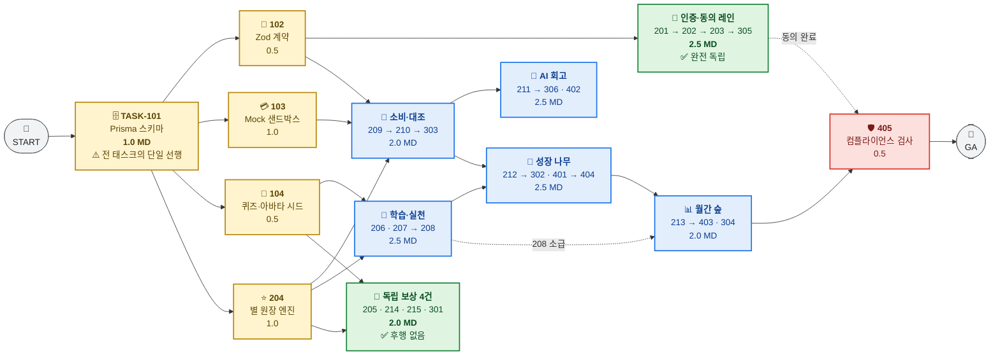
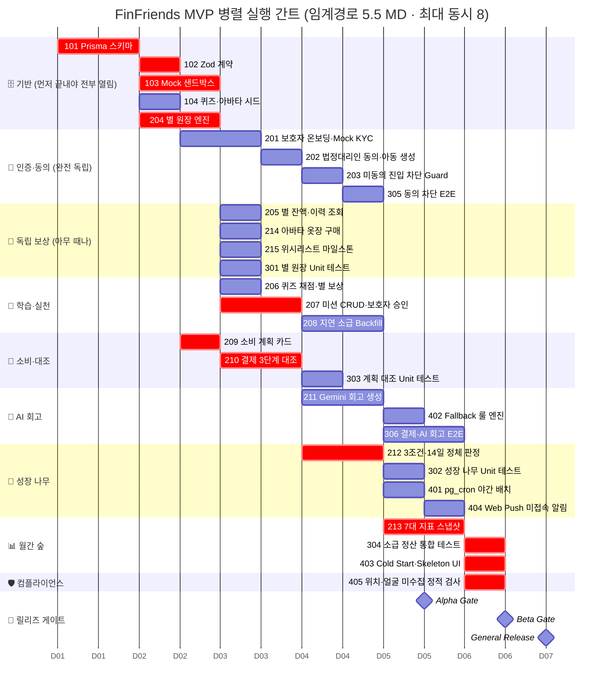

# 🗺️ FinFriends MVP 병렬 실행 한눈에 보기 (Parallel Execution Map)

> **30개 태스크를 "무엇을 동시에 굴릴 수 있는가"만 남기고 압축한 시각 지도입니다.**
> 총 공수 **20.5 MD** · 임계 경로 **5.5 MD** · 최대 동시 실행 **8개** · 완전 독립 레인 **2개**
> 상세 근거·게이트 명령어·파일 소유권 → [`docs/00_PROJECT_DAG_ROADMAP.md`](../docs/00_PROJECT_DAG_ROADMAP.md)

---

## 1. 간소화 의존성 다이어그램

30개 태스크를 **9개 블록**으로 접었습니다. 세로로 나란히 놓인 블록은 **서로를 기다리지 않습니다.**



| 색 | 의미 | 실행 지침 |
|:---:|---|---|
| 🟨 **노랑** | 기반 계약 | **먼저 끝내야 나머지가 열립니다.** `101`은 전 트랙 대기 구간 |
| 🟩 **초록** | 완전 독립 | 선행만 충족되면 **아무 때나, 다른 블록과 무관하게** 진행 |
| 🟦 **파랑** | 순차 체인 | 블록 **내부는 직렬**, 블록 **끼리는 병렬** |
| 🟥 **빨강** | 마감 관문 | Step 2 전체 완료 후 실행 |

---

## 2. 병렬 실행 간트 차트

**같은 세로선 위에 걸친 막대는 전부 동시에 진행할 수 있습니다.** 붉은 막대(`crit`)는 임계 경로 — 하루도 밀리면 안 되는 태스크입니다. 가로축 `D01`~`D07`은 캘린더가 아니라 **MD(Man-Day) 경과일**입니다.



---

## 3. 동시 실행 보드 — 언제 몇 개가 같이 돌아가는가

| MD 구간 | 동시에 돌아가는 태스크 | 병렬 폭 |
|:---:|---|:---|
| 0.0 ~ 1.0 | `101` | `█` 1 ⚠️ 병목 |
| 1.0 ~ 1.5 | `102` `103` `104` `204` | `████` 4 |
| 1.5 ~ 2.0 | `103` `204` `201` `209` | `████` 4 |
| **2.0 ~ 2.5** | `201` `205` `206` `207` `210` `214` `215` `301` | `████████` **8** 🔥 피크 |
| 2.5 ~ 3.0 | `202` `207` `210` | `███` 3 |
| 3.0 ~ 3.5 | `203` `208` `211` `212` `303` | `█████` 5 |
| 3.5 ~ 4.0 | `208` `211` `212` `305` | `████` 4 |
| 4.0 ~ 4.5 | `213` `302` `306` `401` `402` | `█████` 5 |
| 4.5 ~ 5.0 | `213` `306` `404` | `███` 3 |
| 5.0 ~ 5.5 | `304` `403` `405` | `███` 3 |

**평균 병렬 폭 3.7** → 에이전트 **4명이 최적 편성**입니다. 5명째부터는 활용률이 40%로 떨어집니다.

---

## 4. 독립 실행 가능 태스크

### 🟢 A. 완전 독립 — 다른 체인과 교차하지 않음

| 레인 | 태스크 | 열리는 시점 | 특징 |
|---|---|:---:|---|
| **인증·동의** | `201` → `202` → `203` → `305` | `102` 완료 후 | 4건 내부만 직렬. 외부 후행은 `405` 하나뿐이라 **끝까지 혼자 굴릴 수 있음** |
| **독립 보상** | `205` · `214` · `215` · `301` | `204`(+`104`) 완료 후 | **후행 태스크 0건.** 언제 해도 아무도 안 기다림 |

### 🟡 B. 지연 허용 — 늦춰도 전체 일정에 영향 없음

| 여유(Slack) | 태스크 |
|:---:|---|
| **3.0 MD** | `214` `215` `301` |
| 2.5 MD | `205` |
| 2.0 MD | `303` |
| 1.5 MD | `201` `202` `203` `305` |
| 1.0 MD | `104` `208` `302` `402` |

> 💡 일정 압박 시 **`214`·`215`(P1)를 범위에서 빼면** 트랙 부하가 1.0 MD 줄어듭니다. 단 임계 경로는 그대로 5.5 MD이므로 **납기는 당겨지지 않습니다.**

### 🔴 C. 절대 지연 불가 — 임계 경로 (Slack 0)

```
101 ─┬─ 204 ─── 207 ─┐
     ├─ 103 ────────┤
     └─ 102 ─ 209 ─ 210 ─┴─ 212 ─── 213 ─┬─ 304
                                          ├─ 403
                                          └─ 405
```

`101` `102` `103` `204` `207` `209` `210` **`212`** `213` `304` `403` `405` — **12건**

> 🎯 **`212`(성장 나무 판정)가 최대 위험 지점입니다.** 세 갈래 임계 체인이 전부 여기로 수렴하므로, `206`·`207`·`210` 중 **하나만 밀려도 프로젝트 전체가 1:1로 밀립니다.**

---

## 5. 착수 신호등 — 무엇을 끝내면 무엇이 열리는가

| 완료 태스크 | 🔓 새로 열리는 태스크 | 열리는 수 |
|---|---|:---:|
| **`101`** | `102` `103` `104` `204` | **4** |
| `102` | `201` `209` | 2 |
| **`204`** | `205` `207` `215` `301` (+`104` 시 `206` `214`) | **4~6** |
| `103` + `209` + `204` | `210` | 1 |
| `201` → `202` → `203` | 각각 `202` / `203` / `305` | 1 |
| `207` | `208` | 1 |
| `210` | `211` `303` | 2 |
| `211` | `306` `402` | 2 |
| **`206` + `207` + `210`** | **`212`** | **1** ⚠️ 3중 수렴 |
| `212` | `213` `302` `401` | 3 |
| `401` | `404` | 1 |
| `213` (+`208`) | `304` `403` `405` | 3 |

**착수 우선순위 한 줄 요약:** `101` → (`204` · `103` · `102` · `104` 동시) → `207` · `210` 최우선 → `212` → `213` → 마감 3건

---

## 6. 게이트 통과 시점

| 게이트 | 시점 | 반드시 끝나 있어야 하는 것 |
|---|:---:|---|
| 🚨 **Alpha** | MD **4.5** | 규제 차단(`305`) · 원장 멱등성(`301`) · 나무 판정(`302`) · 대조(`303`) |
| 🚨 **Beta** | MD **5.5** | AI 회고(`306`) · Fallback(`402`) · 월간 숲(`213`) · 소급 정산(`304`) |
| 🚀 **GA** | MD **6.0** | 컴플라이언스(`405`) · 미접속 알림(`404`) · $0 인프라 확인 |

> 위 시점은 **자원 무제한 기준**입니다. 에이전트 4명 편성 시 Alpha는 그대로 MD 4.5, Beta는 MD 6.0, GA는 MD 6.5입니다 → [총괄 문서 §4.2.2](../docs/00_PROJECT_DAG_ROADMAP.md#422-에이전트-수별-완주-시점)

---

## 📎 더 보기

| 필요한 것 | 위치 |
|---|---|
| 태스크별 구현 명세 (GWT · 대상 파일 · 검증 명령어) | [`step-1/`](step-1/) · [`step-2/`](step-2/) · [`step-3/`](step-3/) · [`step-4/`](step-4/) |
| 30건 전체 인덱스 | [`README.md`](README.md) |
| 파일 소유권 맵 · 순환 의존 해소 · 리스크 · 게이트 명령어 | [`docs/00_PROJECT_DAG_ROADMAP.md`](../docs/00_PROJECT_DAG_ROADMAP.md) |
| 에이전트 4명 실제 배정표 | [총괄 문서 §4.3](../docs/00_PROJECT_DAG_ROADMAP.md#43-4-에이전트-자원-평준화-실행-일정-권장-실행안--완주-60-md) |
