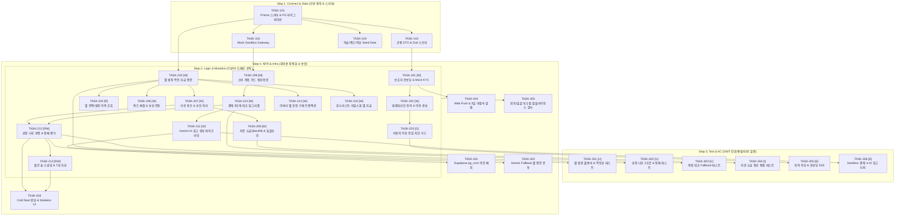

# [개발 태스크 리스트] 핀프렌즈 (FinFriends) MVP Task Specifications

- **문서 ID:** TASK-FINFRIENDS-MVP-002
- **버전:** 1.2 (AI-Native Next.js 단일 풀스택 최적화 개편본)
- **작성일:** 2026-08-25
- **기준 문서:** [`docs/02_SRS/SRS_문서_핀프렌즈_v1.2.md`](../docs/02_SRS/SRS_문서_핀프렌즈_v1.2.md)
- **적용 기술 스택:** Next.js (App Router), Prisma ORM, Supabase PostgreSQL, Tailwind CSS + shadcn/ui, Vercel AI SDK + Google Gemini 1.5 Flash, Vercel ($0 무료 인프라)

---

## 🧭 4단계 개발 원칙 및 선후행 의존성 다이어그램

---

# Step 1. Contract & Data Layer (기반 계약 & 스키마)

| Task ID | 작업 명칭 및 설명 | 규모 | 선행 의존 | 관련 REQ / SRS |
|---|---|:---:|---|---|
| **`TASK-101`** | **Prisma Schema 및 Supabase PostgreSQL 마이그레이션 정의** • SRS §10 기준 11개 테이블 DDL 매핑 (`parent_accounts`, `child_accounts`, `star_ledger_entries`, `star_balances`, `tree_states`, `monthly_forest_snapshots`, `spending_plan_cards`, `spending_records`, `wishlists` 등) • PK, FK Cascade, 멱등키 Unique 인덱스(`idempotency_key`), Enum 정의 | 1.0d | — | §10, REQ-NF-012 |
| **`TASK-102`** | **공통 TypeScript DTO 및 Zod 검증 스키마 정의** • Server Actions 및 Route Handlers의 입출력 DTO 타입 정의 • Zod 기반 입력 유효성 검증(금액 양수, 닉네임 길이, 필수 필드 등) 스키마 정의 | 0.5d | `TASK-101` | §11, REQ-NF-016 |
| **`TASK-103`** | **내장형 Mock Partner Sandbox Gateway 구현 (`/api/v1/sandbox`)** • 가상 카드 충전(`POST /api/v1/sandbox/topup`) Route Handler • 가상 결제 승인(`POST /api/v1/sandbox/pay`) Route Handler • 개발용 시뮬레이션 제어 패널 DTO 및 Mock 원장 연동 | 1.0d | `TASK-101` | §4.1.1, REQ-FUNC-016, ADR-012 |
| **`TASK-104`** | **학습 4주제 퀴즈 및 동물 아바타 Seed Data 구축** • 4대 주제(벌기/쓰기/모으기/불리기) 커리큘럼 및 퀴즈 문제 Seed 스크립트 작성 • 토끼/다람쥐 동물 아바타 및 기본 의상 4종 메타데이터 Seed 구축 | 0.5d | `TASK-101` | REQ-FUNC-003, 006 |

---

# Step 2. Logic & Mutation Layer (CQRS 도메인 비즈니스 로직)

### A. 인증 & 계정 & 규제 게이트 (Account & Consent)
| Task ID | 작업 명칭 및 설명 | 규모 | 선행 의존 | 관련 REQ / SRS |
|---|---|:---:|---|---|
| **`TASK-201`** | **[Write] 보호자 5단계 온보딩 및 Mock KYC 인증 Server Action** • `verifyParentIdentity`: Web Crypto 기반 Mock OTP 검증 • `saveOnboardingStep`: 5단계 중간 이탈 저장 및 재개 지원(AC1) | 1.0d | `TASK-102` | REQ-FUNC-001 |
| **`TASK-202`** | **[Write] 법정대리인 동의 처리 및 아동 프로필 생성 Server Action** • `registerConsent`: `consentStatus = COMPLETED` 갱신 및 타임스탬프 기록 • `createChildProfile`: 닉네임, 출생연도 기반 아동 계정 생성 | 0.5d | `TASK-201` | REQ-FUNC-001, REG-001 |
| **`TASK-203`** | **[Guard] 미동의 아동 진입 원천 차단 Server Guard / Middleware** • Next.js `middleware.ts` 및 Server Action 진입점에서 동의 여부 검증 • 미동의 시 `/consent` 페이지로 100% 리다이렉트 (REG-001 강제) | 0.5d | `TASK-202` | REG-001, REQ-NF-008 |

### B. 별 원장 엔진 (Star Ledger Engine)
| Task ID | 작업 명칭 및 설명 | 규모 | 선행 의존 | 관련 REQ / SRS |
|---|---|:---:|---|---|
| **`TASK-204`** | **[Write] 멱등성 보장형 별 지급/차감 엔진 (`grantStar`, `deductStar`)** • `prisma.$transaction`을 통한 원장 행 추가 + 잔액 갱신 단일 원자성 보장 • `idempotencyKey` 중복 시 추가 지급 없이 기존 잔액 반환 • 불변식 `balance_after(n) = balance_after(n-1) + delta(n)` 검증 및 잔액 부족 차단 | 1.0d | `TASK-101` | REQ-FUNC-002, REG-005 |
| **`TASK-205`** | **[Read] 아동별 실시간 별 잔액 및 원장 이력 조회 Action** • `getStarBalance`: 현재 잔액 및 최근 획득 내역 페이징 조회 | 0.5d | `TASK-204` | REQ-FUNC-002 |

### C. 학습, 미션 및 소급 엔진 (Learning & Practice)
| Task ID | 작업 명칭 및 설명 | 규모 | 선행 의존 | 관련 REQ / SRS |
|---|---|:---:|---|---|
| **`TASK-206`** | **[Write] 퀴즈 채점 및 학습 완료 별 보상 Action** • `submitQuizAnswer`: 정답 검증, `TASK-204` 호출하여 별 1개 지급 • 불리기 영역 실천 잠금(ADR-006) 및 학습 별 WPA 제외 플래그 기록 | 0.5d | `TASK-204`, `TASK-104` | REQ-FUNC-003, ADR-001 |
| **`TASK-207`** | **[Write] 미션 CRUD 및 아동 보고 / 보호자 승인 Action** • `createMission`, `reportMissionCompleted`, `approveMission` • 승인 시 `practice_credits` 생성 및 별 지급 연동 (WPA 산입 대상) | 1.0d | `TASK-204` | REQ-FUNC-004 |
| **`TASK-208`** | **[Write] 지연 소급 승인(Backfill) 및 일괄 승인 Action** • `backfillDelayedApproval`: 48시간 경과 미션 승인 시 완료 시점 Cycle로 실천 귀속 • `bulkApproveMissions`: 5건 이상 미승인 미션 일괄 승인 처리 | 1.0d | `TASK-207` | REQ-FUNC-011 |

### D. 소비 계획 & AI 회고 엔진 (Spending & AI Integration)
| Task ID | 작업 명칭 및 설명 | 규모 | 선행 의존 | 관련 REQ / SRS |
|---|---|:---:|---|---|
| **`TASK-209`** | **[Write] 소비 계획 카드 생성 및 유효시간 관리 Action** • `createPlanCard`: 장소, 업종, 계획 금액 입력 및 72시간 만료시간 부여 | 0.5d | `TASK-102` | REQ-FUNC-007 |
| **`TASK-210`** | **[Write] 결제 3단계 대조 알고리즘 (Category ➔ Merchant ➔ Amount)** • `reconcilePayment`: 결제 발생 시 유효 계획 카드와 3단계 순차 매칭 • `actual <= planned` 판정 시 별 지급 및 `plan_met = true` 설정 | 1.0d | `TASK-103`, `TASK-209` | REQ-FUNC-008 |
| **`TASK-211`** | **[Write] Vercel AI SDK + Google Gemini 기반 아동 맞춤형 회고 생성 Action** • `generateAIRetro`: 아동 눈높이 칭찬/격려 프롬프트 구성 및 Gemini 1.5 Flash 호출 • Gemini API 호출 타임아웃(2.5s) 또는 429 에러 시 룰 템플릿 Fallback 연동 | 1.0d | `TASK-210` | REQ-FUNC-008, ADR-010 |

### E. 성장 나무 & 월간 숲 & 보상 (Growth & Rewards)
| Task ID | 작업 명칭 및 설명 | 규모 | 선행 의존 | 관련 REQ / SRS |
|---|---|:---:|---|---|
| **`TASK-212`** | **[Read/Write] 성장 나무 3조건 판정 및 14일 정체(Stall) 평가 Action** • `evaluateGrowthTree`: `학습>=3 AND 퀴즈>=5 AND 실천>=1` 승급 판정 • 사이클 14일 미만 정체 판정 방지 및 14일 경과 시 부족 조건 넛지 산출 | 1.0d | `TASK-206`, `TASK-207`, `TASK-210` | REQ-FUNC-005 |
| **`TASK-213`** | **[Read/Write] 월간 숲 7대 지표 스냅샷 생성 및 리포트 조회 Action** • `getMonthlyForest`: 4영역 단계, 실천 횟수, 저축률, WPA 등 7대 지표 집계 | 1.0d | `TASK-212` | REQ-FUNC-009 |
| **`TASK-214`** | **[Write] 아바타 별 옷장 아이템 구매 Action** • `purchaseWardrobeItem`: 별 잔액 확인 및 차감 트랜잭션 수행 | 0.5d | `TASK-204`, `TASK-104` | REQ-FUNC-006 |
| **`TASK-215`** | **[Write] 위시리스트 목표 등록 및 30%/70%/100% 마일스톤 별 지급 Action** • `updateWishlistDeposit`: 저축 누적 시 30/70/100% 단계별 1회 한정 별 지급 | 0.5d | `TASK-204` | REQ-FUNC-013 |

---

# Step 3. Test & AC Layer (GWT 단위/통합/E2E 테스트)

| Task ID | 작업 명칭 및 검증 시나리오 | 규모 | 선행 의존 | 관련 REQ / SRS |
|---|---|:---:|---|---|
| **`TASK-301`** | **[Unit] 별 원장 멱등성, 동시성 격리 및 잔액 불변식 Vitest 단위 테스트** • **GWT:** 동일한 `idempotencyKey`로 동시 5회 호출 시 1회만 지급되고 잔액 불변식이 유지되는지 검증 | 0.5d | `TASK-204` | REQ-FUNC-002, REQ-NF-004 |
| **`TASK-302`** | **[Unit] 성장 나무 3조건 승급 및 14일 정체 판정 로직 테스트** • **GWT:** 학습 10회 완료해도 실천 0회면 승급 불가, 13일 차에는 정체 미판정, 14일 차에 정체 넛지 출력 검증 | 0.5d | `TASK-212` | REQ-FUNC-005 |
| **`TASK-303`** | **[Unit] 소비 계획 3단계 대조 및 금액 초과 시 별 미지급 판정 테스트** • **GWT:** 업종 불일치 시 가맹점명 매칭 fallback, 예산 초과 시 별 미지급 및 격려 메시지 생성 검증 | 0.5d | `TASK-210` | REQ-FUNC-008 |
| **`TASK-304`** | **[Integration] 미션 소급 승인 시 과거 Cycle 귀속 및 스냅샷 갱신 통합 테스트** • **GWT:** 지난달 미션 승인 시 해당 월의 실천 카운터와 월간 숲 스냅샷이 정상 보정되는지 검증 | 0.5d | `TASK-208`, `TASK-213` | REQ-FUNC-011 |
| **`TASK-305`** | **[E2E] 보호자 동의 미완료 아동 차단 및 온보딩 Playwright E2E 테스트** • **GWT:** 동의 미완료 아동 URL 직접 접근 시 100% 동의 페이지로 리다이렉트되는지 검증 (REG-001) | 0.5d | `TASK-203` | REG-001, REQ-NF-008 |
| **`TASK-306`** | **[E2E] Sandbox 가상 결제 ➔ AI 회고 피드백 ➔ 별 지급 E2E 전체 여정 검증** • **GWT:** 계획 카드 작성 ➔ 가상 결제 발생 ➔ AI 맞춤 피드백 출력 ➔ 별 원장 반영 전체 흐름 검증 | 1.0d | `TASK-211` | REQ-FUNC-008 |

---

# Step 4. NFR, Infra & Security Layer (무비용 최적화 및 보안)

| Task ID | 작업 명칭 및 설명 | 규모 | 선행 의존 | 관련 REQ / SRS |
|---|---|:---:|---|---|
| **`TASK-401`** | **Supabase `pg_cron` 기반 일일 정체 판정 및 72시간 미접속 플래그 배치 구축** • 매일 자정 실행되는 `pg_cron` SQL 프로시저 작성 (14일 정체 일수 가산, 미접속 플래그 업데이트) • 무료 티어 자립형 배치 구축 (ADR-011) | 0.5d | `TASK-212` | REQ-NF-012, ADR-011 |
| **`TASK-402`** | **Gemini API 429(Rate Limit)/Timeout 대비 결정론적 룰 템플릿 Fallback 파이프라인 구축** • Gemini API 장애 시 즉각 전환되는 룰 기반 비복원 추출 템플릿 엔진 완성 (2.5s 타임아웃 보장) | 0.5d | `TASK-211` | REQ-NF-005, ADR-010 |
| **`TASK-403`** | **Serverless Cold Start 완화를 위한 React Server Component 캐싱 및 Skeleton UI 적용** • 성장 나무/월간 숲 대시보드 진입 시 스켈레톤 로딩 UI 적용 및 RSC 데이터 프리페칭 | 0.5d | `TASK-212`, `TASK-213` | REQ-NF-001, REQ-NF-002 |
| **`TASK-404`** | **Web Push API (VAPID) 연동 및 3일 미접속 인앱 알림 배너 연계** • $0 비용의 브라우저 Web Push 발송 모듈 및 보호자 대시보드 인앱 넛지 배너 연동 | 0.5d | `TASK-201`, `TASK-401` | REQ-FUNC-012 |
| **`TASK-405`** | **컴플라이언스 정적 검사 스크립트 작성 (위치정보 및 얼굴 이미지 미수집 검증)** • CI 파이프라인에서 Geolocation API 호출 및 이미지 업로드 엔드포인트 탐지 시 빌드 실패 처리 | 0.5d | Step 2 전체 | REG-002, REG-006, REQ-NF-009 |

---

## 📊 공수 요약 및 릴리즈 게이트 매핑

- **총 태스크 수:** 30개 (Step 1: 4개, Step 2: 15개, Step 3: 6개, Step 4: 5개)
- **총 예상 공수:** **21.5 Man-Days (M/D)**

| 릴리즈 게이트 | 포함 태스크 | 통과 기준 (Quality Gate) |
|---|---|---|
| **Alpha Gate** | `Step 1` (101~104) + `Step 2` 핵심 (201~212) + `Step 3` (301~305) | • 동의 미완료 아동 차단 100% (REG-001) • 별 원장 멱등성 및 잔액 불변식 100% 통과 • 성장 나무 3조건 판정 정상 동작 |
| **Beta Gate** | `Step 2` 전체 (213~215) + `Step 3` (306) + `Step 4` (401~403) | • 결제 3단계 대조 및 Gemini AI 회고 피드백 정상 생성 • AI 장애 시 룰 기반 Fallback 100% 정상 작동 • 월간 숲 스냅샷 정상 생성 |
| **General Release** | `Step 4` 전체 (404~405) | • 3일 미접속 알림 정상 발송 • 컴플라이언스 정적 검사(위치/얼굴 0건) 100% 통과 • Vercel/Supabase $0 무료 인프라 자립 운영 확인 |
